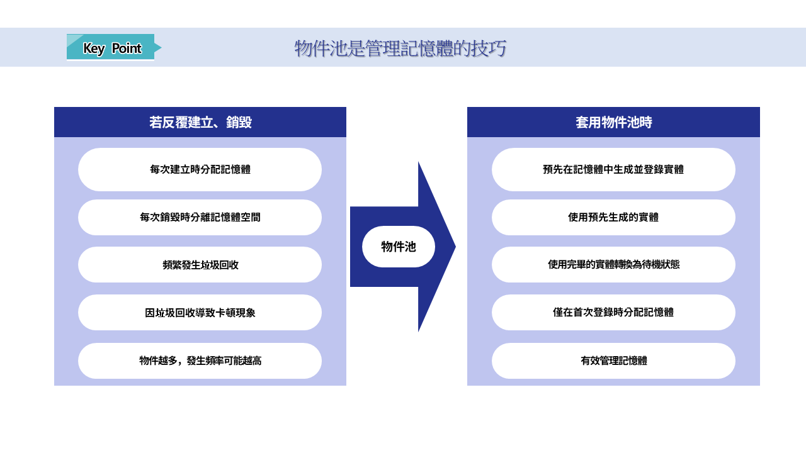
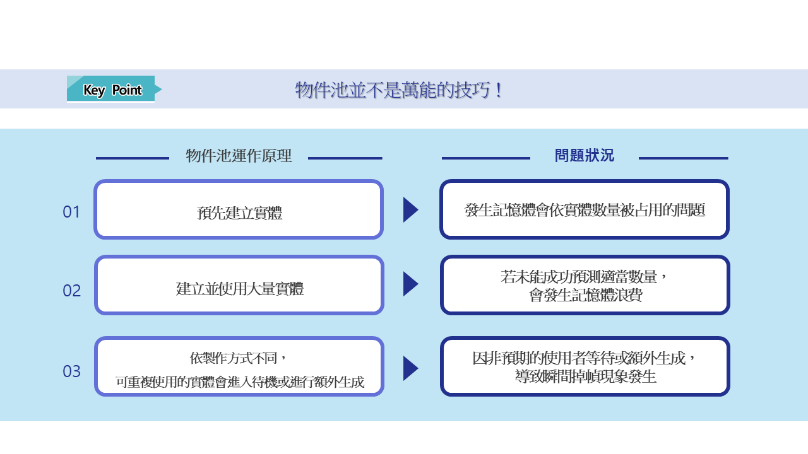

# [💡基礎學習]建立物件池
 
 
 

## 影片時間軸
- 可在課程影片中以下時間點進行學習。
- 理解地圖類型：`01:10:50`

 

## 學習目標
- 了解物件池技巧是什麼以及其運作原理。
- 學習透過物件池技巧獲得的優點，以及需要注意的項目。

 

## 觀看該影片後可嘗試執行的內容

- 學習物件池的理解與使用方法。
- 為了最佳化，優化製作中的世界內必須生成的實體數量。

 

## 什麼是物件池?

- 物件池是**預先**製作相同實體並使用的技巧。
- 必須反覆使用相同實體時，會使用儲存在物件池中的實體。
- 使用完畢的實體會再次轉換為物件池中的**待機**狀態。

 

## 物件池的優點

- **效能提升**
    - 若每次都反覆重新生成並銷毀物件，CPU負荷會變重。
    - 物件生成與銷毀越多，CPU負荷就會越重，並導致幀數下降問題。
    - 物件池是讀取預先生成的物件並再次儲存的方式，因此比起反覆生成與銷毀，CPU占用率會大幅下降。
- **快速啟用、停用**
    - 因為是開啟與關閉預先生成的物件，所以速度比生成、銷毀物件更快。
- **減少垃圾回收(GC)**
    - 物件被銷毀後，會留下不必要的記憶體。
    - 若以生成、銷毀的方式製作，垃圾回收會被頻繁呼叫。
    - 物件池會讓垃圾回收較少被呼叫。
    - 垃圾回收的呼叫次數越少，世界效能就會越提升。
- **提升記憶體管理效率**
    - 物件池會將需要的物件預先載入記憶體後使用。
    - 因此容易預測記憶體使用量，且可防止記憶體碎片化。

 

### ℹ️ 什麼是垃圾回收(GC)?

- 垃圾回收會自動移除記憶體中未使用的堆積(Heap)區域物件。
- 透過移除未使用的物件，確保記憶體的剩餘空間。
- 垃圾回收的作用是防止不必要的記憶體持續累積。

- 垃圾回收(GC)運作期間，執行緒可能停止並造成效能下降。
- 此外，被清理的記憶體越多，等待時間也會變長。
- 世界進行期間，玩家必須等待的時間越長，使用者就會感到不便。

- 因此應該製作成不依賴垃圾回收(GC)進行記憶體管理，而是盡量減少不必要的記憶體。
- 若記憶體量較少，垃圾回收(GC)需要處理的量也會減少，因此可大幅提升遊戲效能。

 

## 物件池的缺點

- **登錄物件所消耗的記憶體**
    - 物件池會預先生成物件並登錄到記憶體。
    - 若已登錄但沒有使用，可能會產生只存在於記憶體中卻未被使用的不必要記憶體。
    - 這類物件越多，浪費的記憶體就會增加。
- **調整適當數量**
    - 必須適當調整為了生成物件池而生成的物件數量。
    - 為此必須預測遊戲中的使用量，並考量重複使用性來製作適當數量。
- **對例外事項的弱點**
    - 若物件使用量預測失敗，可能會依製作狀態產生問題。
        - EX：物件池內沒有可使用的物件時
            - 等到出現可使用的物件為止。
            - 額外重新生成物件。
    - 若等到出現可使用的物件為止，使用者會獲得不愉快的體驗。
    - 若重新生成物件，CPU使用量會上升，因此遊戲效能可能下降。
    - 因此調整適當數量是最優先的課題。

## 範例世界的物件池使用狀態

- 呼叫怪物時，會要求物件池中的怪物。
- 若物件池中沒有怪物，物件池會產生怪物。
- 之後若有可使用的怪物，則回傳可使用的物件。

 

## 最低製作標準
- 必須讓怪物可透過物件池進行管理。
- 若沒有可使用的物件，必須可額外生成物件並使用。

 

## 應用與進階應用
- 組成功能，使世界開始時可預先生成到物件池中並使用。
- 適當產生怪物或角色至一定數量，調整生成數量，避免記憶體被過度使用。
- 與資源載入功能一起運用，修改世界，使進入世界後不需要額外載入。