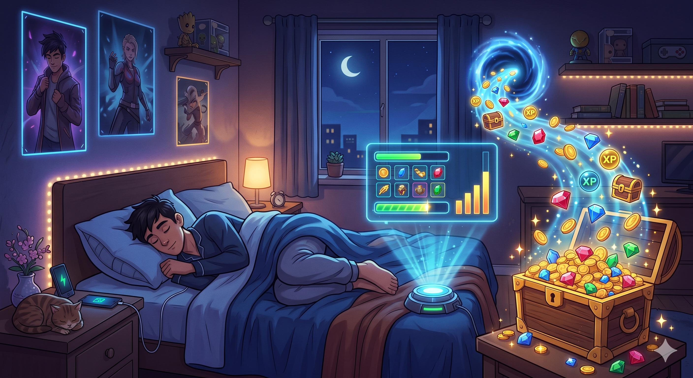

# [📖 進階學習] 製作離線獎勵
<br>
<br>
<br>

## 影片時間軸
- 可在課程影片中以下時間點進行學習。
- 理解地圖類型：`01:28:07`

<br>

## 學習目標

- 製作比較玩家最後登入時間與目前時間的功能。
- 製作依照指定計算式發放資源的功能。

<br>

## 離線獎勵

<p align="center">

</p>

- 離線獎勵是即使玩家未執行世界，也會累積獎勵的功能。
- 這是引導玩家重新連線世界的裝置，同時玩家可透過獎勵強化自己的角色。

<br>

### 製作Logic
- 為了製作離線獎勵，製作了管理資源的Logic與依時間發放獎勵的Logic。
- 在範例世界中，製作為**GameLogic**、**TimeRewardLogic**這兩個名稱。
- 以下是**GameLogic**、**TimeRewardLogic**的程式碼。

```lua
@Logic
script GameLogic extends Logic

property number summonToken = 0

property boolean needTimer = false

property number maxLeftTime = 10.0

property number leftTimeDelta = 0

@ExecSpace("ClientOnly")
method void NeedResult()
-- 檢查目前地圖是否為InGame。
if _UserService.LocalPlayer.CurrentMapName == "InGame" then
	-- 若為InGame狀態，則尋找並賦予MonsterSpawnController。
	local MonsterSpawnController = _EntityService:GetEntityByPath("/maps/InGame/MonsterSpawnController")
	local monsterSpawnComponent = MonsterSpawnController.MonsterSpawnController
	local userId = _UserService.LocalPlayer.PlayerComponent.UserId
	monsterSpawnComponent:ChangeResultUI()
	-- 將目前波數與最高波數儲存至變數。
	local currentWave = monsterSpawnComponent.waveIndex
	local bestWave = _DataStorageLogic.clientBestWave
	-- 只有這次波數的達成度大於既有Wave時，才將其儲存。
	if currentWave > bestWave then
		_DataStorageLogic:RequestSaveBestWave(userId, currentWave)
		-- 更新後立即同步客戶端值。
		_DataStorageLogic.clientBestWave = currentWave
		bestWave = currentWave
	end
	-- 比較達成的Wave與儲存的Wave，並傳遞使其顯示到UI。
	_UIManageLogic:ShowResultUI(currentWave, bestWave)
end
end

@ExecSpace("ClientOnly")
method void RestartGame()
-- 檢查目前地圖狀態是否為InGame。
if _UserService.LocalPlayer.CurrentMapName == "InGame" then
	-- 以路徑為基準尋找並登錄MonsterSpawnController。
	local MonsterSpawnController = _EntityService:GetEntityByPath("/maps/InGame/MonsterSpawnController")
	local monsterSpawnComponent = MonsterSpawnController.MonsterSpawnController
	-- 遊戲重新開始時，請求MonsterSpawnController執行應執行的功能。
	monsterSpawnComponent:CallRestart()
    -- 尋找並登錄characterSlotPosGroup。
	local characterSlotController = _EntityService:GetEntityByPath("/maps/InGame/CharacterSlotPosGroup")
	local characterSlotGroupComponent = characterSlotController.CharacterSlotGroupComponent
	-- 刪除characetrSlotGroupComponent的所有子實體角色。
	characterSlotGroupComponent:ClearCharacterList()
    -- 若目前summonTokken為0以下，則為了讓遊戲可以遊玩，將summonTokken更改為1。
	if self.summonToken <= 0 then
		self:UpdateSummonTokken(1)
	end
	self:DisableTimer()
end
end

@ExecSpace("ClientOnly")
method void OnBeginPlay()
-- 請求離線獎勵並套用。
self:CallOfflineReward()
-- 取得本機玩家的ID值後，預先取得該使用者的最高紀錄。
local userId = _UserService.LocalPlayer.PlayerComponent.ProfileCode
_DataStorageLogic:RequestLoadBestWave(userId)
end

@ExecSpace("ClientOnly")
method void CallOfflineReward()
-- 請求offlineReward後套用。
local getUserID = _UserService.LocalPlayer.PlayerComponent.ProfileCode
self:RequestOfflineReward(getUserID)
end

@ExecSpace("Server")
method void RequestOfflineReward(string UserID)
-- 請求最後連線時間。
_TimeRewardLogic:LoadLastLoginTime(UserID)
end

@ExecSpace("ClientOnly")
method void UpdateSummonTokken(number ChangeValue)
-- 以收到的值更新SummonTokken後更新UI。
self.summonToken = self.summonToken + ChangeValue
_UIManageLogic:UpdateSummonTokken(self.summonToken)
end

@ExecSpace("ClientOnly")
method void NeedTimer()
-- 轉換為需要計時器的狀態，請求計時器運作。
self.needTimer = true
self.leftTimeDelta = self.maxLeftTime
end

@ExecSpace("ClientOnly")
method void DisableTimer()
-- 擊殺所有波數敵人，更改為不需要計時器的狀態。
self.needTimer = false
_UIManageLogic:DisableTimer()
end

@ExecSpace("ClientOnly")
method void OnUpdate(number delta)
-- 若needTimer為true，則啟動Timer。
if self.needTimer then
	-- 若leftTimeDelta為0以下，則開始遊戲結束處理。
	if self.leftTimeDelta <= 0 then
		self.needTimer = false
		self.leftTimeDelta = 0
		_UIManageLogic:UpdateTimer(self.leftTimeDelta)
		self:NeedResult()
	else
		-- 若還有剩餘時間，則執行時間減少及UI處理。
		self.leftTimeDelta = self.leftTimeDelta - delta
		if self.leftTimeDelta <= 0 then
			self.leftTimeDelta = 0
			end
			_UIManageLogic:UpdateTimer(self.leftTimeDelta)
	end	
end
end

end
```

> 該程式碼是以Plain Text為基準編寫而成。

```lua
@Logic
script TimeRewardLogic extends Logic

property string storageKey = "LastLoginTime"

@Sync
property number offlineReward = 0

@Sync
property boolean offlineRewardComplete = false

@ExecSpace("ServerOnly")
method void SaveCurrentTime(string userId)
    local currentTime = os.time()
    local userDataStorage = _DataStorageService:GetUserDataStorage(userId)
    
    -- 以「LastLoginTime」這個Key儲存目前os.time()值。
    userDataStorage:SetAsync(self.storageKey, tostring(currentTime), function(errorCode, key)
        if errorCode == 0 then
            log(userId .."的連線時間已成功儲存：" ..currentTime)
        else
            log("儲存失敗！錯誤代碼：" .. errorCode)
        end
    end)
end

@ExecSpace("ServerOnly")
method void LoadLastLoginTime(string userId)
local userDataStorage = _DataStorageService:GetUserDataStorage(userId)
    
userDataStorage:GetAsync(self.storageKey, function(errorCode, key, value)
if errorCode == 0 then
	-- 若先前沒有儲存的時間，value可能為nil。
	local lastTime = tonumber(value) or 0
            
	-- 呼叫先前製作的計算邏輯，取得獎勵數值。
	self.offlineReward = self:CalculateTimeReward(lastTime)
	-- 已完成領取獎勵，因此儲存目前時間。
	self:SaveCurrentTime(userId)
	end
end)
end

@ExecSpace("ServerOnly")
method number CalculateTimeReward(number lastLoginTime)
-- 比較最後連線時間與目前時間，計算並發放所需獎勵。
self.offlineRewardComplete = true
if lastLoginTime == nil or lastLoginTime == 0 then
	return 1
end

local currentTime = os.time()
local timeDiff = currentTime - lastLoginTime

if timeDiff < 0 then 
	timeDiff = 0 
end
	
if timeDiff <= 1 then
	return 1
else
	-- 每10秒額外發放1個SummonTokken。
	local returnValue = math.floor(timeDiff / 10)
	-- 進行最多只發放10個的處理。
	if returnValue >= 10 then
		returnValue = 10
	end
    return returnValue
end
   
end

@ExecSpace("ClientOnly")
method void OnSyncProperty(string name, any value)
-- 若offlineReward值發生更改，則更新SummonTokken。
if name == "offlineReward" then
	_GameLogic:UpdateSummonTokken(value)
end
end

end
```

> 該程式碼是以Plain Text為基準編寫而成。

- 在範例世界中，未連線時間差距為10秒時會發放1個召喚詞元，最多發放10個。
- 將**TimeRewardLogic**計算出的結果值代入**GameLogic**的summonTokken。
- 玩家可依summonTokken的有無來召喚角色。

<br>

## ⚠️ 製作離線獎勵時的注意事項
- **安全及濫用**
    - 若使用者設定裝置時間，將時間設為未來，可能會視為經過了相對應的時間，發放大量獎勵。
- **遊戲經濟及平衡**
    - 雖然製作了離線獎勵，但若未設定上限值，也就是上限(Max Cap)，遊戲經濟可能會大幅崩壞。
- **比例及小數點處理**
    - 假設每1分鐘發放10金幣，若只經過30秒就連線，就會產生該如何設定基準的問題。
- **時區問題**
    - 若使用者出國旅行，可能會因與伺服器儲存的時區不同，而獲得更多獎勵或無法領取獎勵。
- **使用者體驗及例外處理**
    - 若是有道具欄數量限制的遊戲，當離線獎勵多於欄位時，可能會發生獎勵遺失。
    - 領取獎勵時，可能會因強制結束或網路斷線，導致獎勵發放途中資料消失。

### 解決方案
- 解決上述問題的方法如下。
- **安全及濫用**
    - 有一種方法是讓值的處理只在伺服器上運算，避免客戶端介入。
- **遊戲經濟及平衡**
    - 若製作並使用獎勵上限，也就是上限(Max Cap)，即可防止獎勵發放過多。
- **比例及小數點處理**
    - 這是企劃層面的問題，必須設定規則後，調整為不讓該規則產生例外。
- **時區問題**
    - 可運用國際標準時間(UTC)來預防這類問題。
- **使用者體驗及例外處理**
    - 發放獎勵前，先進行例外處理，確認是否有足夠的剩餘空間。
    - 若是需要網路通訊的功能，則確認網路通訊是否失敗，若失敗則重複請求2～3次，以減少通訊錯誤。


<br>

## 觀看該影片後可嘗試執行的內容

- 設計及製作獎勵資源，使玩家可依連線時間差距獲得獎勵。
- 組成及製作邏輯，使其可依時間按固定比例提供獎勵。

<br>

## 最低製作標準
- 依連線時間差距向玩家發放召喚資源。
- 正常發放資源給玩家，並在發放時儲存連線時間。

<br>

## 應用與進階應用
- 擴充玩家可使用的資源種類，並新增可透過離線獎勵獲得的功能。
- 製作成可儲存及讀取玩家的資源，新增內容使玩家能持續進入世界。
- 修改結構，使離線獎勵可運用資料表調整各種資源的發放量。