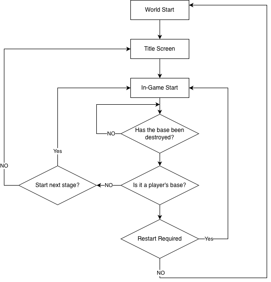

# Defense Genre Learning Guide Document
 
 
 

## Learning Goals

- Learn how to implement core defense game functions using the guide document and the sample world.
- Learn how to set the map up based on the game that is to be created in MapleStory Worlds.
- Understand Logic and use it to design the game's structure.
- Modify and utilize the world based on the lessons.

 

---

 

## Learning Core Functions
- **DataSet Applications**: Learn how to utilize DataSet in a variety of ways to control the difficulty of the game.
- **Utilize AddComponent**: Learn how to use only one entity and register the necessary components to perform purpose-built actions in real-time in response to the situation.
- **Event Handler**: Detects various things that happen in the game and controls their timing so that the intended function can be performed properly.

 

## 🔄 Core Gameplay Loop

 

**1. Title Screen**: This is the entry point to the game, where you can jump right into battle or preset a "deck" of units for the battle. 
**2. In-Game Start**: Based on the player's progress data, the battle will start from the last stage reached. 
**3. Determine Whether Base Is Destroyed**: During unit skirmishes, check in real-time whether ally or enemy (AI) bases have been destroyed. 
**4. Check Ownership of Destroyed Bases**: Determine who owns the destroyed bases to determine the stage's final.  
**5. Confirm Stage Progression**: If you clear the stage by destroying the enemy's (AI) base, you can proceed to the next stage; conversely, if your base is destroyed, you can replay the current stage.

 

## Folder Composition

<table class="tg"><thead>
  <tr>
    <th class="tg-9wq8">Name</th>
    <th class="tg-9wq8">Description</th>
  </tr></thead>
<tbody>
  <tr>
    <td class="tg-lboi">DataSet</td>
    <td class="tg-lboi">The folder containing the DataSet needed to compose the sample world.</td>
  </tr>
  <tr>
    <td class="tg-lboi">Deck</td>
    <td class="tg-lboi">The folder containing the component scripts utilized by the Deck entity in the Defense World.</td>
  </tr>
  <tr>
    <td class="tg-0pky">Logic</td>
    <td class="tg-0pky">The folder containing scripts created with the MapleStory Worlds Logic function.</td>
  </tr>
  <tr>
    <td class="tg-lboi">Models</td>
    <td class="tg-lboi">The folder containing the entities that have gone through Modelization.</td>
  </tr>
  <tr>
    <td class="tg-0pky">Units</td>
    <td class="tg-0pky">The folder contains the component scripts that are registered to the actual combat units.</td>
  </tr>
</tbody>
</table>

---

 

## Implementation Order

- 💡 **Basic Training**: The training material for MapleStory Worlds's basic functions and the fundamental functions of each target genre.
- 📖 **Advanced Training**: Category of training for learning and implementing functions visible in the sample world. Using these materials can improve the functions for the genre and understanding of the training materials. 

### [💡 Basic Training] 1. Composing a World Environment
- Learn about Maple TileMap mode, the most basic mapping method for MapleStory Worlds.
- In TileMap mode, place the tile maps to organize the game environment.
- Analyze the traits of the defense genre and compose the game creation environment yourself.
- Various entities can be placed within the world map.

 

### [💡 Basic Training] 2. Creating Units
- Learn how to create DataSets to compose the various data utilized within the game.
- Learn to utilize actual data by creating DataSetLogic that utilizes data registered in a DataSet.
- Create units that will be utilized in actual combat and gain a better understanding of the various components.
- Create Models, the basic form of units, which are the core characters in the Defense World.

 

### [💡 Basic Training] 3. Implementing Attacks
- Learn how to set up a TriggerComponent and the concept of an Event Handler.
- Learn how each unit performs a periodic attack or skill.
- Understand how to strategically utilize Datasets and learn how to use a variety of skills.

 

### [💡 Basic Training] 4. Implementing Unit Spawn System
- Learn how to configure the units generated from the enemy base, so they vary across different stages.
- Learn how to automatically generate units periodically from enemy bases.
- Understand how to create units via player control.

 

### [💡 Basic Training] 5. Creating Stage Manager
- Learn how to utilize Logic's "globality" trait to manage the number of stages.
- Understand the functions that need to be processed based on the stage clear or defeat phases and create it yourself.
- Understand how to switch maps utilizing TeleportService, which can only be done on the Server side.

 

### [💡Basic Training] 6. Creating an Object Pool
- Understand why performance drops when entities are created and destroyed and then understand why the object pooling technique is necessary.
- Implement your own Pool data structure that pre-creates multiple units and keeps them in a standby state.
- Write a function that returns units with zero HP or less back to the object pool, resets them when needed, and pulls them back out again.

 

### [📖Advanced Training] 7. Implementing Currency System
- Learn how to produce currency periodically over time.
- Learn how the player or enemy (AI) utilize currency to create units.
- Understand how enemies (AI) actually utilize currency to create units.
- Build your own unit Deck to create the ability for players to create units.
- Learn how to utilize the ScrollLayoutComponent to lay out the UI.

 

### [📖Advanced Training] 8. Implementing Deck Editing System
- Learn how to attach different components to an existing Model 'Deck' and use them in different ways.
- From the deck-building process to the actual stages, learn how the battle proceeds with a set deck.
- Learn how to utilize DataStorage to store and retrieve a variety of information about users.

 

### [💡 Basic Training] 9. Implementing UI
- Learn how to expose the required UI to the screen in different situations (Title, MainGame, Result).
- Learn how to easily integrate different features via the Entity's ConnectEvent.
- Learn how to control UI that changes in real-time to create UI that displays information about players' currency in the Defense World.

 
