# [💡Basic Training] Implementing a World Environment
<br>
<br>
<br>

## Video Timeline
- You can follow along by using the timeline under the training video.
- Implementing a World Environment: 00:00:00

<br>

## Learning Goals
- Learn about Maple TileMap mode, the most basic mapping method for MapleStory Worlds.
- In TileMap mode, place the tile maps to organize the game environment.
- Analyze the traits of the defense genre and compose the game creation environment yourself.
- Various entities can be placed within the world map.

<br>

## Practical Exercises to Do After Watching the Video
- Create and place entities for non-base background elements.
- Implement a larger or smaller base by controlling the property value of the base entity's TransformComponent.

<br>

## MapleStory Worlds Map Mode
<p align="Center">


<br>

### TileMap
<p align="center">


- A map format that is set up as the default when creating a world for the first time in MapleStory Worlds.
- A world that is best suited for the feel of MapleStory.
- Formulate a map by utilizing Tiles provided by MapleStory Worlds to create platforms and place entities.
- Create a ramp based on how the tiles are placed.
- A useful map format when you want to make a side scrolling-type game reminiscent of MapleStory.

<br>

### RectTileMap
<p align="center">


- A map format that is effective in making top-down view-type games.
- Create your own tile sets or use the tile set resources provided by MapleStory Worlds to formulate a map.
- You can formulate a map by placing tiles in a gridded format.
- You can create mobile and immobile areas with each individual tile.
- Create a game where you can move in 4 or 8 directions, unlike with the TileMap and SideViewRectTileMap methods.

<br>

### SideviewRectTileMap
<p align="center">


- A map format that is effective in making side scrolling-type games.
- Create your own tile sets or use the tile set resources provided by MapleStory Worlds to formulate a map.
- You can formulate a map by placing tiles in a gridded format.
- The character moves **through** tiles if the tile set doesn't prevent it, unlike with RectTileMap.
- So if you formulate a map with SideViewRectTileMap, the tile set that prevents movement must be used to create **platforms**.

<br>

## Placing Terrain

### Selecting TileMap Mode
<p align="center">
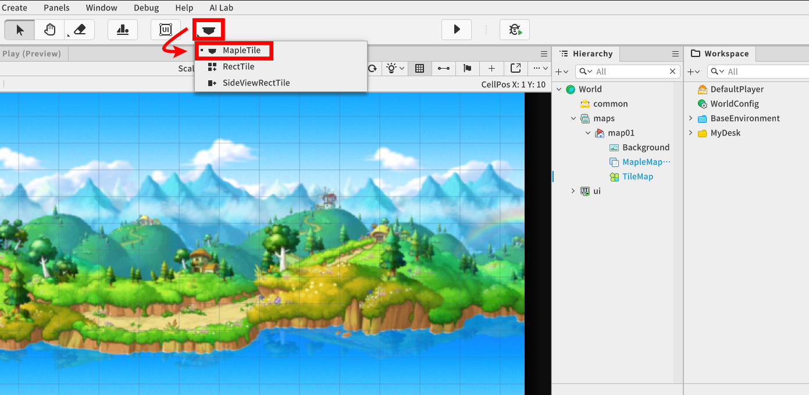

- Press and hold the 'Tile Editor' button at the top of the editor to display a menu list where you can select the map mode.
- Select the 'MapleTile' map mode that appears in the list.

ℹ️ When you create a new world and don't set any environment, the default map mode is set to 'MapleTile'.

<br>

### Placing Tiles
<p align="center">
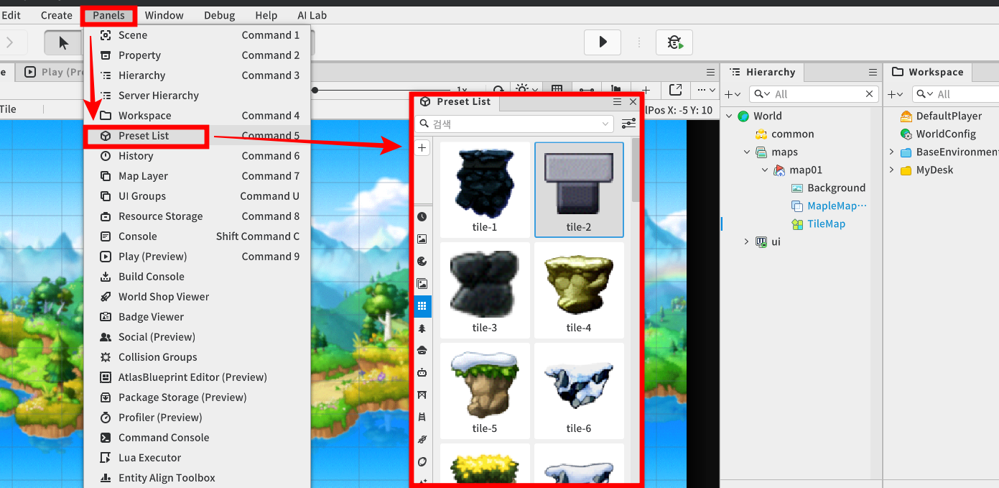

- To place the terrain that your character or unit will interact with, you need to place Tiles that can be utilized in a TileMap.
- At the top of the editor, under **Tile** - **Preset List**, you will find a list of presets that can be placed in the TileMap.

<br>
<br>

<p align="center">
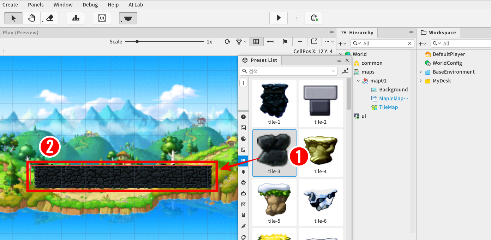

  1. Select the terrain tile you want to place.
  2. Allows natural terrain placement within the map environment by left-clicking or dragging.

<br>

## Player Model

<p align="center">
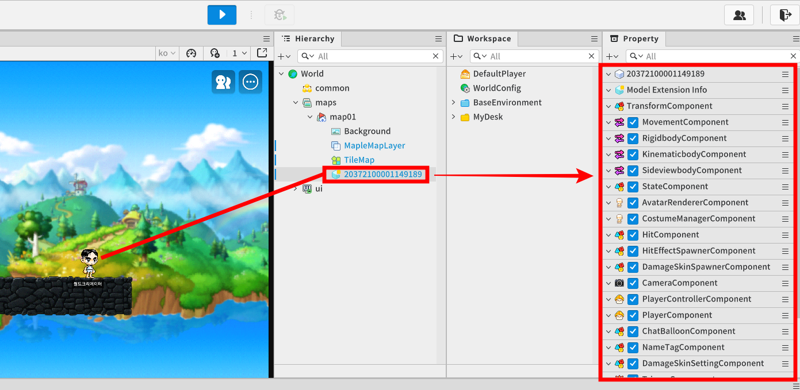

- The default character that appears when the world is launched is created based on the Player Model registered in the **Workspace**, which manages all of the files registered within the project.
- Manage various properties of the Player Model to prepare the character settings that appear when the world runs.

<br>  

### Adding and Deleting Player Model Components
<p align="center">
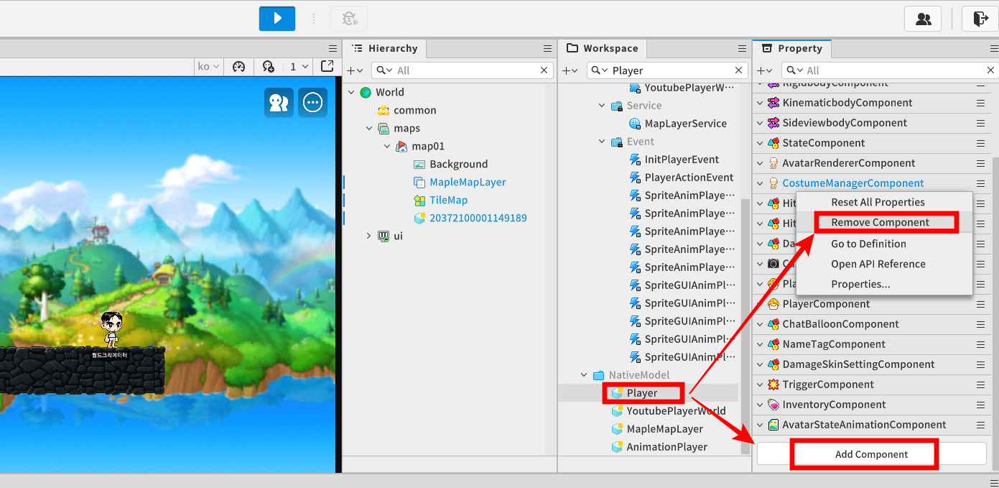

- On the **Workspace** tab, check the **Player Model** registered in the NativeModel path.
- On the **Property** tab, right-click on the component you want to remove, then Remove Component to pre-delete the components of the default character.
- To pre-register new components to the default character, add them via **AddComponent** at the bottom.

<br>

### Setting Character's Default Components
<p align="center">
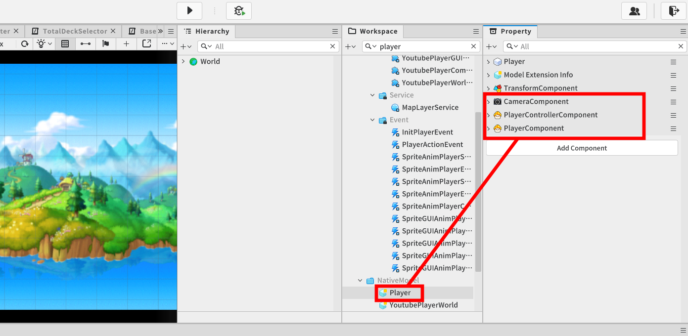

- Since Defense sample world does not require character roles, delete all components except the world environment output and the character base component.
- The components that must be registered are as follows.
  - CameraComponent, PlayerControllerComponent, PlayerComponent

<br>

### Editing Player Model's Property Values
<p align="center">
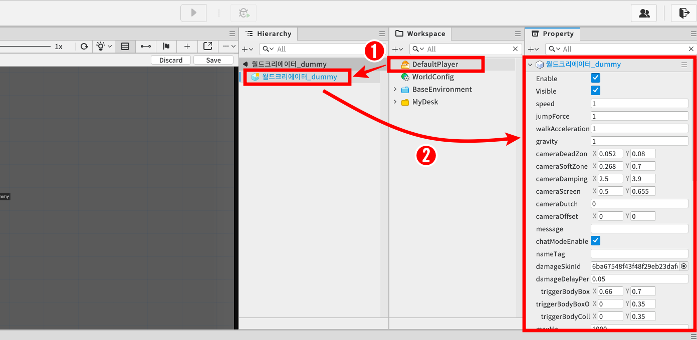

1. Double-click the **DefaultPlayer** in the **Workspace** tab to enter Model editing mode.
2. After selecting the Model entity for the default character, set the desired component values on the Property tab.

<br>

## Creating the Base
<p align="center">
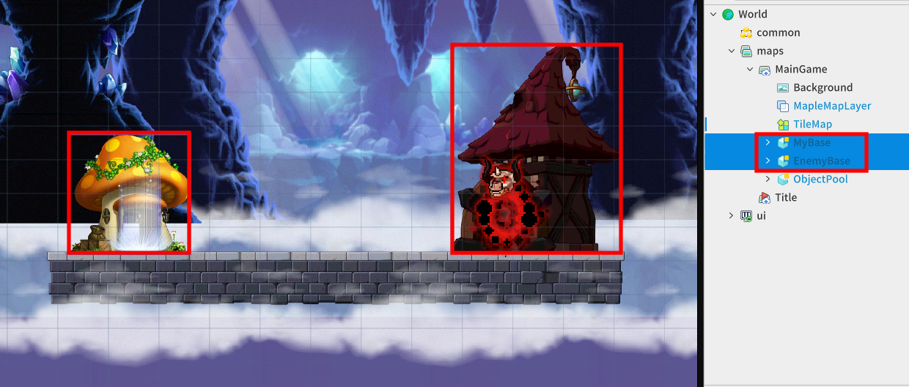

- Once the game is in full swing, players must destroy the enemy's base, and the enemy must destroy the player's base.
- The base entity, which is the source of unit creation, has to be placed. The components that hold the functions each base needs to perform need to be created and registered.

<br>

### Creating Entities
<p align="center">
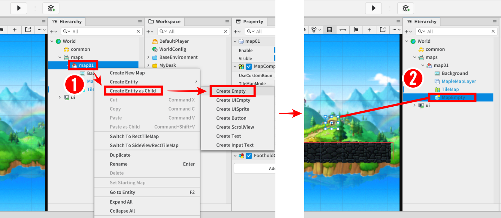

- Create a new entity by **Right-clicking** the path to create the entity or the parent target entity - **Create Entity as Child** - **Create Empty**.
- When creating an empty entity, no appearance is registered by default, since the only component that is registered is the TransformComponent, which determines the position of the entity.

<br>

### Registering Entity Appearance
<p align="center">
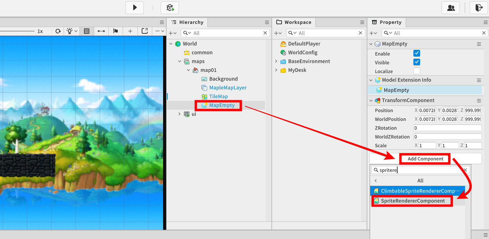

- Select the newly-created entity.
- On the **Property** tab, click **Add Component**.
- Select **SpriteRenderComponent** to register the component.

<br>
<br>

<p align="center">
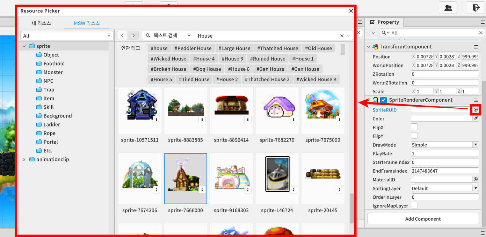

- Among the registered **SpriteComponent** properties, click the '⦿' button to the right of the SpriteRUID option to activate the ResourcePicker window.
- Select the desired resource image.

<br>
<br>

<p align="center">
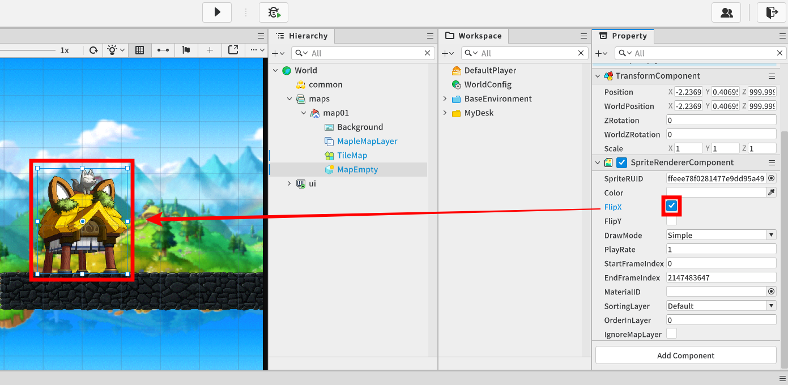

- If you want to flip the image of the Sprite along the X or Y axis, you can do so by checking the SpriteComponent's Flip option.

<br>

### Creating BaseComponent

<p align="center">
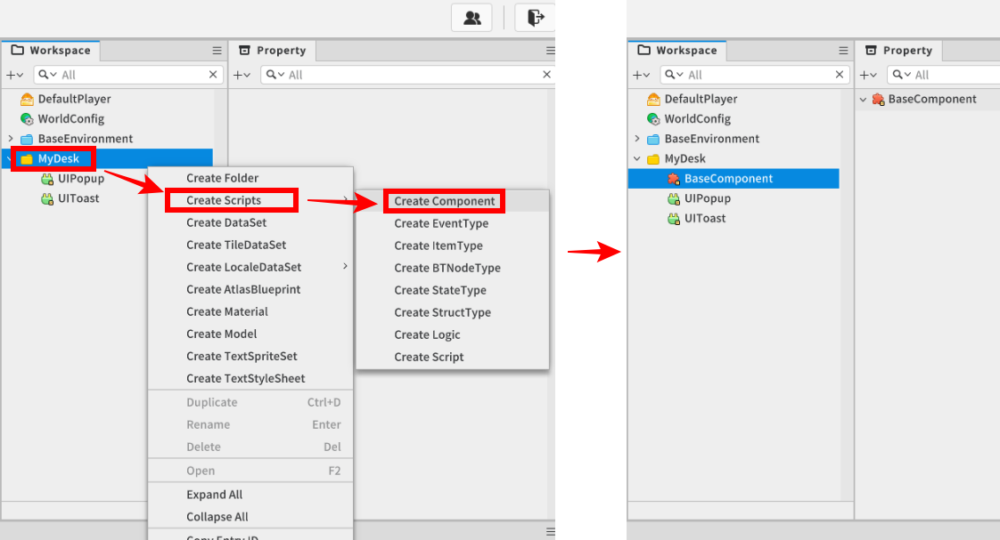

- To create a new component script, **Right-click** on the path you want to create in **Workspace**, then select - **Create Scripts** - **Create Component**.
- Define the component name that matches the function and purpose of what the script will do.

<br>
<br>

<p align="center">
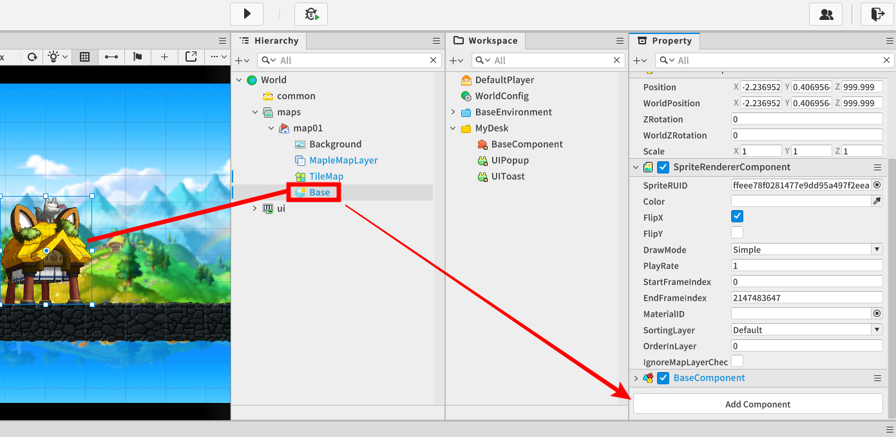

- Select the entity that will act as the base, then register the newly-created BaseComponent via **Add Component**.

<br>

## Writing BaseComponent Code
- Write the following code.
- The target code is based on Plain Text.

```lua
@Component
script BaseComponent extends Component

property boolean isUser = true -- A variable indicating whether the base belongs to the user.

property integer hp = 0 -- Represents the current HP value for this base.

property Entity spawnLocation = nil

property number gold = 0 -- The value of the good that can produce a unit.

property number goldTimer = 0 -- The timer that measures the set intervals at which to produce currency.

property number goldPerSecond = 0 -- The variable that determines how many gold to produce per second.

property string nextSpawnUnitName = "" -- The unit that should be produced next. (Enemy-Only Variable)

property integer needGold = 0 -- Represents the value of the currency required for the action.

@ExecSpace("ClientOnly")
method void OnBeginPlay()
-- This function is immediately called when the world is launched.

-- Proceed with your own initialization.
self:Init()
end

@ExecSpace("ClientOnly")
method void Init()
-- Performs initialization of the component.

-- Among the child entities, find and register the 'SpawnLocation' entity that will determine where the unit spawns.
self.spawnLocation = self.Entity:GetChildByName("SpawnLocation")

-- Resets the current currency value to zero.
self.gold = 0
-- Set the value of the timer for producing the currency to 0.
self.goldTimer = 0

-- If the base is the user's,
if self.isUser == true then
	-- Set the currency yielded per second to the PlayerGoldPerSecond value in StageData (based on the current stage number).
	self.goldPerSecond = _DataSetLogic.stageData[_StageLogic.currentStage].PlayerGoldPerSecond
	-- Sets the initial HP value of the base that players must defend.
	self.hp = _DataSetLogic.stageData[_StageLogic.currentStage].PlayerBaseHp
	
	_UI_MainGame:UpdateGoldText(self.gold)
	
-- If the base is the enemy's,
else
	-- Set the currency yielded per second to the EnemyGoldPerSecond value in StageData (based on the current stage number). 
	self.goldPerSecond = _DataSetLogic.stageData[_StageLogic.currentStage].EnemyGoldPerSecond
	-- Determine the next unit to produce.
	self.nextSpawnUnitName = self:SelectRandomUnitForEnemyName()
	-- Sets the initial HP value of the base that enemy must defend.
	self.hp = _DataSetLogic.stageData[_StageLogic.currentStage].EnemyBaseHp
	-- Record the required currency value of the units you need to produce next.
	self.needGold = _DataSetLogic.unitData[self.nextSpawnUnitName].Cost
end
end

@ExecSpace("ClientOnly")
method void SpawnUnit(string unitName)
-- A function that produces a unit.

-- Parameter 1 unitName: Receives the name of the unit being produced.

-- Requests that a unit entity be returned from the object pool.
-- Pass a parameter to set the received parent entity to itself.
local unit = _ObjectPoolLogic:GetUnit(self.Entity)

-- Sets the unit entity's location coordinates to be same as the location of its child entity, SpawnLocaion.
unit.TransformComponent.Position = self.spawnLocation.TransformComponent.Position
-- Accesses the UnitComponet of the Unit and initializes it.
unit.UnitComponent:Init(unitName,self.isUser)
end

@ExecSpace("ClientOnly")
method void OnDamage(integer damageValue)
-- Function called when hit by an opponent's unit.

-- Parameter 1 damageValue: Determines how much damage hit is received from the opponent.

-- Decreases HP value.
self.hp -= damageValue

-- If HP is 0 or lower,
if self.hp <= 0 then
	-- Performs destroy function.
	self:Destory()
	-- Sets that the stage's progress has ended.
	_StageLogic:SetStageState(false)
end
end

@ExecSpace("ClientOnly")
method void Destory()
-- The function that performs the destruction of that entity.

-- If the destroyed entity is the user's base, display a popup with the result of defeat.
_UI_Result:ShowWithWinInfo(not self.isUser)

-- Disables the entity the component is attached to.
self.Entity.Enable = false
end

@ExecSpace("ClientOnly")
method void OnUpdate(number delta)
-- A function that is called every frame.

-- If the stage has ended,
if _StageLogic.isStageStart == false then
	-- Exits without performing any further functions.
	return
end

-- Allows currency to accumulate automatically over the course of the game.
self:AutoGetGold(delta)
end

@ExecSpace("ClientOnly")
method void AutoGetGold(number delta)
-- A function that automatically accumulates currency.

-- Parameter 1 delta: Receives the value of the time change between frames.

-- Increases the timer value to measure in units of 1 second.
self.goldTimer += delta

-- Record the value of the max amount of currency you can carry for the current stage.
-- ---@ type to indicate that the data type is an integer.
---@ type integer
local maxGold = _DataSetLogic.stageData[_StageLogic.currentStage].MaxGold

-- If it's 1 second or more,
if self.goldTimer >= 1 and self.gold < maxGold then
	-- Reset the timer back to 0.
	self.goldTimer = 0
	-- Adds the set gold value per second to the current gold value.
	self.gold += self.goldPerSecond
	self.gold = math.clamp(self.gold,0,maxGold)
	
		-- If the base is an enemy base,
		if self.isUser == false then
			-- Enable the auto unit spawn function.
			self:EnemyAutoSpawn()
		-- If that base is the user's base,
	elseif self.isUser == true then
			-- Update the value of the UI text displaying the currency information.
			_UI_MainGame:UpdateGoldText(self.gold)
		end
end
end

@ExecSpace("ClientOnly")
method string SelectRandomUnitForEnemyName()
-- Function that retrieves a random unit name from the EnemyUnit registered in StageData that matches the current stage.

-- Create a table to hold the names of the units.
local enemyUnits = {} 
-- Retrieves the unit name table that can be generated in the current stage from DataSetLogic as is.
enemyUnits = _DataSetLogic.stageData[_StageLogic.currentStage].EnemyUnit

-- Generates a random index value from the 1st element to the last element of the table.
local selectRandomIndex = _UtilLogic:RandomIntegerRange(1,#enemyUnits)

-- Retrieves the name of the unit corresponding to the specified index.
local randomUnitName = enemyUnits[selectRandomIndex]

-- Returns the name of the unit.
return randomUnitName
end

@ExecSpace("ClientOnly")
method void EnemyAutoSpawn()
-- This is an enemy base-specific function that automatically produces units.

-- If the enemy base has enough gold to create the next unit,
if self.gold >= self.needGold then
	-- Allow the required units to spawn.
	self:SpawnUnit(self.nextSpawnUnitName)
	-- Decreases the required currency value from the current currency.
	self.gold -= self.needGold
	-- Next, select the units to produce again.
	self.nextSpawnUnitName = self:SelectRandomUnitForEnemyName()
end
end

@ExecSpace("ClientOnly")
method void PlayerRequestSpawn(string unitName)
-- This function requests the spawning of the unit passed as a parameter. (Player-only function)

-- Parameter 1 unitName: Unit name of the unit you want to spawn.

-- View the production cost value for the target unit.
local targetUnitCost = _DataSetLogic.unitData[unitName].Cost

-- If the current gold value is higher than the production cost of the target unit,
if self.gold >= targetUnitCost then
	-- Request that the target unit spawn as is.
	self:SpawnUnit(unitName)
	-- Decreases the amount of the currency by the unit's production cost from the current amount of the currency.
	self.gold -= targetUnitCost
	-- Refreshes the TextUI representing the inventory with the current consumed amount of currency.
	_UI_MainGame:UpdateGoldText(self.gold)
end
end

@ExecSpace("ClientOnly")
method void ReturnAllUnit()
-- A function that returns all produced units back to the object pool.

-- Records child entities with UnitComponent registered to Table.
local units = self.Entity:GetChildComponentsByTypeName("UnitComponent")

-- Iterates through the entire table.
for _, unit in pairs(units) do
	-- Have the object pool return the units.
	_ObjectPoolLogic:ReturnUnit(unit.Entity)
end
end

end
```

<br>

## Minimum Implementation Standards
- In order to utilize the resources available in MapleStory Worlds, it must be set to 'Maple TileMap' environment.
- To destroy a base, which is the trigger for the end of the game, basic base entities must be placed and you need to register a BaseComponent to act as the base.

<br>

## Usage and Extension Direction
- Make the game much harder by placing additional enemy (AI) bases.
- Place a variety of decorative entities within the map environment to add more variety to the game.


