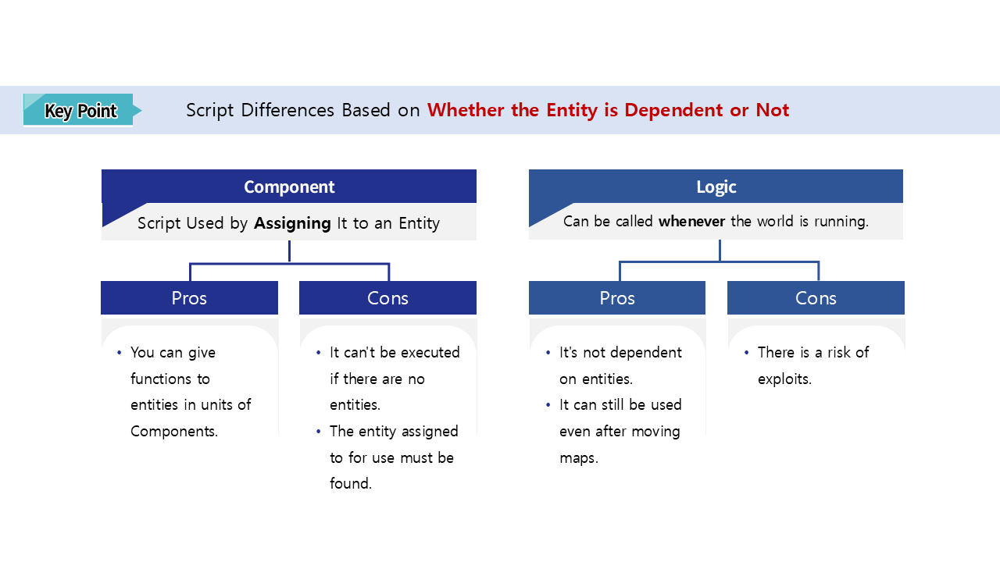

# [💡 Basic Training] Creating Units
<br>
<br>
<br>

## Video Timeline
- You can follow along by using the timeline under the training video.
- Creating Units: 00:21:12

<br>

## Learning Goals
- Learn how to create DataSets to compose the various data utilized within the game.
- Learn to utilize actual data by creating DataSetLogic that utilizes data registered in a DataSet.
- Create units that will be utilized in actual combat and gain a better understanding of the various components.
- Create Models, the basic form of units, which are the core characters in the Defense World.

<br>

## Practical Exercises to Do After Watching the Video
- Register additional information in the DataSet to create a wider variety of units beyond those provided in the sample world.
- Create your own Component and Logic scripts and compare the differences.

<br>

## Creating a DataSet
<p align="Center">


- DataSet organizes data managed within the game into a tabular format, making the necessary data immediately available for use.
- Create DataSet by **Right-clicking** on the path you want in **Workspace** and selecting **Create DataSet**.

### Creating UnitData
<p align="Center">


<table class="tg"><thead>
  <tr>
    <th class="tg-nrix">Name</th>
    <th class="tg-nrix">Description</th>
  </tr></thead>
<tbody>
  <tr>
    <td class="tg-cly1">Usable</td>
    <td class="tg-cly1">Indicates whether a unit that can be utilized for deck building can be configured.</td>
  </tr>
  <tr>
    <td class="tg-cly1">RenderID</td>
    <td class="tg-cly1">Record the ID number value of the UnitRenderData that records the unit's appearance RUID value.</td>
  </tr>
  <tr>
    <td class="tg-cly1">Name</td>
    <td class="tg-cly1">The name of the unit as it appears in-game.</td>
  </tr>
  <tr>
    <td class="tg-cly1">Cost</td>
    <td class="tg-cly1">The creation cost of the unit.</td>
  </tr>
  <tr>
    <td class="tg-cly1">Hp</td>
    <td class="tg-cly1">The unit's base HP value.</td>
  </tr>
  <tr>
    <td class="tg-cly1">Attack</td>
    <td class="tg-cly1">The unit's base attack power value.</td>
  </tr>
  <tr>
    <td class="tg-cly1">Speed</td>
    <td class="tg-cly1">The unit's speed value.</td>
  </tr>
  <tr>
    <td class="tg-cly1">Skill</td>
    <td class="tg-cly1">Record the ID number value of the SkillData that manages data about the unit's skills.</td>
  </tr>
</tbody>
</table>

- **UnitData** DataSet is needed to record the default data values that should be applied per unit.
- For RenderID, Skill data values, record the value to reference another DataSet.

### Creating UnitRenderData
<p align="Center">


<table class="tg"><thead>
  <tr>
    <th class="tg-nrix">Name</th>
    <th class="tg-nrix">Description</th>
  </tr></thead>
<tbody>
  <tr>
    <td class="tg-cly1">IDLE</td>
    <td class="tg-cly1">The RUID value of the animation that plays when the unit is on standby.</td>
  </tr>
  <tr>
    <td class="tg-cly1">MOVE</td>
    <td class="tg-cly1"><span style="font-weight:400;font-style:normal">The RUID value for the animation that plays when the unit moves.</span></td>
  </tr>
  <tr>
    <td class="tg-cly1">ATTACK</td>
    <td class="tg-cly1"><span style="font-weight:400;font-style:normal">The RUID value of the animation that plays when the unit attacks.</span></td>
  </tr>
  <tr>
    <td class="tg-cly1">ONHIT</td>
    <td class="tg-cly1"><span style="font-weight:400;font-style:normal">The RUID value of the animation that plays when the unit is hit.</span></td>
  </tr>
  <tr>
    <td class="tg-cly1">DEAD</td>
    <td class="tg-cly1"><span style="font-weight:400;font-style:normal">The RUID value for the animation that plays when the unit dies.</span></td>
  </tr>
  <tr>
    <td class="tg-cly1">AttackPick</td>
    <td class="tg-cly1">Records the time to deliver damage when playing an attack animation.</td>
  </tr>
</tbody></table>

- A DataSet that records the RUID values of the animations that should be played for each current state of the unit.
- For AttackPick value, it's the time value measured in seconds starting from the moment the attack animation begins to when the damage is dealt to the opponent.

### RenderID and UnitRenderData Relationship
<p align="Center">


- The number value of the RenderID of each unit registered in the **UnitData** DataSet means the data in each line corresponding to each entry (Index) of the UnitRenderData.
- If Pepe, a unit with ID 4, is also given a RenderID value of 1, the unit will be created with the same appearance as the first Tiger.
- May consider producing units that look the same, but are more powerful under the hood.

<br>

### Creating SkillData
<p align="Center">


<table class="tg"><thead>
  <tr>
    <th class="tg-nrix">Name</th>
    <th class="tg-nrix">Description</th>
  </tr></thead>
<tbody>
  <tr>
    <td class="tg-cly1">EffectRUID</td>
    <td class="tg-cly1">The RUID value of the effect that plays when the unit's skill attacks.</td>
  </tr>
</tbody>
</table>

<br>

### Skill Number and SkillData Relationship
<p align="Center">


- The number value of the **Skill** of each unit registered in the **UnitData** DataSet means the data in each line corresponding to each entry (Index) of the SkillData.
- Bear, a unit with ID 2, will also play the same skill effect as Tiger number 1 when it is assigned a skill number value of 1.

<br>

## Creating DataSetLogic
<p align="Center">


- **Right-Click** the path to create Logic script in Workspace and select - **Create Scripts** - **Create Logic** to create the new Logic script.
- Define the name of the created Logic as DataSetLogic.

<br>

### What is Logic?
<p align="Center">


- It is one of the script types provided by MapleStory Worlds.
- Unlike typical component scripts, they can perform functional behavior on their own without registering with a specific entity.
- It doesn't require a separate reference, and its global access allows it to be called at any time while the world is running.

<br>

### Registering Data in the Table
<p align="Center">


- After classifying all stored unit data by unit and recording it within a single table, the data table must be created to enable intuitive retrieval and utilization whenever external access to specific data is required.
- In the **Property** space of the **DataSetLogic** script created with Logic, create a table variable to hold each of the unit's data.
- When the world runs, have it perform an initialization function to fetch all the data registered in the DataSet.

<br>

```lua
Declare data table variables.
DataSetLogic{
Property:
    [None]
    table unitData = {} -- Create an empty table to hold the unit's data.

Method:
    void OnBeginPlay() -- The 'OnBeginPlay' lifecycle function that is called when the world is launched.
    {
        local dataSetName = "UnitData"
        local rowCount = _DataService:GetRowCount(dataSetName)

        -- Starting with the first line of data, 1, iterate a number of times equal to the total number of Rows in the data.
        for i = 1, rowCount, 1 do
            -- Create one internal table to hold each piece of information.
            local data = {
                Useable = _DataService:GetCell(dataSetName,i,"Useable"),
                RenderID = tonumber(_DataService:GetCell(dataSetName,i,"RenderID")),
                Hp = tonumber(_DataService:GetCell(dataSetName,i,"Hp")),
                Attack = tonumber(_DataService:GetCell(dataSetName,i,"Attack")),
                Speed = tonumber(_DataService:GetCell(dataSetName,i,"Speed")),
                Skill = tonumber(_DataService:GetCell(dataSetName,i,"Skill")),
                SkAttack = tonumber(_DataService:GetCell(dataSetName,i,"SkAttack")),
                AtkCooltime = tonumber(_DataService:GetCell(dataSetName,i,"AtkCooltime")),
                SkCooltime = tonumber(_DataService:GetCell(dataSetName,i,"SkCooltime")),
                Cost = tonumber(_DataService:GetCell(dataSetName,i,"Cost"))
            }
            
            -- Record the name of the target unit.
            local unitName = _DataService:GetCell(dataSetName,i,"Name")
            
            -- Store the name of the unit as the key value in the unitData table and record a table internally with each piece of information specific to that unit.
            self.unitData[unitName] = data
        end
            }

}
```
<br>

### Retrieve Registered Data
- To get each of the required data stored in the unitData table in **DataSetLogic**, write the following code.

```lua
Get the Cost value of a Tiger unit.
    local tigerUnitCost = _DataSetLogic.unitData["Tiger"].Cost

Get the speed value of a Panda unit.
    local pandaMoveSpeed = _DataSetLogic.unitData["Panda"].Speed
```

<br>

## Extract Various Animation RUID Values
<p align="Center">


- The RUID values of the animations of various monsters in the resources provided by MapleStory Worlds can be found within the **Resource Storage** panel.
- Turn on the resource list panel by selecting **Panels** - **Resource Storage** at the top of the editor.

<br>
<br>

<p align="Center">


- To view the resources provided by MapleStory Worlds in Resource Storage, select the MSW Resources tab at the top of the window.
- See the different monster animations in the **animationclip** - **Monster** path to access the monster's animations among the resources.
- Select the 'info' icon placed in the bottom right corner of each resource item to view the various animations of the desired monster (standby, moving, attacking, etc.).

<br>
<br>

<p align="Center">


- Access the tag entries associated with unit animations to view information regarding the various animation clips for a specific unit.

<br>

### Checking Animation Timing
<p align="Center">


- If an event needs to occur during the animation of a unit, the current playback time can be checked at the bottom of the panel by pressing the stop button at a specific point in the animation.
- Each unit's attacked delivery timing value is recorded as an entry in **AttackPick** in **UnitRenderData**.

<br>

## Creating Unit Components

<p align="Center">


<table class="tg"><thead>
  <tr>
    <th class="tg-9wq8">Component</th>
    <th class="tg-9wq8">Description</th>
  </tr></thead>
<tbody>
  <tr>
    <td class="tg-0lax">TransformComponent</td>
    <td class="tg-0lax">Components that set the position, rotation, and size of entities.</td>
  </tr>
  <tr>
    <td class="tg-lboi">SpriteRendererComponent</td>
    <td class="tg-lboi">Components that set the sprite (appearance) of entities.</td>
  </tr>
  <tr>
    <td class="tg-0lax">UnitComponent</td>
    <td class="tg-0lax">A core component with a defined set of functions to be performed as a unit.</td>
  </tr>
  <tr>
    <td class="tg-0lax">AnimationController</td>
    <td class="tg-0lax">Components that utilize the features of the SpriteComponent to control various animations.</td>
  </tr>
  <tr>
    <td class="tg-0lax">RigidbodyComponent</td>
    <td class="tg-0lax">Components that perform physical functions in Maple TileMap, such as terrain detection and gravity effects.</td>
  </tr>
  <tr>
    <td class="tg-0lax">CustomState</td>
    <td class="tg-0lax">Components that manage the various states of a unit (standby, moving, attacking, etc.) in detail.</td>
  </tr>
  <tr>
    <td class="tg-0lax">TriggerComponent</td>
    <td class="tg-0lax">Components for zone and collision detection.</td>
  </tr>
</tbody></table>

- To enable a unit to execute various functions within the implemented sample world, several components as illustrated in the figure are required.
- The components in UnitComponent, AnimationController, and CustomState are custom-made components, and you can check their roles and code to see how they work specifically.

<br>

### AnimationController Component
<p align="Center">


- The Animation component is responsible for storing the unit's animations set when the unit is initialized in a single table and playing externally-requested animations.
- Write the following code.
- The target code is based on Plain Text.

```lua
@Component
script AnimationController extends Component

property SpriteRendererComponent renderer = nil

property table actionSheet = {} -- Table Keys: The name of each state. Values: The animation GUID for each state. 

property number hitTiming = 0 -- The timing value at which the opponent unit should be hit when the attack animation plays.

@ExecSpace("ClientOnly")
method void OnBeginPlay()
-- This function is called when the world is launched.

-- Find the SpriteRendererComponent among the components registered in your own entity and register it as an internal member.
self.renderer = self.Entity.SpriteRendererComponent
end

@ExecSpace("ClientOnly")
method void ChangeAnimation(string animName)
-- Change the animation state to the parameter value (State).

-- Parameter 1 animName: Key value of the animation to apply. (Example: IDLE, MOVE, ATTACK)

-- Change the GUID value of the SpriteRenderer to the internally-registered animation GUID value.
self.renderer.SpriteRUID = self.actionSheet[animName]
end

@ExecSpace("ClientOnly")
method void SetAnimTable(string unitName)
-- Brings over the internal member actionSheet table as-is: The table containing the animation GUID values of 
-- the UnitRenderData of the unit registered under the name of the parameter.

-- Parameter 1 unitName: The name value of the currently-registered unit.

-- The number of the table (with each ID number in UnitRenderData) that contains information about the animation that should be rendered for the unit.
local unitRenderID = _DataSetLogic.unitData[unitName].RenderID

-- Registers the internal member's table as-is: The table corresponding to the index of the UnitRenderData.
self.actionSheet = _DataSetLogic.unitRenderData[unitRenderID]

-- Saves the "AttackPick" data registered in UnitRenderData as a member as-is.
self.hitTiming = self.actionSheet["AttackPick"]
end

end
```

<br>

### CustomState Component
<p align="Center">


1. The CustomState component receives a state transition request from a UnitComponent that performs the core functionality of the unit.
2. Determine whether the received state can be converted, and if so, record the current unit's state as the new state.
3. An **AnimationController** component, which requests to play the required animation per state.

- Write the following code.
- The target code is based on Plain Text.
```lua
@Component
script CustomState extends Component

property string currentState = "" -- A variable for recording that indicates the current state of the character.

property AnimationController animation = nil

@ExecSpace("ClientOnly")
method void Init()
-- Initialize the CustomState component.

-- Saves the current state as idle state.
self.currentState = "IDLE"
-- When the state changes, the animation should also change, so register the animation controller component as a member.
self.animation = self.Entity.AnimationController
end

@ExecSpace("ClientOnly")
method void ChangeState(string stateName)
-- Function to switch to the parameter state.

-- Parameter 1 stateName: The state name you want to change.

-- If the existing state is the attacking state and needs to be switched to attacked state,
if self.currentState == "ATTACK" and stateName == "ONHIT" then
	-- Ensure that no processing is performed.
	-- If the attack motion is interrupted, it can look awkward when consecutive hits occur.
	return
end

-- Records the current state as received as a parameter.
self.currentState = stateName
-- Directs an animation to play for the received state.
self.animation:ChangeAnimation(stateName)
end

@EventSender("Self")
handler HandleSpriteAnimPlayerEndFrameEvent(SpriteAnimPlayerEndFrameEvent event)
-- Event function that is called when the animation ends.

-- If the current unit's state is 'ATTACK',
if self.currentState == "ATTACK" then
	-- Automatically switches the state of the unit to IDLE.
	self:ChangeState("IDLE")
	
-- If the current unit's status is 'DEAD', 
elseif self.currentState == "DEAD" then
	-- Disable the unit's entity.
	-- This is the same reason the entire animation played to FrameEnd.
	self.Entity.Enable = false
	-- Returns the unit back to the object pool.
	_ObjectPoolLogic:ReturnUnit(self.Entity)
end
end

end
```

<br>

### UnitComponent

- A UnitComponent is a component that directly handles the detailed behavior and functionality of a unit.
- Requests a 'MOVE' state transition to the CustomState component if no targets are detected within its collision range, or a state transition such as 'ATTACK' if a target is detected.
- Write the following code.
- The target code is based on Plain Text.
```lua
@Component
script UnitComponent extends Component

property boolean isMine = false -- A variable for the record that determines whether the unit belongs to the user.

property CustomState state = nil

property integer direction = -1 -- Indicates the forward direction of the unit's movement.

property number attackTimer = 0 -- Timer variable to measure and manage the basic attack cooldown.

property number skillTimer = 0 -- Timer variable to measure and manage the cooldown of skill attacks.

property table unitStat = {} -- The table that holds the unit's information. Retrieves the table containing information about the units registered in the DataSet as-is.

property boolean found = false -- A variable that checks whether the opponent unit was detected.

property boolean waiting = false -- A variable to record that the current unit is in idle state for the next attack after an attack.

property number hitTimer = 0 -- Timer variable for transmitting the attack value to the opponent.

property boolean isSendHit = false -- A variable that records whether the attack value was transmitted to the opponent.

property UnitComponent targetUnit = nil

property BaseComponent targetBase = nil

property integer hp = 0 -- The unit's current HP.

property integer power = 0 -- The unit's attack power. The unit currently has two attacks (basic and skill), and the value changes with each attack.

property number damageTimer = 0 -- Timer variable for changing the transparency of the sprite when hit.

property boolean changedSpriteAlpha = false -- A state variable indicating whether the alpha value of the sprite has changed.

@ExecSpace("ClientOnly")
method void OnBeginPlay()
-- This function is called when the world is launched.

-- Store the CustomState component registered to the unit entity as an internal member.
self.state = self.Entity.CustomState
-- Initialize the CustomState component.
self.state:Init()
end

@ExecSpace("ClientOnly")
method void Init(string unitName, boolean isMine)
-- Functions that perform initialization of the unit.

-- Sets whether the unit is the player's unit.
self.isMine = isMine

-- If the value of the 'isMine' variable is true (if it belongs to the user)
if self.isMine == true then
	-- Set the unit's direction of travel to a positive value (to the right).
	self.direction = 1
	-- Set the Collision Group of this unit's TriggerComponent to Player.
	-- Setting Up Player and Enemy Collision interaction
	self.Entity.TriggerComponent.CollisionGroup = CollisionGroups.Player
	-- Flips the unit's sprite image around the X-axis.
	self.Entity.SpriteRendererComponent.FlipX = true
else
	-- Set the unit's direction of advance to a negative value (to the left).
	self.direction = -1
	-- Set the Collision Group of this unit's TriggerComponent to Enemy.
	self.Entity.TriggerComponent.CollisionGroup = CollisionGroups.Enemy
	-- Flips the unit's sprite image around the X-axis.
	self.Entity.SpriteRendererComponent.FlipX = false
end

-- Sets the property value of the SpriteRenderer Component's FlipX.
--self.Entity.SpriteRendererComponent.FlipX = self.isMine

-- Get the table with the unit's information values as an internal member as is.
self.unitStat = _DataSetLogic.unitData[unitName]

-- Set the animation table for the unit when initialization is happening (Unit animation table for UnitRenderData).
self.Entity.AnimationController:SetAnimTable(unitName)

-- Resets the basic attack timer.
self.attackTimer = 0
-- Resets the skill attack timer.
self.skillTimer = 0
-- Set the unit's initial HP value to the 'Hp' value in UnitData.
self.hp = self.unitStat["Hp"]

self.Entity.RigidbodyComponent.Enable = true
-- Enables the TriggerComponent registered in entity to be used.
self.Entity.TriggerComponent.Enable = true
-- Initializes the SpriteRenderer Component's color values to be opaque by setting their transparency to state 1.
self.Entity.SpriteRendererComponent.Color.a = 1
-- Sets the unit's status to not idle state.
self.waiting = false;
end

@ExecSpace("ClientOnly")
method void OnUpdate(number delta)
-- A function that is called every frame.

-- If the transparency of the SpriteRenderer's color values changed due to being hit,
if self.changedSpriteAlpha == true then
	-- If the damageTimer, which is set on being hit, is 0 or less (restores state),
	if self.damageTimer <= 0 then
		-- Sets the transparency of the Sprite's color values to unchanged.
		self.changedSpriteAlpha = false
		-- Set the SpriteRenderer Component's transparency value to 1, which makes it opaque.
		self.Entity.SpriteRendererComponent.Color.a = 1
	else
		-- Since the timer set upon being hit still has time remaining, decrease the timer value until it reaches 0.
		self.damageTimer -= delta	
	end
end

-- If you don't have HP,
if self.hp <= 0 then
	-- Configure so subsequent action functions are not performed.
	return
end


-- Allows basic and skill attacks to continue to cycle through their cooldowns while the unit is alive.
-- This is to cycle cooldowns in all situations when moving, idle, and taking damage.
self.attackTimer += delta
self.skillTimer += delta

-- If the unit is in the Attack state (if an attack animation is being performed),
if self.state.currentState == "ATTACK" then
		-- If damage hasn't been delivered to the opponent,
		if self.isSendHit == false then
			-- Adds the delta value to the hitTimer until the timing for delivering that unit's damage to the opponent is reached.
			self.hitTimer += delta
			
			-- In situations where the hitTimer value is greater than the AttackPick value registered in the UnitRenderData DataSet (proceeding with damage delivery),
			if self.hitTimer >= self.Entity.AnimationController.hitTiming then
				
				-- If any target units are detected,
				if self.targetUnit ~= nil then
					-- Delivers damage to the target unit.
					self.targetUnit:OnDamage(self.power)
				
				-- If any target bases are detected,
				elseif self.targetBase ~= nil then
					-- Delivers damage to the target base.
					self.targetBase:OnDamage(self.power)
				
				end
				
				-- Switch the state to damage delivered.
				-- This is to prevent delivering consecutive damage when performing a single Attack.
				self.isSendHit = true
				-- Leave the detected target unit's information blank.
				self.targetUnit = nil
				-- Leave the detected target base's information blank.
				self.targetBase = nil
			
			end
		
		end
	-- If it's in an attack state, no further logic is performed so that it can only perform functions that are responsible for attacking.
	return
end
	

-- If the TriggerComponent has no detected opponent,
if self.found == false then
	-- Perform a move function.
	self:Move(delta)

	-- If the TriggerComponent has a detected opponent,
else
	-- If none of the basic attack cooldown and skill attack cooldown values reached usable state,
	if(self.attackTimer < self.unitStat["AtkCooltime"]) and (self.skillTimer < self.unitStat["SkCooltime"]) then
		
		-- Switch the unit to idle state.	
		self.waiting = true
		-- Switches the current state of the unit to IDLE.
		self.state:ChangeState("IDLE")
		
	-- If the cooldown of attack action (basic or skill attack) has been met,
	else
		
		-- Switch the unit's status to not idle.	
		self.waiting = false
		-- If the skill attack has completed its cooldown,	
		if self.skillTimer >= self.unitStat["SkCooltime"] then
			-- Performs unit's skill attack. 
			self:Skill()
		-- If the cooldown of a non-skill basic attack has completed,
		elseif self.attackTimer >= self.unitStat["AtkCooltime"] then
			-- Performs the unit's basic attack.
			self:Attack()
		end
		
		-- Now that the attack has been performed, change the unit's status back to idle.
		self.waiting = true
	
	end

end


end

@ExecSpace("ClientOnly")
method void Move(number delta)
-- Perform a unit's movement.

-- Switches the state of the unit to not idle.
self.waiting = false
-- Switch the character's current state to MOVE in CustomStateComponent.
self.state:ChangeState("MOVE")

-- Get the current absolute coordinate value of the unit.
local currentPos = self.Entity.TransformComponent.WorldPosition
-- Calculate the position value that should be reflected on the unit, taking speed and direction into account.
local movePos = currentPos + Vector3(delta*self.direction*self.unitStat["Speed"],0,0)
-- Set the absolute coordinate value of the unit with RigidbodyComponent.
self.Entity.RigidbodyComponent:SetWorldPosition(movePos:ToVector2())
end

@ExecSpace("ClientOnly")
method void Skill()
-- Activates the unit's skill function.

-- Skill attacks also reset the basic attack timer.
self.attackTimer = 0
-- Resets the skill attack timer.
self.skillTimer = 0
-- Change the unit's status to ATTACK.
self.state:ChangeState("ATTACK")
-- Resets the damage delivery timer.
self.hitTimer = 0
-- Reset to 'did not deliver damage'.
self.isSendHit = false

local skillFX_ID = self.unitStat["Skill"]
local skillFX_RUID = _DataSetLogic.skillData[skillFX_ID].EffectRUID

_EffectService:PlayEffect(skillFX_RUID,self.Entity,self.Entity.TransformComponent.WorldPosition,0,Vector3.one)
_SoundService:PlaySound("83529166c98f420092183aa310b2d660",0.5)

-- Set the unit's attack power to the skill's attack power value.
self.power = self.unitStat["SkAttack"]
end

@ExecSpace("ClientOnly")
method void Attack()
-- Resets the basic attack timer.
self.attackTimer = 0
-- Change the unit's status to ATTACK.
self.state:ChangeState("ATTACK")
-- Resets the damage delivery timer.
self.hitTimer = 0
-- Reset to 'did not deliver damage'.
self.isSendHit = false

-- Set the unit's attack power to the basic attack power value.
self.power = self.unitStat["Attack"]

_SoundService:PlaySound("ddd8caea18a04c88a7a9cf9627a91f86",0.35)
end

@ExecSpace("ClientOnly")
method void OnDamage(integer damage)
-- Function that handles the processing of a unit being hit.

-- Parameter 1 damage: Delivered damage value.

-- Decreases the value of the parameter from current HP.
self.hp -= damage
-- Switches the current state of the unit to the ONHIT state.
self.state:ChangeState("ONHIT")

-- Lower the Alpha value of the SpriteRenderer component to 0.4.
self.Entity.SpriteRendererComponent.Color.a = 0.4
-- Set the hit timer to 0.15 seconds. (Revert back to the original state after 0.15 seconds.)
self.damageTimer = 0.15
-- Sets the internal state that the current sprite has changed.
self.changedSpriteAlpha = true

-- If HP is 0 or lower,
if self.hp <= 0 then
	-- Disables the TriggerComponent of the unit entity.
	self.Entity.TriggerComponent.Enable = false
	-- Toggle the current state of the unit to DEAD.
	self.state:ChangeState("DEAD")
end
end

@EventSender("Self")
handler HandleTriggerLeaveEvent(TriggerLeaveEvent event)
-- Event function that is triggered when a previously-detected object within the collision range disappears.

-- Switch the status to 'Not detecting the opponent's unit'.
self.found = false

-- Leave all detection target information blank.
self.targetUnit = nil
self.targetBase = nil
end

@EventSender("Self")
handler HandleTriggerStayEvent(TriggerStayEvent event)
-- An event function that triggers every moment an object is detected within the collision range.

-- If the collided target has a UnitComponent or BaseComponent (check to see if it's the opponent's unit or base),
if event.TriggerBodyEntity.UnitComponent ~= nil or event.TriggerBodyEntity.BaseComponent then
	-- Set to 'Detected opponent's unit'.
	self.found = true
end

-- If the detection target has a UnitComponent,
if event.TriggerBodyEntity.UnitComponent ~= nil then
	-- Sets the attack target unit to the currently-detected unit.
	self.targetUnit = event.TriggerBodyEntity.UnitComponent
end

-- If the detection target has a BaseComponent,
if event.TriggerBodyEntity.BaseComponent ~= nil then
	-- Sets the attack target base to the currently-detected base.
	self.targetBase = event.TriggerBodyEntity.BaseComponent
end
end

end
```

<br>

## Creating Unit Models
<p align="Center">


- To create new unit entities in real-time while the world is running, you need the functionality of the SpawnService.
- To replicate the same Unit entity via SpawnService, prepare a Model that is the source of the Unit in advance.
- **Right-click** on the entity in the **Hierarchy** that you want to create as a model - select **Create Model From Entity** to create model.
- The created **Model** can be found in the Workspace tab.

<br>

## Minimum Implementation Standards
- Basic unit entity creation and Model registration is required to interact with your opponent's base or units and conduct combat.
- Creating and registering UnitComponent and CustomState scripts is required to perform the functional behavior of the unit.

<br>

## Usage and Extension Direction
- Build units that can fight ground battles, as well as units that can fight air battles.
- Add more stat information for the units (defense, attribute attacks, etc.) to give players more ways to consider different strategies.


