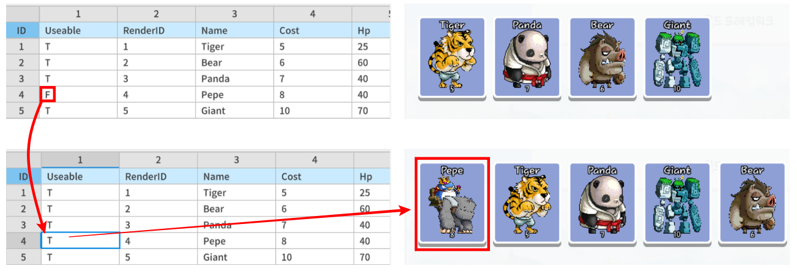
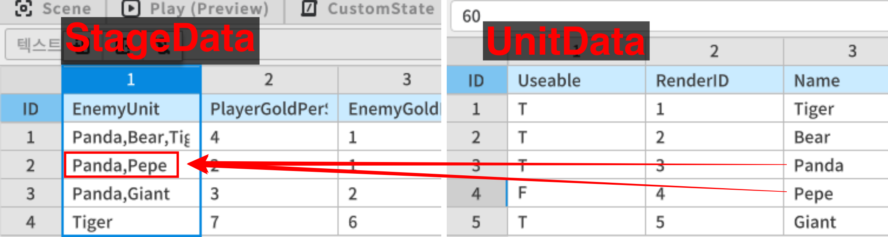
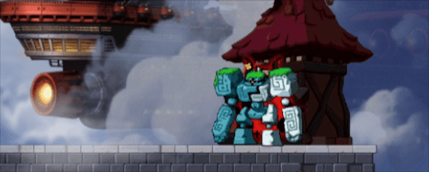
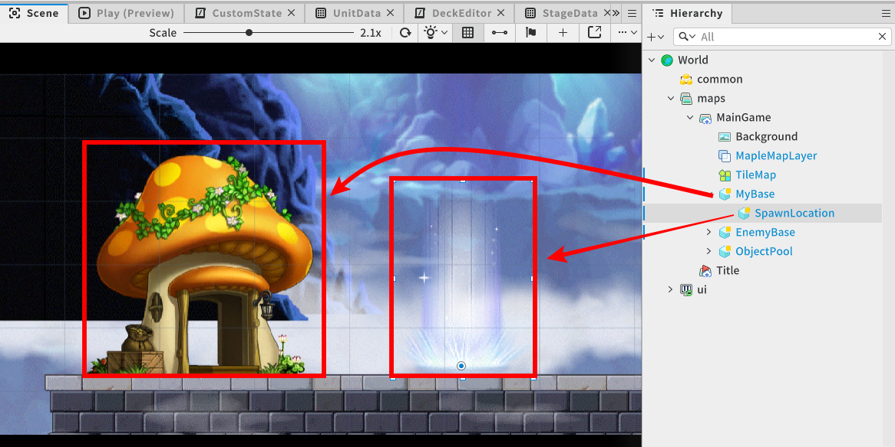

# [💡 Basic Training] Implementing Unit Spawn System
<br>
<br>
<br>

## Video Timeline
- You can follow along by using the timeline under the training video.
- Implementing Unit Spawn System: 01:22:30

<br>

## Learning Goals
- Learn how to configure the units generated from the enemy base, so they vary across different stages.
- Learn how to automatically generate units periodically from enemy bases.
- Understand how to create units via player control.

<br>

## Practical Exercises to Do After Watching the Video
- Try changing the information in the 'Usable' field of UnitData to a value of 'T' or 'F' to test if the unit is usable in the deck setting environment.
- Try changing the location of the 'SpawnLocation' entity that is registered as a child of the Base entity and verify that the actual unit is spawned at the location.

<br>

## Setting Player's Available Units
<p align="Center">


- The Defense sample world allows you to limit the units that users can use in combat, via DataSets.
- To configure the setting option to determine which from the entire unit list registered in **UnitData** DataSet are not available to the user, set the value of **Usable** to **F**.
- To create a feature like this, write code as follows.

```lua
void RegistUseableDecks()
{
    -- Gets all unit data table registered in the DataSet.
    local unitData = _DataSetLogic.unitData

    -- Iterate through the entire table.
    for unitName,unitData in pairs(unitData)
        -- If the 'Useable' value of that data is registered as 'F'
        if unitData["Useable"] == "F" then
            -- Move on to the next iteration.
            continue
        end

        -- If the value is 'T', proceed with the function call to create the Deck.
        RegistDeckItem(unitName)
    end
}
```

<br>

## Set the Units Enemy (AI) Creates
<p align="Center">


- Units that can be created from an enemy base can be utilized by registering all units registered in the **UnitData** DataSet.
- In **StageData**, the units that can be created for each stage are configured by registering unit names, regardless of the Usable value in UnitData.
- The leading **ID** value in **StageData** is utilized as the number of each stage.
  - List of units the enemy can create in Stage 2: Panda, Pepe
- The process of organizing the list of enemy units into a table can be coded as follows:

```lua
Property:
Integer currentStage = 2

table GetEnemyUnitTable()
{
    -- Gets the enemy's unit production data for the current stage.
    -- The data received in is in the form of a String.
    local enemyUnitData = _DataSetLogic.stageData[currentStage].EnemyUnit -- string : "Panda,Pepe"

    -- Split the string and convert it to a table using UtilLogic's Split function.
    -- enemyUnitData("Panda,Pepe") is split by comma (,) values and saved as a table.
    -- table { "Panda" , "Pepe" }
    return _UtilLogic:Split(enemyUnitData,",")
} 
```

<br>

## Automate Unit Creation
<p align="Center">


- Since units spawned from enemy bases are not directly controlled by the player, you need to create a system where units that perform combat are spawned periodically.

### Creating Base's Spawn Location
<p align="Center">


- Create and place child entities representing the spawn points of units produced from each base for Player and Enemy.

### Process for Selecting Units to Create

1. Select a random unit from the EnemyUnit registered in **StageData**.
2. Wait for the creation conditions (Cost) to be met for the selected unit.
3. If you have enough currency to produce the target unit, create the unit.
4. Next, the unit to be created is again randomized from the EnemyUnit list.
5. Repeat the process from step 2 again.

- The code for the BaseComponent that is registered with each base is written as follows
- The target code is based on Plain Text.
```lua
@Component
script BaseComponent extends Component

property boolean isUser = true -- A variable indicating whether the base belongs to the user.

property integer hp = 0 -- Represents the current HP value for this base.

property Entity spawnLocation = nil

property number gold = 0 -- The value of the good that can produce a unit.

property number goldTimer = 0 -- The timer that measures the set intervals at which to produce currency.

property number goldPerSecond = 0 -- The variable that determines how many gold to produce per second.

property string nextSpawnUnitName = "" -- The unit that should be produced next. (Enemy-Only Variable)

property integer needGold = 0 -- Represents the value of the currency required for the action.

@ExecSpace("ClientOnly")
method void OnBeginPlay()
-- This function is immediately called when the world is launched.

-- Proceed with your own initialization.
self:Init()
end

@ExecSpace("ClientOnly")
method void Init()
-- Performs initialization of the component.

-- Among the child entities, find and register the 'SpawnLocation' entity that will determine where the unit spawns.
self.spawnLocation = self.Entity:GetChildByName("SpawnLocation")

-- Resets the current currency value to zero.
self.gold = 0
-- Set the value of the timer for producing the currency to 0.
self.goldTimer = 0

-- If the base is the user's,
if self.isUser == true then
	-- Set the currency yielded per second to the PlayerGoldPerSecond value in StageData (based on the current stage number).
	self.goldPerSecond = _DataSetLogic.stageData[_StageLogic.currentStage].PlayerGoldPerSecond
	-- Sets the initial HP value of the base that players must defend.
	self.hp = _DataSetLogic.stageData[_StageLogic.currentStage].PlayerBaseHp
	
	_UI_MainGame:UpdateGoldText(self.gold)
	
-- If the base is the enemy's,
else
	-- Set the currency yielded per second to the EnemyGoldPerSecond value in StageData (based on the current stage number). 
	self.goldPerSecond = _DataSetLogic.stageData[_StageLogic.currentStage].EnemyGoldPerSecond
	-- Determine the next unit to produce.
	self.nextSpawnUnitName = self:SelectRandomUnitForEnemyName()
	-- Sets the initial HP value of the base that enemy must defend.
	self.hp = _DataSetLogic.stageData[_StageLogic.currentStage].EnemyBaseHp
	-- Record the required currency value of the units you need to produce next.
	self.needGold = _DataSetLogic.unitData[self.nextSpawnUnitName].Cost
end
end

@ExecSpace("ClientOnly")
method void SpawnUnit(string unitName)
-- A function that produces a unit.

-- Parameter 1 unitName: Receives the name of the unit being produced.

-- Requests that a unit entity be returned from the object pool.
-- Pass a parameter to set the received parent entity to itself.
local unit = _ObjectPoolLogic:GetUnit(self.Entity)

-- Sets the unit entity's location coordinates to be same as the location of its child entity, SpawnLocaion.
unit.TransformComponent.Position = self.spawnLocation.TransformComponent.Position
-- Accesses the UnitComponet of the Unit and initializes it.
unit.UnitComponent:Init(unitName,self.isUser)
end

@ExecSpace("ClientOnly")
method void OnDamage(integer damageValue)
-- Function called when hit by an opponent's unit.

-- Parameter 1 damageValue: Determines how much damage hit is received from the opponent.

-- Decreases HP value.
self.hp -= damageValue

-- If HP is 0 or lower,
if self.hp <= 0 then
	-- Performs destroy function.
	self:Destory()
	-- Sets that the stage's progress has ended.
	_StageLogic:SetStageState(false)
end
end

@ExecSpace("ClientOnly")
method void Destory()
-- The function that performs the destruction of that entity.

-- If the destroyed entity is the user's base, display a popup with the result of defeat.
_UI_Result:ShowWithWinInfo(not self.isUser)

-- Disables the entity the component is attached to.
self.Entity.Enable = false
end

@ExecSpace("ClientOnly")
method void OnUpdate(number delta)
-- A function that is called every frame.

-- If the stage has ended,
if _StageLogic.isStageStart == false then
	-- Exits without performing any further functions.
	return
end

-- Allows currency to accumulate automatically over the course of the game.
self:AutoGetGold(delta)
end

@ExecSpace("ClientOnly")
method void AutoGetGold(number delta)
-- A function that automatically accumulates currency.

-- Parameter 1 delta: Receives the value of the time change between frames.

-- Increases the timer value to measure in units of 1 second.
self.goldTimer += delta

-- Record the value of the max amount of currency you can carry for the current stage.
-- ---@ type to indicate that the data type is an integer.
---@ type integer
local maxGold = _DataSetLogic.stageData[_StageLogic.currentStage].MaxGold

-- If it's 1 second or more,
if self.goldTimer >= 1 and self.gold < maxGold then
	-- Reset the timer back to 0.
	self.goldTimer = 0
	-- Adds the set gold value per second to the current gold value.
	self.gold += self.goldPerSecond
	self.gold = math.clamp(self.gold,0,maxGold)
	
		-- If the base is an enemy base,
		if self.isUser == false then
			-- Enable the auto unit spawn function.
			self:EnemyAutoSpawn()
		-- If that base is the user's base,
	elseif self.isUser == true then
			-- Update the value of the UI text displaying the currency information.
			_UI_MainGame:UpdateGoldText(self.gold)
		end
end
end

@ExecSpace("ClientOnly")
method string SelectRandomUnitForEnemyName()
-- Function that retrieves a random unit name from the EnemyUnit registered in StageData that matches the current stage.

-- Create a table to hold the names of the units.
local enemyUnits = {} 
-- Retrieves the unit name table that can be generated in the current stage from DataSetLogic as is.
enemyUnits = _DataSetLogic.stageData[_StageLogic.currentStage].EnemyUnit

-- Generates a random index value from the 1st element to the last element of the table.
local selectRandomIndex = _UtilLogic:RandomIntegerRange(1,#enemyUnits)

-- Retrieves the name of the unit corresponding to the specified index.
local randomUnitName = enemyUnits[selectRandomIndex]

-- Returns the name of the unit.
return randomUnitName
end

@ExecSpace("ClientOnly")
method void EnemyAutoSpawn()
-- This is an enemy base-specific function that automatically produces units.

-- If the enemy base has enough gold to create the next unit,
if self.gold >= self.needGold then
	-- Allow the required units to spawn.
	self:SpawnUnit(self.nextSpawnUnitName)
	-- Decreases the required currency value from the current currency.
	self.gold -= self.needGold
	-- Next, select the units to produce again.
	self.nextSpawnUnitName = self:SelectRandomUnitForEnemyName()
end
end

@ExecSpace("ClientOnly")
method void PlayerRequestSpawn(string unitName)
-- This function requests the spawning of the unit passed as a parameter. (Player-only function)

-- Parameter 1 unitName: Unit name of the unit you want to spawn.

-- View the production cost value for the target unit.
local targetUnitCost = _DataSetLogic.unitData[unitName].Cost

-- If the current gold value is higher than the production cost of the target unit,
if self.gold >= targetUnitCost then
	-- Request that the target unit spawn as is.
	self:SpawnUnit(unitName)
	-- Decreases the amount of the currency by the unit's production cost from the current amount of the currency.
	self.gold -= targetUnitCost
	-- Refreshes the TextUI representing the inventory with the current consumed amount of currency.
	_UI_MainGame:UpdateGoldText(self.gold)
end
end

@ExecSpace("ClientOnly")
method void ReturnAllUnit()
-- A function that returns all produced units back to the object pool.

-- Records child entities with UnitComponent registered to Table.
local units = self.Entity:GetChildComponentsByTypeName("UnitComponent")

-- Iterates through the entire table.
for _, unit in pairs(units) do
	-- Have the object pool return the units.
	_ObjectPoolLogic:ReturnUnit(unit.Entity)
end
end

end
```

<br>

## Minimum Implementation Standards
- Units should be automatically created from the enemy's base in order to have the battle against the enemy proceed.
- An environment must be created that allows at least one player, an enemy (AI), to create units.

<br>

## Usage and Extension Direction
- You can create multiple spawn points of the enemy base to create different situations in a single stage.


