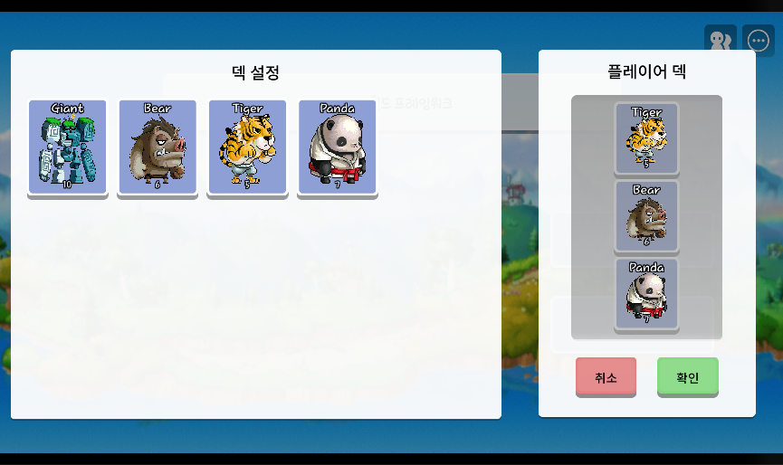
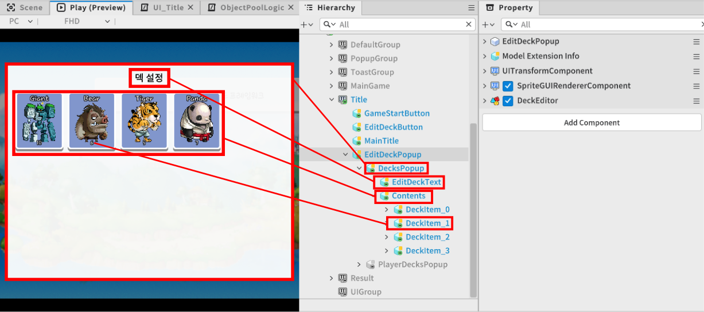
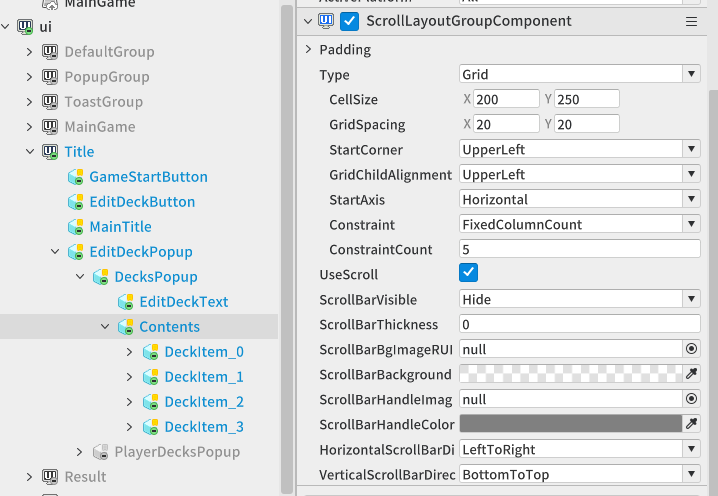
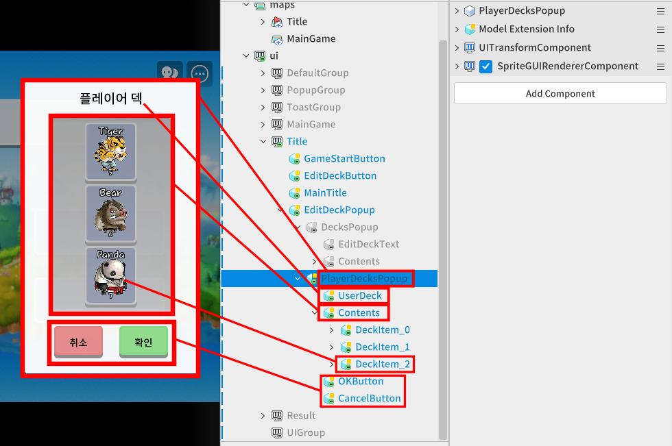
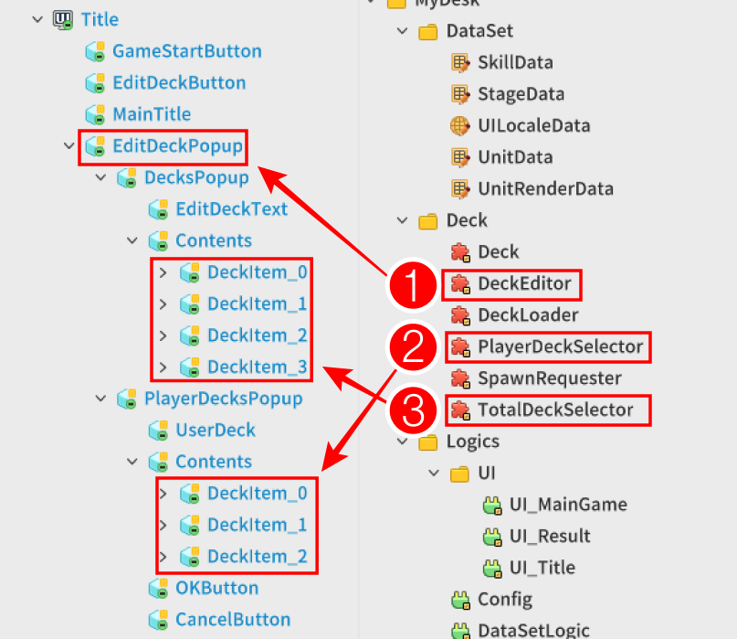

# [📖Advanced Training] Implementing Deck Editing System
<br>
<br>
<br>

## Video Timeline
- You can follow along by using the timeline under the training video.
- Implementing Deck Editing System: 02:46:50

<br>

## Learning Goals
- Learn how to attach different components to an existing Model 'Deck' and use them in different ways.
- From the deck-building process to the actual stages, learn how the battle proceeds with a set deck.
- Learn how to utilize DataStorage to store and retrieve a variety of information about users.

<br>

## Practical Exercises to Do After Watching the Video
- Utilize the UI Editor to split the DecksPopup and PlayerDecksPopup areas and adjust the Grid option of the ScrollLayoutComponent to ensure that the Decks UI automatically aligns in a neat checkerboard pattern.
- Register the DeckEditor, TotalDeckSelector, and PlayerDeckSelector scripts to each UI entity and then test to confirm that the units swap correctly when you select a unit from the total deck list and click on a specific slot in the player deck.
- After rebuilding your deck and hitting the 'OK (Save)' button, exit World Play completely and confirm that the deck information you set up last time is still intact and loaded when you return.

<br>

## Creating Deck-Setting Pop-Ups
<p align="Center">


- Create a 'deck setup' pop-up window for players to set their units for battle before they enter the actual game.
- The "Deck Settings" space on the left side of the attached image is where it lists all of the unit decks that can be built by the player.
- The "Player Deck" space on the right side of the attached image is where it lists all the existing units players have built.
- You can change the deck composition by choosing the selected unit deck in the 'Deck Settings' space and swapping it in the 'Player Deck' on the right.

<br>

### Creating Editable Deck-Setting Pop-Ups
<p align="Center">


<table class="tg"><thead>
  <tr>
    <th class="tg-9wq8">Entity</th>
    <th class="tg-9wq8">Description</th>
  </tr></thead>
<tbody>
  <tr>
    <td class="tg-0pky">DecksPopup</td>
    <td class="tg-0pky">Layout UI entity that instructs the space to display all available deck UIs.</td>
  </tr>
  <tr>
    <td class="tg-lboi">EditDeckText</td>
    <td class="tg-lboi">An entity that acts as a TextComponent that displays what the space is about.</td>
  </tr>
  <tr>
    <td class="tg-0pky">Contents</td>
    <td class="tg-0pky">An entity that acts as a ScrollLayoutComponent that lists multiple deck UIs.</td>
  </tr>
  <tr>
    <td class="tg-0pky">DeckItem</td>
    <td class="tg-0pky">An individual deck UI that is placed inside a ScrollLayoutComponent in Contents.</td>
  </tr>
</tbody>
</table>

<br>

### Setting Contents Entity's ScrollLayoutGroupComponent
<p align="Center">


- The Type option is set to **Grid** to set the 'Deck UI' entities to be laid out in a checkerboard arrangement.
- Set the CellSize, GridSpacing values to set the **size and spacing of the elements**.
- Set the StartCorner to **UpperLeft** so that the placement starts from the upper left corner.
- Set the StartAxis to **Horizontal** so that it is placed horizontally first.
- Set the Constraint option to FixedColumnCount to specify the number of 'columns' to be placed.

<br>

## Setting Player's Deck
<p align="Center">


<table class="tg"><thead>
  <tr>
    <th class="tg-9wq8">Entity</th>
    <th class="tg-9wq8">Description</th>
  </tr></thead>
<tbody>
  <tr>
    <td class="tg-0pky">PlayerDecksPopup</td>
    <td class="tg-0pky">Layout UI entity for an area to display the player's current deck list.</td>
  </tr>
  <tr>
    <td class="tg-lboi">UserDeck</td>
    <td class="tg-lboi">An entity that acts as a TextComponent that displays what the space is about.</td>
  </tr>
  <tr>
    <td class="tg-0pky">Contents</td>
    <td class="tg-0pky">An entity that acts as a ScrollLayoutComponent that lists multiple deck UIs.</td>
  </tr>
  <tr>
    <td class="tg-0pky">DeckItem</td>
    <td class="tg-0pky">An individual deck UI that is placed inside a ScrollLayoutComponent in Contents.</td>
  </tr>
  <tr>
    <td class="tg-0lax">Button</td>
    <td class="tg-0lax">This button determines whether you want to save the registered deck or cancel the deck building operation.</td>
  </tr>
</tbody>
</table>

<br>

## Creating Deck Editing Feature
<p align="Center">


1. Select the units you want to use as the core of your deck setup functionality and register the DeckEditor component, which contains the functionality to set up player decks for editing.
2. The TotalDeckSelector component is registered on the deck elements that are created while the game is running.
3. The PlayerDeckSelector component is registered on the deck elements that are created while the game is running.

<br>

- The DeckEditor script is written as follows.
- The target code is based on Plain Text.

```lua
@Component
script DeckEditor extends Component

property table tempSelectedDecks = {} -- Temporary deck table. When the player presses the OK button, GameLogic's deck information will be reflected as the values in that table.

property string selectedDeckUnitName = "" -- A variable that records the unit name of the currently-selected deck.

property Entity totalDeckContentParent = "63ea1601-803c-4336-9ed4-4f26d4b45aad"

property Entity playerDeckContentParent = "0ae318bb-9902-4c7e-8823-b58d5f34d6c0"

property table playerDeckButtons = {} -- Record the button elements in the popup that display the user's deck information in a table.

property Entity okButton = "7b9b83fd-d956-499a-ab69-6aca967a1cc8"

property Entity cancelButton = "43860e7a-219f-4c89-8247-6182c5a6533d"

@ExecSpace("ClientOnly")
method void OnBeginPlay()
-- This function is called when the world is launched.


-- Register an event to call the SaveDeckData function when the OK button is clicked in the Deck Settings popup.
self.okButton:ConnectEvent(ButtonClickEvent,self.SaveDeckData)
-- Register an event to call the ClosePopup function when the Cancel button is clicked in the Deck Settings popup.
self.cancelButton:ConnectEvent(ButtonClickEvent,self.ClosePopup)

-- Register all deck information available to the user.
self:RegistTotalDeck()
wait(0.2)
-- Register the user's current deck information.
self:InitUserDeck()
end

@ExecSpace("ClientOnly")
method void InitUserDeck()
-- Retrieve the current user's deck information from GameLogic.
self.tempSelectedDecks = _GameLogic.userDeck
-- The EntryID value of the model for creating the DeckItem (prefab).
local deckModelEntryID = "model://7ed4ff59-e40b-4ff9-a9bf-d22a306afb70"

-- See how many decks are already registered.
-- This is to create a Deck UI entity, since the deck is not configured when first entering the game.
local currentDeckCount = #self.playerDeckContentParent.Children
-- Check how many decks you currently need to create.
local needDeckCount = #self.tempSelectedDecks - currentDeckCount

-- Iterate as many rounds as needed to create the required number of decks.
for i = 1, needDeckCount, 1 do
	
	-- Create a new deck with the SpawnService, setting it as a child element of the entity that holds the user's deck.
	local newDeck = _SpawnService:SpawnByModelId(deckModelEntryID,"",Vector3.zero,self.playerDeckContentParent)
	-- Set the information in the newly-created deck to the target unit's information.
	newDeck.Deck:Init(self.tempSelectedDecks[i])
	-- Register an additional 'PlayerDeckSeletor' component as the managed deck inside the user popup.
	newDeck:AddComponent("PlayerDeckSelector")
	-- Sets the index number for which number unit the corresponding button is pointing to.
	newDeck.PlayerDeckSelector.index = i
	-- Adds the Button component currently registered in the deck to the internal member playerDeckButtons.
	table.insert(self.playerDeckButtons,newDeck.ButtonComponent)
end

-- When you have finished adding all decks in the user's deck, disable the feature so that all buttons are not selectable.
self:ActivePlayerDecks(false)
end

@ExecSpace("ClientOnly")
method void ActivePlayerDecks(boolean active)
-- Function to enable or disable the functionality of the buttons for all decks in the popup that displays the user's deck.

-- Parameter 1 active: The active state of the buttons is reflected by the value of the parameter.

-- Traverse as much as the button element.
for i = 1, #self.playerDeckButtons, 1 do
	
	-- Check each button element.
	---@type ButtonComponent
	local button = self.playerDeckButtons[i]
	
	-- Sets whether the button's functionality is enabled.
	button.Enable = active
end
end

@ExecSpace("ClientOnly")
method void RegistTotalDeck()
-- Register deck elements that users can select from.

-- Retrieve the DataSet Table with the unit's information as is.
local unitTable = _DataSetLogic.unitData
-- Record the value of the deck's model EntryID.
local deckModelEntryID = "model://7ed4ff59-e40b-4ff9-a9bf-d22a306afb70"

-- Initiating table traversal.
for unitName,unitData in pairs(unitTable) do
	-- Check whether the deck can be used by the user, and if not, skip to the next deck element.
	if unitData["Useable"] == "F" then
		continue
	end
	
	-- Create a new deck from the all decks' element through SpawnService.
	local newDeck = _SpawnService:SpawnByModelId(deckModelEntryID,"",Vector3.zero,self.totalDeckContentParent)
	-- Initializes the deck to the name of the corresponding unit.
	newDeck.Deck:Init(unitName)
	-- Attach the TotalDeckSelector component for deck building.
	newDeck:AddComponent("TotalDeckSelector")
end
end

@ExecSpace("Client")
method void SaveDeckData()
-- Functions to record the deck elements that were built.

-- The deck information recorded in the temporary table reflects the deck data that will actually be used.
_GameLogic.userDeck = self.tempSelectedDecks
-- Save the deck information to data storage.
_GameLogic:SaveUserDeck(_GameLogic.userDeck)
-- Exit the Deck Settings popup.
self:ClosePopup()
end

@ExecSpace("ClientOnly")
method void ClosePopup()
-- Function to end the Deck Settings popup.

-- Deactivates your own entity.
self.Entity.Enable = false
end

end
```

<br>

- The PlayerDeckSelector script is written as follows.
- The target code is based on Plain Text.

```lua
@Component
script PlayerDeckSelector extends Component

property integer index = -1

property DeckEditor mainDeckEditor = "b887294b-9d5c-44fd-9c14-f830cbd749c3"

@EventSender("Self")
handler HandleButtonClickEvent(ButtonClickEvent event)
-- Records the names of units in the pending deck registered in mainDeckEditor.
local deckUnitName = self.mainDeckEditor.seletedDeckUnitName

-- Initializes the information in the current deck with the corresponding unit name.
self.Entity.Deck:Init(deckUnitName)
-- Replace the index-th element of the temporary deck Table of mainDeckEditor with the current unit name.
self.mainDeckEditor.tempSelectedDecks[self.index] = deckUnitName
-- Now that the user is done swapping decks, disable the user's Deck button again.
self.mainDeckEditor:ActivePlayerDecks(false)
end

end
```

<br>

- The TotalDeckSelector script is written as follows.
- The target code is based on Plain Text.

```lua
@Component
script TotalDeckSelector extends Component

property DeckEditor mainDeckEditor = "b887294b-9d5c-44fd-9c14-f830cbd749c3"

@EventSender("Self")
handler HandleButtonClickEvent(ButtonClickEvent event)
-- Event function that is called when the button is clicked.

-- Retrieve the deck information being recorded from the mainDeckEditor.
local currentDecks = self.mainDeckEditor.tempSelectedDecks
-- View the unit name of the current deck.
local unitName = self.Entity.Deck.deckUnitName

-- Iterate as much as the total number of tables.
for i = 1, #currentDecks, 1 do
	-- If there are decks already in use in the table, end the function itself.
	if currentDecks[i] == unitName then
		return
	end	
end

-- Sets the name of the unit currently selected in the mainDeckEditor to the name of the unit in the current deck.
self.mainDeckEditor.seletedDeckUnitName = unitName
-- Now that the units to be deployed have been selected, it is time to choose the user's deck; therefore, the user's deck button is enabled.
self.mainDeckEditor:ActivePlayerDecks(true)
end

end
```

## Save and Load Decks
- You can utilize the DataStorage feature provided by the DataStroageService to store or retrieve information about users.
- If you need the ability to save or retrieve data upon entering and exiting a world, we recommend utilizing EventHandler(UserEnterEvent, UserLeaveEvent) over utilizing lifecycle functions.

### Saving Decks Utilizing DataStorage Feature
- You can utilize the SetAndWait function available in DataStorage to store user-specific information.
- Storing data requires a String data type conversion process.
- The process of storing data on a server can proceed as follows.

```lua
Method:
[server]
void SaveDeck()
{
  local DeckString = "Tiger,Bear,Panda"
  local userKey = "TestUserKey"

  local userData = _DataStroageService:GetUserDataStroage(userKey)
  local errorCode = userData:SetAndWait("Deck",DeckString)

  if errorCode ~= 0 then
    log_error("Save deck error : "..errorCode)
  end
}
```

<br>

### Loading Decks Utilizing DataStorage Feature
- You can utilize the GetAndWait function available in DataStorage to retrieve user-specific information.
- The first return value of GetAndWait returns an error code value if an error occurs, and the second parameter is the data being fetched from the server.
- When you fetch data, you receive it as a String data type.
- The process of fetching data from a server can proceed as follows.

```lua
[server]
void LoadDeck()
{
  local userKey = "TestUserKey"
  local userStorage = _DataStorageService:GetUserDataStorage(userKey)

  local errorCode,loadData = userData:GetAndWait("Deck")

  local errorCode ~= 0 then
    log_error("Load deck error : "..errorCode)
  end
}
```

<br>

- Here is a script in GameLogic that includes the ability to store information about users and stages in your game.
- The target code is based on Plain Text.

```lua
@Logic
script GameLogic extends Logic

property table userDeck = nil

@Sync
property string playerStorageKey = ""

@ExecSpace("Server")
method void SaveUserDeck(table decks)
local saveStr = tostring(decks[1])

for i = 2, #decks, 1 do
	saveStr = saveStr..","..tostring(decks[i])
end

local userData = _DataStorageService:GetUserDataStorage(self.playerStorageKey)

local errorCode = userData:SetAndWait("Deck",saveStr)

if errorCode ~= 0 then
	log("Save deck error : "..errorCode)
end
end

@ExecSpace("Server")
method void SaveLastStage(integer stageNumber)
local userData = _DataStorageService:GetUserDataStorage(self.playerStorageKey)

local errorCode = userData:SetAndWait("Stage",tostring(stageNumber))

if errorCode ~= 0 then
	log("Save stage error : "..errorCode)
end
end

@ExecSpace("Client")
method void LoadLastStage(string stageInfo)
if stageInfo == nil then
	log("No data for previous stage.")
	_StageLogic.currentStage = 1
else
	log("Previous Stage Data: "..stageInfo)
	_StageLogic.currentStage = tonumber(stageInfo)
end
end

@ExecSpace("Server")
method void LoadUserDeckData(string storageKey)
local userData = _DataStorageService:GetUserDataStorage(storageKey)

local errorCode,data = userData:GetAndWait("Deck")

if errorCode ~= 0 then
	log("LoadUserDeck error : "..errorCode)
end

self:LoadUserDeck(data)
end

@ExecSpace("Client")
method void LoadUserDeck(string deckInfo)

if deckInfo == nil then
	log("No previous deck data.")
	self.userDeck = _Config.DEFAULT_USER_DECK
else
	log("Previous Deck Data: "..deckInfo)
	self.userDeck = _UtilLogic:Split(deckInfo,",")	
end
end

@ExecSpace("Server")
method void LoadLastStageData(string storageKey)
local userData = _DataStorageService:GetUserDataStorage(storageKey)

local errorCode,data = userData:GetAndWait("Stage")

if errorCode ~= 0 then
	log("LoadUserDeck error : "..errorCode)
end

self:LoadLastStage(data)
end

@EventSender("Service", "UserService")
handler HandleUserEnterEvent(UserEnterEvent event)
local UserId = event.UserId

_TelePortLogic:SaveLocalPlayerNametoServer(UserId)
self.playerStorageKey = UserId

self:LoadUserDeckData(UserId)
self:LoadLastStageData(UserId)
end

end
```

<br>

- The Config logic script that contains the default user deck information is shown below.
- The target code is based on Plain Text.

```lua
@Logic
script Config extends Logic

property integer DECK_COUNT = 3 -- Indicates the number of decks that can be owned.

property table DEFAULT_USER_DECK = {"Tiger","Bear","Panda"} -- The state of the unit deck that is set by default for the initial game state.

@ExecSpace("ClientOnly")
method void SetDefaultDeckCount()
-- Function to set the number of decks you can own.

-- The number of decks you can own is determined by the number of elements in the table in DEFAULT_USER_DECK.
self.DECK_COUNT = #self.DEFAULT_USER_DECK
end

@ExecSpace("ClientOnly")
method void OnBeginPlay()
-- This function is called when the world is launched.

-- Set the number of decks you can own.
self:SetDefaultDeckCount()
end

end
```

## Minimum Implementation Standards
- Only units registered in the DataSet that are available to the player should be listed correctly and without duplicates in the full Deck Settings popup (Contents).
- If you click on a specific unit in the full deck list and then click on a player deck slot, the unit in that slot should be properly replaced with the selected unit.
- Exception handling should work to prevent players from having more than one copy of the same unit in their deck.
- After deck building is complete, the DataStorageService should securely store the user's deck information as a String on the server and load it correctly upon reconnection.

<br>

## Usage and Extension Direction
- You can add a strategic element by assigning each unit a deployment "Cost" or "Rank" and limiting the total cost of the units in a player's deck to a certain number.
- When a unit is selected from the full deck list, improve the user experience by adding a border highlight or selection effect to that unit's UI to make it clear to the player which unit is currently selected.
- Expand beyond using just one deck to a system where you can store multiple deck presets, such as "Deck A", "Deck B", and "Deck C" and quickly swap between them based on the stage's characteristics or enemy attributes.


