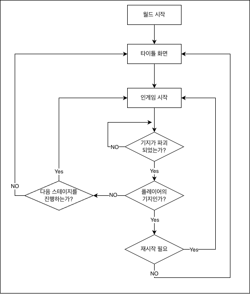

# 디펜스 게임 학습 가이드 문서
 
 
 

## 학습 목표

- 가이드 문서와 샘플 월드를 통하여 디펜스 게임의 핵심 기능들을 구현하는 방법에 대해 학습합니다.
- 메이플스토리 월드에서 제작하려는 게임의 방식에 따라 맵을 세팅하는 방법에 대해 학습합니다.
- Logic에 대해 이해하고, 이를 활용하여 게임 구조를 설계하는 방법을 학습합니다.
- 학습한 내용을 바탕으로 월드를 원하는 형태로 가공하고 응용할 수 있습니다.

 

---

 

## 학습 핵심 기능
- **DataSet 응용**: 다양한 방식으로 DataSet을 활용하여 게임의 난이도를 제어하는 방법에 대해 학습합니다.
- **AddComponent 활용**: 하나의 엔티티만을 사용하며 실시간으로 상황에 따라 필요한 컴포넌트를 등록해 목적에 맞는 동작을 수행시키는 방법에 대해 학습합니다.
- **Event Handler**: 게임 내에서 벌어지는 다양한 상황을 감지하고 타이밍에 맞춰 의도한 기능이 정상적으로 수행될 수 있도록 제어할 수 있습니다.

 

## 🔄 핵심 게임플레이 루프

 

**1. 타이틀 화면**: 게임 진입점으로 바로 전투를 시작하거나, 전투에 쓸 유닛'덱'을 미리 세팅할 수 있습니다. 
**2. 인게임 시작**: 플레이어의 진행 데이터를 바탕으로, 마지막으로 도달한 스테이지부터 본격적인 전투를 진행합니다. 
**3. 기지 파괴 여부 확인**: 유닛 공방전이 펼쳐지는 동안, 아군 또는 적(AI) 기지의 파괴 여부를 실시간으로 확인합니다. 
**4. 파괴된 기지 소유권 확인**: 파괴된 기지가 누구의 것인지 파악하여 스테이지의 최종  
**5. 스테이지 진행 확인**: 적(인공지능)의 기지를 파괴해 스테이지를 클리어했을 경우 다음 스테이지로 게임을 진행할 수 있으며, 반대로 유저의 기지가 파괴되었을 경우 현재 스테이지를 다시 플레이할 수 있습니다.

 

## 폴더 구성

<table class="tg"><thead>
  <tr>
    <th class="tg-9wq8">이름</th>
    <th class="tg-9wq8">설명</th>
  </tr></thead>
<tbody>
  <tr>
    <td class="tg-lboi">DataSet</td>
    <td class="tg-lboi">샘플 월드를 구성하는 데 필요한 DataSet을 담은 폴더입니다.</td>
  </tr>
  <tr>
    <td class="tg-lboi">Deck</td>
    <td class="tg-lboi">디펜스 월드에서 활용되는 Deck 엔티티에 활용되는 컴포넌트 스크립트를 담은 폴더입니다.</td>
  </tr>
  <tr>
    <td class="tg-0pky">Logic</td>
    <td class="tg-0pky">메이플스토리 월드의 기능인 Logic으로 제작된 스크립트를 담은 폴더입니다.</td>
  </tr>
  <tr>
    <td class="tg-lboi">Models</td>
    <td class="tg-lboi">Model 화한 엔티티들을 담은 폴더입니다.</td>
  </tr>
  <tr>
    <td class="tg-0pky">Units</td>
    <td class="tg-0pky">실제 전투를 벌이는 유닛에 등록되는 컴포넌트 스크립트를 담은 폴더입니다.</td>
  </tr>
</tbody>
</table>

---

 

## 구현 순서

- 💡 **기초 학습**: 메이플스토리 월드의 기본 기능 및 해당 장르의 기초적인 기능을 담은 학습 항목입니다.
- 📖 **심화 학습**: 샘플 월드에 구현된 기능을 학습하고 구현하는 항목입니다. 해당 과정의 학습을 통해 장르의 기능 확장과 학습 이해도를 높일 수 있습니다. 

### [💡기초 학습]1. 월드 환경 구성하기
- 메이플스토리 월드의 가장 기본적인 맵 방식인 Maple TileMap 모드에 대해 학습합니다.
- TileMap 모드에서 타일 맵을 배치하여 게임 환경을 구성할 수 있습니다.
- 디펜스 장르의 특성을 분석하고, 게임 제작 환경을 스스로 구성할 수 있습니다.
- 월드의 맵 내에 다양한 엔티티를 배치할 수 있습니다.

 

### [💡기초 학습]2. 유닛 제작하기
- DataSet을 제작하여 게임 내에서 활용되는 다양한 데이터를 구성하는 방법을 학습합니다.
- DataSet에 등록된 데이터를 활용하는 DataSetLogic을 제작하여 실제 데이터를 활용하는 법을 학습합니다.
- 실제 전투에 활용될 유닛을 제작하며, 다양한 컴포넌트에 대한 이해도를 높일 수 있습니다.
- 디펜스 월드의 핵심 캐릭터인 유닛의 기본적인 형태인 Model을 제작할 수 있습니다.

 

### [💡기초 학습]3. 공격 구현하기
- TriggerComponent의 설정 방법과 Event Handler에 대한 개념을 익힙니다.
- 유닛마다 주기적인 공격 또는 스킬을 어떠한 방식으로 수행하는지 학습합니다.
- DataSet의 전략적인 활용 방식을 이해하며 다양한 스킬을 사용하는 방법을 학습합니다.

 

### [💡기초 학습]4. 유닛 스폰 시스템 구현하기
- 적의 기지로부터 생성되는 유닛을 여러 스테이지마다 다르게 구성하는 방법을 학습합니다.
- 주기적으로 적의 기지로부터 자동으로 유닛을 생산하는 방법을 학습합니다.
- 플레이어의 조작으로 유닛을 생산하는 방법을 이해합니다.

 

### [💡기초 학습]5. 스테이지 매니저 제작하기
- Logic의 '전역성' 특징을 활용해 스테이지의 번호를 관리하는 방법을 학습합니다.
- 스테이지 클리어 또는 패배의 분기별로 처리되어야 하는 기능을 이해하며 직접 제작할 수 있습니다.
- Server 측에서만 수행할 수 있는 TeleportService를 활용해 맵을 전환하는 방법을 이해합니다.

 

### [💡기초 학습]6. 오브젝트 풀 생성하기
- 엔티티 생성과 파괴가 반복될 때 발생하는 성능 저하의 원인을 파악하고, 오브젝트 풀링 기법의 필요성을 이해합니다.
- 여러 유닛을 미리 생성하여 대기 상태로 보관하는 Pool 자료구조를 직접 구현할 수 있습니다.
- 체력이 0 이하의 유닛을 다시 오브젝트 풀로 반환하고, 필요할 때 초기화를 진행하여 다시 꺼내 사용하는 함수를 작성합니다.

 

### [📖심화 학습]7. 재화 시스템 구현하기
- 시간의 흐름에 따라 주기적으로 재화를 생산하는 방법을 학습합니다.
- 플레이어 또는 적(인공지능)이 재화를 활용하여 유닛을 생산하는 방법을 학습합니다.
- 실제 적(인공지능)이 재화를 활용하여 유닛을 생산하는 과정을 이해합니다.
- 유닛 Deck을 직접 제작하여 플레이어가 유닛을 생산하는 기능을 제작할 수 있습니다.
- ScrollLayoutComponent의 활용 방법을 학습해 UI를 배치하는 방법을 학습합니다.

 

### [📖심화 학습]8. 덱 편집 시스템 구현하기
- 이미 제작된 Model 'Deck'에 다양한 컴포넌트를 부착하여 다양한 방식으로 사용하는 방법을 학습합니다.
- 덱 편성 과정부터 실제 스테이지까지 설정된 덱을 통해 전투를 진행하는 방법을 학습합니다.
- DataStorage를 활용한 유저의 다양한 정보를 저장하고 불러올 수 있는 기능을 학습합니다.

 

### [💡기초 학습]9. UI 구성하기
- 여러 상황(Title, MainGame, Result)에 따라 필요한 UI를 화면에 노출시키는 방법을 학습합니다.
- Entity의 ConnectEvent를 통해 간편하게 기능을 연동시키는 방법에 대해 학습합니다.
- 실시간으로 변경되는 UI를 제어하는 방법을 학습하여 디펜스 월드에서 플레이어의 재화 정보를 나타내는 UI 제작할 수 있습니다.

 
