# [💡기초 학습]유닛 제작하기
<br>
<br>
<br>

## 영상 타입라인
- 강의 영상 내 아래의 타임라인에서 학습할 수 있습니다.
- 유닛 제작하기: 00:21:12

<br>

## 학습 목표
- DataSet을 제작하여 게임 내에서 활용되는 다양한 데이터를 구성하는 방법을 학습합니다.
- DataSet에 등록된 데이터를 활용하는 DataSetLogic을 제작하여 실제 데이터를 활용하는 법을 학습합니다.
- 실제 전투에 활용될 유닛을 제작하며, 다양한 컴포넌트에 대한 이해도를 높일 수 있습니다.
- 디펜스 월드의 핵심 캐릭터인 유닛의 기본적인 형태인 Model을 제작할 수 있습니다.

<br>

## 해당 영상 시청 후 수행해 볼 내용
- 샘플월드에서 제공되는 유닛뿐만 아니라, 더욱 다양한 유닛을 생성할 수 있도록 DataSet에 추가적인 정보를 등록합니다.
- Component 스크립트와 Logic 스크립트를 직접 제작해 보며 차이점을 직접 비교해봅니다.

<br>

## DataSet 제작하기
<p align="Center">
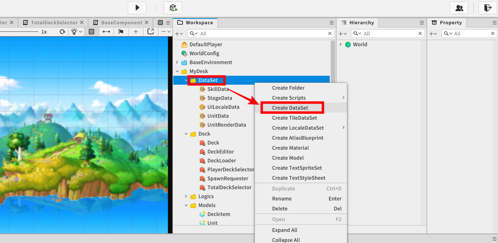

- DataSet은 게임 내에서 관리되는 데이터를 표 형식으로 작성해 필요한 데이터를 바로 활용할 수 있습니다.
- **Workspace**에서 DataSet을 생성하고자 하는 경로 **우클릭** - **Create DataSet** 을 선택해 제작할 수 있습니다.

### UnitData 제작하기
<p align="Center">
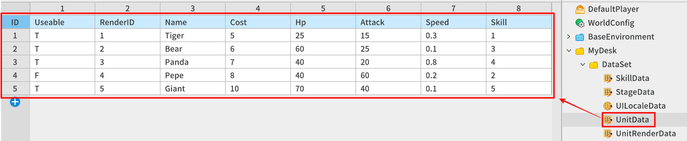

<table class="tg"><thead>
  <tr>
    <th class="tg-nrix">이름</th>
    <th class="tg-nrix">설명</th>
  </tr></thead>
<tbody>
  <tr>
    <td class="tg-cly1">Usable</td>
    <td class="tg-cly1">유저의 덱 편성 시 활용할 수 있는 유닛의 설정 가능 여부를 나타냅니다.</td>
  </tr>
  <tr>
    <td class="tg-cly1">RenderID</td>
    <td class="tg-cly1">유닛의 외형 RUID값을 기록하는UnitRenderData의 ID 번호 값을 기록합니다.</td>
  </tr>
  <tr>
    <td class="tg-cly1">Name</td>
    <td class="tg-cly1">게임 내에서 표기되는 유닛의 이름입니다.</td>
  </tr>
  <tr>
    <td class="tg-cly1">Cost</td>
    <td class="tg-cly1">유닛의 생산 비용입니다.</td>
  </tr>
  <tr>
    <td class="tg-cly1">Hp</td>
    <td class="tg-cly1">유닛의 기본 체력 값입니다.</td>
  </tr>
  <tr>
    <td class="tg-cly1">Attack</td>
    <td class="tg-cly1">유닛의 기본 공격력 수치입니다.</td>
  </tr>
  <tr>
    <td class="tg-cly1">Speed</td>
    <td class="tg-cly1">유닛의 이동속도 값입니다.</td>
  </tr>
  <tr>
    <td class="tg-cly1">Skill</td>
    <td class="tg-cly1">유닛의 스킬 관련 데이터를 관리하는 SkillData의 ID 번호 값을 기록합니다.</td>
  </tr>
</tbody>
</table>

- 유닛별로 적용되어야 할 기본 데이터 값을 기록하기 위한 **UnitData** DataSet이 필요합니다.
- RenderID, Skill 데이터값의 경우 다른 DataSet을 참조하기 위한 값을 기록합니다.

### UnitRenderData 제작하기
<p align="Center">
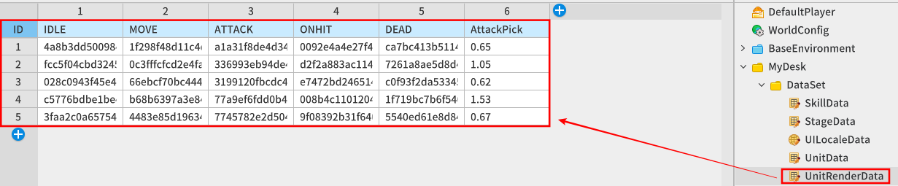

<table class="tg"><thead>
  <tr>
    <th class="tg-nrix">이름</th>
    <th class="tg-nrix">설명</th>
  </tr></thead>
<tbody>
  <tr>
    <td class="tg-cly1">IDLE</td>
    <td class="tg-cly1">유닛의 행동 대기상태 시 재생되는 애니메이션의 RUID 값 입니다.</td>
  </tr>
  <tr>
    <td class="tg-cly1">MOVE</td>
    <td class="tg-cly1"><span style="font-weight:400;font-style:normal">유닛의 이동 시 재생되는 애니메이션의 RUID 값입니다.</span></td>
  </tr>
  <tr>
    <td class="tg-cly1">ATTACK</td>
    <td class="tg-cly1"><span style="font-weight:400;font-style:normal">유닛의 공격 시 재생되는 애니메이션의 RUID 값입니다.</span></td>
  </tr>
  <tr>
    <td class="tg-cly1">ONHIT</td>
    <td class="tg-cly1"><span style="font-weight:400;font-style:normal">유닛의 피격 시 재생되는 애니메이션의 RUID 값입니다.</span></td>
  </tr>
  <tr>
    <td class="tg-cly1">DEAD</td>
    <td class="tg-cly1"><span style="font-weight:400;font-style:normal">유닛의 사망 시 재생되는 애니메이션의 RUID 값입니다.</span></td>
  </tr>
  <tr>
    <td class="tg-cly1">AttackPick</td>
    <td class="tg-cly1">공격 애니메이션 재생 시 데미지를 전달하는 시간을 기록합니다.</td>
  </tr>
</tbody></table>

- 유닛의 각 현재 상태별로 재생되어야 하는 애니메이션의 RUID 값을 기록하는 DataSet 입니다.
- AttackPick 값의 경은 공격 애니메이션이 수행된 시점부터 몇 초 뒤에 상대방에게 데미지를 전달할 타이밍 시간값을 의미합니다.

### RenderID 와 UnitRenderData 관계
<p align="Center">
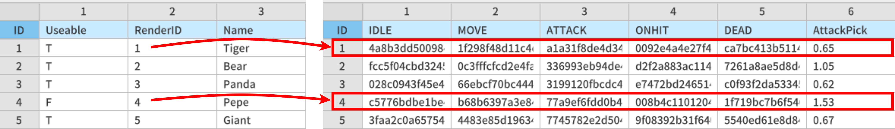

- **UnitData** DataSet에 등록된 각 유닛의 RenderID의 번호 값은 UnitRenderData의 각 항목(Index)에 해당하는 각 줄의 데이터들을 의미합니다.
- ID 4번 유닛인 Pepe 또한 RenderID 값을 1로 지정하게 되면, 첫 번째 Tiger와 동일한 외형으로 유닛이 생성됩니다.
- 유닛의 외형은 동일하지만, 내부적으로 더욱 강력한 유닛을 생산하는 방식을 고려해 볼 수 있습니다.

<br>

### SkillData 제작하기
<p align="Center">
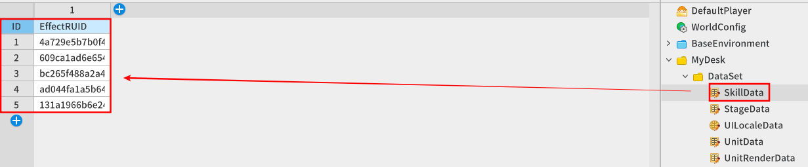

<table class="tg"><thead>
  <tr>
    <th class="tg-nrix">이름</th>
    <th class="tg-nrix">설명</th>
  </tr></thead>
<tbody>
  <tr>
    <td class="tg-cly1">EffectRUID</td>
    <td class="tg-cly1">유닛의 스킬 공격 시 재생되는 이펙트의 RUID 값입니다.</td>
  </tr>
</tbody>
</table>

<br>

### Skill 번호와 SkillData 관계
<p align="Center">
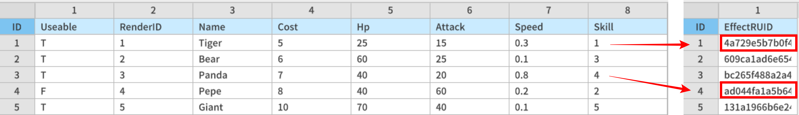

- **UnitData** DataSet에 등록된 각 유닛의 **Skill**의 번호 값은 SkillData의 각 항목(Index)에 해당하는 각 줄의 데이터들을 의미합니다.
- ID 2번 유닛인 Bear 또한 Skill 번호 값을 1로 지정하게 되었을 때 1 첫번째 Tiger와 동일한 스킬 이펙트가 재생됩니다.

<br>

## DataSetLogic 제작하기
<p align="Center">
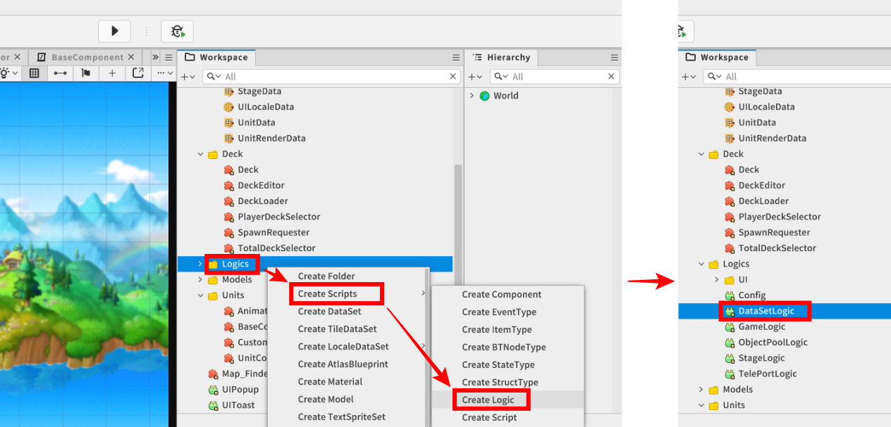

- Workspace에서 Logic 스크립트를 생성할 경로를 **우클릭** - **Create Scripts** - **Create Logic**을 선택해 새로운 Logic 스크립트를 생성할 수 있습니다.
- 생성된 Logic의 이름을 DataSetLogic으로 정의합니다.

<br>

### Logic 이란?
<p align="Center">
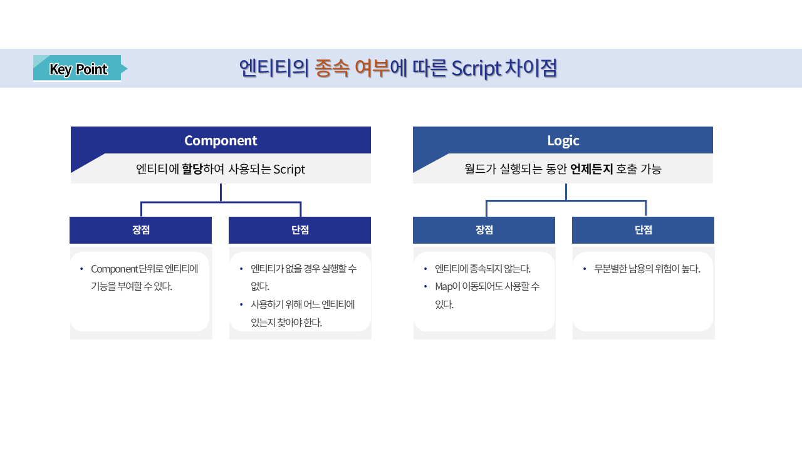

- 메이플스토리 월드가 제공하는 스크립트의 형태 중 하나입니다.
- 일반적인 컴포넌트 스크립트와는 달리 특정 엔티티에 등록하지 않고 자체적으로 기능 동작을 수행할 수 있습니다.
- 별도의 참조가 필요 없으며 전역적인 접근을 통해 월드가 실행되는 동안 언제든지 호출이 가능합니다.

<br>

### 테이블 내 데이터 등록하기
<p align="Center">
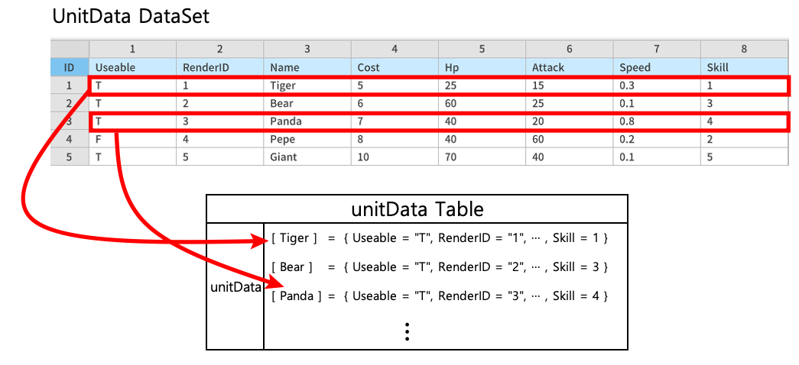

- 저장되는 모든 유닛의 데이터를 유닛별로 분류해 하나의 테이블 내에 기록해 두고 이후, 외부에서 필요한 데이터를 사용해야 할 경우, 직관적인 방법으로 데이터를 꺼내어 사용할 수 있도록 데이터 테이블이 제작되어야 합니다.
- Logic으로 제작한 **DataSetLogic** 스크립트의 **Property** 공간에서 유닛의 각 데이터를 보관할 테이블 변수를 생성합니다.
- 월드 실행 시, DataSet에 등록된 모든 데이터를 불러올 수 있는 초기화 함수를 수행하도록 합니다.

<br>

```lua
데이터 테이블 변수 선언
DataSetLogic{
Property:
    [None]
    table unitData = {} -- 유닛의 데이터를 담을 빈 테이블을 생성합니다.

Method:
    void OnBeginPlay() -- 월드가 실행될 때 호출되는 'OnBeginPlay' 라이프 사이클 함수입니다.
    {
        local dataSetName = "UnitData"
        local rowCount = _DataService:GetRowCount(dataSetName)

        -- 데이터의 첫줄인 1부터 데이터의 총 Row수 만큼 순회를 진행합니다.
        for i = 1, rowCount, 1 do
            -- 각 정보를 담을 하나의 내부 테이블을 생성합니다.
            local data = {
                Useable = _DataService:GetCell(dataSetName,i,"Useable"),
                RenderID = tonumber(_DataService:GetCell(dataSetName,i,"RenderID")),
                Hp = tonumber(_DataService:GetCell(dataSetName,i,"Hp")),
                Attack = tonumber(_DataService:GetCell(dataSetName,i,"Attack")),
                Speed = tonumber(_DataService:GetCell(dataSetName,i,"Speed")),
                Skill = tonumber(_DataService:GetCell(dataSetName,i,"Skill")),
                SkAttack = tonumber(_DataService:GetCell(dataSetName,i,"SkAttack")),
                AtkCooltime = tonumber(_DataService:GetCell(dataSetName,i,"AtkCooltime")),
                SkCooltime = tonumber(_DataService:GetCell(dataSetName,i,"SkCooltime")),
                Cost = tonumber(_DataService:GetCell(dataSetName,i,"Cost"))
            }
            
            -- 대상 유닛의 이름을 기록합니다.
            local unitName = _DataService:GetCell(dataSetName,i,"Name")
            
            -- unitData 테이블의 키값으로 유닛의 이름을 저장하고, 해당 유닛에 맞는 각 정보가 담긴 테이블을 내부에 기록합니다.
            self.unitData[unitName] = data
        end
            }

}
```
<br>

### 등록된 데이터 가져오기
- **DataSetLogic**의 unitData 테이블에 저장된 각 필요한 데이터를 가져오기 위해선 다음과 같이 코드를 작성합니다.

```lua
Tiger 유닛의 Cost 값 가져오기
    local tigerUnitCost = _DataSetLogic.unitData["Tiger"].Cost

Panda 유닛의 이동속도 값 가져오기
    local pandaMoveSpeed = _DataSetLogic.unitData["Panda"].Speed
```

<br>

## 다양한 애니메이션 RUID 값 추출하기
<p align="Center">
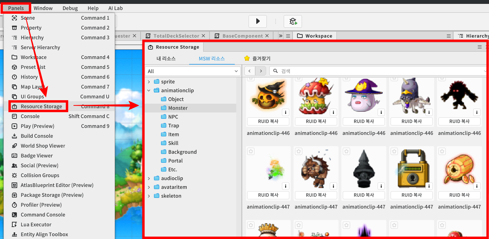

- 메이플스토리 월드에서 제공하는 리소스 중 다양한 몬스터의 애니메이션의 RUID 값은 **Resource Storage** 패널 내에서 확인할 수 있습니다.
- 에디터 상단의 **Panels** - **Resource Storage**를 선택해 리소스 목록 창을 켤 수 있습니다.

<br>
<br>

<p align="Center">
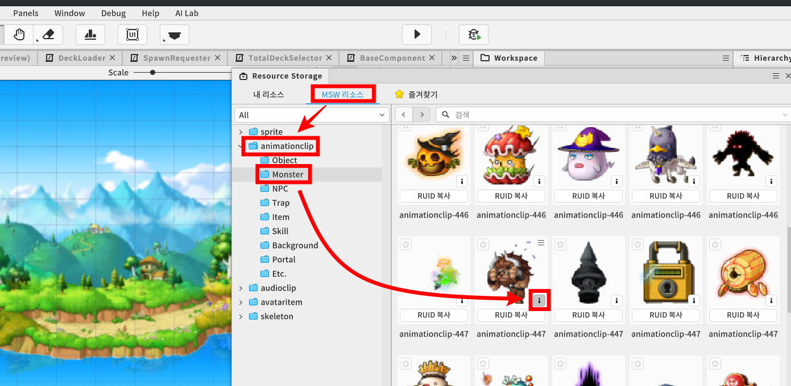

- Resource Storage에서 메이플스토리 월드에서 제공하는 리소스를 확인하기 위해선 창 상단의 MSW리소스 탭을 선택합니다.
- 리소스 중 몬스터의 애니메이션의 항목을 접근하기 위해 **animationclip** - **Monster** 경로에서 다양한 몬스터 애니메이션을 확인할 수 있습니다.
- 원하는 몬스터의 다양한 애니메이션(대기, 이동, 공격 등)을 확인하기 위해 각 리소스 아이템의 우측 하단에 배치된 `info` 아이콘을 선택합니다.

<br>
<br>

<p align="Center">
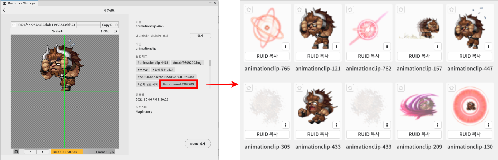

- 유닛의 애니메이션과 관련된 태그 항목 정보를 통해 해당 유닛의 다양한 애니메이션 클립 정보를 확인할 수 있습니다.

<br>

### 애니메이션 타이밍 시간 확인하기
<p align="Center">
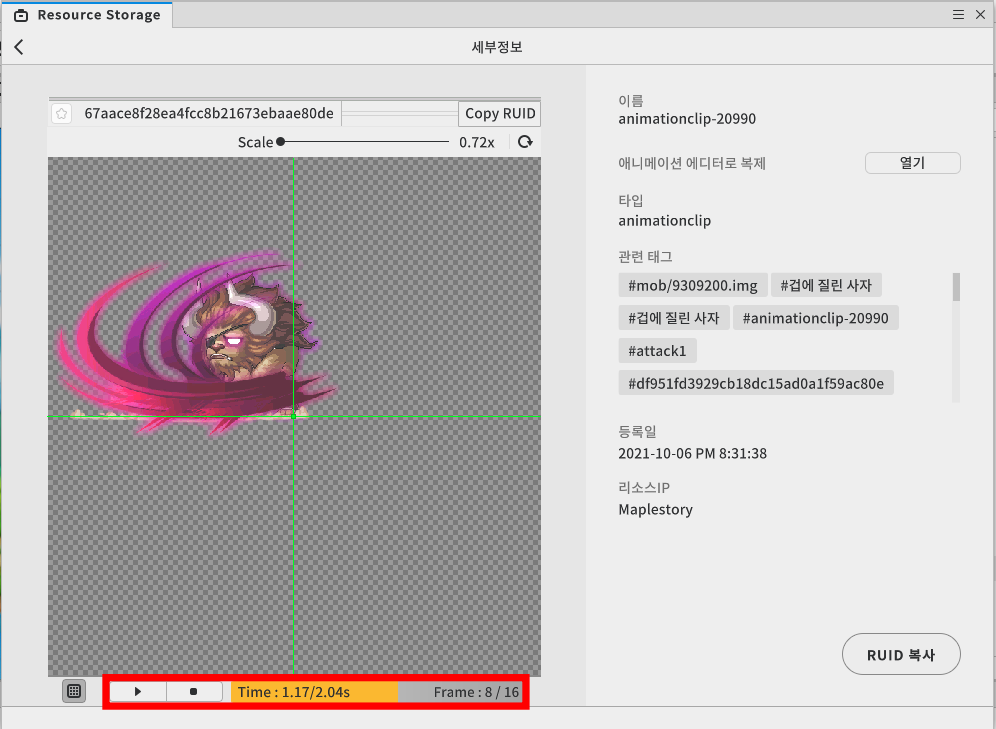

- 유닛의 애니메이션이 수행되는 도중에 이벤트 발생이 필요한 경우, 애니메이션의 특정 구간에서 정지버튼을 통해 현재 재생된 시간값을 패널의 하단에서 확인할 수 있습니다.
- 각 유닛의 피격 전달 타이밍값은 **UnitRenderData**의 **AttackPick**의 항목으로 값이 기록되어 있습니다.

<br>

## 유닛 컴포넌트 제작하기

<p align="Center">
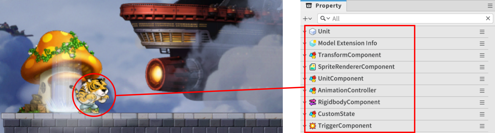

<table class="tg"><thead>
  <tr>
    <th class="tg-9wq8">컴포넌트</th>
    <th class="tg-9wq8">설명</th>
  </tr></thead>
<tbody>
  <tr>
    <td class="tg-0lax">TransformComponent</td>
    <td class="tg-0lax">엔티티의 위치, 회전, 크기를 설정하는 컴포넌트입니다.</td>
  </tr>
  <tr>
    <td class="tg-lboi">SpriteRendererComponent</td>
    <td class="tg-lboi">엔티티의 스프라이트(외형)를 설정하는 컴포넌트입니다.</td>
  </tr>
  <tr>
    <td class="tg-0lax">UnitComponent</td>
    <td class="tg-0lax">유닛으로써 수행되어야 할 기능들이 정의된 핵심 컴포넌트입니다.</td>
  </tr>
  <tr>
    <td class="tg-0lax">AnimationController</td>
    <td class="tg-0lax">SpriteComponent의 기능을 활용해 다양한 애니메이션을 제어하는 컴포넌트입니다.</td>
  </tr>
  <tr>
    <td class="tg-0lax">RigidbodyComponent</td>
    <td class="tg-0lax">Maple TileMap에서 지형 감지, 중력 영향 등 물리적인 기능을 수행하는 컴포넌트입니다.</td>
  </tr>
  <tr>
    <td class="tg-0lax">CustomState</td>
    <td class="tg-0lax">유닛의 다양한 상태(대기, 이동, 공격 등)를 세부적으로 관리하는 컴포넌트입니다.</td>
  </tr>
  <tr>
    <td class="tg-0lax">TriggerComponent</td>
    <td class="tg-0lax">영역 감지, 충돌을 감지하기 위한 컴포넌트입니다.</td>
  </tr>
</tbody></table>

- 구현된 샘플월드에서 유닛으로써 여러 기능을 동작시키기 위해선 그림과 같은 여러 컴포넌트들이 필요합니다.
- UnitComponent, AnimationController, CustomState의 컴포넌트는 직접 제작된 컴포넌트로 각각의 역할과 코드를 확인하며 구체적으로 어떻게 동작하는지 확인합니다.

<br>

### AnimationController 컴포넌트
<p align="Center">
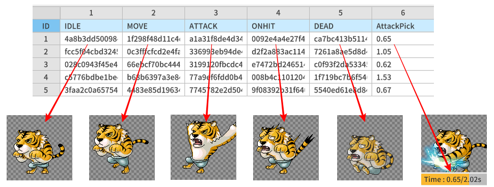

- 애니메이션 컴포넌트는 유닛이 초기화될 때 설정된 유닛의 애니메이션을 하나의 테이블에 저장해두고 외부에서 요청되는 애니메이션을 재생하는 역할을 수행합니다.
- 다음과 같이 코드를 작성해야 합니다.
- 해당 코드는 Plain Text 환경으로 작성되었습니다.

```lua
@Component
script AnimationController extends Component

property SpriteRendererComponent renderer = nil

property table actionSheet = {} -- 테이블의 키: 각 상태명, 값: 각 상태에 맞는 애니메이션 GUID 입니다. 

property number hitTiming = 0 -- 공격 애니메이션 재생 시 상대유닛의 피격처리를 수행해야하는 타이밍 값입니다.

@ExecSpace("ClientOnly")
method void OnBeginPlay()
-- 월드 실행 시 호출되는 함수입니다.

-- SpriteRendererComponent를 자신의 엔티티에 등록된 컴포넌트 중에서 찾아 내부 멤버로 등록합니다.
self.renderer = self.Entity.SpriteRendererComponent
end

@ExecSpace("ClientOnly")
method void ChangeAnimation(string animName)
-- 애니메이션의 상태를 매개변수값(State)으로 변경합니다.

-- 매개변수 1 animName : 적용할 애니메이션의 키값입니다.(ex: IDLE, MOVE, ATTACK)

-- SpriteRenderer의 GUID값을 내부에 등록된 애니메이션 GUID값으로 변경합니다.
self.renderer.SpriteRUID = self.actionSheet[animName]
end

@ExecSpace("ClientOnly")
method void SetAnimTable(string unitName)
-- 내부 멤버인 actionSheet의 테이블을 매개변수의 이름으로 등록된 유닛의 UnitRenderData의 
-- 애니메이션의 GUID값이 담긴 테이블을 그대로 가져옵니다.

-- 매개변수 1 unitName : 현재 등록된 유닛의 이름값입니다.

-- 유닛의 렌더링되어야할 애니메이션의 정보들이 담긴 테이블(UnitRenderData의 각 ID번호) 번호 입니다.
local unitRenderID = _DataSetLogic.unitData[unitName].RenderID

-- 내부 멤버의 테이블을 UniRenderData의 인덱스에 해당하는 테이블을 그대로 등록합니다.
self.actionSheet = _DataSetLogic.unitRenderData[unitRenderID]

-- UnitRenderData에 등록된 "AttackPick"데이터를 그대로 멤버로 저장합니다.
self.hitTiming = self.actionSheet["AttackPick"]
end

end
```

<br>

### CustomState 컴포넌트
<p align="Center">
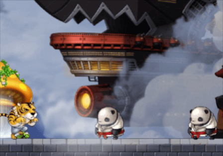

1. CustomState 컴포넌트는 유닛의 핵심 기능을 수행하는 UnitComponent의 상태 전환 요청을 전달받습니다.
2. 전달받은 상태로 전환이 가능한지 판별하며 전환이 가능하다면, 현재 유닛의 상태를 새로운 상태로 기록해 둡니다.
3. **AnimationController** 컴포넌트로, 상태별로 필요한 애니메이션을 재생하도록 요청합니다.

- 다음과 같이 코드를 작성해야 합니다.
- 해당 코드는 Plain Text 환경으로 작성되었습니다.
```lua
@Component
script CustomState extends Component

property string currentState = "" -- 현재 캐릭터의 상태를 나타내는 기록용 변수입니다.

property AnimationController animation = nil

@ExecSpace("ClientOnly")
method void Init()
-- CustomState 컴포넌트를 초기화합니다.

-- 현재 상태를 대기상태로 저장해둡니다.
self.currentState = "IDLE"
-- 상태 변경 시 애니메이션 또한 변경되어야 하므로 애니메이션 컨트롤러 컴포넌트를 멤버로 등록합니다.
self.animation = self.Entity.AnimationController
end

@ExecSpace("ClientOnly")
method void ChangeState(string stateName)
-- 매개변수의 상태로 전환하는 함수입니다.

-- 매개변수 1 stateName : 변경하고자 하는 상태명

-- 기존의 상태가 공격중인 상태이며, 피격상태로 전환을 해야할 경우
if self.currentState == "ATTACK" and stateName == "ONHIT" then
	-- 아무런 처리를 수행하지 않도록 합니다.
	-- 공격 모션이 끊키게 될 경우 연속적인 피격상황 발생 시 어색한 연출이 발생될 수 있습니다.
	return
end

-- 현재 상태를 매개변수로 전달받은 상태로 기록해둡니다.
self.currentState = stateName
-- 전달받은 상태에 맞는 애니메이션 재생을 요청합니다.
self.animation:ChangeAnimation(stateName)
end

@EventSender("Self")
handler HandleSpriteAnimPlayerEndFrameEvent(SpriteAnimPlayerEndFrameEvent event)
-- 애니메이션이 종료되었을때 호출되는 이벤트 함수입니다.

-- 만약 현재 유닛의 상태가 'ATTACK' 이라면,
if self.currentState == "ATTACK" then
	-- 유닛의 상태를 IDLE 상태로 자동으로 전환합니다.
	self:ChangeState("IDLE")
	
-- 만약 현재 유닛의 상태가 'DEAD' 라면 
elseif self.currentState == "DEAD" then
	-- 유닛의 엔티티를 비활성화합니다.
	-- FrameEnd로 애니메이션이 전부 재생되었음과 같은 이유입니다.
	self.Entity.Enable = false
	-- 오브젝트 풀로 유닛을 다시 반환합니다.
	_ObjectPoolLogic:ReturnUnit(self.Entity)
end
end

end
```

<br>

### UnitComponent

- UnitComponent는 유닛의 세부적인 동작 및 기능을 직접 처리하는 컴포넌트입니다.
- 자신에게 설정된 충돌 범위 내에 감지되는 대상이 없는 경우 CustomState 컴포넌트에 `'MOVE'`상태 전환을 요청하며, 대상이 감지되는 경우 `'ATTACK'`과 같은 상태 전환을 요청합니다.
- 다음과 같이 코드를 작성해야 합니다.
- 해당 코드는 Plain Text 환경으로 작성되었습니다.
```lua
@Component
script UnitComponent extends Component

property boolean isMine = false -- 유닛이 유저의 것인지 설정하는 기록용 변수입니다.

property CustomState state = nil

property integer direction = -1 -- 유닛의 전진 진행방향을 의미합니다.

property number attackTimer = 0 -- 기본 공격 쿨타임을 측정, 관리하는 타이머 변수입니다.

property number skillTimer = 0 -- 스킬 공격 쿨타임을 측정, 관리하는 타이머 변수입니다.

property table unitStat = {} -- 유닛의 정보를 담아두는 테이블입니다. DataSet에 등록된 유닛의 정보가 담긴 테이블을 그대로 가져옵니다.

property boolean found = false -- 상대 유닛을 탐지했는지 확인하는 변수입니다.

property boolean waiting = false -- 공격 후 다음 공격을 진행하기 위해 현재 유닛이 대기상태임을 기록하는 변수입니다.

property number hitTimer = 0 -- 상대방에게 공격값을 전달하기 위한 타이머 변수입니다.

property boolean isSendHit = false -- 상대방에게 공격값을 전달했는지 기록하는 변수입니다.

property UnitComponent targetUnit = nil

property BaseComponent targetBase = nil

property integer hp = 0 -- 유닛의 현재 체력입니다.

property integer power = 0 -- 유닛의 공격력입니다. 유닛은 현재 두개의 공격(기본,스킬)이 있으며 각 공격을 할때마다 값이 변경됩니다.

property number damageTimer = 0 -- 피격 시 스프라이트의 투명도 변경하기 위한 타이머 변수입니다.

property boolean changedSpriteAlpha = false -- 스프라이트의 알파값이 변경되었는지 나타내는 상태 변수입니다.

@ExecSpace("ClientOnly")
method void OnBeginPlay()
-- 월드 실행 시 호출되는 함수입니다.

-- 유닛 엔티티에 등록된 CustomState 컴포넌트를 내부 멤버로 저장합니다.
self.state = self.Entity.CustomState
-- CustomState 컴포넌트를 초기화합니다.
self.state:Init()
end

@ExecSpace("ClientOnly")
method void Init(string unitName, boolean isMine)
-- 유닛의 초기화를 수행하는 함수입니다.

-- 해당 유닛이 플레이어의 유닛인지 설정합니다.
self.isMine = isMine

-- 만약 'isMine' 변수값이 true라면 (유저의 것이라면)
if self.isMine == true then
	-- 유닛의 진행방향을 양수값으로 설정합니다. (오른쪽 방향)
	self.direction = 1
	-- 이 유닛의 TriggerComponent의 Collision Group을 Player로 설정합니다.
	-- Player와 Enemy 콜리젼의 상호작용을 위한 설정
	self.Entity.TriggerComponent.CollisionGroup = CollisionGroups.Player
	-- 유닛의 스프라이트 이미지를 X축을 기준으로 반전시킵니다.
	self.Entity.SpriteRendererComponent.FlipX = true
else
	-- 유닛의 진행방향을 음수값으로 설정합니다. (왼쪽 방향)
	self.direction = -1
	-- 이 유닛의 TriggerComponent의 Collision Group을 Enemy로 설정합니다.
	self.Entity.TriggerComponent.CollisionGroup = CollisionGroups.Enemy
	-- 유닛의 스프라이트 이미지를 X축을 기준으로 반전시킵니다.
	self.Entity.SpriteRendererComponent.FlipX = false
end

-- SpriteRenderer Component의 FlipX 속성값을 설정합니다.
--self.Entity.SpriteRendererComponent.FlipX = self.isMine

-- 유닛의 정보값이 담긴 테이블을 내부 멤버로 그대로 가져옵니다.
self.unitStat = _DataSetLogic.unitData[unitName]

-- 초기화가 진행될 때 유닛에 맞는 애니메이션 테이블을 설정해둡니다. (UnitRenderData에 맞는 유닛 애니메이션 테이블)
self.Entity.AnimationController:SetAnimTable(unitName)

-- 기본 공격 타이머를 초기화합니다.
self.attackTimer = 0
-- 스킬 공격 타이머를 초기화합니다.
self.skillTimer = 0
-- 유닛의 초기 체력값을 UnitData의 'Hp'값으로 설정해 둡니다.
self.hp = self.unitStat["Hp"]

self.Entity.RigidbodyComponent.Enable = true
-- 엔티티에 등록된 TriggerComponent를 사용할 수 있도록 활성화 합니다.
self.Entity.TriggerComponent.Enable = true
-- SpriteRenderer Component의 컬러값의 투명도를 1 상태로 설정해 불투명하게 초기화 합니다.
self.Entity.SpriteRendererComponent.Color.a = 1
-- 유닛의 대기 상태가 아님으로 설정합니다.
self.waiting = false;
end

@ExecSpace("ClientOnly")
method void OnUpdate(number delta)
-- 매 프레임마다 호출되는 함수입니다.

-- 만약 피격으로 인해 SpriteRenderer의 컬러값의 투명도가 변경되었다면,
if self.changedSpriteAlpha == true then
	-- 피격 시 설정되는 damageTimer의 0 이하라면 (상태를 복구)
	if self.damageTimer <= 0 then
		-- Sprite의 컬러값의 투명도가 변경되지 않았음으로 설정합니다.
		self.changedSpriteAlpha = false
		-- SpriteRenderer Component의 투명도의 값을 1로 불투명 상태로 설정합니다.
		self.Entity.SpriteRendererComponent.Color.a = 1
	else
		-- 피격 시 설정된 타이머가 아직 잔여 시간이 있으므로, 0에 도달할 때까지 타이머값을 감소시킵니다.
		self.damageTimer -= delta	
	end
end

-- 만약 체력이 없다면
if self.hp <= 0 then
	-- 이 후의 행동 기능을 수행하지 않도록 설정합니다.
	return
end


-- 유닛이 살아있는동안 기본,스킬 공격의 쿨타임은 계속 순환시키도록 합니다.
-- 이동, 대기, 피격시 모든 상황에서 쿨타임을 순환시키기 위함입니다.
self.attackTimer += delta
self.skillTimer += delta

-- 유닛이 공격상태에 진입되어 있다면, (공격 애니메이션이 수행중이라면)
if self.state.currentState == "ATTACK" then
		-- 상대방에게 데미지를 전달하지 않은 상황이라면,
		if self.isSendHit == false then
			-- 상대방에게 해당 유닛의 데미지를 전달하는 타이밍에 도달할때까지 delta값 만큼 hitTimer에 추가합니다.
			self.hitTimer += delta
			
			-- hitTimer값이 UnitRenderData DataSet에 등록된 AttackPick 값 보다 큰 상황이라면(데미지 전달을 진행)
			if self.hitTimer >= self.Entity.AnimationController.hitTiming then
				
				-- 만약 대상 유닛이 감지된게 있다면
				if self.targetUnit ~= nil then
					-- 대상 유닛에게 데미지를 전달합니다.
					self.targetUnit:OnDamage(self.power)
				
				-- 만약 대상 기지가 감지된게 있다면
				elseif self.targetBase ~= nil then
					-- 대상 기지에 데미지를 전달합니다.
					self.targetBase:OnDamage(self.power)
				
				end
				
				-- 데미지를 전달했음으로 상태를 전환합니다.
				-- 한번의 Attack수행 시 연속적인 데미지 전달을 방지하기 위함입니다.
				self.isSendHit = true
				-- 감지된 대상 유닛의 정보를 비워둡니다.
				self.targetUnit = nil
				-- 감지된 대상 기지의 정보를 비워둡니다.
				self.targetBase = nil
			
			end
		
		end
	-- 공격 상태라면 공격만 담당하는 기능만 수행할 수 있도록 이후의 로직은 수행되지 않도록 설정합니다.
	return
end
	

-- TriggerComponent에 탐지된 상대방이 없다면
if self.found == false then
	-- 이동 기능을 수행합니다.
	self:Move(delta)

	-- TriggerComponent에 탐지된 상대방이 있다면
else
	-- 기본공격 쿨타임과 스킬공격 쿨타임 값중 아무것도 사용가능한 상태로 도달하지 않았다면,
	if(self.attackTimer < self.unitStat["AtkCooltime"]) and (self.skillTimer < self.unitStat["SkCooltime"]) then
		
		-- 유닛이 대기중인 상태임으로 전환합니다.	
		self.waiting = true
		-- 유닛의 현재 상태를 IDLE상태로 전환합니다.
		self.state:ChangeState("IDLE")
		
	-- 공격 행위(기본공격 또는 스킬공격)의 쿨타임이 채워졌다면
	else
		
		-- 유닛의 대기중인 상태가 아님으로 전환합니다.	
		self.waiting = false
		-- 스킬 공격의 쿨타임이 완료되었다면	
		if self.skillTimer >= self.unitStat["SkCooltime"] then
			-- 유닛의 스킬 공격을 수행합니다. 
			self:Skill()
		-- 스킬 공격이 아닌 기본공격의 쿨타임이 완료되었다면
		elseif self.attackTimer >= self.unitStat["AtkCooltime"] then
			-- 유닛의 기본 공격을 수행합니다.
			self:Attack()
		end
		
		-- 공격이 수행되었으므로 다시 유닛의 상태를 대기중으로 변경해 둡니다.
		self.waiting = true
	
	end

end


end

@ExecSpace("ClientOnly")
method void Move(number delta)
-- 유닛의 이동을 수행합니다.

-- 유닛이 대기중이 아님으로 상태를 전환합니다.
self.waiting = false
-- CustomStateComponent에서 캐릭터의 현재상태를 MOVE로 전환합니다.
self.state:ChangeState("MOVE")

-- 유닛의 현재 절대 좌표값을 확인합니다.
local currentPos = self.Entity.TransformComponent.WorldPosition
-- 이동속도, 방향을 고려해 유닛에 반영되어야 하는 위치값을 계산합니다.
local movePos = currentPos + Vector3(delta*self.direction*self.unitStat["Speed"],0,0)
-- RigidbodyComponent으로 유닛의 절대좌표값을 설정합니다.
self.Entity.RigidbodyComponent:SetWorldPosition(movePos:ToVector2())
end

@ExecSpace("ClientOnly")
method void Skill()
-- 유닛의 스킬 기능을 동작시킵니다.

-- 스킬 공격시 기본 공격 타이머도 같이 초기화합니다.
self.attackTimer = 0
-- 스킬 공격 타이머를 초기화합니다.
self.skillTimer = 0
-- 유닛의 상태를 ATTACK으로 변경합니다.
self.state:ChangeState("ATTACK")
-- 데미지 전달 타이머를 초기화합니다.
self.hitTimer = 0
-- '데미지를 전달하지 않았었음'으로 초기화 해둡니다.
self.isSendHit = false

local skillFX_ID = self.unitStat["Skill"]
local skillFX_RUID = _DataSetLogic.skillData[skillFX_ID].EffectRUID

_EffectService:PlayEffect(skillFX_RUID,self.Entity,self.Entity.TransformComponent.WorldPosition,0,Vector3.one)
_SoundService:PlaySound("83529166c98f420092183aa310b2d660",0.5)

-- 유닛의 공격력을 스킬 공격력 값으로 설정해 둡니다.
self.power = self.unitStat["SkAttack"]
end

@ExecSpace("ClientOnly")
method void Attack()
-- 기본 공격 타이머를 초기화 합니다.
self.attackTimer = 0
-- 유닛의 상태를 ATTACK으로 변경합니다.
self.state:ChangeState("ATTACK")
-- 데미지 전달 타이머를 초기화합니다.
self.hitTimer = 0
-- '데미지를 전달하지 않았었음'으로 초기화 해둡니다.
self.isSendHit = false

-- 유닛의 공격력을 기본 공격력 값으로 설정해 둡니다.
self.power = self.unitStat["Attack"]

_SoundService:PlaySound("ddd8caea18a04c88a7a9cf9627a91f86",0.35)
end

@ExecSpace("ClientOnly")
method void OnDamage(integer damage)
-- 유닛의 피격처리를 수행하는 함수입니다.

-- 매개변수 1 damage : 전달받는 데미지 값 입니다.

-- 현재 체력에서 매개변수의 값을 감소합니다.
self.hp -= damage
-- 유닛의 현재 상태를 ONHIT 상태로 전환합니다.
self.state:ChangeState("ONHIT")

-- SpriteRenderer 컴포넌트의 Alpha값을 0.4로 낮춥니다.
self.Entity.SpriteRendererComponent.Color.a = 0.4
-- 피격 타이머를 0.15초로 설정합니다.(0.15초 뒤 다시 원상태로 복원시킵니다.)
self.damageTimer = 0.15
-- 내부 상태로 현재 스프라이트가 변경되었음을 설정합니다.
self.changedSpriteAlpha = true

-- 체력이 0이하라면
if self.hp <= 0 then
	-- 유닛 엔티티의 TriggerComponent를 비활성화 합니다.
	self.Entity.TriggerComponent.Enable = false
	-- 유닛의 현재상태를 DEAD 상태로 전환합니다.
	self.state:ChangeState("DEAD")
end
end

@EventSender("Self")
handler HandleTriggerLeaveEvent(TriggerLeaveEvent event)
-- 충돌 범위 내에서 기존에 감지된것이 사라졌을 때 발생되는 이벤트 함수입니다.

-- '상대방 유닛을 감지하지 못하고 있음'으로 상태를 전환합니다.
self.found = false

-- 감지 대상 정보를 전부 비워둡니다.
self.targetUnit = nil
self.targetBase = nil
end

@EventSender("Self")
handler HandleTriggerStayEvent(TriggerStayEvent event)
-- 충돌 범위 내에서 감지되고 있는 매 순간 발생되는 이벤트 함수입니다.

-- 만약 충돌 된 대상에 UnitComponent 또는 BaseComponent 가 있다면(상대방의 유닛, 기지인지 확인)
if event.TriggerBodyEntity.UnitComponent ~= nil or event.TriggerBodyEntity.BaseComponent then
	-- '상대방의 유닛을 감지했음'으로 설정합니다.
	self.found = true
end

-- 만약 감지 대상이 UnitComponent가 있다면
if event.TriggerBodyEntity.UnitComponent ~= nil then
	-- 공격 대상 유닛을 현재 감지된 유닛으로 설정합니다.
	self.targetUnit = event.TriggerBodyEntity.UnitComponent
end

-- 만약 감지 대상이 BaseComponent가 있다면
if event.TriggerBodyEntity.BaseComponent ~= nil then
	-- 공격 대상 기지를 현재 감지된 기지로 설정합니다.
	self.targetBase = event.TriggerBodyEntity.BaseComponent
end
end

end
```

<br>

## Unit Model 제작하기
<p align="Center">
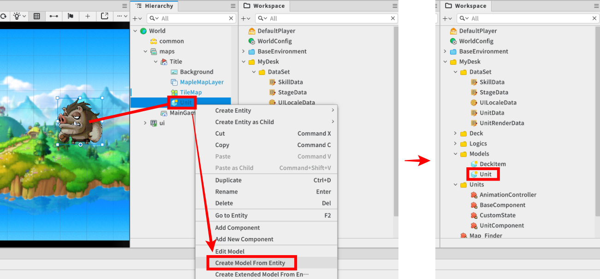

- 월드가 실행되는 중, 실시간으로 새로운 유닛 엔티티를 생성하기 위해선 SpawnService의 기능이 필요합니다.
- SpawnService를 통해 동일한 유닛 엔티티를 복제하기 위해 유닛의 원본이 되는 Model을 미리 준비해 둡니다.
- **Hierarchy**에서 모델로 생성하고자 하는 엔티티를 **우클릭** - **Create Model From Entity**를 선택해 모델을 생성할 수 있습니다.
- 생성된 **Model**은 Workspace 탭에서 확인할 수 있습니다.

<br>

## 최소 구현 기준
- 상대방의 기지 또는 유닛과 상호작용을 수행하며 전투를 진행하기 위해 기본적인 유닛 엔티티 제작 및 Model 등록이 필요합니다.
- 유닛의 기능 동작을 수행하기 위해선 UnitComponent, CustomState 스크립트 제작 및 등록이 필요합니다.

<br>

## 응용 및 확장 방향
- 지상전을 진행하는 유닛뿐만 아니라, 공중전을 수행할 수 있는 유닛을 제작할 수 있습니다.
- 유닛의 더욱 다양한 스탯 정보(방어력, 속성 공격 등)를 추가해 플레이어에게 좀 더 다양한 전략 방식을 고려하게 제공할 수 있습니다.


