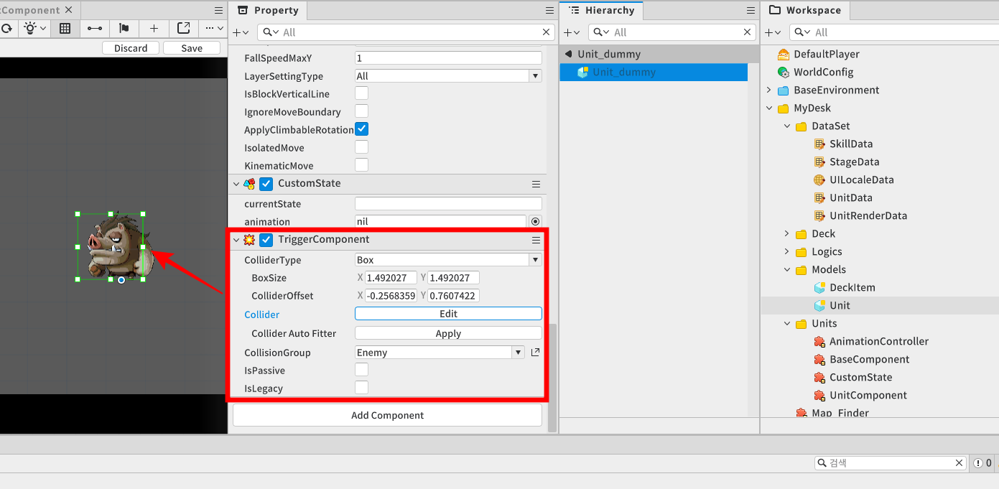
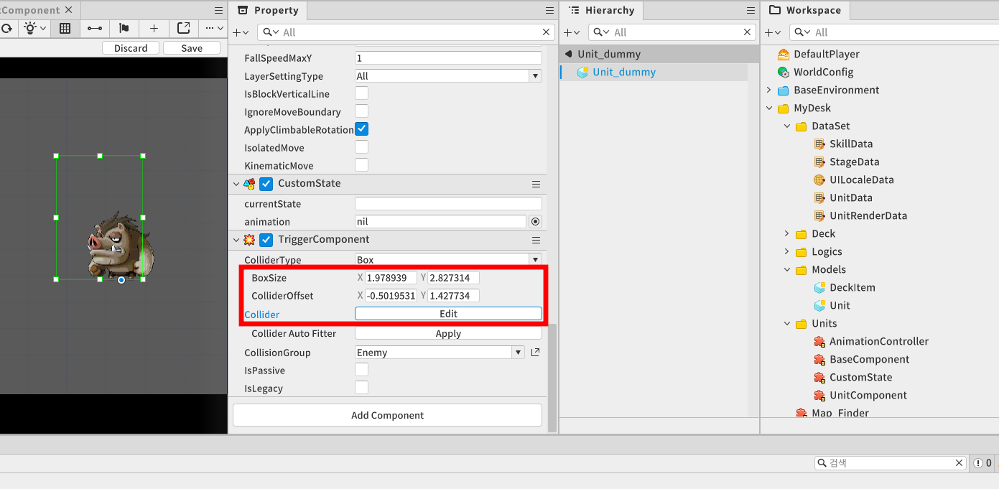
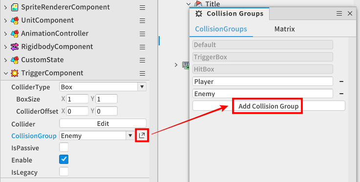
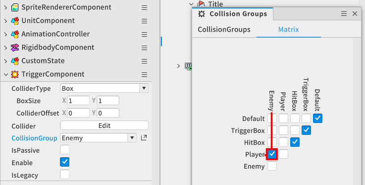
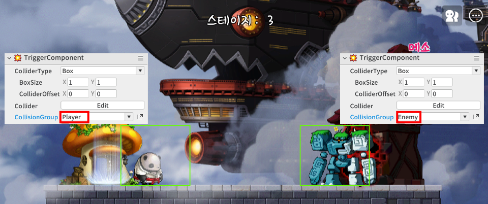
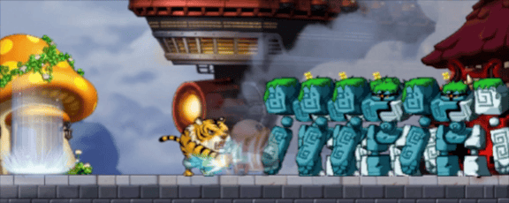

# [💡기초 학습]공격 구현하기
<br>
<br>
<br>

## 영상 타입라인
- 강의 영상 내 아래의 타임라인에서 학습할 수 있습니다.
- 공격 구현하기: 01:11:19

<br>

## 학습 목표
- TriggerComponent의 설정 방법과 Event Handler에 대한 개념을 익힙니다.
- 유닛마다 주기적인 공격 또는 스킬을 어떠한 방식으로 수행하는지 학습합니다.
- DataSet의 전략적인 활용 방식을 이해하며 다양한 스킬을 사용하는 방법을 학습합니다.

<br>

## 해당 영상 시청 후 수행해 볼 내용
- UnitRenderData에서 상대방에게 피격 타이밍을 제공하는 'AttackPick' 값을 조절해 보며 원하는 타이밍에 피격 판정이 발생하는지 확인합니다. 
- 유닛의 TriggerComponent의 범위를 조절하여 원거리 공격이 수행될 수 있도록 수정해 봅니다.

<br>

## TriggerComponent 등록하기
<p align="Center">


- 상대방의 유닛과 접근되었을 경우를 감지할 수 있는 TriggerComponent의 기능이 필요합니다.
- 상대방의 유닛과 자신의 TriggerComponent의 Collider가 충돌(범위 내)감지 될 경우 TriggerComponent의 이벤트 기능을 활용할 수 있습니다.

<br>

### 콜라이더 범위설정하기
<p align="Center">


- 상대방의 TriggerComponent를 감지하기 위한 유닛의 Collider 크기, 범위 설정이 필요합니다.
  - BoxSize : X, Y축의 값을 할당하여 충돌 박스의 크기를 설정할 수 있습니다.
  - ColliderOffset : 충돌 박스의 중심점의 위치를 엔티티 기준점으로부터 떨어진 값을 설정합니다.
  - Collider : 현재 설정된 범위를 시각적으로 확인할 수 있으며, 마우스 드래그 또는 드롭으로 Size 또는 Offset 값을 설정할 수 있습니다.
- Collider 범위가 너무 클 경우, 유닛이 마치 원거리에서 공격하는 모션으로 동작할 수 있습니다.

<br>

### Collision Group 설정하기
- 플레이어가 생성된 유닛들은 상대방의 유닛 또는 기지만 공격을 수행해야 하므로 TriggerComponent를 통해 상대방의 Collider만 감지할 수 있도록 설정해야 합니다.

### Collision Group 추가하기
<p align="Center">


- 새로운 Collision Group을 생성하기 위해 **TriggerComponent**의 **CollisionGroup**의 패널 활성화 버튼을 클릭해 **Collsion Groups** 패널을 확인합니다.
- CollsionGroups 탭의 하단 **Add Collsion Group**으로 신규 Collsion Group을 생성할 수 있습니다.  

<br>

### 충돌 Matrix 설정하기

<p align="Center">


- 플레이어가 생성한 유닛들은 CollisionGroup을 `Player`로 설정하며 Matrix에서 Player는 Player 유닛 간의 충돌을 감지하지 못하도록 설정합니다.
- 적의 기지로부터 생성되는 유닛들은 CollisionGroup을 `Enemy`로 설정하여 Matrix에서 Player와 Enemy가 서로 충돌을 감지하도록 설정합니다.

<br>
<br>

<p align="Center">


- 월드 테스트를 진행하며 플레이가 생성한 유닛 간 충돌 감지로 인해 서로 공격을 수행하지 않는지 확인합니다.

<br>

## 유닛 사망 애니메이션 처리
<p align="Center">


- 유닛의 피격 처리를 수행 후 체력이 0 이하로 떨어질 경우 사망 애니메이션이 재생된 이후 엔티티가 제거되거나 비활성화 되어야 합니다.
- 만약, 유닛에 등록된 CustomState 컴포넌트로 `DEAD` 상태 전환이 진행되는 동시에 엔티티를 제거하게 될 경우 애니메이션이 재생되지 않는 문제가 발생될 수 있습니다.

<br>

### HandleSpriteAnimPlayerEndFrameEvent
- SpriteRendererComponent에서 제공되는 SpriteAnimPlayerEndFrameEvent를 활용할 경우 애니메이션이 종료되는 마지막 프레임이 재생될 때 해당 이벤트 함수를 호출할 수 있습니다.

```lua
CustomState 컴포넌트의 HandleSpriteAnimPlayerEndFrameEvent 이벤트 함수 활용예시

Property:

string currentState = ""


Event Handler:

[self]
HandleSpriteAnimPlayerEndFrameEvent(SpriteAnimPlayerEndFrameEvent event)
{
    -- 현재 재생되고 있는 애니메이션의 마지막 프레임일 경우 호출되는 이벤트 함수
    
    -- 현재 유닛의 상태가 "DEAD"라면 (DEAD 애니메이션의 마지막 프레임의 상황)
    if self.currentState == "DEAD" then
        -- 자신의 엔티티를 비활성화 합니다.
        self.Entity.Enable = false
    end
}
```

## 최소 구현 기준
- 유닛 간 상호작용을 수행하기 위해 TriggerComponent가 등록되어 있어야 합니다.
- 플레이어가 생산한 유닛은 적의 유닛을 공격해야 하며, 적의 유닛은 플레이어가 생산한 유닛을 공격해야 하므로 TriggerComponent의 Maxtrix 설정이 필요합니다.

<br>

## 응용 및 확장 방향
- 유닛 스탯의 방어력 스탯을 추가하여 피격 시 전달받는 데미지 값을 별도로 계산하는 과정을 추가할 수 있습니다.
- Matrix를 설정해 유닛의 혼란상태를 추가하여 아군 유닛이 아군 유닛을 공격할 수 있도록 기능을 추가할 수 있습니다.


