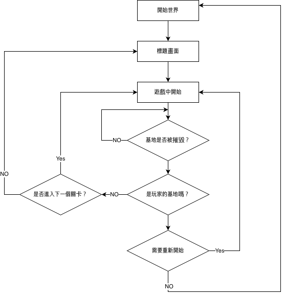
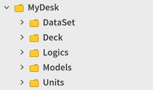

# 防禦遊戲學習指南文件
 
 
 

## 學習目標

- 透過指南文件與範例世界，學習防禦遊戲核心功能的方法
- 學習在楓之谷世界中，依據欲製作的遊戲方式來設定地圖的方法。
- 學習理解Logic，並善用它設計遊戲架構的方法。
- 能將製作完成的世界調整成想要的形式並進行製作。

 

---

 

## 學習核心功能
- **DataSet應用**：學習以各種方式善用DataSet來控制遊戲難度的方法。
- **AddComponent運用**：學習只使用一個實體，並依即時情況登錄需要的元件，使其執行符合目的之動作的方法。
- **Event Handler**：可以偵測遊戲內發生的各種情況，並控制預期功能能依照時機正常執行。

 

## 🔄 核心遊戲循環

 

**1.標題畫面**：作為遊戲入口，可以直接開始戰鬥，或預先設定戰鬥中使用的英雄「牌組」。 
**2.遊戲內開始**：根據玩家的進度資料，從最後抵達的關卡開始正式進行戰鬥。 
**3.確認基地破壞與否**：英雄攻防戰展開期間，即時確認我方或敵方(AI)基地是否被破壞。 
**4.確認被破壞基地所有權**：掌握被破壞的基地屬於誰，判斷關卡的最終  
**5.確認關卡進行**：破壞敵方(人工智慧)基地並通關關卡時，可進入下一關卡；相反地，若使用者的基地被破壞，則可以重新遊玩目前關卡。

 

## 資料夾組成

<table class="tg"><thead>
  <tr>
    <th class="tg-9wq8">名稱</th>
    <th class="tg-9wq8">說明</th>
  </tr></thead>
<tbody>
  <tr>
    <td class="tg-lboi">DataSet</td>
    <td class="tg-lboi">存放用來建立範例世界之DataSet的資料夾。</td>
  </tr>
  <tr>
    <td class="tg-lboi">Deck</td>
    <td class="tg-lboi">這是存放防禦世界中Deck實體所使用元件腳本的資料夾。</td>
  </tr>
  <tr>
    <td class="tg-0pky">Logic</td>
    <td class="tg-0pky">用於存放以楓之谷世界功能Logic製作的腳本的資料夾。</td>
  </tr>
  <tr>
    <td class="tg-lboi">Models</td>
    <td class="tg-lboi">用於存放model化後實體的資料夾。</td>
  </tr>
  <tr>
    <td class="tg-0pky">Units</td>
    <td class="tg-0pky">這是存放登錄於實際進行戰鬥之英雄的元件腳本的資料夾。</td>
  </tr>
</tbody>
</table>

---

 

## 製作順序

- 💡 **基礎學習**：包含楓之谷世界基本功能與該類型基礎功能的學習項目。
- 📖 **進階學習**：學習並製作範例世界中的功能項目。透過此流程的學習，可提升類型功能擴充與學習理解度。 

### [💡基礎學習]1.建構世界環境
- 學習楓之谷世界最基本的地圖方式Maple TileMap模式。
- 可以在TileMap模式中配置圖塊地圖，建立遊戲環境。
- 分析防禦類型的特性，並可自行組成遊戲製作環境。
- 可以在世界的地圖內配置各種實體。

 

### [💡基礎學習]2.製作英雄
- 學習製作DataSet，建立遊戲內使用的各種資料的方法。
- 製作用來使用登錄於DataSet之資料的DataSetLogic，學習如何使用實際資料。
- 製作實際用於戰鬥的英雄，並提升對各種元件的理解。
- 可以製作防禦世界核心角色，也就是英雄的基本形態Model。

 

### [💡基礎學習]3.製作攻擊
- 學習TriggerComponent的設定方法與Event Handler概念。
- 學習每個英雄以什麼方式執行週期性攻擊或技能。
- 理解DataSet的策略性運用方式，並學習使用各種技能的方法。

 

### [💡基礎學習]4.製作英雄生成系統
- 學習依不同關卡，讓敵方基地生成不同英雄組合的方法。
- 學習從敵方基地週期性自動生產英雄的方法。
- 理解透過玩家操作生產英雄的方法。

 

### [💡基礎學習]5.製作關卡管理者
- 運用Logic的「全域性」特徵，學習管理關卡編號的方法。
- 理解依關卡通關或敗北分支各自需要處理的功能，並可直接製作。
- 理解如何運用只能在Server端執行的TeleportService來切換地圖。

 

### [💡基礎學習]6.建立物件池
- 掌握當實體建立與刪除反覆發生時造成效能下降的原因，並理解物件池化技法的必要性。
- 可以直接製作預先生成多個英雄並儲存在待機狀態的Pool資料結構。
- 撰寫將體力為0以下的英雄重新歸還至物件池，並在需要時進行初始化後再次取出使用的函式。

 

### [📖進階學習]7.製作資源系統
- 學習依時間流逝週期性生產資源的方法。
- 學習玩家或敵方(人工智慧)運用資源生產英雄的方法。
- 理解實際敵方(人工智慧)運用資源生產英雄的過程。
- 可以直接製作英雄Deck，製作讓玩家生產英雄的功能。
- 學習ScrollLayoutComponent的運用方法，學習配置UI的方法。

 

### [📖進階學習]8.製作牌組編輯系統
- 學習在已製作的Model「Deck」上附加各種元件，並以各種方式使用的方法。
- 學習從牌組編成過程到實際關卡，透過已設定的牌組進行戰鬥的方法。
- 學習運用DataStorage儲存及讀取使用者各種資訊的功能。

 

### [💡基礎學習]9.建立UI
- 學習依各種情況(Title，MainGame，Result)將需要的UI顯示於畫面上的方法。
- 學習透過Entity的ConnectEvent簡便連動功能的方法。
- 學習控制即時更改的UI，並可製作用於在防禦世界中顯示玩家資源資訊的UI。

 
