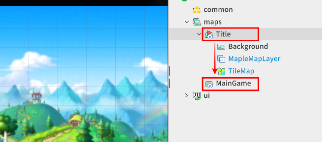
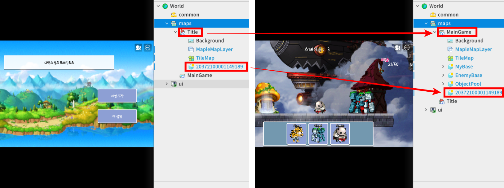
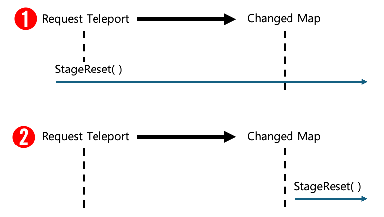
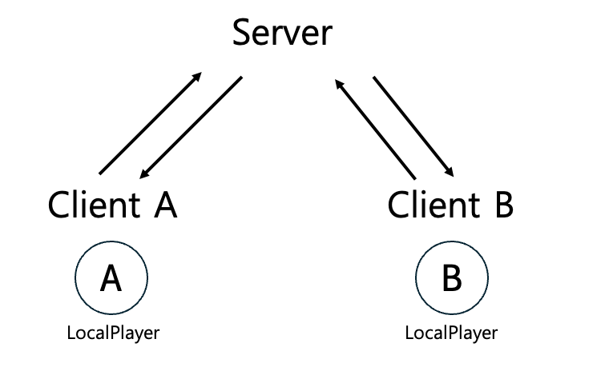
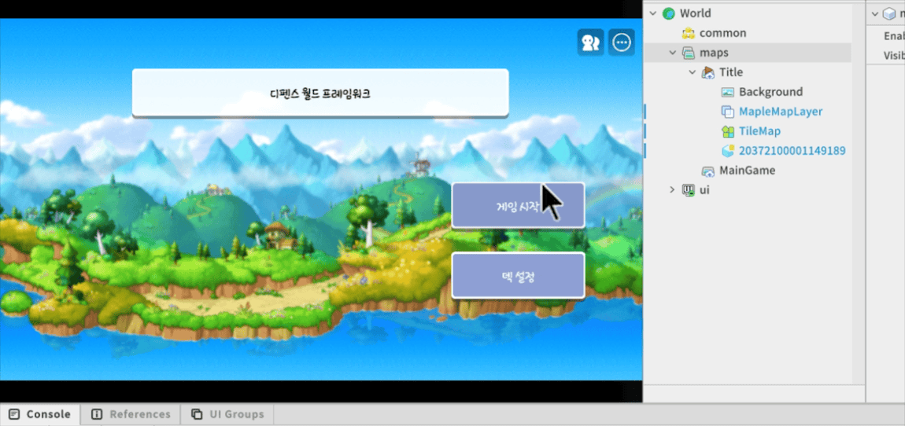

# [💡基礎學習]製作關卡管理員
<br>
<br>
<br>

## 影片時間軸
- 可在課程影片中以下時間點學習。
- 製作關卡管理員：01:35:08 

<br>

## 學習目標
- 運用Logic的「全域性」特徵，學習管理關卡編號的方法。
- 理解依關卡通關或敗北分支各自需要處理的功能，並可直接製作。
- 理解運用只能在Server端執行的TeleportService切換地圖的方法。

<br>

## 觀看該影片後可嘗試執行的內容
- 撰寫StageLogic程式碼後呼叫StageReset函式，確認背景畫面與UI文字是否依關卡編號正常更改。
- 注意TeleportService功能只能在Server空間運作，撰寫TelePortLogic，並測試玩家在地圖間的移動。

<br>

## 管理防禦世界的關卡
- 為了提供使用者各種關卡，必須建立符合各關卡編號的遊戲環境。
- 需要執行各關卡編號、關卡設定的中間角色管理者。
- 運用可在程式內全域存取的**Logic**腳本，製作**StageLogic**。 

<br>

### 製作StageLogic
- StageLogic會執行以下角色。
  - currentStage：記錄玩家要進行的目前關卡編號。
  - StageReset：在正式MainGame內，依目前關卡編號初始化為符合的遊戲環境。
  - OpenNextStage：執行使用者通關關卡並進入下一關卡的功能。
  - SetStageBackGround：設定目前關卡背景畫面。

<br>

- 必須如下撰寫程式碼。
- 該程式碼是在Plain Text環境下撰寫。
```lua
@Logic
script StageLogic extends Logic

property integer currentStage = 1 -- 記錄目前關卡編號。

property boolean isStageStart = false -- 表示目前關卡是否進行中。

property string backGroundEntityPath = "/maps/MainGame/Background" -- 記錄BackGround實體路徑。

@ExecSpace("ClientOnly")
method void StageReset()
-- 設定為從頭重新開始目前關卡的函式。

-- 設定為停用結果視窗彈出視窗。
_UI_Result:Hide()

-- 儲存玩家的baseComponent。
local myBase = _EntityService:GetEntityByPath("/maps/MainGame/MyBase").BaseComponent
-- 儲存敵方baseComponent。
local enemyBase = _EntityService:GetEntityByPath("/maps/MainGame/EnemyBase").BaseComponent

-- 啟用玩家的基地實體。
myBase.Entity.Enable = true
-- 啟用敵方基地實體。
enemyBase.Entity.Enable = true

-- 將玩家baseComponent生成的所有英雄重新歸還至物件池。
myBase:ReturnAllUnit()
-- 將敵方baseComponent生成的所有英雄重新歸還至物件池。
enemyBase:ReturnAllUnit()

-- 初始化玩家baseComponent。
myBase:Init()
-- 初始化敵方baseComponent。
enemyBase:Init()
-- 設定關卡BackGround。
self:SetStageBackGround()
-- 將關卡設定為進行中狀態。
self:SetStageState(true)

-- 設定上方的關卡編號UIText。
_UI_MainGame:UpdateStageNumberText()
end

@ExecSpace("Client")
method void OpenNextStage()
-- 切換至下一關卡的函式。

-- 確認所有關卡的數量。
local totalStageCount = #_DataSetLogic.stageData

-- 若該關卡低於最後關卡
if totalStageCount > self.currentStage then
	-- 將目前關卡編號增加1。
	self.currentStage += 1
	-- 在資料儲存空間中記錄使用者最後通關的關卡編號。
	_GameLogic:SaveLastStage(self.currentStage)
end

-- 將關卡狀態重新恢復為初始狀態。
self:StageReset()
end

@ExecSpace("ClientOnly")
method void SetStageState(boolean isStart)
-- 更改關卡進行中狀態的函式。

-- 參數1 isStart：若為true，代表關卡處於進行中狀態。

-- 將關卡狀態記錄為內部成員。
self.isStageStart = isStart
end

@ExecSpace("ClientOnly")
method void SetStageBackGround()
-- 切換背景畫面的函式。

-- 存取作為管理內部成員所記錄BackGround的實體，並存取BackgroundComponent。
local backGroundComponent = _EntityService:GetEntityByPath(self.backGroundEntityPath).BackgroundComponent
-- 將背景元素設定為符合目前關卡編號的背景。
backGroundComponent:ChangeBackgroundByTemplateRUID(_DataSetLogic.stageData[self.currentStage].BackGroundRUID)
end

end
```

<br>

## 運用TeleportService切換地圖
<p align="Center">


- 為了讓使用者在Title畫面完成戰鬥準備並正式進入遊戲，必須進入**Hierarchy**中登錄的MainGame地圖。

<br>
<br>

<p align="Center">


- 可以將作為遊戲畫面輸出基準的角色實體從**Title**地圖移動至**MainGame**地圖，正式執行遊戲。
- 若要將角色實體移動至其他地圖，必須運用楓之谷世界提供的功能**TeleportService**。
- 用於地圖切換的TeleportService可如下使用。
```lua
[server only]
void TeleportToMainGameMap(Entity playerEntity)
{
    -- 登錄Hierarchy中登錄的MainGame地圖實體路徑。
    string destinationPath = "/maps/MainGame"

    -- 傳遞函式參數收到的目標實體與路徑值。 
    -- 將對象移動為配置於destinationPath之實體的子物件。
    _TeleportService:TeleportToEntityPath(playerEntity,destinationPath)
}
```

<br>

### 製作TeleportLogic
- 防禦世界中運用TeleportService的TeleportLogic會如下製作。
- 該程式碼是在Plain Text環境下撰寫。

```lua
@Logic
script TelePortLogic extends Logic

property string localPlayerName = "" -- 用來存放世界執行時出現之玩家實體名稱的變數。

@ExecSpace("Server")
method void SaveLocalPlayerNametoServer(string userName)
-- 在伺服器端登錄本機玩家實體名稱的函式。

-- 參數1 userName：接收本機玩家操作之角色的實體名稱。

-- 將參數(玩家實體名稱)記錄為內部成員。
self.localPlayerName = userName
end

@ExecSpace("ServerOnly")
method void TelePort(string mapName)
-- 執行Teleport功能的函式。

-- 參數1 mapName：接收想移動的地圖名稱。

-- 尋找並記錄登錄為內部成員的目標玩家實體。
local playerEntity = _UserService:GetUserEntityByUserId(self.localPlayerName)

-- 宣告用來存放想移動地圖path值的變數。
local mapPath = ""

-- 若參數值為「Title」
if mapName == "Title" then
	-- 將mapPath值設定如下。
	mapPath = "/maps/Title"

-- 若參數值為「MainGame」	
elseif mapName == "MainGame" then
	-- 將mapPath值設定如下。
	mapPath = "/maps/MainGame"

-- 若收到錯誤的參數值
else
	-- 設定為輸出如下錯誤值至記錄。
	log_error("Invalid map name. Please check again.")
end

-- 若目標玩家實體與地圖路徑已設定，則運用TeleportService功能執行地圖切換。
_TeleportService:TeleportToEntityPath(playerEntity,mapPath)
end

end
```

<br>

## 運用HandleEntityMapChangedEvent確認地圖切換時間點
<p align="Center">


- 若要正式進行關卡，必須在切換至MainGame地圖後，呼叫依各關卡初始化的**StageLogic**的**StageReset**函式。
- 若執行Teleport功能的同時呼叫StageReset，可能會發生同步時間點不一致的問題。
  1.若執行瞬間移動的同時進行**StageReset**，在連接**MainGame**地圖內已登錄實體、參照的作業時，可能會發生問題。
  2.在請求瞬間移動作業後，地圖完全切換的時間點之後呼叫**StageReset**函式，即可防止這類問題。 

<br>

## 運用UserService尋找本機玩家
<p align="Center">


- 可透過UserService尋找使用者客戶端環境的本機玩家。

```lua
[client only]
void OnBeginPlay()
{
  local playerEntity = _UserService.LocalPlayer
}
```
<br>

⚠️ 在伺服器管理的函式內無法找出本機玩家，因此若伺服器端需要識別或控制特定玩家，必須由客戶端直接傳遞玩家實體。 

<br>

## 登錄ButtonComponent的點擊事件
<p align="Center">


- 若要從Title地圖進入正式遊戲，玩家按下「遊戲開始」時，需要實際切換地圖的互動。
- 在世界執行時呼叫的**OnBeginPlay**函式內，運用ButtonComponent的Event功能，預先登錄切換至**MainGame**地圖的功能。 

```lua
UI_Title Logic中連動按鈕功能的過程

Property:
-- 將按鈕實體分配為變數，並預先連接參照。
[None]
Entity gameStartButton = /ui/Title/GameStartButton

Method:
[clientOnly]
void OnBeginPlay()
{
  -- 運用Entity的ConnectEvent函式，連接為當目標實體的按鈕點擊事件發生時，呼叫EnterMainGame函式。
  self.gameStartButton:ConnectEvent(ButtonClickEvent,self.EnterMainGame)
}

[server]
void EnterMainGame()
{
  _TelePortLogic:TelePort("MainGame")
}
```

<br>

## 最低製作標準
- 點擊Title畫面的「遊戲開始」按鈕時，必須不發生錯誤地瞬間移動至MainGame地圖。
- 通關關卡時currentStage會增加1，且必須依下一關卡資料(背景、敵方資訊)完整重新開始遊戲。

<br>

## 應用與進階應用
- 嘗試在currentStage為5的倍數時，追加專用邏輯，使特殊背景與強大的BOSS怪物登場。
- 為了消除瞬間移動時畫面中斷的感覺，試著追加調整覆蓋畫面的黑色UI透明度的流暢場景切換演出。
- 通關最後關卡時不要結束遊戲，嘗試擴展難度公式，使其進入敵方能力值無限提升的無限模式。


