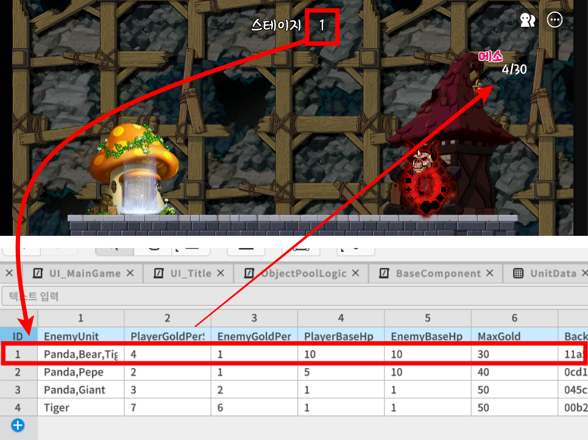
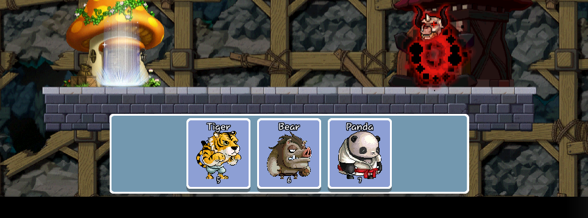
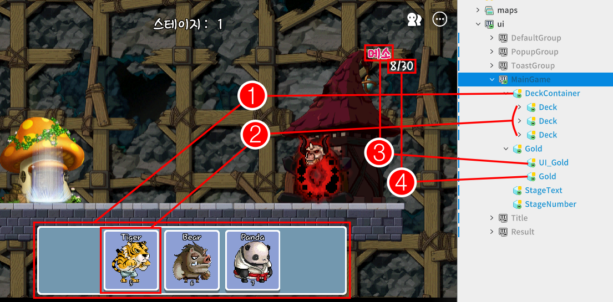
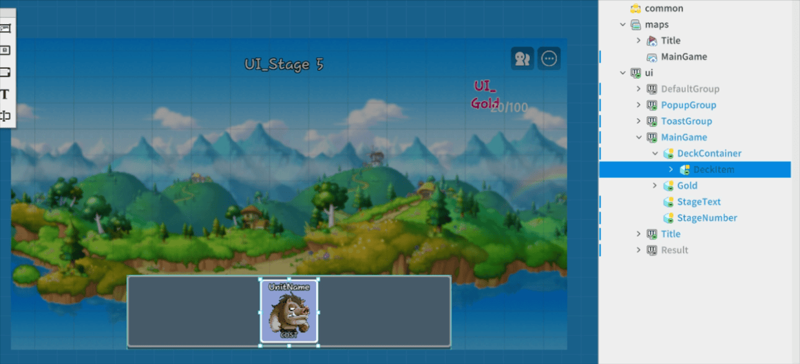
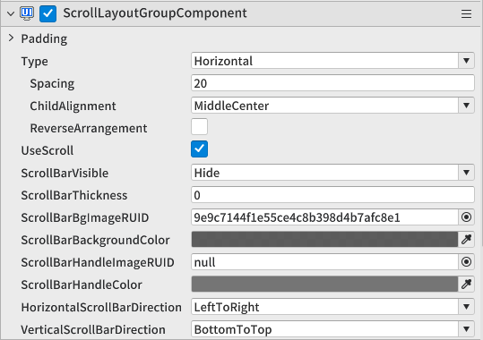
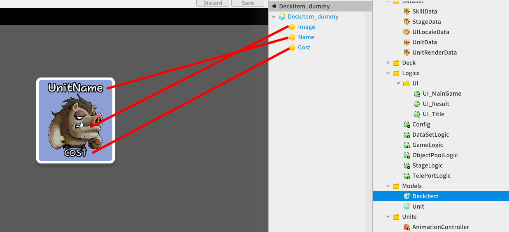
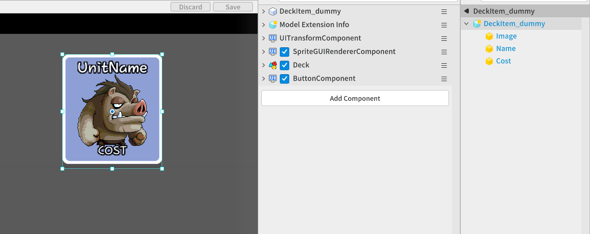
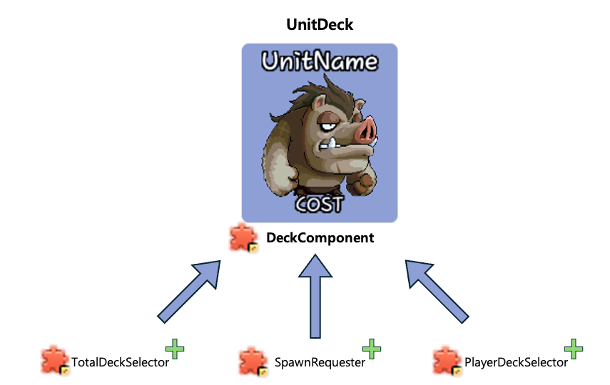

# [📖進階學習]製作資源系統
<br>
<br>
<br>

## 影片時間軸
- 可在課程影片中以下時間點學習。
- 製作資源系統：02:18:15

<br>

## 學習目標
- 學習依時間流逝週期性生產資源的方法。
- 學習玩家或敵方(人工智慧)運用資源生產英雄的方法。
- 理解實際敵方(人工智慧)運用資源生產英雄的過程。
- 可以直接製作英雄Deck，製作讓玩家生產英雄的功能。
- 學習ScrollLayoutComponent的使用方法，學習配置UI的方法。

<br>

## 觀看該影片後可嘗試執行的內容
- 撰寫BaseComponent的AutoGetGold函式，並直接測試是否隨時間經過，玩家與敵方資源會依設定數值正常上升。
- 在UI編輯器中生成DeckContainer並新增ScrollLayoutComponent，確認多個Deck元素是否不重疊，並自動整齊排列成橫向或縱向。

<br>

## 自動生成資源
<p align="Center">


- 進入**MainGame**後，玩家與敵方(AI)基地每秒都會自動生產資源，以便生成執行戰鬥的英雄。
- 依**StageData**DataSet中記錄的各關卡每秒生成量，自動生產資源。
- 使用BaseComponent中宣告的**isUser**變數值，使用所需資源生產量的資料值。

```lua
BaseComponent的AutoGetGold函式動作過程

Property:
-- 這是用來判斷該基地是否屬於使用者(玩家)的狀態變數。
[None]
boolean isUser
-- 用來儲存每秒資源生產量值的變數。
[None]
integer goldPerSecond
-- 為了每隔固定時間生產資源而測量的計時器。
[None]
number goldTimer
-- 用於記錄累積於各基地的黃金量的變數。
[None]
integer gold

Method:
[clientOnly]
void OnUpdate(number delta)
{
    -- 每一格呼叫AutoGetGold函式。
    self:AutoGetGold(number delta)
}

[clientOnly]
void Init()
{
    -- 透過關卡開始時呼叫的Init函式，如下設定符合關卡的資源生產量。

    self.goldTimer = 0
    self.gold = 0

    if isUser == true then
        self.goldPerSecond = _DataSetLogic.stageData[_StageLogic.currentStage].PlayerGoldPerSecond
    else
        self.goldPerSecond = _DataSetLogic.stageData[_StageLogic.currentStage].EnemyGoldPerSecond
    end
}

[clientOnly]
void AutoGetGold(number delta)
{
    -- 增加用於測量1秒單位的計時器值。
    self.goldTimer += delta

    -- 記錄目前關卡可擁有的最大資源量值。
    -- 透過---@ type設定該資料型態為整數。
    ---@ type integer
    local maxGold = _DataSetLogic.stageData[_StageLogic.currentStage].MaxGold

    -- 若狀態為1秒以上
    if self.goldTimer >= 1 and self.gold < maxGold then
        -- 將計時器重新初始化為0。
        self.goldTimer = 0
        -- 將設定的每秒Gold值追加到目前Gold值。
        self.gold += self.goldPerSecond
        self.gold = math.clamp(self.gold,0,maxGold)
    end
}
```

<br>

## 生成英雄牌組
<p align="Center">


- 遊玩遊戲的使用者在可生產英雄的資源充分累積時，必須提供UI環境，使其可以生產會執行實際戰鬥的英雄。
- 必須確認目前資源是否多於想生產英雄的生產費用。
- 生成英雄時，必須依英雄的生產費用扣除目前資源量。

<br>

### 製作英雄生產互動UI
<p align="Center">


- **MainGame**地圖中顯示的資源資訊、英雄生產資訊UI實體與用途如下。

1.DeckContainer：執行排列英雄Deck的布局角色。
2.Deck：標示要生產英雄的資訊，並與實際使用者互動的UI實體。
3.UI_Gold：標示資源文字，並向使用者傳遞資訊的文字實體。
4.Gold：用於表示玩家BaseComponent中累積之實際**Gold**值的文字實體。

<br>

### 運用ScrollLayoutComponent
<p align="Center">


- 製作**DeckContainer**布局實體時，這是用於自動排列內部元素的元件。
- 可設定Horizontal或Vertical選項，設定排列基準，即使超出布局範圍，也能透過拖曳調整檢視區域。
- 自動排列功能在世界執行的即時環境中也會相同運作。

<br>

### ScrollLayoutComponent設定
<p align="Center">


- Padding：設定新增內部元素時距離布局的邊距空間值。
- Type：設定排列方式。
- Spacing：設定內部元素之間的邊距範圍。
- ChildAlignment：設定排列開始地點。
- ScrollBarVisible：設定是否顯示調整布局檢視的捲動條。
- ScrollBarThickness：設定捲動條厚度。

<br>

### 製作DeckLoader元件
- 進入MainGame地圖時，這是根據目前使用者設定的牌組資料，初始化為內部Deck元素資訊的元件。
- DeckLoader元件會登錄於**DeckContainer**並運用。
- DeckLoader元件的程式碼會如下撰寫。
- 該程式碼是在Plain Text環境下撰寫。

```lua
@Component
script DeckLoader extends Component

property string deckItemEntryID = "model://7ed4ff59-e40b-4ff9-a9bf-d22a306afb70" -- 用於生產英雄的UIDeck Model EntryID值。

@ExecSpace("ClientOnly")
method void Init()
-- 初始化管理多個Deck的DeckLoader函式。

-- 取得登錄於GameLogic的使用者牌組資訊表格。
---@type table
local userDecks = _GameLogic.userDeck
-- 確認既有已登錄的Deck數量。
-- 這是因為第一次進入遊戲時牌組尚未組成，需生成牌組UI實體。
local currentDeckCount = #self.Entity.Children
-- 確認目前需要的牌組生產數量。
local needDeckCount = #userDecks - currentDeckCount
-- 依所需數量生產Deck。
self:RegistDeckItem(needDeckCount)

-- 依序存取子實體(Deck)並初始化各牌組。
for index, child in pairs(self.Entity.Children) do
	local deck = child.Deck
	-- 各牌組會設定為GameLogic中登錄的牌組表格內登錄的英雄名稱。
	deck:Init(userDecks[index])
	-- 因為是MainGame內使用的牌組，所以會附加具有可向基地請求生成牌組資訊中登錄英雄功能的「SpawnRequester」元件。
	deck.Entity:AddComponent("SpawnRequester")
end
end

@ExecSpace("ClientOnly")
method void RegistDeckItem(integer count)
-- 登錄請求數量的牌組的函式。

-- 參數1 count：想生產的牌組數量。

-- 只有在所需數量大於0時才進行生產。
if count > 0 then

	for i = 1, count, 1 do
		_SpawnService:SpawnByModelId(self.deckItemEntryID,"Deck",Vector3.zero,self.Entity)
	end
	
end
end

end
```

<br>

### 製作Deck UI Model
<p align="Center">


- 需要透過牌組UI向使用者傳遞該牌組可生產哪個英雄的資訊。
- Image：使用SpriteGUIComponent顯示英雄外型圖片。
- Name：使用TextComponent標示英雄名稱。
- Cost：使用TextComponent標示英雄生產費用。

<br>
<br>

<p align="Center">


- 牌組UI本身登錄的元件如下。
- SpriteGUIComponent：用於標示牌組UI布局的元件。
- Deck：用於登錄英雄作為UI應顯示資訊的元件。
- ButtonComponent：用於透過按鈕輸入與使用者互動的元件。
- Deck元件的程式碼會如下撰寫。
- 該程式碼是在Plain Text環境下撰寫。

```lua
@Component
script Deck extends Component

property string deckUnitName = "" -- 記錄登錄於單一Deck的英雄名稱。

@ExecSpace("ClientOnly")
method void Init(string unitName)
-- 初始化Deck的函式。

-- 參數1：接收應放入牌組的英雄名稱。

-- 將英雄名稱記錄為內部成員。
self.deckUnitName = unitName

-- 從DataSetLogic完整取得該英雄所有資訊的表格。
---@type table
local unitData = _DataSetLogic.unitData[unitName]
-- 記錄決定英雄外型的RenderID值。
local unitRenderID = unitData["RenderID"]
-- 記錄目標英雄IDLE狀態的動畫RUID值。
local unitIDLE_RUID = _DataSetLogic.unitRenderData[unitRenderID].IDLE
-- 記錄目標英雄的生產費用。
local unitCost = unitData["Cost"]

-- 從子實體取得登錄英雄外型的SpriteGUIRenderer元件。
local imageRenderer = self.Entity:GetChildByName("Image").SpriteGUIRendererComponent
-- 從子實體取得登錄英雄名稱的Text元件。
local nameText = self.Entity:GetChildByName("Name").TextComponent
-- 從子實體取得登錄英雄生產費用的Text元件。
local costText = self.Entity:GetChildByName("Cost").TextComponent

-- 將SpriteGUIRenderer元件的RUID值設定為英雄的IDEL資源值。
imageRenderer.ImageRUID = unitIDLE_RUID
-- 將輸入名稱的Text元件text設定為英雄名稱。
nameText.Text = unitName
-- 將輸入生產費用的Text元件text設定為生產費用值。
costText.Text = unitCost

-- 為了讓SpriteGUIRenderer元件只輸出英雄靜態形態，
-- 將格播放速度設定為0。
imageRenderer.PlayRate = 0
end

end
```

<br>

## 使用資源生成英雄
- 英雄生成條件為目前累積資源值大於想生成英雄的費用時即可生成。
- 玩家若要生產配置於場地上的英雄，可透過登錄於牌組UI的ButtonComponent實際生產英雄。
- 敵方(AI)每秒累積資源，若累積到想生產英雄的生產費用，會自動生產英雄。

<br>

### 運用資源的敵方基地英雄生產
- 敵方基地每秒也會累積資源，若超過設定英雄的生產費用，則會生成目標英雄並消耗自身資源。
- 英雄自動生產功能請確認前一單元「4.製作英雄生成系統」單元的參考資料。
- 透過資源自動生產敵方的功能會如下運作。

```lua
BaseComponent的AutoGetGold

Method:
void AutoGetGold(number delta)
{
    -- 增加用於測量1秒單位的計時器值。
    self.goldTimer += delta

    -- 記錄目前關卡可擁有的最大資源量值。
    -- 透過---@ type設定該資料型態為整數。
    ---@ type integer
    local maxGold = _DataSetLogic.stageData[_StageLogic.currentStage].MaxGold

    -- 若狀態為1秒以上
    if self.goldTimer >= 1 and self.gold < maxGold then
        -- 將計時器重新初始化為0。
        self.goldTimer = 0
        -- 將設定的每秒Gold值追加到目前Gold值。
        self.gold += self.goldPerSecond
        self.gold = math.clamp(self.gold,0,maxGold)
        
            -- 若該Base是敵方基地
            if self.isUser == false then
                -- 執行自動英雄生成函式。
                self:EnemyAutoSpawn()
            -- 若該Base是使用者基地
        elseif self.isUser == true then
                -- 更新表示資源資訊的UI文字值。
                _UI_MainGame:UpdateGoldText(self.gold)
            end
    end
}
```

<br>

### 製作玩家英雄生產功能
- 玩家英雄生產方式會在Deck UI實體的ButtonComponent發生**ClickEvent**時執行。
- 透過MainGame地圖中運用的DeckContainer實體的DeckLoader元件生成Deck UI實體時，會即時登錄向BaseComponent請求英雄生產的**SpawnRequester**元件。

<br>

### Deck的各種動作製作方式
<p align="Center">


- 防禦範例世界會運用即時登錄使用者可見Deck UI元素所需元件的方式。
- Deck元件會依登錄英雄名稱，在Deck UI內部標示英雄名稱、外型、費用資訊。
- Deck UI實體上新增TotalDeckSelector元件時，會追加執行牌組編成所需功能。
- Deck UI實體上新增SpawnRequester元件時，會在**MainGame**地圖中向使用者BaseComponent請求生產Deck中記錄的英雄。
- Deck UI實體上新增PlayerDeckSelector元件時，會追加執行牌組編成時替換使用者實際戰鬥使用牌組的功能。

<br>

### 請求生成英雄
- 製作SpawnRequester元件中偵測按鈕點擊時呼叫的**HandleButtonClickEvent**函式。
- 確認Deck元件中記錄的英雄名稱，並尋找玩家BaseComponent請求生成英雄。

```lua
SpawnRequester

Event Handler:
[self]
HandleButtonClickEvent(ButtonClickEvent event)
{
    -- 記錄目前Deck元件中記錄的名稱。
    local unitName = self.Entity.Deck.deckUnitName

    -- 記錄玩家baseComponent。
    local playerBaseComponent = _EntityService:GetEntityByPath("/maps/MainGame/MyBase").BaseComponent
    -- 點擊Deck按鈕時，請求生產登錄為內部成員的英雄。
    playerBaseComponent:PlayerRequestSpawn(unitName)
}

```

<br>

## 最低製作標準
- 使用者必須能透過牌組UI，從玩家基地生成執行戰鬥的英雄。
- 必須能運用資源，從敵方基地自動生成英雄。

<br>

## 應用與進階應用
- 可以追加「基地升級」按鈕，當玩家支付一定量資源時，永久提升每秒資源生產量或最大持有量，提高遊戲策略性。
- 資源不足時可將牌組UI圖片處理為變暗，或限制按鈕輸入，讓玩家直覺知道無法生產狀態。
- 敵軍AI會在費用一累積就生產英雄，但可以擴展條件式，製作在特定時間前累積資源後，一次生成多個英雄的「波數」形式模式。


