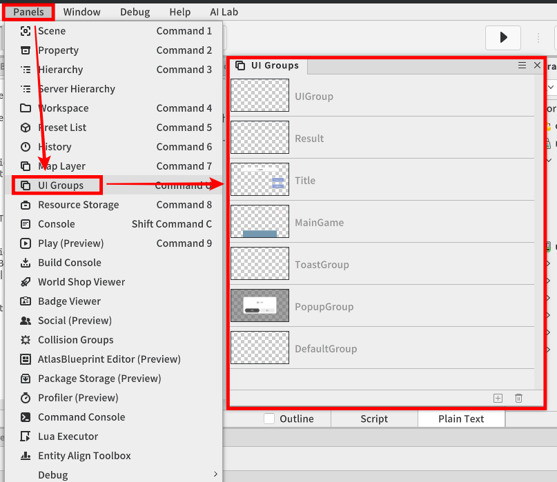
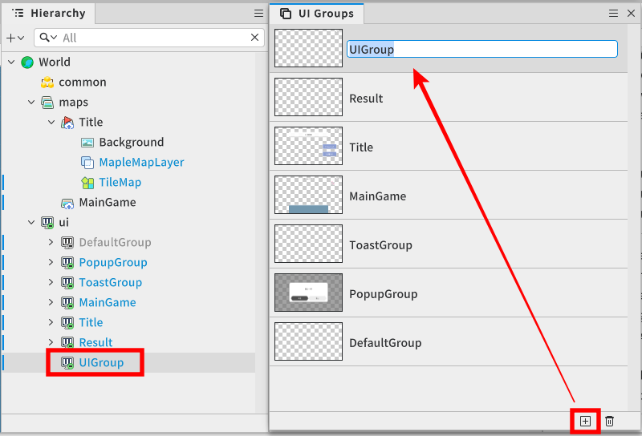
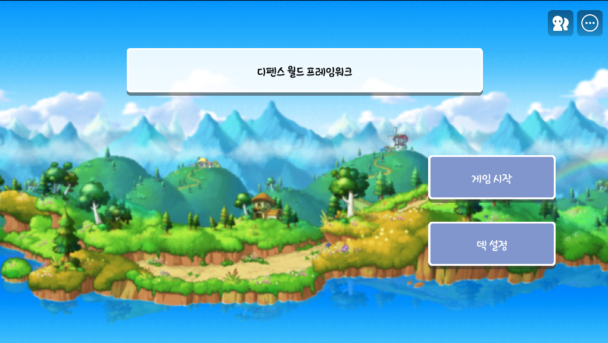
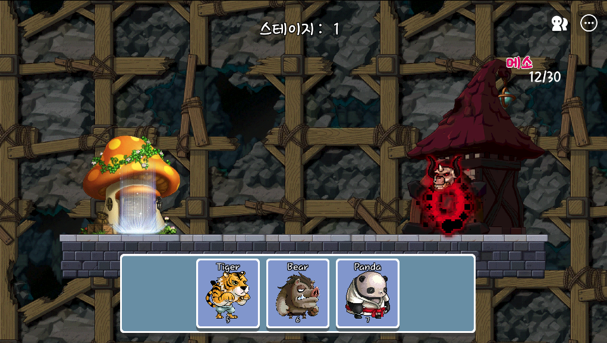
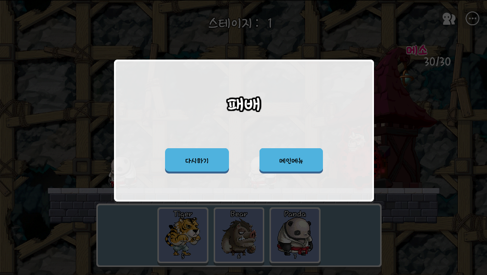

# [💡基礎學習]建立UI
<br>
<br>
<br>

## 影片時間軸
- 可在課程影片中以下時間點學習。
- 建立UI：03:31:23

<br>

## 學習目標
- 學習依各種情況(Title，MainGame，Result)將需要的UI顯示於畫面上的方法。
- 學習透過Entity的ConnectEvent簡便連動功能的方法。
- 學習控制即時更改的UI，並可製作用於在防禦世界中顯示玩家資源資訊的UI。

<br>

## 觀看該影片後可嘗試執行的內容
- 打開UI編輯器的「UI Groups」面板，直接生成「Title」、「MainGame」、「Result」共三個新的UI Group。
- 直接測試按下「UI_Title」Logic的「遊戲開始」按鈕時，是否會透過「TelePortLogic」正常切換到MainGame地圖，以及「ConnectEvent」是否正常運作。

<br>

## UI Group
<p align="Center">


- UI Group會將多個UI實體(按鈕、文字、圖片等)整合成一體管理，執行**一種類似資料夾兼容器的角色**。
- 可用群組單位控制群組內所有UI實體的畫面顯示與否，比起逐一關閉個別UI，能將整個UI群組停用處理，這就是其優點。
- 可透過編輯器上方Panels - UI Groups啟用UI Groups彈出視窗。

<br>
<br>

<p align="Center">


- 可透過「UI Groups」彈出視窗下方的「+」按鈕生成新的UI Group。
- 防禦範例世界中運用的UI Group會控制「Title」、「MainGame」、「Result」共3個群組。

<br>

## 製作UI Logic
- 製作各UI Group別Logic腳本，使其作為控制塔，在適當時機啟用/停用符合各遊戲情況(標題、主遊戲、結果畫面)的UI群組，並即時更新UI內部資料(資源、波數資訊、結果等)。

<br>

### UI Title Logic
<p align="Center">


- 這是用來管理「Title」畫面所需UI的Logic。
- 「UI_Title」Logic的腳本如下。 
- 該程式碼是在Plain Text環境下撰寫。

```lua
@Logic
script UI_Title extends Logic

property Entity titleUIEntity = "275fd157-6ae2-4e34-a285-a5641234ff9c"

property Entity gameStartButton = "e753b827-d9d8-4ef1-bf34-34b98d4d8de5"

property Entity editDeckButton = "884bfac2-2231-4d35-a7c5-c0717a73ddb8"

property Entity editDeckPopup = "b887294b-9d5c-44fd-9c14-f830cbd749c3"

@ExecSpace("ClientOnly")
method void OnBeginPlay()
-- 世界執行時呼叫的函式。

-- 連接事件，使標題畫面中點擊「遊戲開始」按鈕時呼叫EnterMainGame函式。
self.gameStartButton:ConnectEvent(ButtonClickEvent,self.EnterMainGame)
self.editDeckButton:ConnectEvent(ButtonClickEvent,self.ShowEditDeckPopup)
end

@ExecSpace("Server")
method void EnterMainGame()
-- 這是切換至MainGame地圖的函式。

-- 請求TelePortLogic切換至「MainGame」。
_TelePortLogic:TelePort("MainGame")
end

@ExecSpace("ClientOnly")
method void Show(boolean active)
-- 顯示標題狀態下應顯示UI Group的函式。

-- 參數1 active：決定彈出視窗是否啟用。

-- 將titleUIEntity群組的啟用與否原樣更新為active狀態。
self.titleUIEntity.Enable = active
end

@ExecSpace("ClientOnly")
method void ShowEditDeckPopup()
self.editDeckPopup.Enable = true
self.editDeckPopup.DeckEditor:InitUserDeck()
end

end
```

### UI MainGame Logic
<p align="Center">


- 這是用來管理「Title」畫面所需UI的Logic。
- 「UI_MainGame」Logic的腳本如下。 
- 該程式碼是在Plain Text環境下撰寫。

```lua
@Logic
script UI_MainGame extends Logic

property DeckLoader deckLoader = "00df9b64-aa74-4d67-818e-852aae7160a6"

property TextComponent goldText = "3af7e818-674a-4c83-b39e-2431afc4db30"

property Entity mainGameUIEntity = "7c66c8c8-90de-423e-8add-8a5af46b08cb"

property TextComponent stageText = "ba8541f6-7acd-4fb5-b116-6b13cfa8e62d"

@ExecSpace("ClientOnly")
method void DeckInit()
-- 進入MainGame時，初始化牌組資訊。

-- 進行DeckLoader元件初始化。
self.deckLoader:Init()
end

@ExecSpace("ClientOnly")
method void UpdateGoldText(integer gold)
-- 更新MainGame環境中顯示之資源資訊的函式。

-- 參數1 gold：將收到的參數(資源值)以持有狀態傳遞。

-- 記錄各關卡可擁有最大資源量值。
local maxGold = _DataSetLogic.stageData[_StageLogic.currentStage].MaxGold
-- 因為不需要小數點值，所以使用math.floor功能，只輸出整數部分。
gold = math.floor(gold)

-- 在TextUI登錄「目前黃金/最大黃金」值。
self.goldText.Text = gold.."/"..maxGold
end

@ExecSpace("ClientOnly")
method void Show(boolean active)
-- 決定MainGame UI Group的Enable狀態的函式。

-- 參數1 active：依該變數原樣決定enable。

-- 將MainGame UI Group實體設定為參數值。
self.mainGameUIEntity.Enable = active
end

@ExecSpace("ClientOnly")
method void UpdateStageNumberText()
self.stageText.Text = tostring(_StageLogic.currentStage)
end

end
```

<br>

### UI Result Logic
<p align="Center">


- 這是用來管理「Result」狀態畫面所需UI的Logic。
- 「UI_Result」Logic的腳本如下。 
- 該程式碼是在Plain Text環境下撰寫。

```lua
@Logic
script UI_Result extends Logic

property Entity resultUIEntity = "58f610ca-687c-402e-a236-9a0ecaba20f3"

property Entity clearTextEntity = "d2b4dfa2-3936-4535-9edb-536fde51e227"

property Entity defeatTextEntity = "e5b2c909-0029-4bb9-9923-139155b3e095"

property Entity clearButtons = "af66debb-69c0-4272-87f6-298c18b21a75"

property Entity defeatButtons = "1901f087-e074-430e-b549-5c07200b25ed"

property Entity nextStageButton = "d6ca8901-a8bf-43e0-917b-d42c05b0bb8b"

property Entity retryButton = "675afdd5-dd71-482c-9628-af3c04e24b08"

property Entity toTitleButton_win = "b148778c-64c9-4470-9612-bd7619199924"

property Entity toTitleButton_lose = "a06b5b49-7a0a-4a39-b5df-da62f56e80c8"

@ExecSpace("ClientOnly")
method void OnBeginPlay()
-- 世界執行時呼叫的函式。

-- 登錄事件，使點擊「下一關卡」按鈕時呼叫OpenNextStage函式。
self.nextStageButton:ConnectEvent(ButtonClickEvent,_StageLogic.OpenNextStage)
-- 登錄事件，使點擊「重新開始」按鈕時呼叫StageReset函式。
self.retryButton:ConnectEvent(ButtonClickEvent,_StageLogic.StageReset)

-- 登錄事件，使戰鬥勝利時出現的「返回主選單」按鈕被點擊時呼叫ToTitle函式。
self.toTitleButton_win:ConnectEvent(ButtonClickEvent,self.ToTitle)
-- 登錄事件，使戰鬥敗北時出現的「返回主選單」按鈕被點擊時呼叫ToTitle函式。
self.toTitleButton_lose:ConnectEvent(ButtonClickEvent,self.ToTitle)
end

@ExecSpace("ClientOnly")
method void ShowWithWinInfo(boolean isWin)
-- 遊戲結束時，會與玩家勝敗一同輸出結果視窗的函式。

-- 參數1 isWin：接收玩家的勝、敗值。

-- 啟用結果視窗彈出視窗的UI Group。
self.resultUIEntity.Enable = true

-- 將clearTextEntity的啟用狀態原樣更新為isWin狀態值。
self.clearTextEntity.Enable = isWin
-- 將clearButtons的啟用狀態原樣更新為isWin狀態值。
self.clearButtons.Enable = isWin

-- 將defeatTextEntity的啟用狀態更新為isWin相反值。
self.defeatTextEntity.Enable = not isWin
-- 將defeatButtons的啟用狀態更新為isWin相反值。
self.defeatButtons.Enable = not isWin
end

@ExecSpace("ClientOnly")
method void Hide()
-- 結果視窗彈出視窗停用的函式。

-- 停用結果視窗彈出視窗的UI Group。
self.resultUIEntity.Enable = false
end

@ExecSpace("Server")
method void ToTitle()
-- 返回標題地圖的函式。

-- 請求TeleportLogic切換至「Title」地圖。
_TelePortLogic:TelePort("Title")
end

end
```

<br>

## 最低製作標準
- 各UI(Title，MainGame，Result)所屬畫面元素必須依群組Enable狀態一次開啟或關閉。
- 進入MainGame畫面時，必須讀取玩家牌組資訊，並在畫面下方正常輸出牌組UI。
- 遊戲結束時，必須依條件(基地破壞)呼叫「UI_Reuslt」的ShowWithInfo函式，並依參數「isWin」值(true/false)輸出符合情況的「勝利」文字、「敗北」文字及相關按鈕。

<br>

## 應用與進階應用
- 除了單純文字標示外，也可以計算目前擊殺敵人數量相對於全體敵人數量，運用sliderComponent，以視覺化進度條形式在UI表現剩餘波數進度。
- Result畫面開啟時，不只是顯示文字，也可以運用Tween等追加簡單UI動畫演出，提升遊戲完成度。


