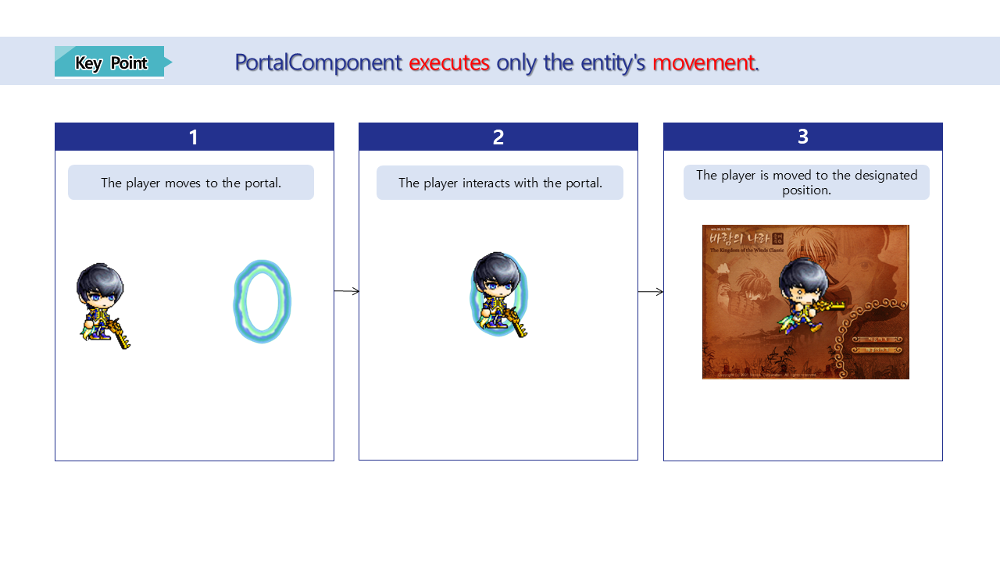
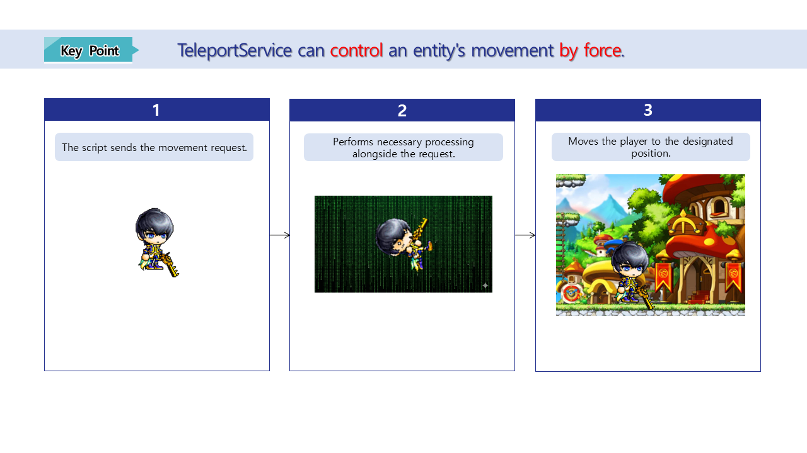

# [💡 Basic Training] Implementing Map Transitions
 
 
 

## Video Timeline
- You can follow along by using the timeline under the training video.
- Implementing Map Transitions: `00:02:17`
 

## Learning Goals
- Learn about MapleStory Worlds's Component and PortalComponent.
- Learn about the map transition method using TeleportService.
- Learn about the differences between PortalComponent and TeleportService.

 

## Practical Exercises to Do After Watching the Video

- Directly select the map transition method to select the mini game in the mini game world.
- Compose and apply a function using the selected method.
- Learn about the additional functions as needed and use them to create a process needed or map transitions.

 

---

## Implementing Move Transitions

- The need to transition between maps occurs quite often when running a game.
- Map transitions occur via a variety of methods, such as moving from a safe space to a combat space, moving between maps, etc.
- MapleStory Worlds provides various functions that move players or entities to another map.

 

### Learning About PortalComponent

> The form of the PortalComponent's Property for MapleStory Worlds.

<table class="tg"><thead>
  <tr>
    <th class="tg-9wq8">Number</th>
    <th class="tg-9wq8">Name</th>
    <th class="tg-9wq8">Description</th>
  </tr></thead>
<tbody>
  <tr>
    <td class="tg-9wq8">1</td>
    <td class="tg-lboi">Collider</td>
    <td class="tg-lboi">The Property needed to edit the portal's detection range for players.</td>
  </tr>
  <tr>
    <td class="tg-9wq8">2</td>
    <td class="tg-lboi">BoxSize</td>
    <td class="tg-lboi">The value needed to define the TriggerBox size that identifies the player.</td>
  </tr>
  <tr>
    <td class="tg-9wq8">3</td>
    <td class="tg-lboi">BoxOffset</td>
    <td class="tg-lboi">The value needed to define the center of the TriggerBox based on the center of the entity.</td>
  </tr>
  <tr>
    <td class="tg-nrix">4</td>
    <td class="tg-cly1">PortalEntityRef</td>
    <td class="tg-cly1">The value needed to define which entity's position the player will be sent to when they interact with a portal.</td>
  </tr>
</tbody>
</table>

- PortalComponent makes it possible for the player to move to another map via direct interaction.
- It relies heavily on the player's manual input, but it is easy to implement and the function can be formed very easily.

- Use the `Preset List` Model to use the portal.
- Models provided by `Preset List` all contain PortalComponent as default.
- Create a portal by selecting a Model, placing it in a `Scene`, and then registering the entity that's located in the desired position to the **PortalEntityRef** under **PortalComponent**.

 

#### ☑️ The Pros and Cons of PortalComponent
- Pros
    - Low implementation difficulty.
    - You can show the player that they can move to a different location by simply having the portal entity visible.
    - It's a direct method, since the player can move to the position of the designated entity and the location of the player is easily predictable.
- Cons
    - It's not as compulsive since the player has to interact with them directly.
    - It becomes hard to control if there is a function that must execute value processing when moving to another map.

 

### Learning About TeleportService

> View the information regarding TeleportService from MapleStory Worlds's API Reference.

- TeleportService is the method that controls entity movements via Script.
- Entity movement can be controlled in 3 main ways.
    - **TeleportToEntity**: Moves to the position of the designated entity based on the map's entity.
    - **TeleportToEntityPath**: Moves the designated entity based on the map's entity path to the position of the map entity.
    - **TeleportToMapPosition**: Changes the position of the designated entity based on the name and position (Vector3) of the map that's being moved to.

 

#### ☑️ The Pros and Cons of TeleportService
- Pros
    - You can control the player's movement timing.
    - The required processes can be performed before the movement of the entity, since it's controlled via Script.
    - You can implement movement between maps via a variety of methods, such as reaching a specific point, using an item, or making a specific input.
- Cons
    - It has a comparatively high implementation difficulty compared to PortalComponent, since you have to write the Script yourself.
    - Abnormal actions may occur if the processing order is written incorrectly in the Script.
    - If the movement doesn't happen in a fair situation, the player might find the experience unfair.

 

#### ⚠️ Notes on Using TeleportService

- TeleportService is an API that only works with ServerOnly.
- So when the position that calls TeleportService is Client Only, the API can't be executed.
- You need to make sure that the environment that calls TeleportService is Server.

 

### Where to Use PortalComponent vs Where to Use TeleportService

- PortalComponent
    - Often used when moving between maps.
    - Often used when there is no special processing needed when moving between maps.
    - Used when moving to another location inside a single map or when moving to a specified position in another map.

 

- TeleportService
    - Used when implementing a change of location based on item use.
    - Often used when special processing is needed alongside moving maps (such as resetting values).

 

---

## Minimum Implementation Standards
- The function must be implemented so that the player can traverse the map.
- Implement a map movement function using PortalComponent or TeleportService.

 

## Usage and Extension Direction
- Implement the function so that player information is updated based on the character's movements.
- Add various effects such as changing BGMs when the player moves between maps.