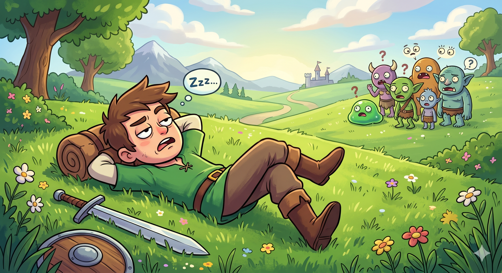
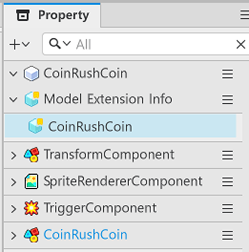
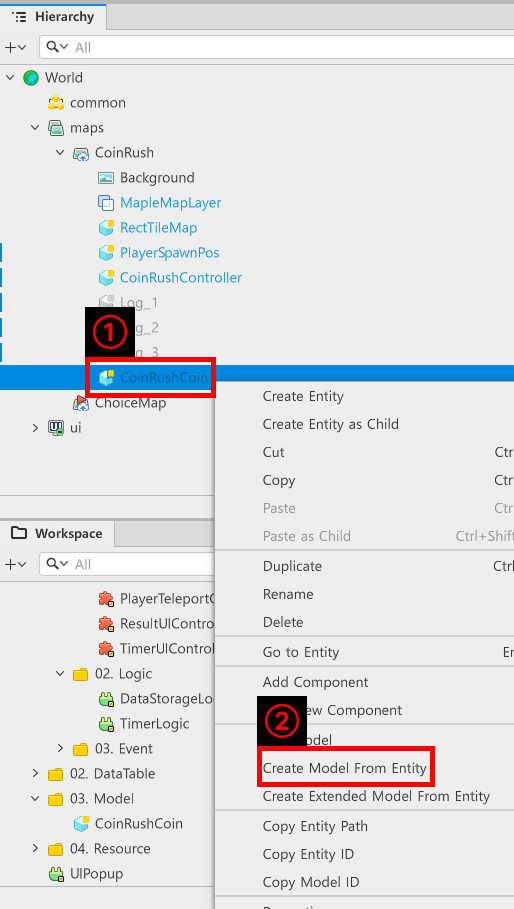
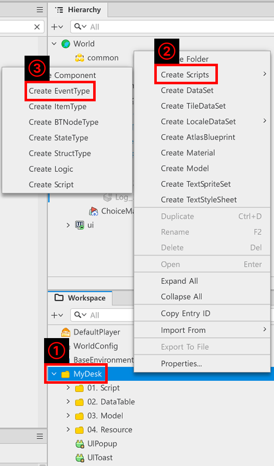
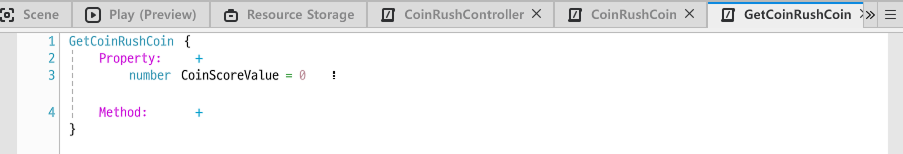
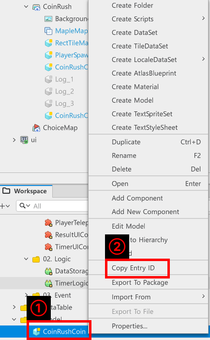
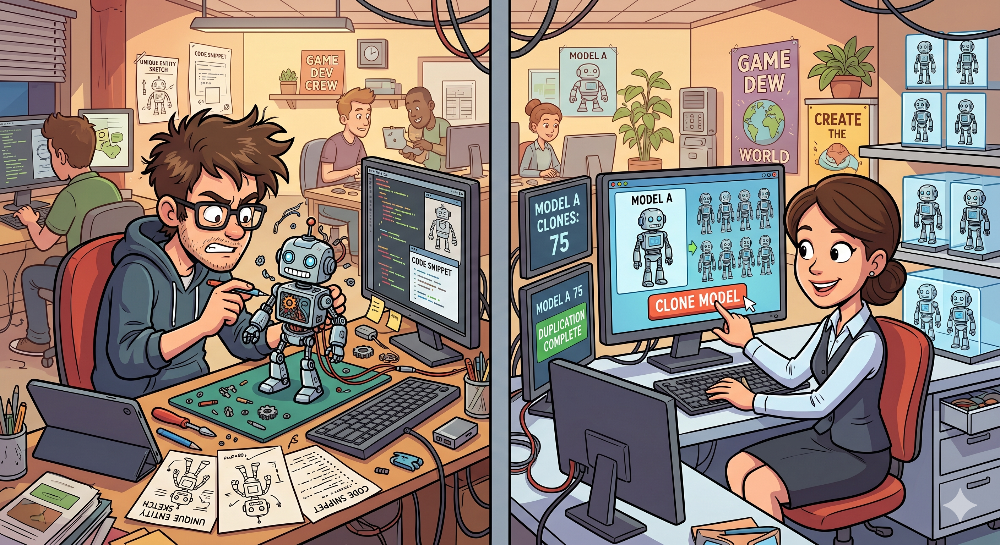

# [💡 Basic Training] Creating Score Items
<br>
<br>
<br>

## Video Timeline
- You can follow along by using the timeline under the training video.
- Creating Score Items: `00:58:13`

<br>

## Learning Goals
- Learn how to create score items that make the player take risks.
- Learn about the collision settings via TriggerComponent.
- Learn how to create the generated entities as models.
- Implement a function that spawns score items at regular intervals.
<br>

## Practical Exercises to Do After Watching the Video
- Create a function that calculates the player's score when they obtain an item.
- Compose a function that spawns scoring items randomly or in a specific manner.

---

## Implementing Scoring Items
<p align="center">

</p>

- The player will never take risks unless they have something to gain or have a personal goal.
- The lack of any such player motive will quickly cause the player to lose all interest in the world.
- As such, the sample world provides items that will encourage the player to take on challenging obstacles to earn higher scores.

<br>

### Composition of Scoring Item Entities

<p align="center">

</p>

- Scoring item entities have the following Components.
    - **TransformComponent**: The Component that determines the entity's position.
    - **SpriteRendererComponent**: The Component that displays the scoring item's image.
    - **TriggerComponent**: A function that detects the collision between the player and scoring item.
    - **CoinRushCoin**: The Component that determines the score or position of a scoring item.
- Change the SpriteRendererComponent's SpriteRUID value to register the scoring item's image.
- Adjust the TriggerComponent value to make the collision area fit the size of the registered image.
    - Change CollisionGroup to Coin.
    - Check IsPassive to reduce the collision calculations.
- Write the following CoinRushCoin code.

```lua
@Component
script CoinRushCoin extends Component

property number coinValue = 10

@ExecSpace("ClientOnly")
method void DisableCoin()
-- Executes a function that deactivates the coin when it collides with something.
self.Entity.Enable = false
end

@ExecSpace("ClientOnly")
method number GetCoinValue()
-- Returns coinValue.
self:DisableCoin()
return self.coinValue
end

@ExecSpace("ClientOnly")
method void SetCoinPosition(Vector3 SetPosition)
-- Converts the coin's position to the position received.
self.Entity.TransformComponent.WorldPosition = SetPosition
-- Activates the coin's state.
self.Entity.Enable = true
end

end
```

> This code is written based on Plain Text.

### Creating a Model
- Created entities can be created as models for repeated use.
- Designating one as a Model allows that entity to be copied without the need to create multiple entities with the same structure and format each time.

<p align="center">

</p>

- Right-click the entity that you want to designate as a Model and then click `Create Model from Entity` to designate it as a Model.

<br>

### Registering an Event

- An Event is a function that sends out a notice about what happened to a specific subject.
- If an event is activated while subscribed to the target subject, the Event Handler that was facing the target entity will receive it and execute the function.
- You can create any Event you want in MapleStory Worlds.

<p align="center">

</p>

- Right-click `MyDesk` from `Hierarchy`.
- Click `Create Scripts` and then `Create EventType`.
- Declare the created Event's name as GetCoinRushCoin.

<br>

#### Function of an Event
<p align="center">

</p>

- The name of a created Event itself fulfills the role of a Key.
- The Event's name is used to determine what kind of event it is when one is triggered.
    - For the GetCoinRushCoin Event created, GetCoinRushCoin fulfills the role of a Key.
- Register a Property and Method in the created Event, so it can serve the role of performing necessary functions and delivering necessary registered values.
- The sample world uses a value called CoinScoreValue to deliver the score of an obtained scoring item.

<br>

### Writing CoinRushCoin Code

- Modify the function to make the scoring item spawn upon receiving StartGame from CoinRushCoin.
- Edit the code as follows to ensure the scoring entity can be created.
- The following is the full code for CoinRushController.

```lua
@Component
script CoinRushController extends Component

property table coinModel = {}

property number coinSpawnDelay = 5

property string coinModelID = "model://1433b985-a5dc-496f-9b67-5c4ed6883bb2"

property number coinSpawnCount = 10

property number coinTimerID = 0

property number logCallTimer = 5.0

property number specialLogTime = 3

property number specialLogTimeCount = 0

property integer logTimerID = 0

property table logTable = {}

@ExecSpace("ClientOnly")
method void OnBeginPlay()
self:InitCoinModel()
self:InitLog()
end

@ExecSpace("ClientOnly")
method void InitCoinModel()
-- Determines whether the coinModel is empty.
if not isvalid(self.coinModel) or not next(self.coinModel) then
	-- Creates a new coin model if it is empty.
	for i=1, self.coinSpawnCount do
		-- Copies the Model through coinModelID.
		local spawnModel = _SpawnService:SpawnByModelId(self.coinModelID, "Coin", Vector3.zero, self.Entity)
		-- Deactivates the created Model.
		spawnModel.CoinRushCoin:DisableCoin()
		-- Adds Model to coinModel.
		self.coinModel[i] = spawnModel
	end
end
end

@ExecSpace("ClientOnly")
method void InitLog()
-- Executes the loop a number of times equal to the number of wooden logs.
for i = 1, 3 do
	-- Calls the path in accordance to each wooden log's name.
	local entityName = "/maps/CoinRush/Log_"..i
	-- Searches for the wooden log entity based on the path.
	local findEntity = _EntityService:GetEntityByPath(entityName)
	if isvalid(findEntity) then
		self.logTable[i] = findEntity
	end
end
end

@ExecSpace("ClientOnly")
method void CheckLeftCoin()
-- Registers the value as being in a state that needs coin reproduction in advance.
local needRespawn = true
-- Determines whether there are any remaining usable coins.
for i = 1, #self.coinModel do
	-- @type Entity
	if self.coinModel[i].Enable then
		needRespawn = false
		break
	end
end
-- Reserves reproduction if needRespawn is true.
if needRespawn then
	self.coinTimerID = _TimerService:SetTimerOnce(function()
	self:ReservationCoinSpawn()	
	end, self.coinSpawnDelay)
end
end

@ExecSpace("ClientOnly")
method void SpawnCoin(number coinNumber)
-- Loads a random X position value that fits in the map's range.
local randPosX = _UtilLogic:RandomIntegerRange(-200, 200)
-- Uses the quotient that divided 100 to fix the actual coordinates.
randPosX = randPosX / 100
-- Loads a random Y position value that fits in the map's range.
local randPosY = _UtilLogic:RandomIntegerRange(-150, 250)
-- Uses the quotient that divided 100 to fix the actual coordinates.
randPosY = randPosY / 100
-- Sets the created coordinate to Vector3.
local SetVector3 = Vector3(randPosX, randPosY, 0)
-- Sets the coin's position to the created coordinates.
self.coinModel[coinNumber].CoinRushCoin:SetCoinPosition(SetVector3)
end

@ExecSpace("ClientOnly")
method void ReservationCoinSpawn()
for i = 1, #self.coinModel do
	self:SpawnCoin(i)
end
end

@ExecSpace("ClientOnly")
method void StartLogLogic()
-- Attempts a reset if logTimerID isn't 0.
if self.logTimerID ~= 0 then
	_TimerService:ClearTimer(self.logTimerID)
	self.logTimerID = 0
end
-- Uses TimerService, so a wooden log can spawn.
self.logTimerID = _TimerService:SetTimerRepeat(function()
	self:SpawnLog()
end, self.logCallTimer, self.logCallTimer)
end

@ExecSpace("ClientOnly")
method void SpawnLog()
if self.specialLogTimeCount >= self.specialLogTime then
	-- Sets 1 wooden log.
	local firstLogPos = _UtilLogic:RandomIntegerRange(1, 3)
	-- Draws 1 wooden log with a different number from the one that was drawn first.
	local secondLogPos = 0
	repeat
		secondLogPos = _UtilLogic:RandomIntegerRange(1, 3)
	until secondLogPos ~= firstLogPos
	-- Plays after activating the selected 2 wooden logs.
	self.logTable[firstLogPos].Enable = true
	self.logTable[secondLogPos].Enable = true
	self.logTable[firstLogPos].TweenLineComponent:Stop(true)
	self.logTable[firstLogPos].TweenLineComponent:Play()
	self.logTable[secondLogPos].TweenLineComponent:Stop(true)
	self.logTable[secondLogPos].TweenLineComponent:Play()
	-- Sets a Timer so that the wooden log automatically deactivates after a set time.
	_TimerService:SetTimerOnce(function()
		self.logTable[firstLogPos].TweenLineComponent:Stop(true)
		self.logTable[secondLogPos].TweenLineComponent:Stop(true)
		self.logTable[firstLogPos].Enable = false
		self.logTable[secondLogPos].Enable = false
	end, self.logTable[firstLogPos].TweenLineComponent.Duration)
	self.specialLogTimeCount = 0
else
	-- Sets 1 wooden log.
	local firstLogPos = _UtilLogic:RandomIntegerRange(1, 3)
	-- Plays the selected wooden log.
	self.logTable[firstLogPos].Enable = true
	self.logTable[firstLogPos].TweenLineComponent:Stop(true)
	self.logTable[firstLogPos].TweenLineComponent:Play()
	-- Increases the special wooden log count by 1.
	self.specialLogTimeCount = self.specialLogTimeCount + 1
	-- Sets a Timer so that the wooden log automatically deactivates after a set time.
	_TimerService:SetTimerOnce(function()
		self.logTable[firstLogPos].TweenLineComponent:Stop(true)
		self.logTable[firstLogPos].Enable = false
	end, self.logTable[firstLogPos].TweenLineComponent.Duration)
end
end

@ExecSpace("ClientOnly")
method void StartGame()
self:StartLogLogic()
self:ReservationCoinSpawn()
end

@ExecSpace("ClientOnly")
method void FinishGame()
-- Deactivates all coin models.
for i = 1, #self.coinModel do
	self.coinModel[i].Enable = false
end
-- Deactivates all wooden log models.
for i = 1, #self.logTable do
	self.logTable[i].TweenLineComponent:Stop(true)
	self.logTable[i].Enable = false
end
-- Removes all reserved timer events.
_TimerService:ClearTimer(self.coinTimerID)
_TimerService:ClearTimer(self.logTimerID)
end

@EventSender("LocalPlayer")
handler HandleGetCoinRushCoin(GetCoinRushCoin event)
self:CheckLeftCoin()
end

end
```

> This code is written in Plain Text.

<p align="center">

</p>

- Right-click the Model of the created scoring item and click `Copy Entry ID`.
- Enter the value copied from coinModelID Property within the code to copy and use the created Model.

<br>

## Why Should You Use a Model

<p align="center">

</p>

- Using the script each time to create entities that are used repeatedly and assigning Components to each is intense work.
- Using a Model will make it easier and faster to use entities with the same format.
- You can also use them for any time or situation.
- If you need an entity with the same format in a single world, creating it as a Model in advance and then copying it as necessary will be more appropriate.

<br>

## Minimum Implementation Standards
- Compose a function that spawns scoring items when certain CoinRushController Methods are executed.
- Design a function that, once all of the scoring items on the map are obtained, will respawn those items after a specified amount of time.
<br>

## Usage and Extension Direction
- Design a function that makes some scoring items give more points than the others.
- Compose a function so that a mix of scoring items are displayed.