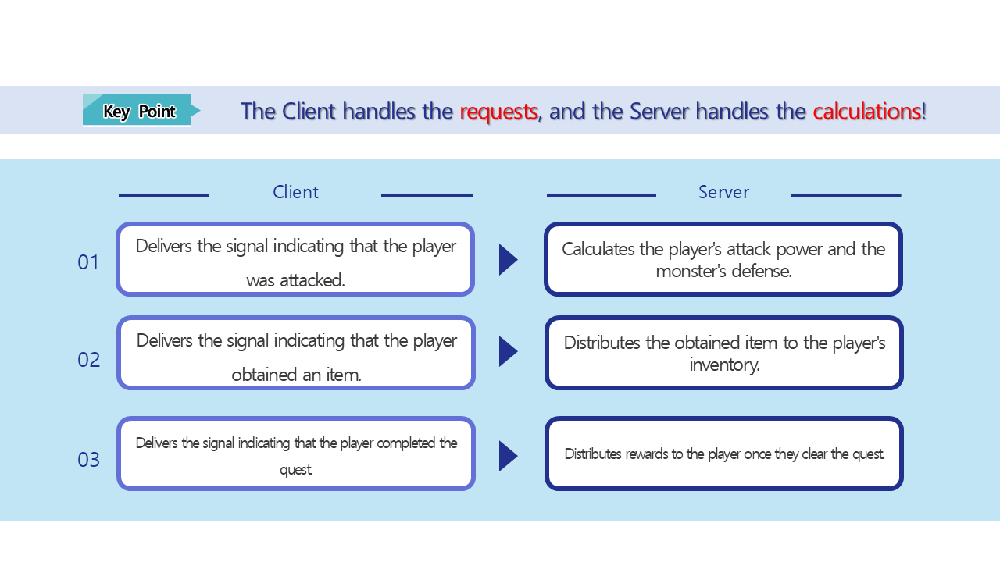
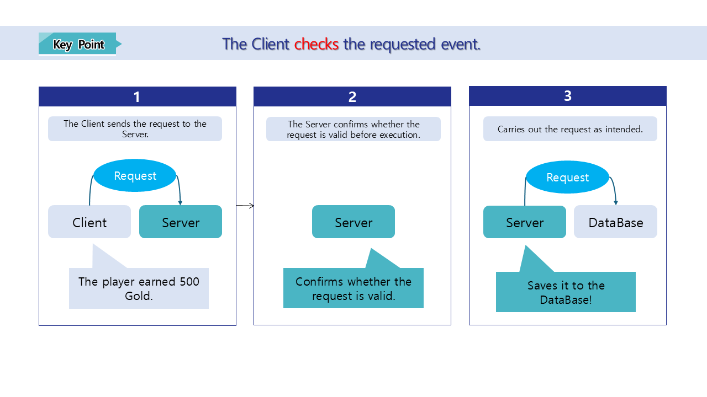

# [📖 Advanced Training] Learning About DataStorage

## Video Timeline
- You can follow along by using the timeline under the training video.
- Understanding Map Types: `01:25:10`

<br>

## Learning Goals
- Learn how to save the player's high score.
- Learn how to load the player's high score.
- Learn what you need to know when implementing the save and load function.

<br>

## Practical Exercises to Do After Watching the Video
- Implement a function that can save and load necessary information other than the player's best score.
- Create a function that displays the saved information in the UI.
---

## DataStorageService

<p align="center">

</p>

- The player will have moments when they want to save or load player information while making a world.
- DataStorageService is a function supported by MapleStory Worlds so that player information can be saved or loaded.
- In the sample world, DataStorageLogic saves or loads player information.
- The following is the DataStorageLogic code.

```lua
@Logic
script DataStorageLogic extends Logic

@Sync
property number serverBestScore = 0

property number clientBestScore = 0

@ExecSpace("ServerOnly")
method void LoadScore(string ProfileID)
-- Loads the current player's unique ID.
local userId = ProfileID
-- Loads the exclusive data storage of the target user.
local storage = _DataStorageService:GetUserDataStorage(userId)

-- Loads the data saved with the "clientScore" key using a yielding (synchronous) call.
local errorCode, value = storage:GetAndWait("serverBestScore")

if errorCode == 0 then
	if value ~= nil and value ~= "" then
		self.serverBestScore = tonumber(value)
		log("Loaded Score: "..value)
	else
		--If no data is stored,
		self.serverBestScore = 0
		log("There is no saved score. Resetting to 0.")
	end
end
end

@ExecSpace("ServerOnly")
method void SaveScore(string ProfileID)
local userProfileID = ProfileID
local storage = _DataStorageService:GetUserDataStorage(userProfileID)

-- Converts the current score to the "clientScore" key value as a string and saves it.
local errorCode = storage:SetAndWait("serverBestScore", tostring(self.serverBestScore))

if errorCode == 0 then
	log("Score saved.")
end
end

@ExecSpace("Server")
method void RequestLoadScore(string ProfileID)
self:LoadScore(ProfileID)
end

@ExecSpace("Server")
method void RequestSaveScore(string ProfileID, number Score)
-- The high score is registered to clientBestScore.
if self.clientBestScore < Score then
	self.clientBestScore = Score
	self.serverBestScore = Score
end
self:SaveScore(ProfileID)
end

@ExecSpace("ClientOnly")
method void OnBeginPlay()
local playerProfile = _UserService.LocalPlayer.PlayerComponent.ProfileCode
self:RequestLoadScore(playerProfile)
end

@ExecSpace("ClientOnly")
method void OnSyncProperty(string name, any value)
if name == "serverBestScore" then
	self.clientBestScore = value
end
end

end
```

<br>

## The Roles of Client, Server

<p align="center">

</p>

- The sample world was created with the assumption that it will only function in a Client environment, so the existing DataStorageLogic is an inefficient operation method.
- This is because value processing isn't being performed in the Server.

<p align="center">

</p>

- The ideal Client-Server relationship has the Client making requests and the Server making calculations.
- Once what the Client did is delivered to the Server, the Server will perform the calculation for that action.
- The Server's calculation results will then be updated and displayed to the player via the Client.
- This is the ideal use of Client and Server.

<br>

## Notes on Synchronous Creation

- If you are separating Client and Server for synchronization purposes, keep the following in mind.
    - The value must be highly reliable before the Server performs the calculations.
        - You can send a request to the Server by changing the value delivered by Client.
        - This means before the items that have calculations are executed, you need to make sure that the delivered values are normal values.
    - The Server doesn't guarantee sequential calculations.
        - Even though an action may have happened first based on network environment or proximity to player, it is possible that the action might not be reflected in the calculations first.
        - To resolve this issue, you need to understand the stamp method, sequence number technique, and other various server techniques and apply them.
 
 <br>

## Minimum Implementation Standards
- Create a function that saves the player's best record.
- Create a function that loads the player's best record.


## Usage and Extension Direction
- Create a function that pulls a player's highest score information and displays it in the UI.
- Reinforce server security so that the player game record is managed by the server and can be used.