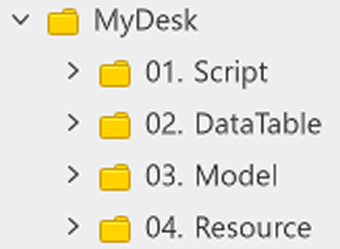

# 파티 게임 샘플 월드 학습 문서
 
 
 

## 학습 목표

- 메이플스토리 월드에서 제공하는 기능을 활용하여 하나의 월드에 다양한 형식의 맵을 구성하는 방법을 학습합니다.
- 메이플스토리 월드의 맵 형식에 대해 이해하고, 제작하려는 월드의 규칙을 설계할 수 있습니다.
- 엔티티의 제작 방법과 모델의 제작 방법에 대해 학습하여 필요한 엔티티를 생성 및 제조할 수 있습니다.
- 맵 이동 방식에 대한 이해를 기반으로 필요에 따라 원하는 맵 이동 방식을 구현할 수 있습니다.

 

## 학습 핵심 기능
- 메이플스토리 월드의 맵 형식과 특성에 대해 학습합니다.
- 맵의 이동 방식인 PortalComponent와 TeleportService에 대해 학습하여 필요한 방식을 선택하여 사용할 수 있습니다.

 

## 폴더 구성

<table class="tg"><thead>
  <tr>
    <th class="tg-nrix">번호</th>
    <th class="tg-nrix">이름</th>
    <th class="tg-nrix">설명</th>
  </tr></thead>
<tbody>
  <tr>
    <td class="tg-nrix">1</td>
    <td class="tg-cly1">Script</td>
    <td class="tg-cly1">샘플 월드를 구성하기 위한 Script들이 담긴 폴더입니다.</td>
  </tr>
  <tr>
    <td class="tg-nrix">2</td>
    <td class="tg-cly1">DataTable</td>
    <td class="tg-cly1">LocaleDataSet인 StringData가 담긴 폴더입니다.</td>
  </tr>
  <tr>
    <td class="tg-nrix">3</td>
    <td class="tg-cly1">Model</td>
    <td class="tg-cly1">샘플 월드에서 CoinRushCoin에 사용할 Model이 담긴 폴더입니다.</td>
  </tr>
  <tr>
    <td class="tg-nrix">4</td>
    <td class="tg-cly1">Resource</td>
    <td class="tg-cly1">TileSet을 담기 위한 폴더입니다.</td>
  </tr>
</tbody>
</table>

## 구현 순서

- 💡 **기초 학습**: 메이플스토리 월드의 기초적인, 또는 해당 장르의 가장 기초적인 기능을 담은 학습 항목입니다.
- 📖 **심화 학습**: 샘플 월드에 구현된 기능을 학습하고 구현하는 항목입니다. 해당 과정의 학습을 통해 장르의 기능 확장과 학습 이해도를 넓힐 수 있습니다.

 

### [💡 기초 학습] 맵 이동 구현하기
- 메이플스토리 월드의 Component의 PortalComponent에 대해 학습합니다.
- TeleportService를 사용한 맵 이동 방법에 대해 학습합니다.
- PortalComponent와 TeleportService의 차이점에 대해 학습합니다.

 

### [💡 기초 학습] RectTileMap 배치하기
- 메이플스토리 월드가 제공하는 맵의 방식에 대해 학습합니다.
- 샘플 월드의 미니 게임인 CoinRush를 구현하기 위한 RectTileMap에 대해 학습합니다.
- RectTileMap을 구성하기 위한 TileSet 제작 방법 및 사용 방법에 대해 학습합니다.
- RectTileMap과 상호작용하기 위한 BodyComponent에 대해 학습합니다.

 

### [💡 기초 학습] 장애물 생성하기
- 플레이어를 방해하는 장애물 엔티티를 제작하는 방법에 대해 학습합니다.
- TriggerComponent의 특성과 사용 방법에 대해 학습합니다.
- 장애물이 기능을 수행하기 위한 Component를 제작합니다.

 

### [💡 기초 학습] 장애물 스폰하기
- 일정 시간마다 장애물이 생성되고, 사용되도록 만드는 방법에 대해 학습합니다.
- 장애물 생성을 담당하는 Component의 제작 방법에 대해 학습합니다.

 

### [💡 기초 학습] 점수 아이템 생성하기
- 플레이어가 위험을 감수하게 만드는 요소인 점수 아이템의 생성 방법에 대해 학습합니다.
- TriggerComponent를 통해 충돌 설정에 대해 학습합니다.
- 생성한 엔티티를 모델로 제작하는 방법에 대해 학습합니다.
- 점수 아이템이 일정 주기마다 스폰 되도록 기능을 구성합니다.

 

### [💡 기초 학습] UI 구성하기
- 게임 내 플레이어에게 현재 점수를 출력하는 방법에 대해 학습합니다.
- 게임의 남은 시간을 출력하는 시간 UI를 출력하는 방법에 대해 학습합니다.
- 게임의 결과를 출력하는 결과 UI를 제작하는 방법에 대해 학습합니다.

 

### [📖 심화 학습] DataStorage 학습하기
- 플레이어의 최고 기록을 저장하는 방법에 대해 학습합니다.
- 플레이어의 최고 기록을 불러오는 방법에 대해 학습합니다.
- 저장과 불러오기 기능을 구현하는 데 있어 주의 사항에 대해 학습합니다.