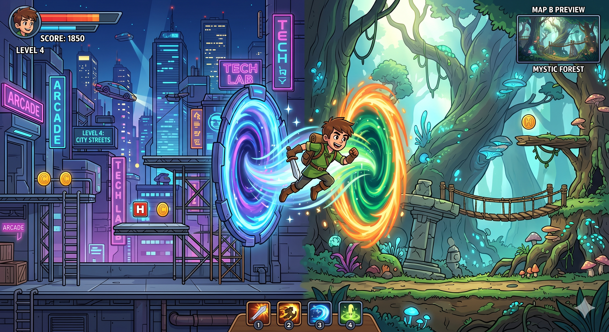
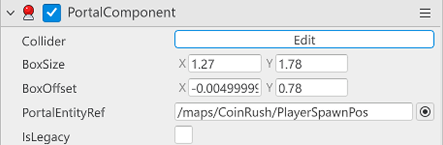
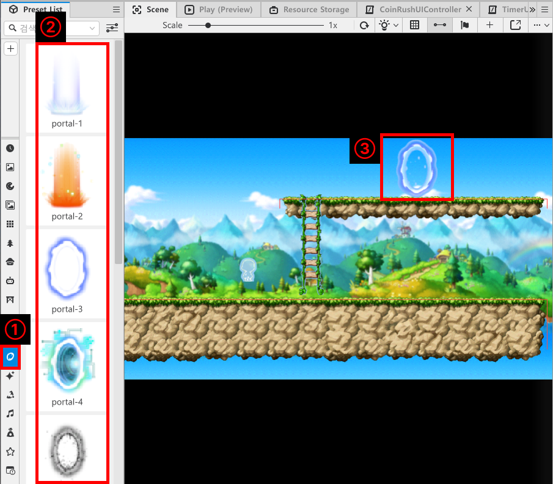
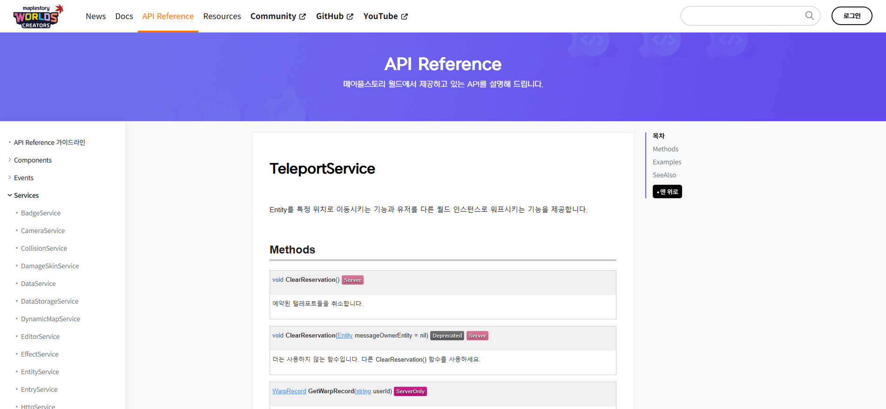
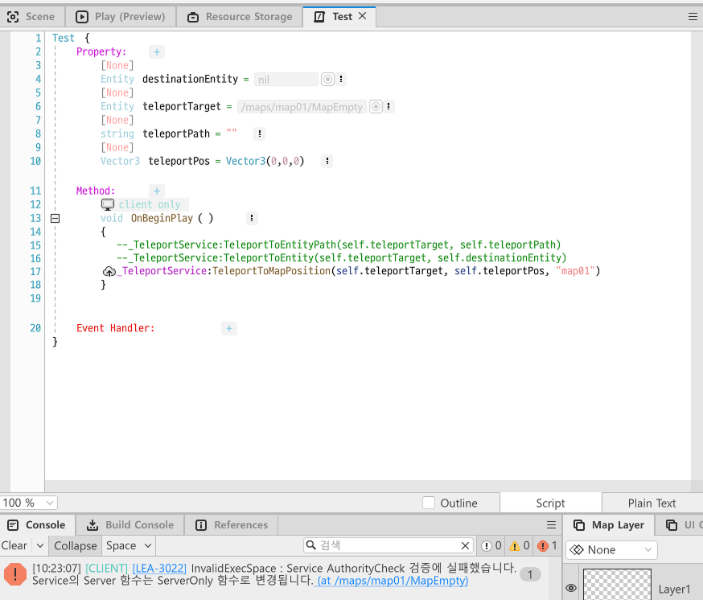
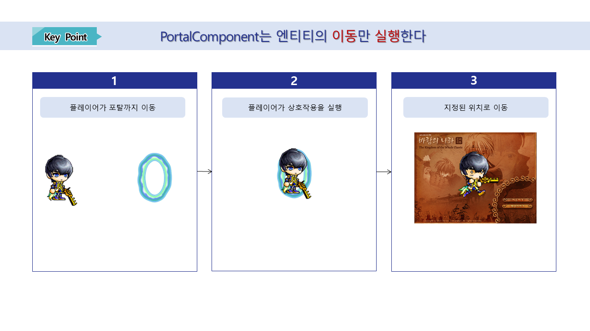
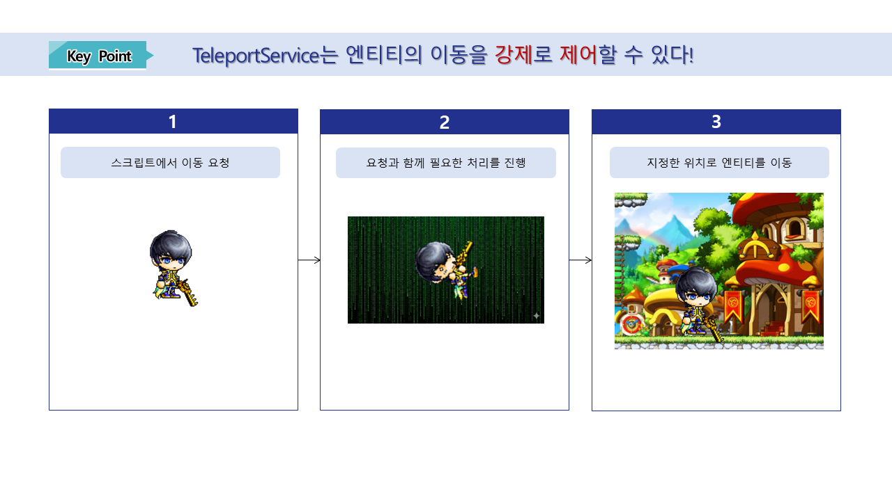

# [💡 기초 학습] 맵 이동 구현하기
 
 
 

## 영상 타임라인
- 강의 영상내 아래의 타임라인에서 학습할 수 있습니다.
- 맵 이동 구현하기: `00:02:17`
 

## 학습 목표
- 메이플스토리 월드의 Component의 PortalComponent에 대해 학습합니다.
-  TeleportService를 사용한 맵 이동 방법에 대해 학습합니다.
- PortalComponent와 TeleportService의 차이점에 대해 학습합니다.

 

## 해당 영상 시청 후 수행해 볼 내용

- 미니 게임 월드에서 미니 게임을 선택하기 위한 맵 이동 방식을 직접 선택합니다.
- 선택한 방식을 활용하여 기능을 구성하고 이를 적용합니다.
- 필요에 따라 추가적인 기능에 대해 학습하고 이를 활용하여 맵 이동시 필요한 처리를 제작합니다.

 

---

## 맵 이동 구현하기

- 게임을 진행하는 데 있어 맵을 이동하는 경우는 빈번하게 일어납니다.
- 안전 구역에서 전투가 일어나는 구역으로의 이동, 맵과 맵 간의 이동 등 다양한 방식을 통해 맵 이동이 일어나게 됩니다.
- 메이플스토리 월드에서는 플레이어 또는 엔티티를 다른 맵으로 이동하기 위해 다양한 기능을 제공하고 있습니다.

 

### PortalComponent 알아보기

> 메이플스토리 월드의 PortalComponent의 Property 모습입니다.

<table class="tg"><thead>
  <tr>
    <th class="tg-9wq8">번호</th>
    <th class="tg-9wq8">이름</th>
    <th class="tg-9wq8">설명</th>
  </tr></thead>
<tbody>
  <tr>
    <td class="tg-9wq8">1</td>
    <td class="tg-lboi">Collider</td>
    <td class="tg-lboi">포탈이 플레이어를 인식하는 범위를 편집하기 위한 Property입니다.</td>
  </tr>
  <tr>
    <td class="tg-9wq8">2</td>
    <td class="tg-lboi">BoxSize</td>
    <td class="tg-lboi">플레이어를 인식하는 TriggerBox의 크기를 지정하기 위한 값입니다.</td>
  </tr>
  <tr>
    <td class="tg-9wq8">3</td>
    <td class="tg-lboi">BoxOffset</td>
    <td class="tg-lboi">엔티티의 중심을 기준으로 TriggerBox의 중심을 지정하기 위한 값입니다.</td>
  </tr>
  <tr>
    <td class="tg-nrix">4</td>
    <td class="tg-cly1">PortalEntityRef</td>
    <td class="tg-cly1">플레이어가 포탈과 상호작용할 경우, 어떤 엔티티의 위치로 이동할 것 인지 지정하기 위한 값입니다.</td>
  </tr>
</tbody>
</table>

- PortalComponent는 플레이어가 직접 상호작용을 통해 다른 맵으로 이동할 수 있게 만듭니다.
- 플레이어의 입력에 의존하는 수동적인 성격이 강하지만 구현 난도가 낮으며 쉽게 기능을 형성할 수 있습니다.

- `Preset List`의 Model을 활용하여 포탈을 사용할 수 있습니다.
- `Preset List`에서 제공하는 Model에는 기본적으로 PortalComponent가 내장되어 있습니다.
- 원하는 Model을 선택한 뒤 `Scene`에 배치, 희망하는 위치의 엔티티를 **PortalComponent**의 **PortalEntityRef**에 등록함으로 포탈을 생성할 수 있습니다.

 

#### ☑️ PortalComponent의 장점과 단점
- 장점
    - 구현 난도가 낮습니다.
    - 플레이어가 포탈 엔티티의 모습을 보고 다른 장소로 이동할 수 있다는 사실을 직관적으로 알려줄 수 있습니다.
    - 지정한 엔티티의 위치로 이동하기 때문에 직관적이며 플레이어의 이동 장소를 쉽게 예측할 수 있습니다.
- 단점
    - 플레이어가 직접 상호작용을 수행해야 이동할 수 있어 강제력이 낮습니다.
    - 맵이 이동되었을 때 값의 처리와 같이 수행해야 하는 기능이 있을 경우 제어가 어렵습니다.

 

### TeleportService 알아보기

> 메이플스토리 월드의 API Reference에서 TeleportService에 대한 정보를 확인할 수 있습니다.

- TeleportService는 Script를 통해 엔티티의 이동을 제어하는 방식입니다.
- 주로 3가지 방식을 통해 엔티티의 이동을 제어할 수 있습니다.
    - **TeleportToEntity**: 맵의 엔티티를 기준으로 지정한 엔티티의 위치를 이동시킵니다.
    - **TeleportToEntityPath**: 맵의 엔티티 경로를 기준으로 지정한 엔티티를 맵의 엔티티 위치로 이동시킵니다.
    - **TeleportToMapPosition**: 이동하려는 맵의 이름과 위치(Vector3)를 기준으로 지정한 엔티티의 위치를 변경합니다.

 

#### ☑️ TeleportService의 장점과 단점
- 장점
    - 플레이어의 이동 타이밍을 직접 제어할 수 있습니다.
    - Script를 통해 제어하므로 엔티티의 이동 전 필요한 처리들을 수행시킬 수 있습니다.
    - 특정 지점에 도달, 아이템의 사용, 특정 키 입력 등 다양한 형식으로 맵의 이동을 구현할 수 있습니다.
- 단점
    - Script를 직접 작성해야 하므로 PortalComponent에 비해 상대적으로 구현 난도가 높습니다.
    - Script의 처리 순서를 잘못 작성할 경우 비정상적인 작동이 이뤄질 수 있습니다.
    - 합리적인 상황에 이동하는 방식이 아닐 경우 플레이어는 불합리함을 느낄 수 있습니다.

 

#### ⚠️ TeleportService 사용 시 주의 사항

- TeleportService는 ServerOnly로 작동하는 API입니다.
- 따라서 TeleportService를 호출하는 위치가 Client Only일 경우 API를 실행하지 못합니다.
- TeleportService를 호출하는 환경이 Server가 되도록 관리해야 합니다.

 

### PortalComponent의 사용처 vs TeleportService의 사용처

- PortalComponent
    - 맵과 맵 사이를 이동할 때 자주 사용됩니다.
    - 맵 이동 시 특별한 처리가 필요하지 않을 경우 자주 사용됩니다.
    - 하나의 맵 안에 다른 위치로의 이동 또는 다른 맵의 특정한 위치로 이동할 때 사용됩니다.

 

- TeleportService
    - 아이템의 사용에 따른 위치 이동을 구현할 때 사용됩니다.
    - 맵 이동과 함께 특수한 처리(값의 초기화 등)가 필요할 경우 자주 사용됩니다.

 

## 최소 구현 기준
- 플레이어가 맵을 이동할 수 있도록 기능이 구성되어야 합니다.
- PortalComponent 또는 TeleportService를 활용하여 맵 이동 기능을 구현합니다.

 

## 응용 및 확장 방향
- 캐릭터의 이동에 맞춰 플레이어의 정보를 갱신하도록 기능을 구성합니다.
- 플레이어의 맵 이동에 따라 맵의 BGM 변경 등 다양한 효과를 추가합니다.