# [💡 기초 학습] 장애물 생성하기
<br>
<br>
<br>

## 영상 타임라인
- 강의 영상 내 아래의 타임라인에서 학습할 수 있습니다.
- 장애물 생성하기: `00:29:35`

<br>

## 학습 목표
- 플레이어를 방해하는 장애물 엔티티를 제작하는 방법에 대해 학습합니다.
- TriggerComponent의 특성과 사용 방법에 대해 학습합니다.
- 장애물이 기능을 수행하기 위한 Component를 제작합니다.

<br>

## 해당 영상 시청 후 수행해 볼 내용
- 재사용성이 높은 엔티티를 Model로 제작하여 사용할 수 있도록 Model을 구성합니다.
- TriggerComponent의 CollisionGroup, Matrix를 필요에 따라 추가하고, 관계를 설정합니다.
- TweenLine을 활용하여 엔티티의 이동 기능을 구성합니다.

<br>

---

## 엔티티 학습하기
<p align="center">
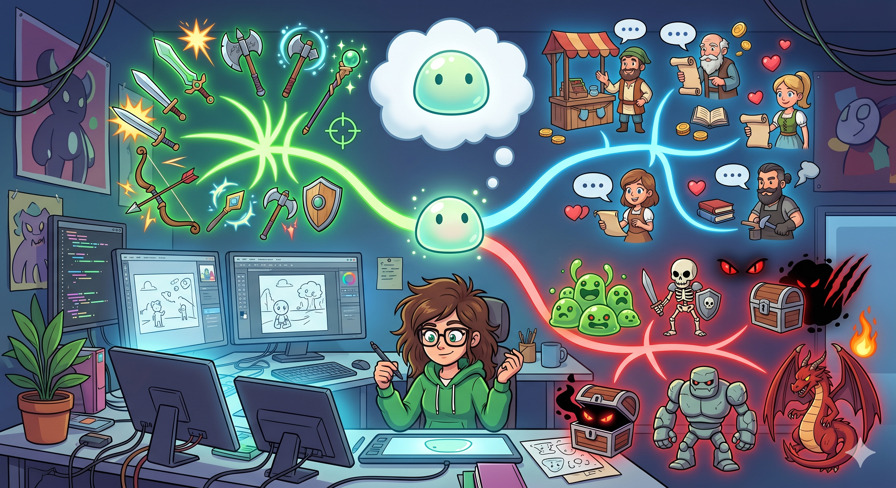
</p>

- 엔티티는 메이플스토리 월드에서 다양한 역할을 수행할 수 있습니다.
- 캐릭터의 이미지와 상호작용을 구현하면 NPC가 될 수 있습니다.
- 만약 캐릭터의 이미지와 공격을 구현하면 몬스터가 될 수 있습니다.
- 혹은 이미지는 부여하지 않고 현재 맵의 설정을 관리하는 기능을 제작하면 Controller를 구현할 수 있습니다.
- 엔티티는 다양한 방식으로 제작하고, 사용할 수 있습니다.

<br>

### 엔티티 구성하기
- 엔티티는 크게 본체인 엔티티, 기능을 부여하기 위한 Component로 구성되어 있습니다.
- 엔티티만 존재하면 어떠한 기능도 수행하지 않습니다.
- Component만 존재할 경우 이를 수행할 엔티티가 존재하지 않으므로 Component는 작동하지 않습니다.
- 따라서 엔티티를 제작할 경우 목적에 따라 엔티티를 생성, 관계를 설정해야 합니다.

<br>

#### 엔티티 제작하기
<p align="center">
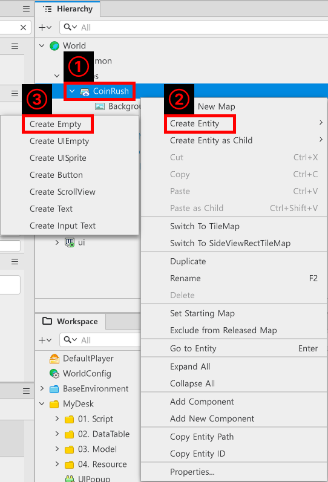
</p>

- 현재 편집 중인 맵을 마우스 우클릭합니다.
    - 편집 중인 맵 좌측에는 `>` 기호 또는 `V` 기호가 출력됩니다.
- `Create Entity`를 클릭하여 확장 메뉴를 엽니다.
- `Create Empty`를 클릭하여 빈 엔티티를 생성할 수 있습니다.

<p align="center">
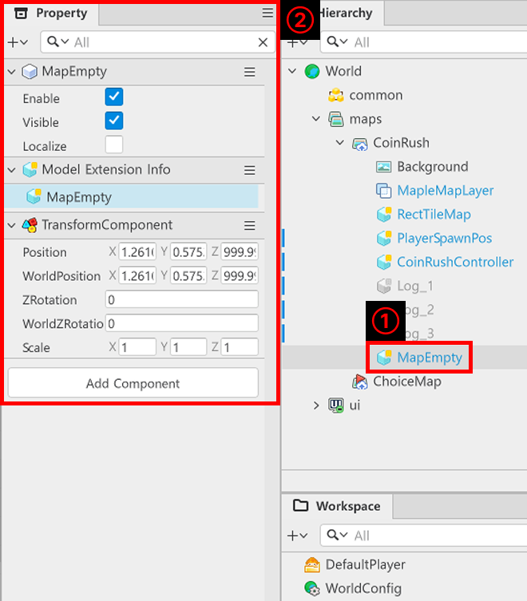
</p>

- 제작된 엔티티는 기본적으로 **MapEmpty**라는 이름으로 제작됩니다.
    - 만약 **ui**에서 빈 엔티티를 제작했을 경우 **UIEmtpy**라는 이름으로 빈 엔티티가 생성됩니다.
- 생성된 엔티티는 기본적으로 TransformComponent를 가지고 있습니다.

<br>

#### Component 부여하기

<p align="center">
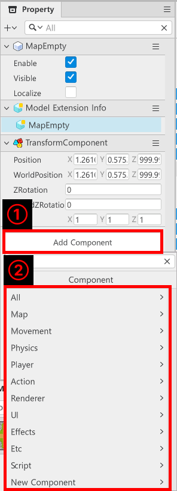
</p>

- Component를 부여하려는 엔티티를 클릭한 뒤 `Property` 창을 살펴보면 `Add Component`를 확인할 수 있습니다.
- `Add Component`를 클릭한 뒤 카테고리 단위에서 필요한 Component를 찾아 등록하거나 검색을 통해 Component를 찾아서 부여할 수 있습니다.
- 또한 `New Component`를 클릭하여 직접 Component를 제작, 등록할 수 있습니다.

<br>

## 장애물 엔티티 구성하기

<p align="center">
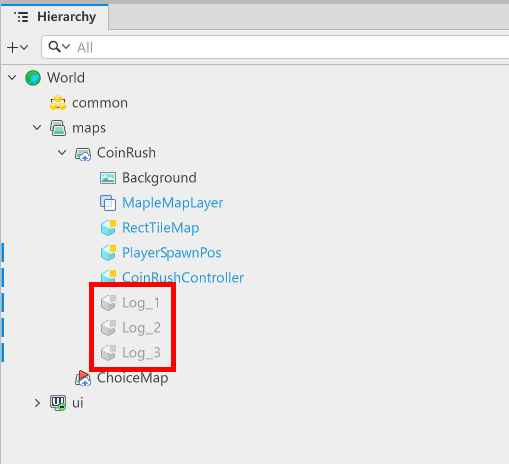
</p>

- 샘플 월드에서는 장애물로 사용하기 위해 Log_1, Log_2, Log_3 엔티티를 사용하고 있습니다.
- 해당 엔티티들은 CoinRush 맵에서 게임이 시작되면 일정한 시간마다 화면 위에서 아래로 이동하며, 플레이어와 충돌 시 플레이어 캐릭터를 잠시 움직이지 못하도록 설정합니다.
- 각 엔티티는 다음의 Component들을 가지고 있습니다.
    - `TransformComponent`: 엔티티 생성 시 기본적으로 부여되는 위치를 지정하기 위한 Component입니다.
    - `SpriteRendererComponent`: 엔티티가 이미지를 출력하기 위한 Component입니다.
    - `TriggerComponent`: 엔티티의 충돌 범위를 지정하기 위한 Component입니다.
    - `TweenLineComponent`: 엔티티가 위에서 아래로 일정한 속도와 시간으로 이동할 수 있도록 추가한 Component입니다.

<br>

### SpriteRendererComponent 편집하기
<p align="center">
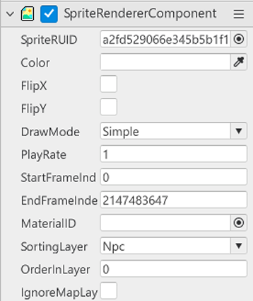
</p>

- `SpriteRendererComponent`에서 다음의 항목들을 편집합니다.
    - **SpriteRUID**: SpriteRendererComponent가 어떤 이미지를 출력해야 하는지 지정하는 값입니다.
    - **Color**: 출력되는 이미지에 덧씌울 색상을 지정하는 값입니다.
    - **FlipX**, **FlipY**: 이미지의 좌우 반전, 상하 반전을 지정하는 값입니다.

#### 리소스 찾기
- AI Lab 활용하기
<p align="center">
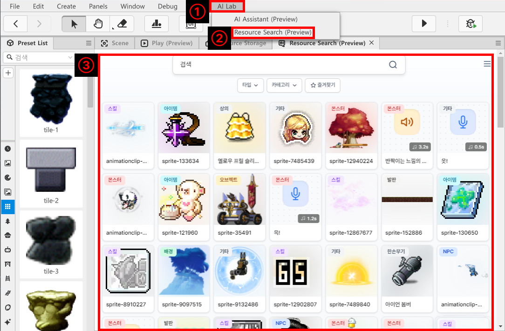
</p>

- 에디터 상단의 `AI Lab`을 클릭합니다.
- `Resource Search`를 클릭합니다.
- 출력된 화면에서 원하는 리소스를 찾습니다.
    - 타입, 카테고리의 필터를 적용하면 원하는 리소스를 빠르게 찾을 수 있습니다.

<p align="center">
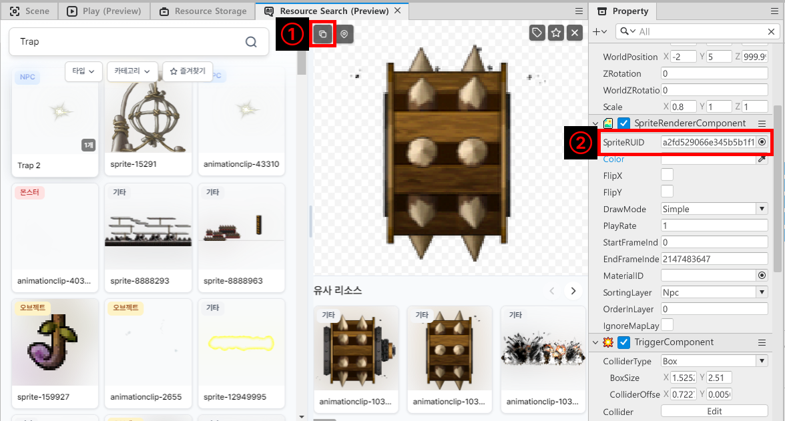
</p>

- 원하는 리소스를 찾아 클릭한 뒤, 상세 정보 창 좌측 상단의 복사 버튼을 클릭합니다.
- `SpriteRendererComponent`의 SpriteRUID에 붙여 넣기를 통해 값을 사용합니다.

<br>

### TriggerComponent 편집하기
<p align="center">
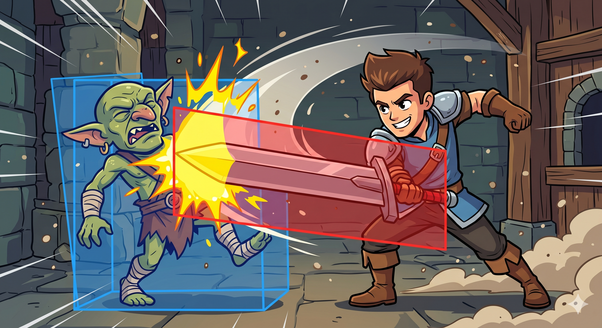
</p>

- 월드에서 플레이어와 몬스터의 충돌, 플레이어의 공격과 적의 충돌, 특정 장소의 이동 등 다양한 충돌이 일어나게 됩니다.
- 컴퓨터는 이런 충돌 구역을 알기 위한 정보가 필요합니다.
- 충돌 정보를 확인하기 위해 충돌 범위를 설정하고, 두 충돌 범위가 겹칠 경우 충돌했다고 판단하는 방식이 충돌 감지입니다.
- TriggerComponent는 충돌 정보를 담기 위한 요소들을 가지고 있습니다.

<p align="center">
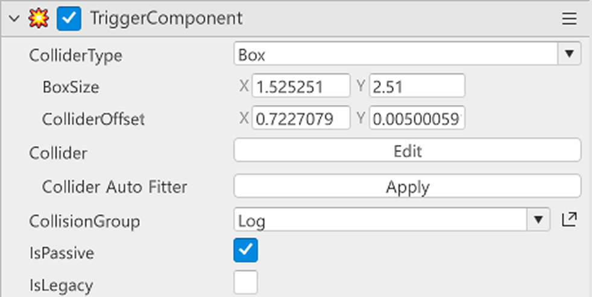
</p>

<table class="tg"><thead>
  <tr>
    <th class="tg-9wq8">번호</th>
    <th class="tg-9wq8">이름</th>
    <th class="tg-9wq8">설명</th>
  </tr></thead>
<tbody>
  <tr>
    <td class="tg-9wq8">1</td>
    <td class="tg-lboi">ColliderType</td>
    <td class="tg-lboi">충돌을 감지하기 위한 도형을 설정하는 값입니다.</td>
  </tr>
  <tr>
    <td class="tg-9wq8">2</td>
    <td class="tg-lboi">BoxSize</td>
    <td class="tg-lboi">ColliderType이 Box 일 때, Box의 크기를 설정하는 값입니다.</td>
  </tr>
  <tr>
    <td class="tg-9wq8">3</td>
    <td class="tg-lboi">ColliderOffset</td>
    <td class="tg-lboi">Collider의 중심을 지정하는 값입니다.</td>
  </tr>
  <tr>
    <td class="tg-nrix">4</td>
    <td class="tg-cly1">Collider</td>
    <td class="tg-cly1">Collider를 시각적으로 보여주고 편집할 수 있게 만듭니다.</td>
  </tr>
  <tr>
    <td class="tg-nrix">5</td>
    <td class="tg-cly1">Collider Auto Fitter</td>
    <td class="tg-cly1">Collider의 크기와 위치를 SpriteRendererComponent의 이미지 사이즈에 맞춰 조정합니다.</td>
  </tr>
  <tr>
    <td class="tg-nrix">6</td>
    <td class="tg-cly1">CollisionGroup</td>
    <td class="tg-cly1">CollisionGroup을 지정하기 위한 값입니다.</td>
  </tr>
  <tr>
    <td class="tg-nrix">7</td>
    <td class="tg-cly1">IsPassive</td>
    <td class="tg-cly1">해당 Component를 가진 객체가 충돌을 감지하지 않도록 설정합니다.</td>
  </tr>
</tbody></table>

- 샘플 월드에서는 도형에 맞춰 작업하기 위해 `ColliderType`을 Box로 설정했습니다.
- 이미지의 크기에 맞춰 BoxSize와 ColliderOffset을 설정했습니다.
    - Collider Auto Fitter를 사용할 경우 리소스의 빈 공간도 충돌 범위로 설정할 수 있으니 주의해야 합니다.
- 충돌의 감지는 플레이어 캐릭터만 수행해도 되므로 `IsPassive`의 값을 설정했습니다.

<br>

### CollisionGroup 설정하기

<p align="center">
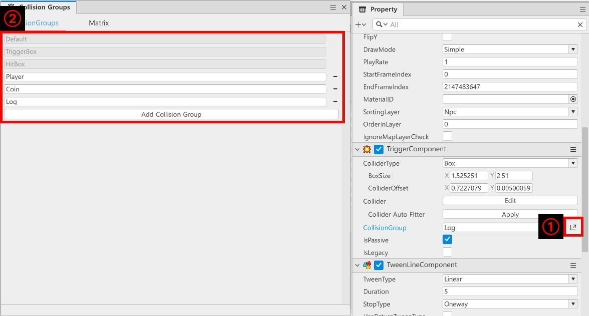
</p>

- CollisionGroup의 우측에 있는 패널 열기 버튼을 클릭합니다.
- Collision Groups 창에서 Collision Group을 편집할 수 있습니다.

<br>

#### CollisionGroup이란?
<p align="center">
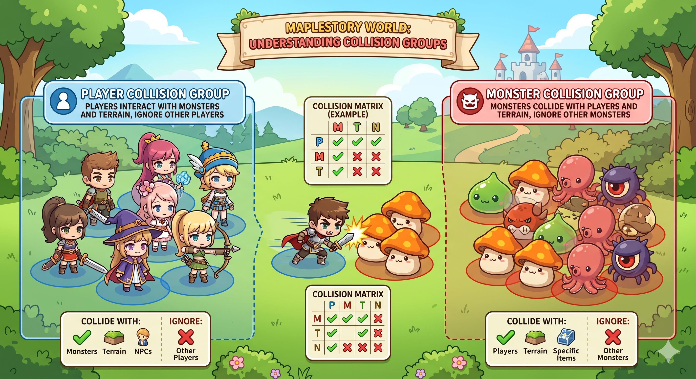
</p>

- CollisionGroup은 충돌을 감지해야 하는 그룹을 설정한 요소입니다.
- 동일한 성질을 가지는 객체들을 하나의 그룹으로 관리하여 연산의 수를 줄입니다.
- 또한 그룹과 그룹 간 충돌의 검사 여부를 미리 설정하여 불필요한 연산의 수행을 줄입니다.
- 기본적으로 **Default**, **TriggerBox**, **HitBox**로 구성되어 있습니다. 
- 샘플 월드에서는 추가로 **Player**, **Coin**, **Log**를 사용하고 있습니다.
    - **Default**: 샘플 월드에서는 사용하지 않는 CollisionGroup입니다.
    - **TriggerBox**: 샘플 월드에서는 사용하지 않는 CollisionGroup입니다.
    - **HitBox**: 샘플 월드에서는 사용하지 않는 CollisionGroup입니다.
    - **Player**: 플레이어 캐릭터에게 부여하기 위한 CollisionGroup입니다.
    - **Coin**:: 점수 아이템들을 하나의 그룹으로 관리하기 위해 제작한 CollisionGroup입니다.
    - **Log**: 장애물 객체로 플레이어와 충돌을 수행하기 위해 제작된 CollisionGroup입니다.

<br>

<p align="center">
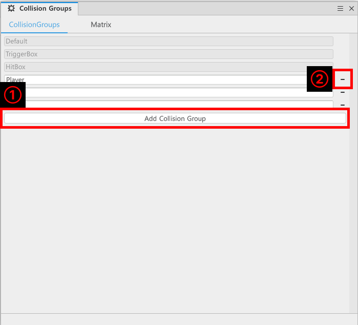
</p>

- 새롭게 CollisionGroup을 만들 경우 `Add Collision Group`을 클릭하여 생성할 수 있습니다.
- 불필요한 CollisionGroup이 생기거나 잘못 생성했을 경우, 우측의 `-` 버튼을 클릭하여 삭제할 수 있습니다.
    - 단, 기본으로 제공되는 **Default**, **TriggerBox**, **HitBox**는 제거할 수 없습니다.

<br>

### Matrix 설정하기

<p align="center">
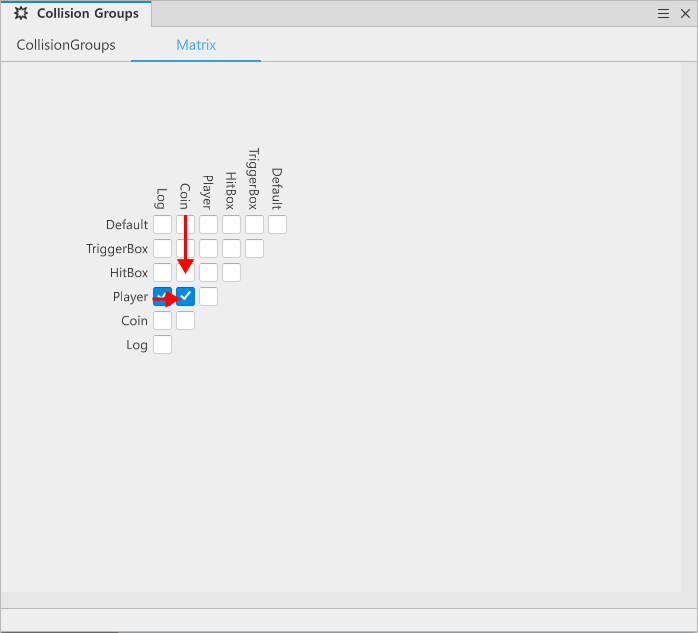
</p>

- Matrix는 Collision Group 간 충돌 검사의 여부를 설정하는 항목입니다.
- 체크 박스가 해제되어 있다면 해당하는 CollisionGroup 간 충돌을 감지하지 않습니다.
- Matrix를 읽기 위해서는 왼쪽부터 하나씩 오른쪽으로 넘어가면서 읽는다는 느낌으로 확인해야 합니다.
    - Player를 살펴본다면 Player는 Log, Coin, Player와 연산 여부를 검사하도록 요청하고 있습니다.
    - 다른 CollisionGroup 역시 왼쪽에서부터 위의 요소들을 하나씩 연결해 가며 각 Matrix가 충돌을 검사해야 하는지 설정해야 합니다.
- Matrix에서는 Player가 Log, Coin과 충돌하도록 관계를 설정합니다.
- 모든 설정을 마쳤다면 Collision Groups 창을 닫은 뒤 TriggerComponent의 CollisionGroup을 Log로 변경합니다.
- `Hierarchy`의 DefaultPlayer를 클릭한 뒤 TriggerComponent의 CollisionGroup을 Player로 변경합니다.

<br>

### TweenLineComponent
<p align="center">
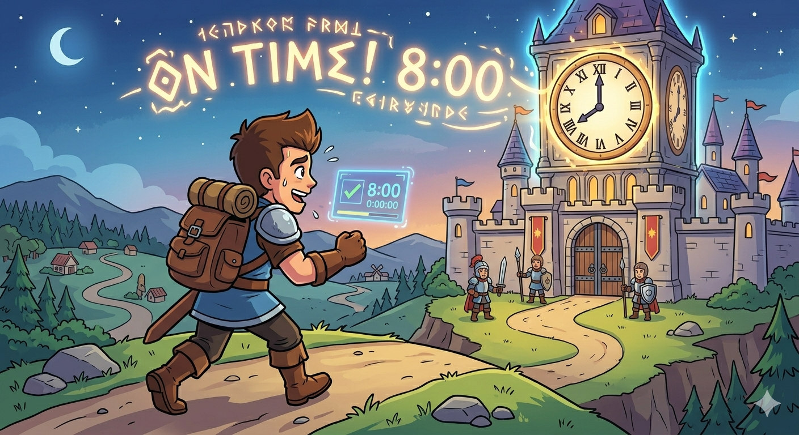
</p>

- TweenLine은 지정한 시간에 맞춰 엔티티가 목적지에 도착할 수 있도록 만드는 Component입니다.
- 목적지로 이동하는 동안 이동 속도의 변화 여부를 설정할 수 있습니다.

<br>

<p align="center">
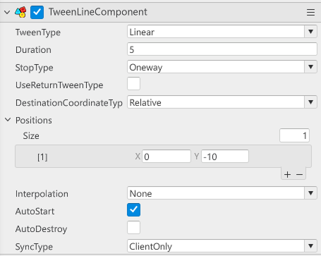
</p>

<table class="tg"><thead>
  <tr>
    <th class="tg-9wq8">번호</th>
    <th class="tg-9wq8">이름</th>
    <th class="tg-9wq8">설명</th>
  </tr></thead>
<tbody>
  <tr>
    <td class="tg-9wq8">1</td>
    <td class="tg-lboi">TweenType</td>
    <td class="tg-lboi">TweenLine이 실행되는 동안 이동 속도의 변화율을 지정하는 값입니다.</td>
  </tr>
  <tr>
    <td class="tg-9wq8">2</td>
    <td class="tg-lboi">Duration</td>
    <td class="tg-lboi">엔티티가 목적지에 도착하는 데 걸리는 시간을 설정하는 값입니다.</td>
  </tr>
  <tr>
    <td class="tg-9wq8">3</td>
    <td class="tg-lboi">StopType</td>
    <td class="tg-lboi">TweenLine의 실행이 끝났을 때, 추가적인 행동의 처리를 지정합니다.</td>
  </tr>
  <tr>
    <td class="tg-nrix">4</td>
    <td class="tg-cly1">DestinationCoordinateType</td>
    <td class="tg-cly1">Positions로 설정한 위치를 절대 좌표 기준인지, 상대 좌표 기준인지 설정합니다.</td>
  </tr>
  <tr>
    <td class="tg-nrix">5</td>
    <td class="tg-cly1">Positions</td>
    <td class="tg-cly1">엔티티가 도착해야 하는 목적지를 지정하기 위한 값입니다.</td>
  </tr>
  <tr>
    <td class="tg-nrix">6</td>
    <td class="tg-cly1">SyncType</td>
    <td class="tg-cly1">TweenLine이 실행되어야 하는 환경을 설정하는 값입니다.</td>
  </tr>
</tbody></table>

- 샘플 월드의 Log는 자기 자신을 기준으로 움직이게 만들기 위해 다음의 값들을 수정했습니다.
    - **TweenType**: 일정한 속도로 이동하기 위해 Linear를 사용합니다.
    - **Duration**: 5초에 걸쳐 지정한 위치로 이동하도록 5를 입력합니다.
    - **StopType**: 장애물이 실행되면 한 번만 이동하도록 One way로 설정합니다.
    - **DestinationCoordinateType**: 엔티티의 위치만 지정하면 지정한 위치에서 이동하도록 Relative를 설정했습니다.
    - **Positions**: 위에서 아래로 이동시키기 위해 엔티티의 위치를 맵의 상단에 배치한 뒤 x = 0, y = -10으로 설정했습니다.
    - **SyncType**: 클라이언트 환경에서 실행되도록 만들기 위해 ClientOnly로 설정했습니다.

#### ⚠️ DestinationCoordinateType 사용 시 주의 사항
- Absolute
    - 절대 좌표로 설정합니다.
    - 현재 엔티티의 위치를 무시하고 지정한 위치로 이동합니다.
    - 엔티티의 현재 위치를 시작하려는 지점에 맞추지 않을 경우 비정상적인 이동을 보일 수 있습니다.
- Relative
    - 상대 좌표로 설정합니다.
    - 현재 엔티티의 좌표를 기준으로 Position에 등록된 위치로 이동하게 만듭니다.
    - 어느 위치에서 시작하더라도 자기 자신의 위치를 기준으로 + 한 위치로 이동합니다.

<br>

## PlayerCoinRushComponent 제작하기
- 해당 Component는 플레이어가 CoinRush 맵에서 각종 요소와 충돌했을 때 기능의 처리를 수행하기 위한 Component입니다.
- 해당 Component는 샘플 월드에서 코인 습득, 장애물과 충돌했을 경우 처리를 수행하고 있습니다.

### Component 부여하기
<p align="center">
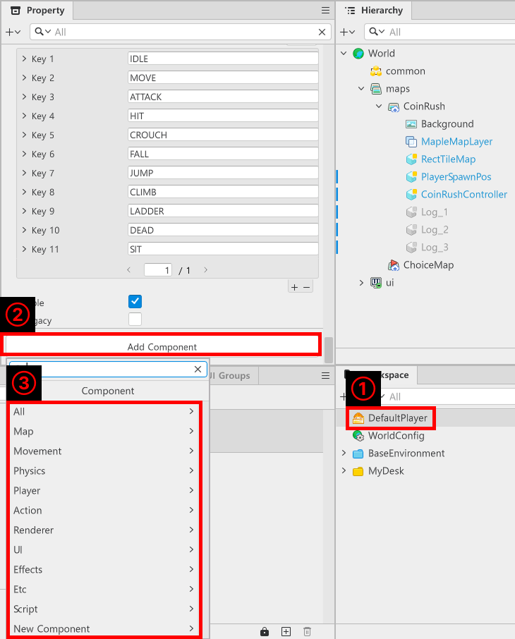
</p>

- `Hierarchy` 창에서 DefaultPlayer를 클릭합니다.
- `Property` 창에서 Add Component를 클릭합니다.
- `New Component`, `New Component`를 클릭한 뒤 Component의 이름을 PlayerCoinRushComponent로 등록합니다.
- 아래의 내용을 PlayerCoinRushComponent에 작성합니다.
```lua
@Component
script PlayerCoinRushComponent extends Component

property number playerScore = 0

property number timerID = 0

property number hitRecoveryTime = 1.0

@ExecSpace("ClientOnly")
method void AddCoinScore(number coinScore)
local event = GetCoinRushCoin()
event.CoinScoreValue = coinScore
self.Entity:SendEvent(event)
self.playerScore = self.playerScore + coinScore
end

@ExecSpace("ClientOnly")
method void PausePlayer()
if self.timerID ~= 0 then
	_TimerService:ClearTimer(self.timerID)
end
-- 플레이어의 MovementComponent를 일시적으로 중단시킵니다.
self.Entity.MovementComponent.Enable = false
-- 플레이어의 애니메이션 상태를 전환합니다.
local body = self.Entity.AvatarRendererComponent:GetBodyEntity()
local event = ActionStateChangedEvent("alert", "alert", 1, SpriteAnimClipPlayType.Loop)
body:SendEvent(event)
-- 일정 시간 뒤 이동 불가상태를 해제합니다.
self.timerID = _TimerService:SetTimerOnce(function()
	event = ActionStateChangedEvent("stand1", "stand1", 1, SpriteAnimClipPlayType.Loop)
	self.Entity.MovementComponent.Enable = true
end, self.hitRecoveryTime)
end

@ExecSpace("ClientOnly")
method void ResetScore()
self.playerScore = 0
end

@EventSender("Self")
handler HandleTriggerEnterEvent(TriggerEnterEvent event)
-- 충돌한 엔티티가 코인인지 점검합니다.
if isvalid(event.TriggerBodyEntity.CoinRushCoin) then
	-- 코인과 관련된 Component를 가져옵니다.
	local coinComponent = event.TriggerBodyEntity.CoinRushCoin
	-- 플레이어의 AddCoinScore를 전달받은 값으로 전달합니다.
	self:AddCoinScore(coinComponent:GetCoinValue())
end
end

@EventSender("Self")
handler HandleTriggerEnterEvent2(TriggerEnterEvent event)
-- 만약 충돌한 대상이 CoinRush의 통나무일 경우 플레이어를 잠시 행동 불가로 전환합니다.
if self.Entity.CurrentMapName == "CoinRush" then
	if  event.TriggerBodyEntity.Name ~= "Coin"then
	self:PausePlayer()
	-- 피격 이펙트를 출력합니다.
	_EffectService:PlayEffect("e9175650f9c0425e96333602842080cd", self.Entity, self.Entity.TransformComponent.WorldPosition, 0, Vector3.one, false)
	-- 피격 사운드 이펙트를 출력합니다.
	_SoundService:PlaySound("849328dbd156473099f90b12d36b667e", 1.0)
	-- 충돌된 통나무는 비활성화 처리합니다.
	event.TriggerBodyEntity.Enable = false
	end
end
end

end
```

> 해당 코드는 Plain Text를 기준으로 작성된 코드입니다.

<br>

## 최소 구현 기준
- 플레이어에게 방해 요소로 사용되기 위한 엔티티를 구성합니다.
- 엔티티와 플레이어가 부딪힐 경우 플레이어가 지정한 시간만큼 이동이 불가능하도록 기능을 구성합니다.
- 엔티티 스스로가 지정한 위치로 이동할 수 있도록 엔티티의 구성을 설계합니다.

<br>

## 응용 및 확장 방향
- 엔티티의 종류를 다양하게 만들에 장애물을 다양하게 구성합니다.
- TweenLine의 구성을 변경하여 장애물이 다양한 방식으로 접근하도록 기능을 구성합니다.