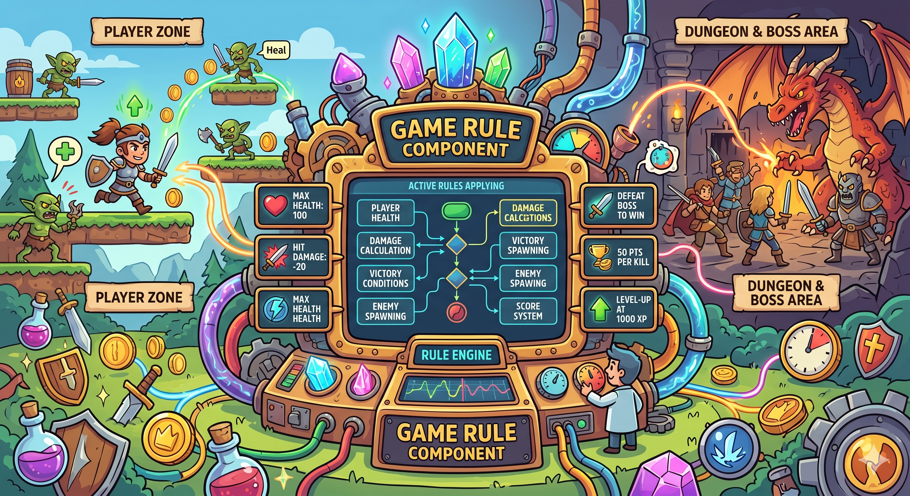
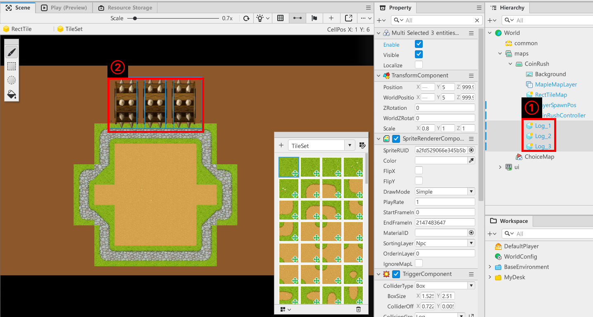

# [💡 기초 학습] 장애물 스폰 하기
<br>
<br>
<br>

## 영상 타임라인
- 강의 영상 내 아래의 타임라인에서 학습할 수 있습니다.
- 장애물 스폰 하기: `00:51:09`

<br>

## 학습 목표
- 일정 시간마다 장애물이 생성되고, 사용되도록 만드는 방법에 대해 학습합니다.
- 장애물 생성을 담당하는 Component의 제작 방법에 대해 학습합니다.

<br>

## 해당 영상 시청 후 수행해 볼 내용
- 장애물을 생성하는 Controller를 직접 제작하고 스폰 시킵니다.
- 장애물이 생성되는 시간을 조절하고 의도한 시간 간격으로 작동하도록 기능을 수정합니다.
- 다양한 장애물이 생성될 수 있도록 기능을 수정합니다.

<br>

---

## Controller 제작하기

<p align="center">

</p>

- 샘플 월드에서 CoinRush 맵 안에 CoinRushController라는 엔티티가 존재하는 모습을 볼 수 있습니다.
- CoinRushController는 CoinRush 미니 게임의 필요한 처리를 관리하는 Component입니다.
- 장애물의 스폰, 점수 아이템의 스폰을 담당합니다.

<br>

### CoinRushController 제작하기
- 빈 엔티티를 생성합니다.
- TransformComponent의 값을 맵의 중앙에 설정합니다.
- 신규 Component로 CoinRushController를 제작합니다.
- 아래의 코드를 CoinRushController에 작성합니다.

```lua
@Component
script CoinRushController extends Component

property number logCallTimer = 5.0

property number specialLogTime = 3

property number specialLogTimeCount = 0

property integer logTimerID = 0

property table logTable = {}

@ExecSpace("ClientOnly")
method void OnBeginPlay()
self:InitLog()
end

@ExecSpace("ClientOnly")
method void InitLog()
-- 통나무의 개수만큼 반복문을 실행합니다.
for i = 1, 3 do
	-- 경로를 각 통나무의 이름에 맞춰 호출합니다.
	local entityName = "/maps/CoinRush/Log_"..i
	-- 경로를 기준으로 각 통나무 엔티티를 찾습니다.
	local findEntity = _EntityService:GetEntityByPath(entityName)
	if isvalid(findEntity) then
		self.logTable[i] = findEntity
	end
end
end

@ExecSpace("ClientOnly")
method void StartLogLogic()
-- logTimerID가 0이 아닐 경우 초기화를 시도합니다.
if self.logTimerID ~= 0 then
	_TimerService:ClearTimer(self.logTimerID)
	self.logTimerID = 0
end
-- 통나무가 스폰될 수 있도록 TimerService를 활용합니다.
self.logTimerID = _TimerService:SetTimerRepeat(function()
	self:SpawnLog()
end, self.logCallTimer, self.logCallTimer)
end

@ExecSpace("ClientOnly")
method void SpawnLog()
if self.specialLogTimeCount >= self.specialLogTime then
	-- 통나무 1개를 설정합니다.
	local firstLogPos = _UtilLogic:RandomIntegerRange(1, 3)
	-- 다른 통나무 1개를 처음 뽑은 통나무와 다른 번호로 뽑습니다.
	local secondLogPos = 0
	repeat
		secondLogPos = _UtilLogic:RandomIntegerRange(1, 3)
	until secondLogPos ~= firstLogPos
	-- 선택된 2개의 통나무를 활성화 한 뒤 재생시킵니다.
	self.logTable[firstLogPos].Enable = true
	self.logTable[secondLogPos].Enable = true
	self.logTable[firstLogPos].TweenLineComponent:Stop(true)
	self.logTable[firstLogPos].TweenLineComponent:Play()
	self.logTable[secondLogPos].TweenLineComponent:Stop(true)
	self.logTable[secondLogPos].TweenLineComponent:Play()
	-- 일정 시간이 지나면 자동으로 통나무를 비활성화 시키도록 Timer를 설정합니다.
	_TimerService:SetTimerOnce(function()
		self.logTable[firstLogPos].TweenLineComponent:Stop(true)
		self.logTable[secondLogPos].TweenLineComponent:Stop(true)
		self.logTable[firstLogPos].Enable = false
		self.logTable[secondLogPos].Enable = false
	end, self.logTable[firstLogPos].TweenLineComponent.Duration)
	self.specialLogTimeCount = 0
else
	-- 통나무 1개를 설정합니다.
	local firstLogPos = _UtilLogic:RandomIntegerRange(1, 3)
	-- 선택된 통나무를 재생시킵니다.
	self.logTable[firstLogPos].Enable = true
	self.logTable[firstLogPos].TweenLineComponent:Stop(true)
	self.logTable[firstLogPos].TweenLineComponent:Play()
	-- 특수 통나무 카운트를 1개 상승시킵니다.
	self.specialLogTimeCount = self.specialLogTimeCount + 1
	-- 일정 시간이 지나면 자동으로 통나무를 비활성화 시키도록 Timer를 설정합니다.
	_TimerService:SetTimerOnce(function()
		self.logTable[firstLogPos].TweenLineComponent:Stop(true)
		self.logTable[firstLogPos].Enable = false
	end, self.logTable[firstLogPos].TweenLineComponent.Duration)
end
end

@ExecSpace("ClientOnly")
method void StartGame()
self:StartLogLogic()
end

@ExecSpace("ClientOnly")
method void FinishGame()
-- 통나무 모델들을 모두 비활성화합니다.
for i = 1, #self.logTable do
	self.logTable[i].TweenLineComponent:Stop(true)
	self.logTable[i].Enable = false
end
-- 예약해둔 타이머 이벤트를 모두 해제합니다.
_TimerService:ClearTimer(self.logTimerID)
end

end
```

> 해당 코드는 Plain Text를 기준으로 작성된 코드입니다.

- 샘플 월드에서는 Log_1, Log_2, Log_3으로 이름을 통일한 이유가 해당 코드에 있습니다.
- 장애물 엔티티를 여러 개 사용하고, 등록할 때 for 문의 i를 기준으로 엔티티를 찾기 위함입니다.

<br>

## 장애물 엔티티 배치하기

<p align="center">

</p>

- 앞서 제작한 장애물 엔티티를 복제한 뒤 이름을 Log_1, Log_2, Log_3으로 설정합니다.
- 각 위치를 적절한 위치에 설정합니다.
- 엔티티의 배치를 완료하였다면 `Property` 창에서 Enable 값을 false로 전환합니다.
- 이를 통해 특수한 장애물이 생성될 경우 좁은 범위에만 회피 가능하도록 기능의 구성이 마무리됩니다.

<br>

## 작동 원리
- OnBeginPlay를 통해 Log_1, Log_2, Log_3 엔티티를 찾아 Property에 등록합니다.
- CoinRushController는 StartGame Method를 호출 받으면 StartLogLogic Method를 호출합니다.
- StartLogLogic은 반복적으로 일정한 시간마다 장애물이 스폰 되도록 TimerService를 통해 기능을 반복 수행합니다.
- FinishGame을 통해 게임이 끝났을 경우 예약한 TimerService를 해제합니다.

<br>


## 최소 구현 기준
- 실행 Method를 활용하여 장애물이 일정한 주기로 실행되어야 합니다.
- Timer를 통해 원하는 시간에 스폰이 진행될 수 있도록 기능을 구성해야 합니다.

<br>

## 응용 및 확장 방향
- 특수한 패턴으로 장애물이 스폰 되도록 기능을 수정합니다.
- 장애물이 동일한 형태의 장애물이 아닌 다양한 디자인의 장애물이 출력되도록 기능을 수정합니다.
- 각 장애물마다 속도를 조절하여 다양한 속도로 장애물이 생성되도록 기능을 구성합니다.
- 장애물의 스폰 시간이 일정 시간마다 변경되도록 기능을 구성합니다.