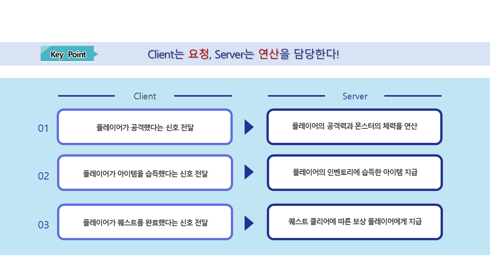
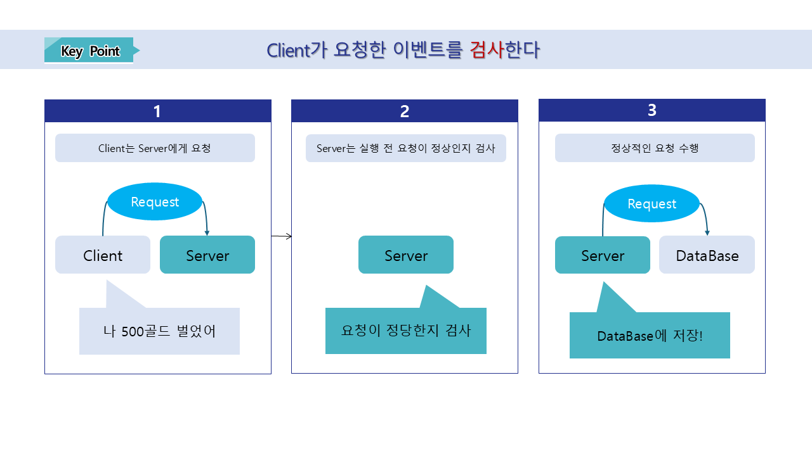

# [📖 심화 학습] DataStorage 학습하기

## 영상 타임라인
- 강의 영상내 아래의 타임라인에서 학습할 수 있습니다.
- 맵 타입 이해하기: `01:25:10`

<br>

## 학습 목표
- 플레이어의 최고 기록을 저장하는 방법에 대해 학습합니다.
- 플레이어의 최고 기록을 불러오는 방법에 대해 학습합니다.
- 저장과 불러오기 기능을 구현하는데 있어 주의 사항에 대해 학습합니다.

<br>

## 해당 영상 시청 후 수행해 볼 내용
- 플레이어의 최고 기록 이외에도 필요한 정보를 저장하고 불러오는 기능을 구현합니다.
- 저장된 정보를 UI에 출력하는 기능을 제작합니다.
---

## DataStorageService

<p align="center">

</p>

- 플레이어가 월드를 제작할 때 플레이어의 정보를 저장하거나 불러오고 싶은 경우가 있습니다.
- DataStorageService는 플레이어의 정보를 저장하거나 불러올 수 있도록 메이플스토리 월드가 지원하는 기능입니다.
- 샘플 월드에서는 DataStorageLogic이 플레이어의 정보를 저장하거나 불러오는 기능을 수행하고 있습니다.
- 아래는 DataStorageLogic의 코드입니다.

```lua
@Logic
script DataStorageLogic extends Logic

@Sync
property number serverBestScore = 0

property number clientBestScore = 0

@ExecSpace("ServerOnly")
method void LoadScore(string ProfileID)
-- 현재 플레이어의 고유 ID를 가져옵니다.
local userId = ProfileID
-- 해당 유저 전용 데이터 스토리지를 가져옵니다.
local storage = _DataStorageService:GetUserDataStorage(userId)

-- "clientScore"라는 키(Key)값으로 저장된 데이터를 대기하며(동기 방식) 불러옵니다.
local errorCode, value = storage:GetAndWait("serverBestScore")

if errorCode == 0 then
	if value ~= nil and value ~= "" then
		self.serverBestScore = tonumber(value)
		log("가져온 점수: "..value)
	else
		self.serverBestScore = 0 -- 첫 접속 시 등 저장된 데이터가 없을 경우
		log("저장된 점수가 없습니다. 0으로 초기화합니다.")
	end
end
end

@ExecSpace("ServerOnly")
method void SaveScore(string ProfileID)
local userProfileID = ProfileID
local storage = _DataStorageService:GetUserDataStorage(userProfileID)

-- "clientScore"라는 키(Key)값에 현재 점수를 문자열로 변환하여 저장합니다.
local errorCode = storage:SetAndWait("serverBestScore", tostring(self.serverBestScore))

if errorCode == 0 then
	log("점수 저장 성공")
end
end

@ExecSpace("Server")
method void RequestLoadScore(string ProfileID)
self:LoadScore(ProfileID)
end

@ExecSpace("Server")
method void RequestSaveScore(string ProfileID, number Score)
-- 만약 최고 점수일 경우 이를 clientBestScore에 등록합니다.
if self.clientBestScore < Score then
	self.clientBestScore = Score
	self.serverBestScore = Score
end
self:SaveScore(ProfileID)
end

@ExecSpace("ClientOnly")
method void OnBeginPlay()
local playerProfile = _UserService.LocalPlayer.PlayerComponent.ProfileCode
self:RequestLoadScore(playerProfile)
end

@ExecSpace("ClientOnly")
method void OnSyncProperty(string name, any value)
if name == "serverBestScore" then
	self.clientBestScore = value
end
end

end
```

<br>

## Client, Server의 역할

<p align="center">

</p>

- 샘플 월드의 경우 Client 환경만을 상정하여 제작된 월드이기에 현재의 DataStorageLogic은 비효율적인 작동 방식을 가지고 있습니다.
- 그 원인으로는 값의 처리들을 Server에서 수행하지 않기 때문입니다.

<p align="center">

</p>

- 이상적인 Client와 Server의 관계는 Client는 요청, Server는 연산을 담당하는 구조입니다.
- CLient가 어떠한 행위를 했는지 Server에 전달하면 Server는 해당 행위에 대해 연산을 수행합니다.
- Server가 전달한 연산 결과를 Client는 시각적으로 플레이어에게 보이도록 갱신합니다.
- 해당 방식이 Client와 Server의 이상적인 사용 방법입니다.

<br>

## 동기화 제작 시 주의 사항

- 여러분들이 동기화를 위해 Client, Server를 구분하여 제작한다면 다음의 경우들을 주의해야 합니다.
    - Server가 연산을 수행하기 전 값들의 신뢰성을 보장해야 합니다.
        - Client가 전달한 값을 변조하여 Server에 요청할 수 있습니다.
        - 따라서 연산이 진행되는 항목이 실행되기 전 전달한 값이 정상적인 값인지 검증하는 과정이 필요합니다.
    - Server가 순차적인 연산을 보장하지 않습니다.
        - 네트워크의 환경, 플레이어의 거리적 환경에 따라 먼저 행동했음에도 해당 행동이 연산에 우선적으로 반영되지 않을 수 있습니다.
        - 이런 문제를 해결하기 위해 스탬프 방식, 시퀀스 넘버 기법 등 다양한 서버 기법을 이해하고 이를 적용해야 합니다.
 
<br>

## 최소 구현 기준
- 플레이어의 최고 기록을 저장하는 기능을 제작합니다.
- 플레이어의 최고 기록을 불러오는 기능을 제작합니다.


## 응용 및 확장 방향
- 플레이어의 정보들 중 가장 높은 점수를 UI에 출력하는 기능을 제작합니다.
- 플레이어의 게임 기록을 서버에서 관리하고 사용할 수 있도록 서버의 보안을 강화합니다.