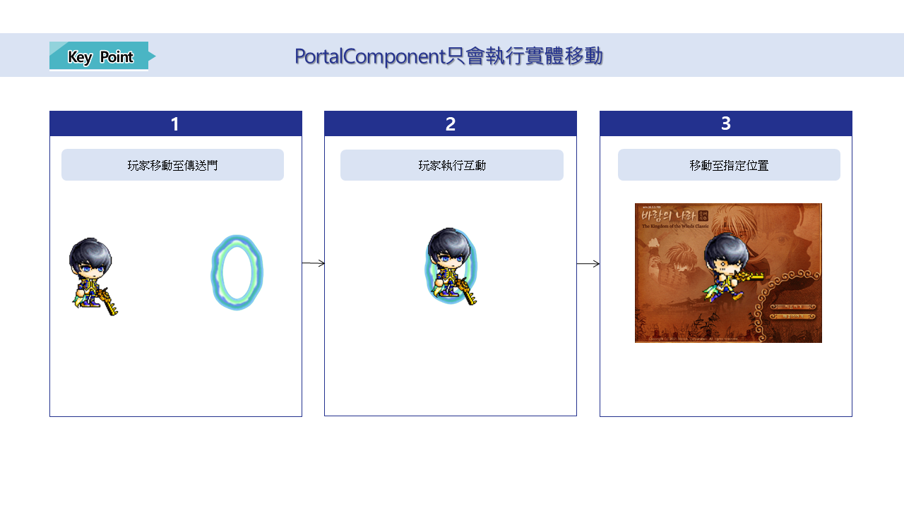
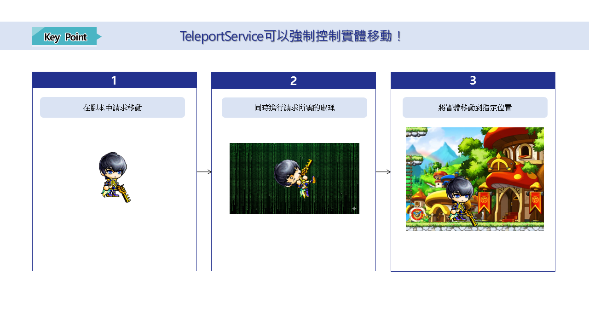

# [💡 基礎學習] 地圖移動製作
 
 
 

## 影片時間軸
- 可在課程影片中以下時間點學習。
- 地圖移動製作：`00:02:17`
 

## 學習目標
- 學習楓之谷世界Component中的PortalComponent。
- 學習使用TeleportService進行地圖移動的方法。
- 學習PortalComponent與TeleportService的差異。

 

## 觀看該影片後可嘗試執行的內容

- 親自選擇迷你遊戲世界中用於選擇迷你遊戲的地圖移動方式。
- 利用選擇的方式製作功能並套用。
- 視需求學習額外功能，並利用其製作地圖移動時所需的處理。

 

---

## 地圖移動製作

- 在進行遊戲時，地圖移動是相當常見的情況。
- 無論是從安全區移動到戰鬥區，或是地圖與地圖之間的移動，都會透過各種方式進行地圖切換。
- 楓之谷世界提供了多種功能，讓玩家或實體能夠移動到其他地圖。

 

### 了解PortalComponent

> 這是楓之谷世界PortalComponent的Property畫面。

<table class="tg"><thead>
  <tr>
    <th class="tg-9wq8">編號</th>
    <th class="tg-9wq8">名稱</th>
    <th class="tg-9wq8">說明</th>
  </tr></thead>
<tbody>
  <tr>
    <td class="tg-9wq8">1</td>
    <td class="tg-lboi">Collider</td>
    <td class="tg-lboi">用來編輯傳送門辨識玩家範圍的Property。</td>
  </tr>
  <tr>
    <td class="tg-9wq8">2</td>
    <td class="tg-lboi">BoxSize</td>
    <td class="tg-lboi">用來指定辨識玩家之TriggerBox大小的數值。</td>
  </tr>
  <tr>
    <td class="tg-9wq8">3</td>
    <td class="tg-lboi">BoxOffset</td>
    <td class="tg-lboi">用來以實體中心為基準，指定TriggerBox中心位置的數值。</td>
  </tr>
  <tr>
    <td class="tg-nrix">4</td>
    <td class="tg-cly1">PortalEntityRef</td>
    <td class="tg-cly1">當玩家與傳送門互動時，用來指定要移動至哪個實體位置的數值。</td>
  </tr>
</tbody>
</table>

- PortalComponent可讓玩家透過直接互動移動到其他地圖。
- 雖然高度依賴玩家輸入，屬於較被動的方式，但製作難度低且容易建立功能。

- 可以透過「Preset List」中的Model使用傳送門。
- 「Preset List」提供的Model預設已內建PortalComponent。
- 選擇想要的Model後配置到「Scene」中，再將目標位置的實體登錄至**PortalComponent**的**PortalEntityRef**即可建立傳送門。

 

#### ☑️ PortalComponent的優點與缺點
- 優點
    - 製作難度低。
    - 玩家能透過看見傳送門實體外觀，直覺理解可以移動到其他地點。
    - 因為移動至指定實體的位置，因此直觀且容易預測玩家的移動地點。
- 缺點
    - 必須由玩家主動互動才能移動，因此強制性較低。
    - 若地圖切換時需要同時處理數值等功能，控制會較困難。

 

### 認識TeleportService

> 可在楓之谷世界的API Reference中檢視TeleportService相關資訊。

- TeleportService是透過Script控制實體移動的方式。
- 主要可透過3種方式控制實體移動。
    - **TeleportToEntity**：以地圖中的實體為基準，移動指定實體的位置。
    - **TeleportToEntityPath**：以地圖實體路徑為基準，將指定實體移動到地圖實體的位置。
    - **TeleportToMapPosition**：依據欲移動的地圖名稱與位置(Vector3)改變指定實體的位置。

 

#### ☑️ TeleportService的優點與缺點
- 優點
    - 可直接控制玩家的移動時機。
    - 透過Script控制，因此能在實體移動前先執行必要處理。
    - 可利用到達特定地點、使用道具、按下特定按鍵等多種方式製作地圖移動。
- 缺點
    - 由於需自行撰寫Script，相較PortalComponent製作難度較高。
    - 若Script處理順序設計錯誤，可能發生異常運作。
    - 若移動方式不符合合理情境，玩家可能會感到不合理。

 

#### ⚠️ 使用TeleportService時的注意事項

- TeleportService是ServerOnly執行的API。
- 因此若呼叫TeleportService的位置為Client Only，將無法執行API。
- 必須確保呼叫TeleportService的執行環境為Server。

 

### PortalComponent的使用情境 vs TeleportService的使用情境

- PortalComponent
    - 常用於地圖與地圖之間的移動。
    - 當地圖移動時不需要額外處理時經常使用。
    - 用於單一地圖內的位置移動，或移動至其他地圖中的特定位置。

 

- TeleportService
    - 用於製作因使用道具而產生的位置移動。
    - 當地圖移動同時需要特殊處理(例如數值初始化)時經常使用。

 

## 最低製作標準
- 必須建構讓玩家能夠移動地圖的功能。
- 使用PortalComponent或TeleportService製作地圖移動功能。

 

## 應用與進階應用
- 建構能依照角色移動更新玩家資訊的功能。
- 根據玩家移動地圖的情況，新增地圖BGM更改等各種效果。