# 配置RectTileMap
 
 
 

## 影片時間軸
- 可在課程影片中以下時間點學習。
- 配置RectTileMap：`00:10:58`
 

## 學習目標
- 學習楓之谷世界提供的地圖類型。
- 學習用於製作範例世界迷你遊戲CoinRush的RectTileMap。
- 學習建立RectTileMap所需的TileSet製作方法與使用方法。
- 學習與RectTileMap互動所需的BodyComponent。

 

## 觀看該影片後可嘗試執行的內容

- 親自配置RectTileMap，建立迷你遊戲執行的地圖。
- 將特定平台設為無法通行區域，以限制玩家的移動範圍。
- 可透過調整KinematicBodyComponent設定所需的物理規則。

 

---

##理解地圖類型

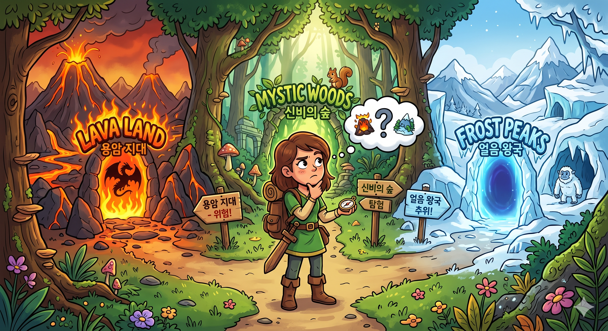

> 可依據想製作地圖的規則，選擇不同的地圖類型進行製作。

- 楓之谷世界提供了多種地圖類型。
- 創作者可依照想製作世界的類型選擇適合的地圖進行製作。

 

### TileMap

- 在楓之谷世界中初次建立世界時預設指定的地圖類型。
- 是最能展現楓之谷風格的世界方式。
- 利用楓之谷世界提供的Tile生成地面，並配置實體來建立地圖。
- 可依圖塊的配置製作斜坡。
- 在製作橫向捲軸的遊戲時，是能展現楓之谷風格的有用地圖方式。
 

### RectTileMap

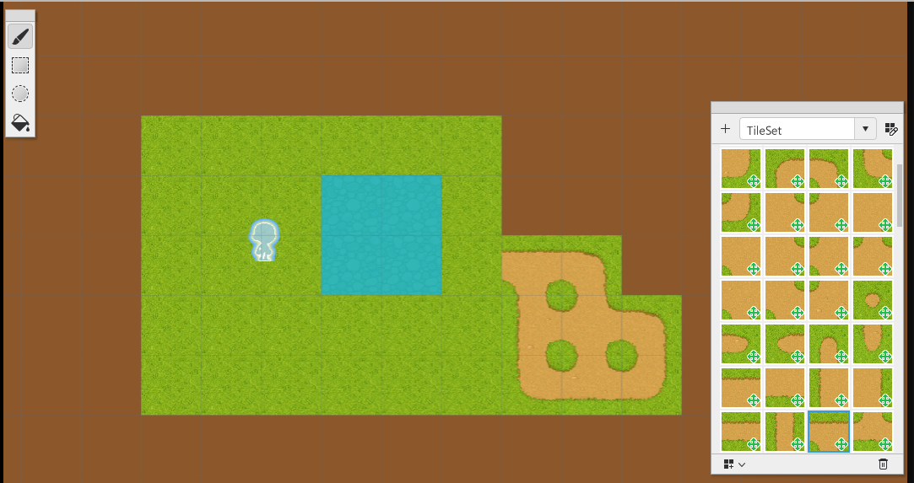

- 在製作俯視視角的遊戲時，是有效的地圖。
可以自行製作TileSet，也可以利用楓之谷世界提供的TileSet資源來建立地圖。
- 可透過棋盤格配置圖塊來建立地圖。
- 可為每個圖塊賦予可移動與不可移動的性質。
- 與TileMap、SideViewRectTileMap方式不同，可製作4方向、8方向移動方式的遊戲。
 

### SideViewRectTileMap

- 在製作橫向捲軸類型遊戲時，是有效的地圖類型。
可以自行製作TileSet，也可以利用楓之谷世界提供的TileSet資源來建立地圖。
- 可透過棋盤格配置圖塊來建立地圖。
- 與RectTileMap不同，若不是設定為不可移動的TileSet，角色將會**穿過**圖塊。
- 因此使用SideViewRectTileMap建構地圖時，必須將不可移動的TileSet製作成**平台**。

 

## 理解BodyComponent

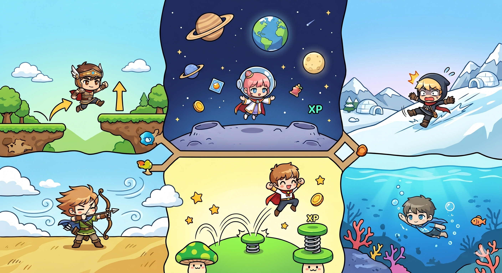

- 楓之谷世界會根據不同地圖使用不同的物理引擎。
- 3種地圖各自都有對應需求的Body Component。
- RigidbodyComponent、KinematicbodyComponent、SideviewbodyComponent分別對應不同的地圖類型。

 

### ⚠️ 沒有Body Component時

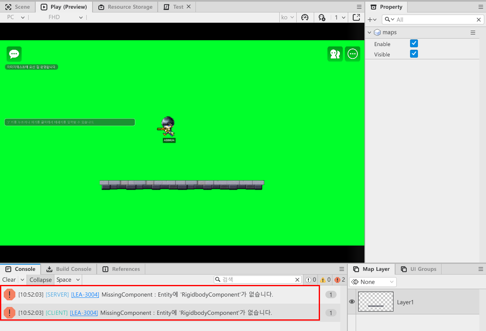

- 若目前實體所在的地圖缺少對應的bodyComponent，將無法正常運作。
- 特別是可能無法與配置在地圖中的平台圖塊產生互動。
- 若Player設定中的DefaultPlayer缺少對應的Body Component，將會顯示錯誤訊息，並發生角色無法動彈的現象。
- 因此，若實體需要與地圖中的圖塊互動，必須賦予與目前編輯中地圖相對應的Body Component。

 

### RigidBodyComponent

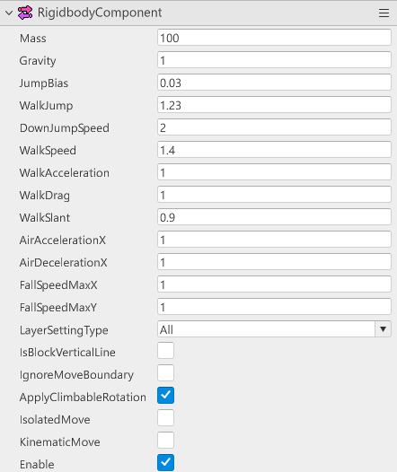

- 在楓之谷世界的TileMap方式中控制角色的物理。
- 若地圖為TileMap但沒有RigidBodyComponent，角色無法與圖塊互動。
- 在RigidBodyComponent中提供角色跳躍控制、重力控制等多種物理屬性值。
- 可透過更改該數值來改變物理方式。
 

### KinematicBodyComponent

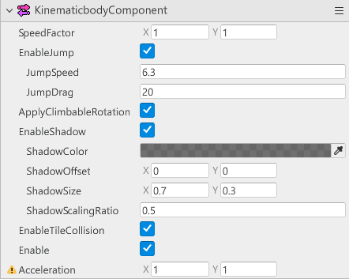

- 在楓之谷世界的RectTileMap方式時控制角色的物理。
- 當地圖為RectTileMap時，若沒有KinematicBodyComponent，將不會與RectTileMap的圖塊產生互動。
- 在KinematicBodyComponent中可調整角色的移動速度、是否可跳躍、是否顯示陰影等。
 

### SideViewRectTileMap

- 在楓之谷世界中使用SideViewRectTileMap方式時控制角色的物理。
- 若沒有該元件，角色無法與地圖圖塊互動。
- 可調整角色的跳躍速度與重力加速度等。

 

## 更改地圖類型

- 在Hierarchy視窗中對要更改的地圖按右鍵。
- 點擊Switch To RectTileMap或Switch To SideViewRectTileMap其中之一。
    - 若目前地圖不是TileMap，則會顯示Switch To TileMap，且切換到目前地圖狀態的選項會被隱藏。
- 範例世界的CoinRush地圖是以RectTileMap製作，因此點擊Switch To RectTileMap進行切換。

### 配置RectTileMap

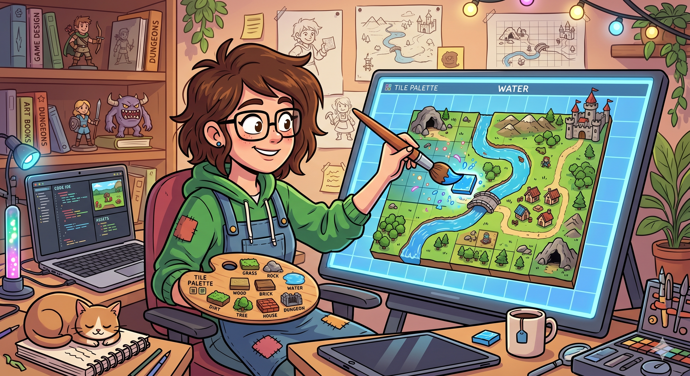

- 要建立RectTileMap，必須先有TileSet。
- TileSet是一種將多種Tile集中在同一空間中的調色盤。
- 就像在調色盤中放入名為Tile的顏料一樣，創作者可以從TileSet中選擇Tile，像點畫般配置地圖。

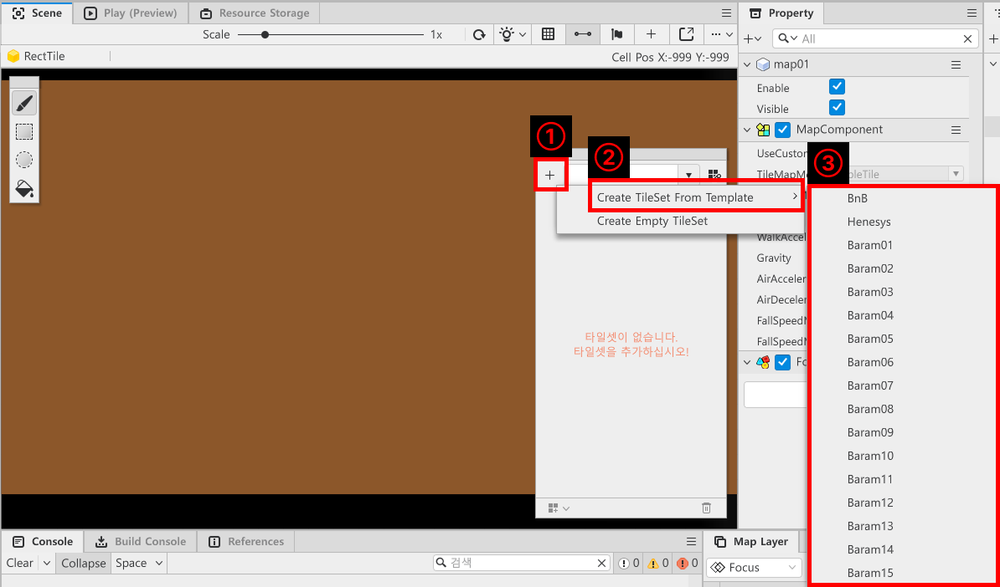

- 在RectTileMap狀態下，點擊TileSet編輯視窗中的「+」按鈕。
- 為了使用楓之谷世界提供的資源製作TileSet，點擊「Create TileSet From Template」。
- 在展開選單中選擇想要的資源類型以建立TileSet。

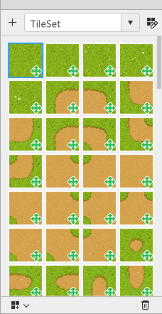

- 若成功建立完成，TileSet編輯視窗中將顯示Tile列表。

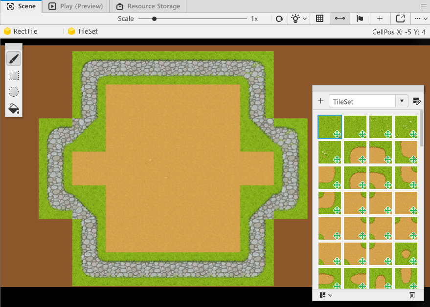

- 選擇TileSet中的Tile並配置到Scene中，即可建立地圖。

 

### 更改Tile的性質

- 配置Tile時，有時會希望將某區域設為玩家無法通行。
- 此時可以透過更改Tile的性質來實現。

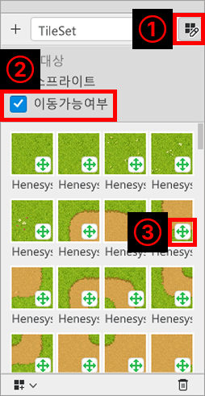

- 點擊TileSet編輯視窗中的鉛筆按鈕。
- 點擊「是否可移動」。
- 點擊欲更改為不可移動性質之Tile的綠色十字圖示，將其更改為**紅色**十字標示。

 

## 編輯KinematicbodyComponent
- 進行與RectTileMap互動所需Component，也就是KinematicbodyComponent的編輯。
- 可依據目前製作中的世界地圖特性編輯並使用各項數值。

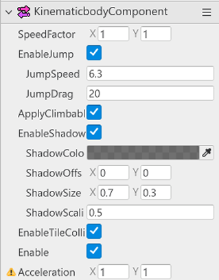

- KinematicbodyComponent
    - **SpeedFactor**：可調整角色移動速度的數值。X、Y的數值可分別調整左右或上下移動速度。
    - **EnableJump**：可決定是否允許角色跳躍。當該值未勾選時，角色無法跳躍。
    - **JumpSpeed**：可調整角色跳躍速度。數值越大，跳躍速度越快且可跳得更高。
    - **JumpDrag**：可調整角色的重力加速度。數值越小，重力影響越小，角色會在空中較慢下降。
    - **ApplyClimbableRotation**：當角色與梯子、繩索等物件互動時，決定是否依其旋轉來讓角色旋轉。
    - **EnableShadow**：決定是否顯示角色的陰影。當該值取消勾選時，將不顯示角色陰影。
    - **ShadowColor**：可更改陰影顏色。
    - **ShadowOffset**：可更改陰影顯示位置。
    - **ShadowSize**：可設定陰影大小。
    - **ShadowScalingRatio**：當角色跳躍時，可更改陰影縮放比例。數值越小，縮放比例越小。
    - **EnableTileCollision**：可讓角色在RectTileMap中**忽略**不可移動的圖塊進行移動。
 

## 最低製作標準
- 至少製作1張以上可供玩家遊玩迷你遊戲的地圖。
- 建構讓玩家角色即使進入不同類型的地圖，也能與地圖中配置的Tile互動。

 

## 應用與進階應用
- 讓每個迷你遊戲都能運用不同類型的地圖來製作。
- 建構可依照不同地圖配置與規則，調整負責物理運算之Body Component數值的功能。