#[💡 基礎學習] 建立UI
<br>
<br>
<br>

## 影片時間軸
- 可在課程影片中以下時間點學習。
- 建立UI：`01:10:24`

<br>

## 學習目標
- 學習在遊戲中向玩家顯示目前分數的方法。
- 學習顯示遊戲剩餘時間之時間UI的製作方法。
- 學習製作顯示遊戲結果的結果UI。

<br>

## 觀看該影片後可嘗試執行的內容
- 製作用於在世界內輸出玩家資訊的UI。
- 親自建立玩家從僵硬恢復前剩餘時間、遊戲進行中UI輸出等各種UI。

<br>

---

## 建立UI

<p align="center">
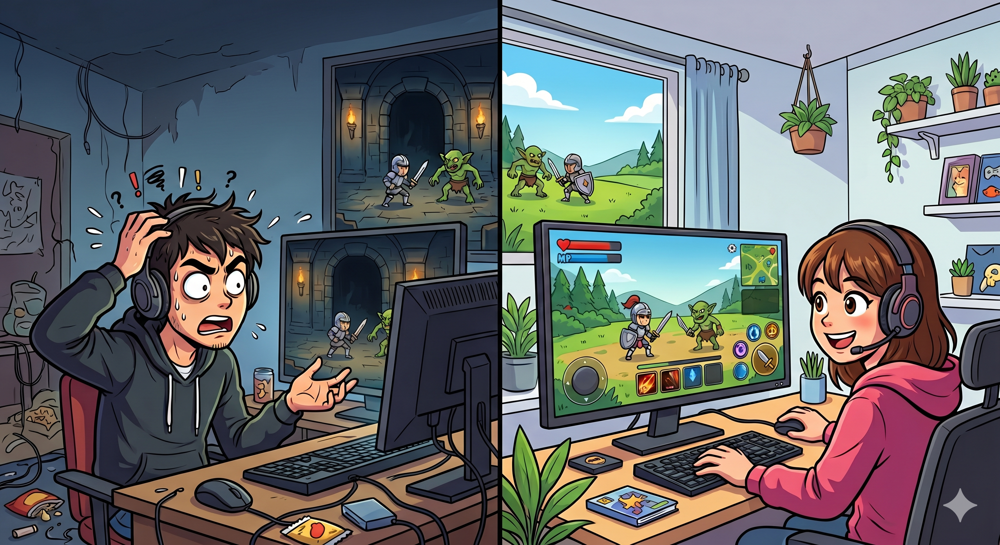
</p>

- UI負責在快速變化的世界環境中向玩家提供資訊。
- 提供玩家角色剩餘HP、冷卻時間、敵人HP等各種資訊的視覺化資訊。
- 良好的UI能讓玩家在觀看畫面時快速確認想要的資訊。
- 但若沒有UI或存在不必要的UI，則可能顯得雜亂或無法獲得資訊。
- 因此在建立UI時，必須考慮適當的位置選擇、比例設定、色彩對比等各種要素。

<br>

### UI製作方法

<p align="center">
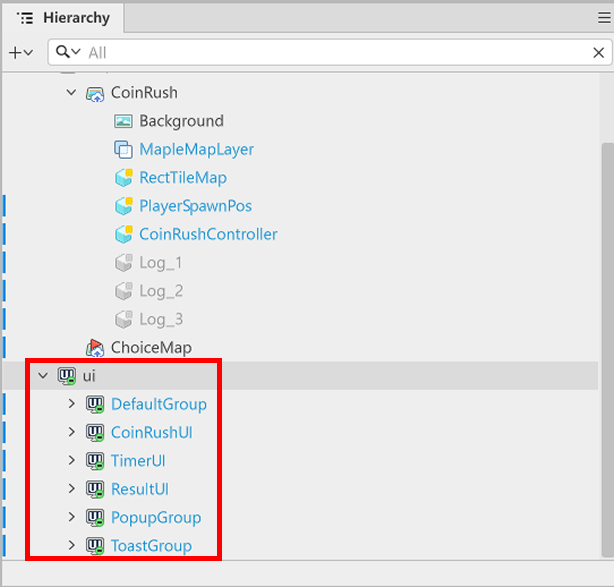
</p>

- 可在「Hierarchy」視窗中確認目前存在的UI Group。
- 一個Group會作為區分UI使用目的的用途。
- 以「Hierarchy」為基準，位於最**下方**的uiGroup會顯示在畫面的最上層。

<p align="center">
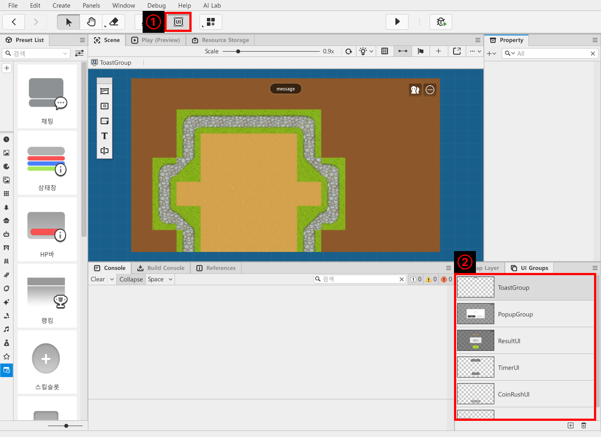
</p>

- 點擊楓之谷世界編輯器畫面上方的UI按鈕。
- 可在畫面下方的UI Groups視窗中拖曳UI Group來更改順序。
- 點擊UI Groups視窗內的「+」按鈕即可製作新的UI Group。
- 點擊垃圾桶按鈕即可刪除目前選取的UI。
- 在範例世界中製作並使用了3個UI Group。
    - **CoinRushUI**：用於顯示目前玩家分數的UI。
    - **TimerUI**：用於顯示CoinRush迷你遊戲剩餘時間與遊戲開始按鈕的UI。
    - **ResultUI**：用於顯示CoinRush迷你遊戲結果的UI。

<br>

### 製作UI實體

<p align="center">
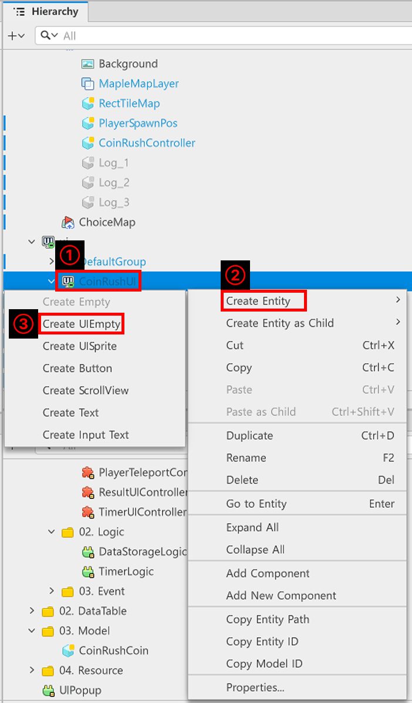
</p>

- 在「Hierarchy」中對正在編輯的UI Group按下滑鼠右鍵。
- 點擊「Create Entity」、「Create UIEmpty」即可製作空白UI實體。

<p align="center">
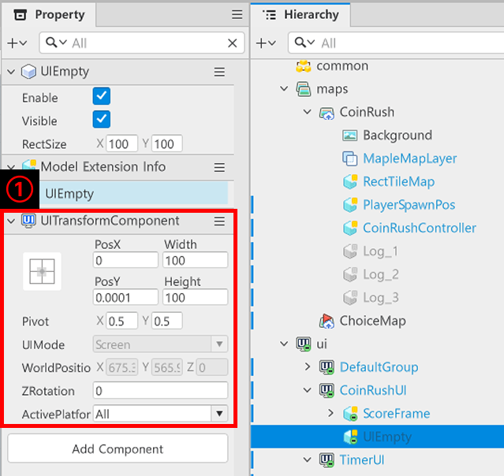
</p>

- UIEmpty與原本的MapEmpty不同，不具有「TransformComponent」。
- 取而代之的是具有「UITransformComponent」。
- 「UITransformComponent」具有以下特性。
    - 存在用於設定以畫面哪個部分作為中心的**Anchor**設定。
    - 可依據**Anchor**的設定，調整PosX、PosY、Width、Height的值，或透過調整Left、Right、Center、Bottom的值來控制實體的位置與大小。
    - 可利用**Pivot**更改UI圖片的中心點。
    - 可利用**ActivePlatform**的值來選擇是僅在PC環境顯示的UI、僅在行動裝置環境顯示的UI，或是在兩種環境都顯示的UI。

<br>

#### 輸出UI圖片

<p align="center">
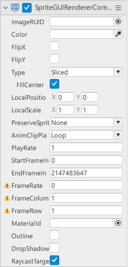
</p>

- 若要在UI中輸出圖片，需使用「SpriteGUIRendererComponent」。
- 和「SpriteRendererComponent」一樣，可透過在ImageRUID輸入資源ID值來選擇圖片。
- ⚠️ `SpriteRendererComponent` VS `SpriteGUIRendererComponent`
    - 「SpriteRendererComponent」是在maps內輸出圖片時使用的Component。
    - 若使用「SpriteRendererComponent」輸出的圖片，可能會隨著**角色移動**而在畫面上**停止顯示**。
    - 「SpriteGUIRendererComponent」則即使角色移動也不會消失。
    - 「SpriteGUIRendererComponent」可能會依據畫面大小改變顯示位置與大小。

<br>

#### 輸出文字

<p align="center">
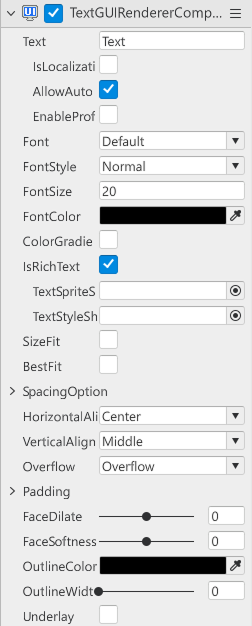
</p>

- 當需要在UI中輸出文字時，可運用「TextGUIRendererComponent」來輸出文字。
- 可在Text輸入欲顯示的內容來輸出文字。
- 可透過FontSize調整文字大小。
- 可透過FontColor更改文字顏色。

<br>

### 建立CoinRushUI

<p align="center">
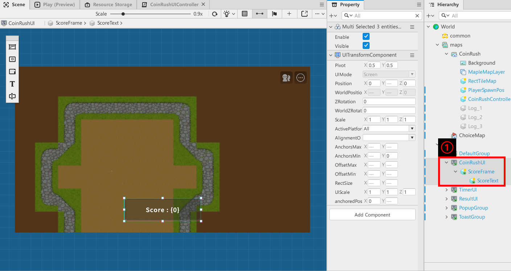
</p>

- **ScoreFrame**：為了輸出分數框，具有SprtieGUIRendererComponent。
- **ScoreText**：為了在分數框上顯示目前分數，具有TextGUIRendererComponent。
- CoinRushUI具有CoinRushUIController Component來管理自身的要素。
- 以下為CoinRushUIController的程式碼。

```lua
@Component
script CoinRushUIController extends Component

property TextGUIRendererComponent scoreText = nil

property number currentScore = 0

@ExecSpace("ClientOnly")
method void OnBeginPlay()
self:InitScoreText()
end

@ExecSpace("ClientOnly")
method void InitScoreText()
-- 檢查scoreText是否為nil狀態。
if not isvalid(self.scoreText) then
	-- 若為nil狀態則尋找並註冊scoreText。
	local findTextEntity = _EntityService:GetEntityByPath("/ui/CoinRushUI/ScoreFrame/ScoreText")
	-- 確認是否找到實體。
	if isvalid(findTextEntity) then
		-- 若成功找到實體，則註冊findTextEntity的TextGUIRendererComponent。
		local findTextComponent = findTextEntity.TextGUIRendererComponent
		-- 驗證是否成功找到TextGUIRendererComponent。
		if isvalid(findTextComponent) then
			-- 將找到的findTextComponent註冊到scoreText。
			self.scoreText = findTextComponent
		else
			-- 因未能成功找到TextGUIRendererComponent，因此留下錯誤日誌並中斷程式執行。
			log_warning("找不到ScoreText的TextGUIRendererComponent！")
			return
		end
	else
		log_warning("找不到ScoreText實體！")
		return
	end
end
end

@ExecSpace("ClientOnly")
method void ResetScoreUI()
self.scoreText.Text = "0"
self.currentScore = 0
self.Entity.Enable = true
end

@EventSender("LocalPlayer")
handler HandleGetCoinRushCoin(GetCoinRushCoin event)
self.currentScore = self.currentScore + event.CoinScoreValue
self.scoreText.Text = string.format("Score : %d", self.currentScore)
end

end
```

> 該程式碼是以Plain Text為基準編寫而成。

- 已建立功能，使LocalPlayer取得分數道具時能更新UI中的分數。

<br>

### 建立TimerUI

<p align="center">
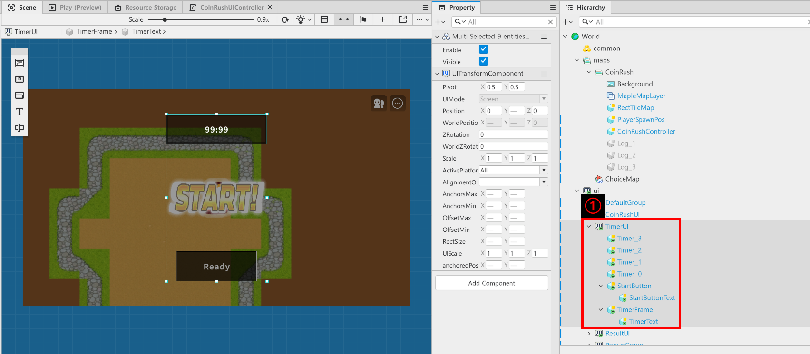
</p>

- **Timer_3**、**Timer_2**、**Timer_1**、**Timer_0**：為了在迷你遊戲開始前進行倒數演出，具有「SpriteGUIRendererComponent」。
- **StartButton**：為了建立開始按鈕的框架，具有「SpriteGUIRendererComponent」。
- **StartButtonText**：為了輸出開始按鈕的名稱，具有「TextGUIRendererComponent」。
- **TimerFrame**：為了建立顯示剩餘時間的框架，使用「SpriteGUIRendererComponent」。
- **TimerTex**t：為了以文字顯示剩餘時間，使用「TextGUIRendererComponent」。
- TimerUI具有TimerUIController Component來管理自身要素。
- 以下為TimerUIController Component的程式碼。

```lua
@Component
script TimerUIController extends Component

property table timerEntity = {}

property string countSoundEffectID = "5dc17871a4e749e093beef9ab1096243"

property string startSoundEffectID = "9925041d48474aeeab6df6e0c4368097"

property Entity startButton = nil

property TextGUIRendererComponent timerText = nil

property Entity timerFrame = nil

@ExecSpace("ClientOnly")
method void OnBeginPlay()
    -- 將1到4的子實體加入到陣列中。
    for i = 1, 4 do
        local entityName = "Timer_"..(i - 1)
        local findEntity = self.Entity:GetChildByName(entityName)
        
        if isvalid(findEntity) then
            self.timerEntity[i] = findEntity
            -- 在開始時將所有倒數圖片停用。
            findEntity.Enable = false
        else
            log(entityName .."找不到。請確認階層結構。")
        end
    end
-- 若StartButton為nil狀態則尋找實體並註冊。
if not isvalid(self.startButton) then
	local findEntity = self.Entity:GetChildByName("StartButton", true)
	if isvalid(findEntity) then
		self.startButton = findEntity
		self.startButton.Enable = false
	end
end
-- 若timerEntity為nil則尋找並註冊timerEntity。
if not isvalid(self.timerFrame) then
	local findEntity = self.Entity:GetChildByName("TimerFrame", true)
	if isvalid(findEntity) then
		self.timerFrame = findEntity
		self.timerFrame.Enable = false
	end
end


-- 若timerText為nil則尋找並註冊timerText。
if not isvalid(self.timerText) then
	local findEntity = self.Entity:GetChildByName("TimerText", true)
	if isvalid(findEntity) then
		self.timerText = findEntity.TextGUIRendererComponent
	end
end
end

@ExecSpace("ClientOnly")
method void StartTimer()
self.Entity.Enable = true
local localPlayer = _UserService.LocalPlayer
if not isvalid(localPlayer) then return end

-- 設定用於檢查遊戲時間的Timer。
_TimerLogic:SetTimer(60)
    
-- 暫時禁止玩家移動。
localPlayer.MovementComponent.Enable = false
    
-- 開始倒數。
for countNumber = 4, 1, -1 do
	local target = self.timerEntity[countNumber]
        
	if isvalid(target) then
		-- 1.目前數字實體啟用。
		target.Enable = true
            
		-- 2.播放音效。
		if countNumber > 1 then
    		_SoundService:PlaySound(self.countSoundEffectID, 1.0)
		else
			_SoundService:PlaySound(self.startSoundEffectID, 1.0)    
		end
            
		-- 3.等待1秒。
		wait(1.0)
            
		-- 4.停用目前數字。
		if isvalid(target) then
			target.Enable = false
		end
	end
end
    
-- 再次允許玩家移動。
localPlayer.MovementComponent.Enable = true
-- 啟用計時器UI。
self.timerFrame.Enable = true
-- 啟用計時器。
_TimerLogic:StartTimer()

end

@ExecSpace("ClientOnly")
method void ShowTimerUI()
self.startButton.Enable = true
self.timerFrame.Enable = false
-- 將計時器演出實體切換為停用狀態。
for i = 1, #self.timerEntity do
	self.timerEntity[i].Enable = false
end
end

@ExecSpace("ClientOnly")
method void OnUpdate(number delta)
-- 若計時器未執行則中斷程式執行。
if not _TimerLogic.isRunning then
	return
end

local time = _TimerLogic.remainTime
local min = math.floor(time / 60)
local sec = _TimerLogic.remainTime % 60
self.timerText.Text = string.format("%02d:%02d", min, sec)
end

@ExecSpace("ClientOnly")
@EventSender("Entity", "8708457c-646e-469d-95a5-c10703f14ed4")
handler HandleButtonClickEvent(ButtonClickEvent event)
self.startButton.Enable = false
self:StartTimer()
end

end
```

> 該程式碼是以Plain Text為基準撰寫的程式碼。

- 範例世界中使用了負責計算剩餘時間的Logic。

<p align="center">
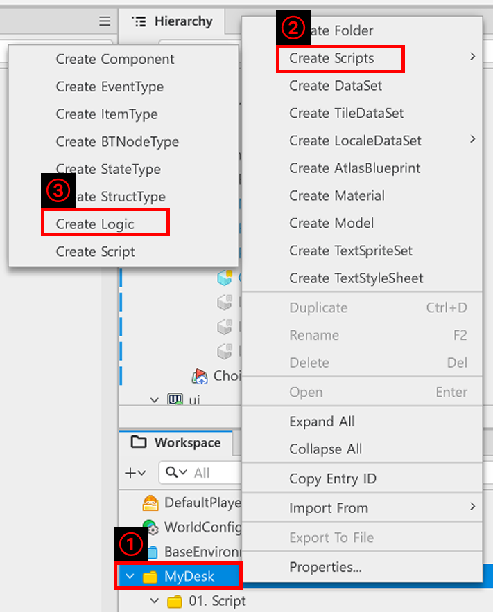
</p>

- 在「Hierarchy」、「MyDesk」上按下滑鼠右鍵。
- 可透過「Create Scripts」、「Create Logic」製作Logic。
- 將生成的Logic名稱宣告為TimerLogic。
- 以下為TimerLogic的程式碼。

```lua
@Logic
script TimerLogic extends Logic

property number remainTime = 0

property boolean isRunning = false

@ExecSpace("ClientOnly")
method void StartTimer()
-- 啟用計時器。
self.isRunning = true

-- 檢查目前地圖是否為CoinRush，若目前地圖是CoinRush則執行遊戲。
local localPlayer = _UserService.LocalPlayer
if localPlayer.CurrentMapName == "CoinRush" then
	local coinRushController = _EntityService:GetEntityByPath("/maps/CoinRush/CoinRushController")
	coinRushController.CoinRushController:StartGame()
	local coinRushUI = _EntityService:GetEntityByPath("/ui/CoinRushUI")
	coinRushUI.CoinRushUIController:ResetScoreUI()
	
end

-- 透過迴圈減少時間。
while self.remainTime > 0 and self.isRunning do
	wait(1.0)
	self.remainTime = self.remainTime - 1
end

-- 當時間全部結束時，要求輸出結果視窗。
if self.isRunning then
	self.isRunning = false
	localPlayer.MovementComponent.Enable = false
	local coinRushController = _EntityService:GetEntityByPath("/maps/CoinRush/CoinRushController")
	coinRushController.CoinRushController:FinishGame()
	local resultUI = _EntityService:GetEntityByPath("/ui/ResultUI")
	resultUI.ResultUIController:ShowResultUI(localPlayer.PlayerCoinRushComponent.playerScore)
end
end

@ExecSpace("ClientOnly")
method void SetTimer(number SetTime)
self.remainTime = SetTime
end

end
```

> 該程式碼是以Plain Text為基準撰寫的程式碼。

<br>

### 建立ResultUI

<p align="center">
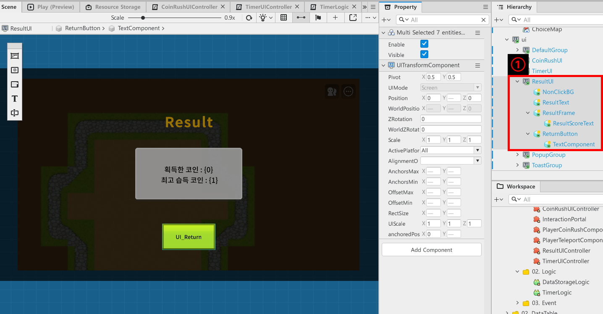
</p>

- **NonClickBG**：當結果UI顯示時，為了防止觸碰結果UI後方的UI而以SpriteGUIRendererComponent製作的UI。
- **ResultTex**t：為了撰寫UI標題而以TextGUIRendererComponent製作的UI。
- **ResultFrame**：為了顯示結果分數的框架而使用SpriteGUIRendererComponent。
- **ResultScoreText**：為了顯示結果分數而使用TextGUIRendererComponent。
- **ReturnButton**：以範例世界為基準，為了輸出移動至地圖按鈕的圖片而使用SpriteGUIRendererComponent。
- **TextComponent**：為了輸出返回按鈕的名稱而使用TextGUIRendererComponent。
- ResultUI使用ResultUIController來管理自身要素。
- 以下為ResultUIController的程式碼。

```lua
@Component
script ResultUIController extends Component

property TextGUIRendererComponent resultText = nil

@ExecSpace("ClientOnly")
method void OnBeginPlay()
self:InitResultText()
end

@ExecSpace("ClientOnly")
method void InitResultText()
-- 若resultText為nil則尋找並註冊resultText。
if not isvalid(self.resultText) then
	local findEntity = self.Entity:GetChildByName("ResultScoreText", true)
	if isvalid(findEntity)then
		self.resultText = findEntity.TextGUIRendererComponent
	end
end
end

@ExecSpace("ClientOnly")
method void ShowResultUI(number ResultValue)
local playerProfileID = _UserService.LocalPlayer.PlayerComponent.ProfileCode
if ResultValue > _DataStorageLogic.clientBestScore then
	_DataStorageLogic:RequestSaveScore(playerProfileID, ResultValue)
	self.resultText.Text = _LocalizationService:GetTextFormat("UI_Result", ResultValue, ResultValue)
else
	self.resultText.Text = _LocalizationService:GetTextFormat("UI_Result", ResultValue, _DataStorageLogic.clientBestScore)
end
self.Entity.Enable = true
end

@ExecSpace("ClientOnly")
@EventSender("Entity", "03be7e6d-2983-4972-a95e-10bad9a57892")
handler HandleButtonClickEvent(ButtonClickEvent event)
-- 取得玩家實體。
local findLocalPlayer = _UserService.LocalPlayer
-- 取得TimerUI後將UI停用。
local timerUI = _EntityService:GetEntityByPath("/ui/TimerUI")
timerUI.Enable = false
-- 取得CoinRushUI後將UI停用。
local coinRushUI = _EntityService:GetEntityByPath("/ui/CoinRushUI")
coinRushUI.CoinRushUIController:ResetScoreUI()
coinRushUI.Enable = false
-- 將玩家移動至遊戲選擇地圖。
findLocalPlayer.MovementComponent.Enable = true
findLocalPlayer.PlayerTeleportComponent:RequestPlayerChoiceMap(findLocalPlayer)
self.Entity.Enable = false
end

end
```

> 該程式碼是以Plain Text為基準編寫而成。

- 此外，為了讓玩家能夠移動，也在「DefaultPlayer」新增了「PlayerTeleportComponent」來使用。
- 以下為PlayerTeleportComponent的程式碼。

```lua
@Component
script PlayerTeleportComponent extends Component

@ExecSpace("Server")
method void RequestPlayerChoiceMap(Entity PlayerEntity)
self:TeleportChoiceMap(PlayerEntity)
end

@ExecSpace("ServerOnly")
method void TeleportChoiceMap(Entity PlayerEntity)
_TeleportService:TeleportToEntityPath(PlayerEntity, "/maps/ChoiceMap")
end

@EventSender("Self")
handler HandleEntityMapChangedEvent(EntityMapChangedEvent event)
if event.NewMap.Name == "ChoiceMap" then
	_SoundService:PlayBGM("8b57ad3bb40742a1b4955390bf14b36d", 1.0)
else
	
end
end

end
```

### 地圖移動時輸出UI

<p align="center">
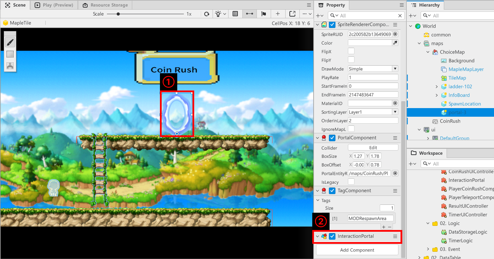
</p>

- 當玩家使用範例世界的傳送門時，會偵測此行為並更新UI，因此在傳送門實體製作並使用了InteractionPortal Component。
- 以下為InteractionPortal程式碼。

```lua
@Component
script InteractionPortal extends Component

@EventSender("Self")
handler HandlePortalUseEvent(PortalUseEvent event)
-- 使用傳送門時啟用TimerUI。
if event.PortalUser == _UserService.LocalPlayer then
	local timerUI = _EntityService:GetEntityByPath("/ui/TimerUI")
	event.PortalUser.PlayerCoinRushComponent:ResetScore()
	timerUI.Enable = true
	timerUI.Visible = true
	timerUI.TimerUIController:ShowTimerUI()
	-- 更改背景音樂。
	_SoundService:PlayBGM("ae1e81ea94f5421580ecbdf1b0fddfaf", 1.0)
end

end

end
```

> 該程式碼是以Plain Text為基準編寫而成。

<br>

## 最低製作標準
- 在迷你遊戲中以UI顯示剩餘時間。
- 透過遊戲開始UI與結果UI，建立讓玩家能確認遊戲開始與結束的UI。

<br>

## 應用與進階應用

- 運用Tween功能建立UI演出。
- 直接將UI的組成圖片替換為其他資源，以便有效傳達視覺資訊。