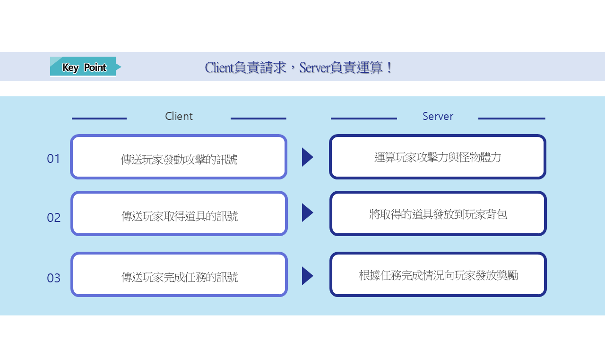
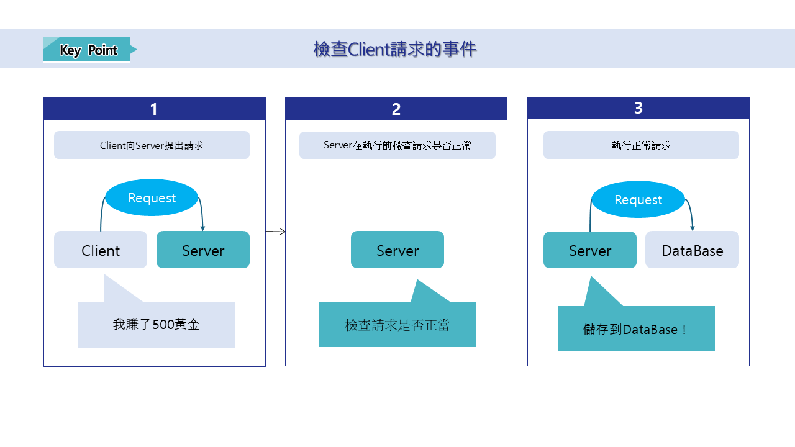

# [📖 進階學習] 學習DataStorage

## 影片時間軸
- 可在課程影片中以下時間點學習。
- 理解地圖類型：`01:25:10`

<br>

## 學習目標
- 學習儲存玩家最高紀錄的方法。
- 學習讀取玩家最高紀錄的方法。
- 學習製作儲存與讀取功能時的注意事項。

<br>

## 觀看該影片後可嘗試執行的內容
- 製作除了玩家最高紀錄以外，其他必要資訊的儲存與讀取功能。
- 製作將已儲存資訊輸出到UI的功能。
---

## DataStorageService

<p align="center">

</p>

- 玩家在製作世界時，有時會希望儲存或讀取玩家資訊。
- DataStorageService是楓之谷世界支援的功能，可讓玩家資訊進行儲存與讀取。
- 在範例世界中，由DataStorageLogic負責執行玩家資訊的儲存與讀取功能。
- 以下為DataStorageLogic的程式碼。

```lua
@Logic
script DataStorageLogic extends Logic

@Sync
property number serverBestScore = 0

property number clientBestScore = 0

@ExecSpace("ServerOnly")
method void LoadScore(string ProfileID)
-- 取得目前玩家的唯一ID。
local userId = ProfileID
-- 取得該使用者專用的資料儲存空間。
local storage = _DataStorageService:GetUserDataStorage(userId)

-- 等待並讀取以「clientScore」這個鍵(Key)儲存的資料(同步方式)。
local errorCode, value = storage:GetAndWait("serverBestScore")

if errorCode == 0 then
	if value ~= nil and value ~= "" then
		self.serverBestScore = tonumber(value)
		log("取得的分數："..value)
	else
		self.serverBestScore = 0 -- 首次登入等沒有已儲存資料時
		log("沒有已儲存的分數。初始化為0。")
	end
end
end

@ExecSpace("ServerOnly")
method void SaveScore(string ProfileID)
local userProfileID = ProfileID
local storage = _DataStorageService:GetUserDataStorage(userProfileID)

-- 將目前分數切換為字串後，以"clientScore"這個鍵(Key)儲存。
local errorCode = storage:SetAndWait("serverBestScore", tostring(self.serverBestScore))

if errorCode == 0 then
	log("分數儲存成功")
end
end

@ExecSpace("Server")
method void RequestLoadScore(string ProfileID)
self:LoadScore(ProfileID)
end

@ExecSpace("Server")
method void RequestSaveScore(string ProfileID, number Score)
-- 若為最高分，則將其登錄到clientBestScore。
if self.clientBestScore < Score then
	self.clientBestScore = Score
	self.serverBestScore = Score
end
self:SaveScore(ProfileID)
end

@ExecSpace("ClientOnly")
method void OnBeginPlay()
local playerProfile = _UserService.LocalPlayer.PlayerComponent.ProfileCode
self:RequestLoadScore(playerProfile)
end

@ExecSpace("ClientOnly")
method void OnSyncProperty(string name, any value)
if name == "serverBestScore" then
	self.clientBestScore = value
end
end

end
```

<br>

## Client、Server的角色

<p align="center">

</p>

- 範例世界是假設只有Client環境而製作的世界，因此目前的DataStorageLogic具有低效率的運作方式。
- 原因在於沒有由Server執行數值處理。

<p align="center">

</p>

- 理想的Client與Server關係是Client負責請求，Server負責運算。
- 當Client將某個行為傳送給Server後，Server會對該行為進行運算。
- Client再將Server回傳的運算結果以視覺方式更新給玩家觀看。
- 這才是Client與Server理想的使用方式。

<br>

## 製作同步化時的注意事項

- 若你們要區分Client與Server來製作同步化功能，則必須注意以下情況。
    - Server在進行運算前必須保證數值的可信度。
        - Client可能會竄改傳送給Server的數值。
        - 因此在進行運算前，必須先驗證傳送過來的數值是否正常。
    - Server無法保證運算的先後順序。
        - 依據網路環境與玩家之間的距離環境，即使先執行的行為，也有可能不會優先更新到運算結果中。
        - 為了解決這些問題，必須理解並套用時間戳記方式、序列號碼技術等各種伺服器技術。
 
<br>

## 最低製作標準
- 製作儲存玩家最高紀錄的功能。
- 製作讀取玩家最高紀錄的功能。

<br>

## 應用與進階應用
- 製作將玩家資訊中最高分數輸出到UI的功能。
- 強化伺服器安全性，使玩家的遊戲紀錄能夠由伺服器管理與使用。