<br>

# 📝 메이플스토리 월드 네트워킹 및 동기화

<br>

## 학습 목표

- 서버-클라이언트 모델을 이해할 수 있다.
- None과 Sync를 이해할 수 있다.
- Server, ServerOnly, Client, ClientOnly, Multicast를 이해할 수 있다.

<br>

## 서버-클라이언트 모델 이론

(참고: https://maplestoryworlds-creators.nexon.com/ko/docs?postId=207)

<p align="center">
  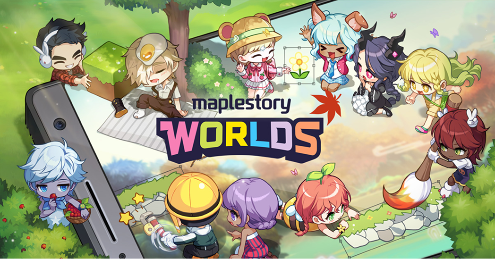
</p>

이번 강의에선, 메이플스토리월드의 네트워킹과 동기화에 대해 알.아보도록 하겠습니다. 먼저 서버-클라이언트 이론을 알아본 후, 그 후에 메이플월드에서 제공하는 다양한 네트워크 설정에 대해 알아볼 예정입니다. 


<p align="center">
  
</p>

- 넥슨의 메이플스토리 계정을 하나의 PC에서 생성했다면 그 계정은 노트북 혹은 PC방에서도 이어서 플레이 가능합니다. 이것이 가능한 이유는, 저희가 어느 기기에서 접속하든 결국 '단 하나의 목적지'에서 정보를 가져오기 때문입니다.

 - 여기서 데이터를 안전하게 저장하고 보내주는 '하나의 중심 공간'을 서버(Server)라고 부릅니다.

 - 그 서버에 접속해서 화면을 보여주고 유저의 입력을 받는 '각각의 기기'들을 클라이언트(Client)라고 부릅니다.

- 메이플스토리 월드의 게임들도 같은 방식으로 작동합니다.

<br>

---

<p align="center">
  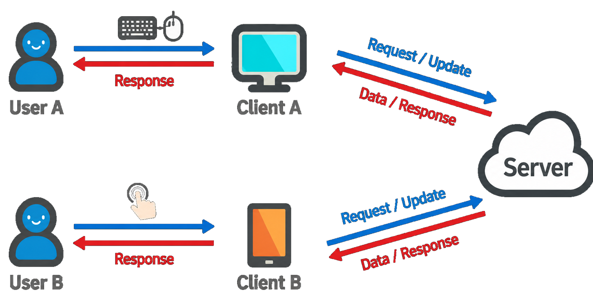
</p>

- 네트워크 게임에서 가장 널리 쓰이는 표준 구조가 바로 이 ‘서버-클라이언트 모델’입니다. 
- 클라이언트는 플레이어가 게임을 플레이할 때 직접 마주하는 영역입니다. 
- 플레이는 User라고 표현하겠습니다. User가 누르는 키보드나 마우스 같은 유저의 입력을 받아서 서버에 전달하고, 서버에서 받은 정보를 모니터에 화면을 잘 조립해서 출력해주는 역할을 합니다.
- 서버는 클라이언트들이 보내오는 수많은 요청을 처리하고, 모든 유저가 완전히 동일한 시간, 동일한 게임 상황을 경험할 수 있도록 실시간으로 정보를 다시 클라이언트들에게 전달하는 역할을 수행합니다.

- 클라이언트들끼리는 서로 직접 연결되지 않습니다.

<br>

---

<p align="center">
  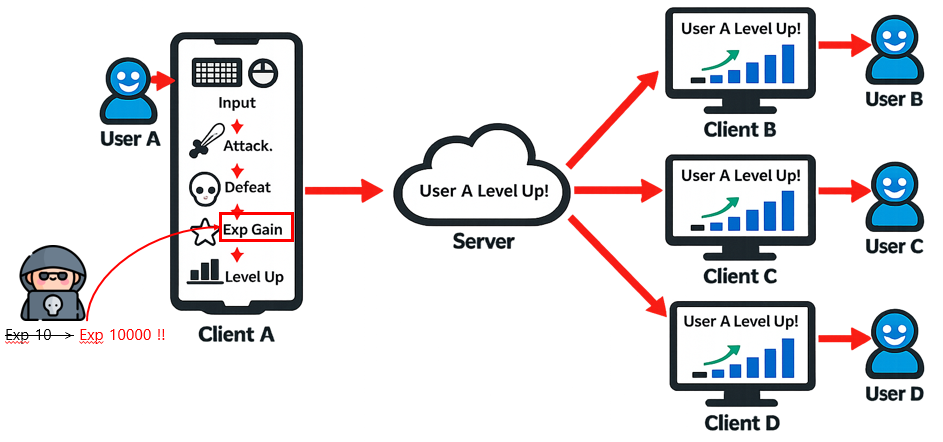
</p>

- 이런 방식을 쓰는 이유는 데이터 변조 위험성', 즉 보안 때문입니다
- 만약 서버를 거치지 않고 클라이언트가 직접 중요한 정보를 처리하고 다른 사람에게 전달할 수 있다면, 누군가 자기 컴퓨터의 게임 프로그램을 해킹했을 때 게임 전체가 무너지는 위험성이 생깁니다.

<br>

---
<p align="center">
  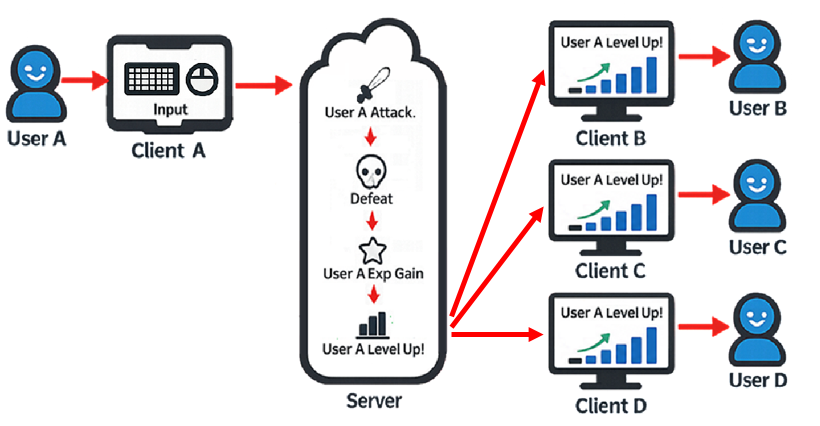
</p>

- 위와 같은 위험성을 막기 위해서, 클라이언트는 유저의 입력을 받아 서버에게 전송하고, 서버는 중요한 로직을 처리한 뒤 결과를 계산한 뒤, 클라이언트에게 전달하고, 클라이언트는 전달된 내용을 출력하는 방법으로 돌아갑니다.

- 서버-클라이언트 모델은 모든 권한과 데이터 검증을 '서버'라는 하나의 절대적인 기준점에 맡김으로써, 해킹 위험을 막고 공정한 게임 환경을 유지하도록 설계된 구조입니다."

- 메이플스토리 월드도 마찬가지입니다. 서버에서 주요 행동이 수행되면 그 결과가 클라이언트에게 반영됩니다

- 동기화가 잘 되어있다는 가정 하에, 서버에서 전투, 아이템 사용등의 이유로 체력이 줄어들면 변동된 체력은 클라이언트들에게도 반영됩니다.


<br>

---

## Sync와 None

- Sync는 특정 프로퍼티를 동기화 시키겠다는 뜻이고, None은 그렇지 않겠다는 뜻입니다.

- 프로젝트를 따라 진행하며 Sync와 None의 차이를 상세히 알아보도록 하겠습니다.

<p align="center">
  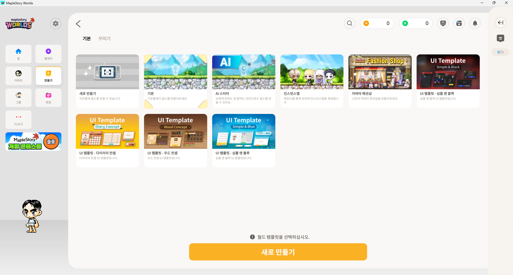
</p>

- 월드를 새로 만들어줍니다.

<br>

<p align="center">
  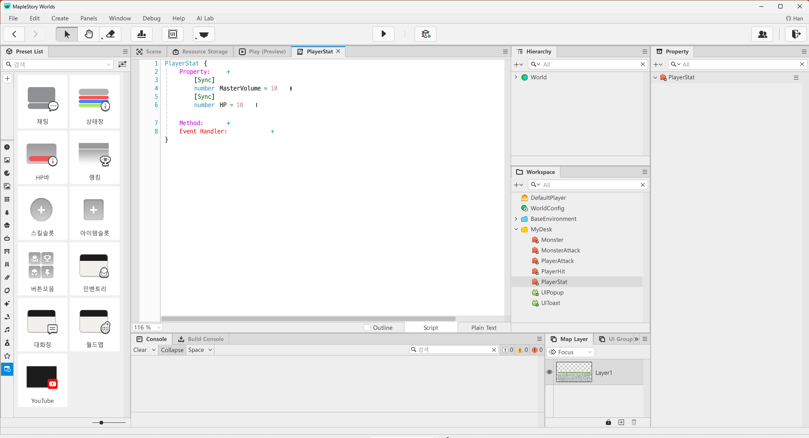
</p>

 - 그 후, Default Player에게 붙일 하나의 컴포넌트 스크립트를 만듭니다.

 <br>

<p align="center">
  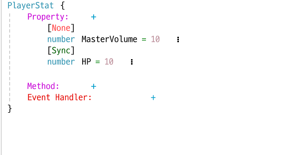
</p>

```lua
[None]
number MasterVolume = 10

[Sync]
number HP = 10

```
- 프로퍼티는 2개를 만들고, 하나는 None, 하나는 Sync로 만들어서 테스트를 해보도록 하겠습니다.

<br>


<p align="center">
  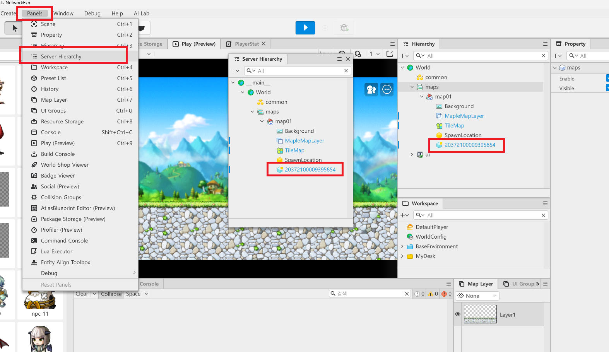
</p>

- [Panels -> ServerHierarchy] 를 눌러서 서버 하이어라키를 띄워줍니다.

- 이 패널은, 서버상에 존재하는 엔티티와 각종 정보들을 확인할 수 있게 해줍니다.

- 패널을 띄운 후 상단의 ▶ 플레이 버튼을 눌러줍니다.

<br>

<p align="center">
  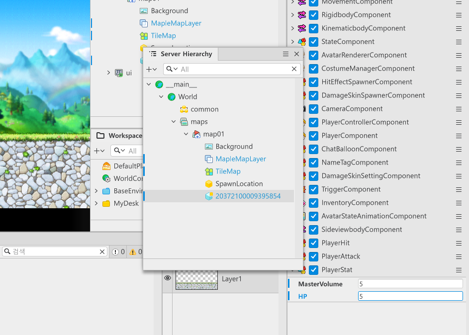
</p>

- 서버 하이어라키의 플레이어 엔티티를 누른 후, 수치가 (10,10) 이었던 것을 각각 (5,5) 로 바꾸고 엔터를 칩니다.

<br>


<p align="center">
  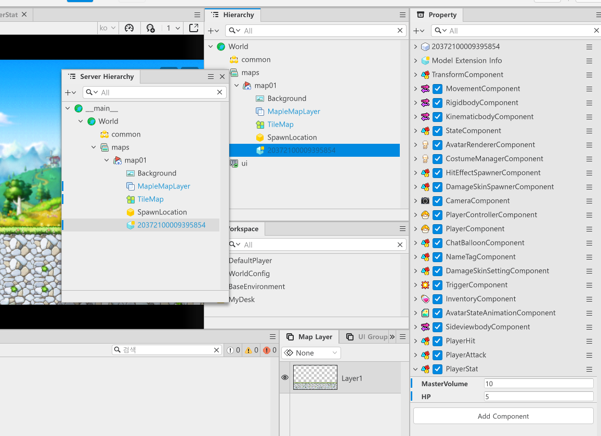
</p>

- 클라이언트 엔티티를 확인해본 결과, MasterVolume은 10, HP는 5입니다.

- Sync가 적용된 프로퍼티는 서버와 동기화 되고, None이 붙은 프로퍼티는 되지 않는다는 사실을 알았습니다.

<br>


<p align="center">
  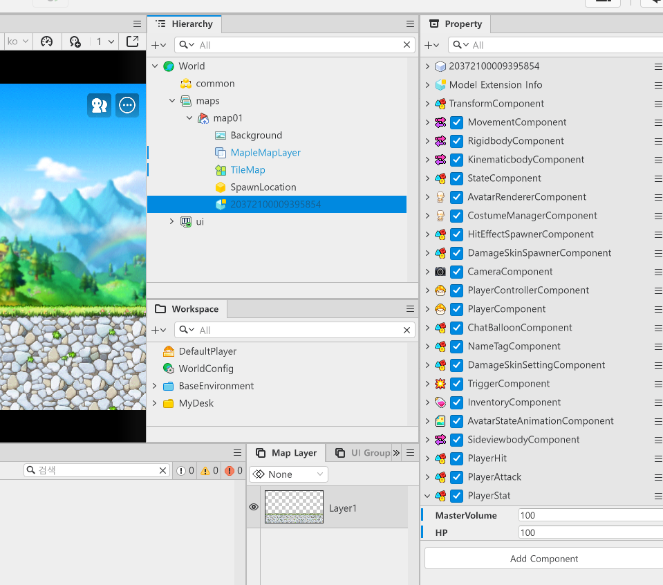
</p>


<p align="center">
  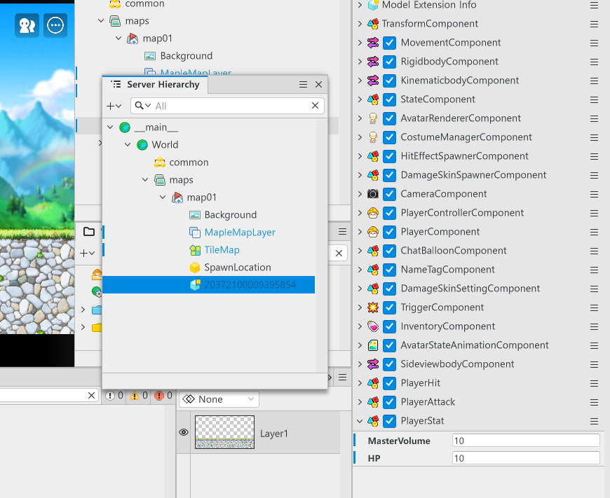
</p>


- 거꾸로 클라이언트 엔티티의 수치를 (100,100)으로 바꿔도 서버에는 반영되지 않습니다.

- 메이플스토리 월드 공식 문서를 확인해보면, 프로퍼티가 Sync로 설정되어있다면 서버에서 클라이언트로 단방향 동기화가 일어난다고 적혀있습니다.

- None은 서버 클라이언트 방향 무관, 동기화 되지 않습니다.

<br>

---

## Server Only, Client Only

- 이어서 메서드를 통해 Server Only, Client Only를 알아보도록 하겠습니다.

- Server Only 메서드는 서버 엔티티에서만 수행되고, Client Only는 클라이언트 엔티티에서만 수행됩니다.

<p align="center">
  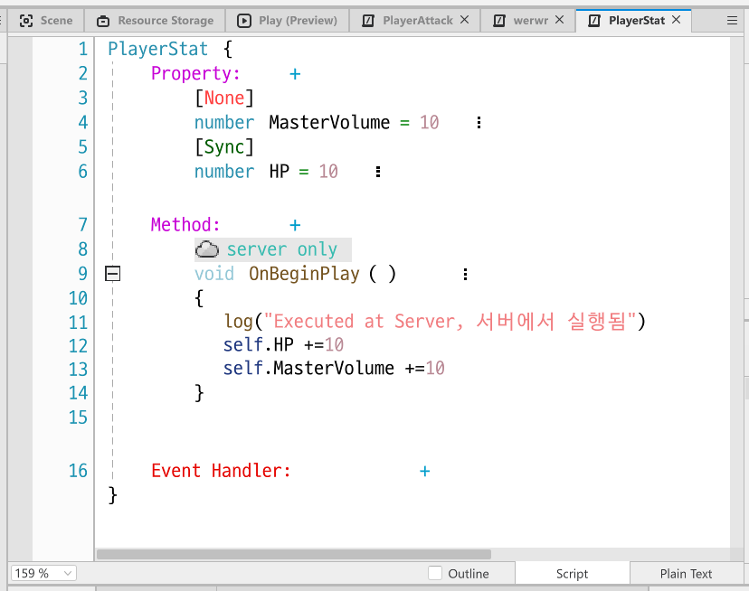
</p>

```lua
[server only]
void OnBeginPlay()
{
    log("Executed at Server (서버에서 실행됨)")
    self.HP +=10
    self.MasterVolume +=10
}
```

<br>

<p align="center">

  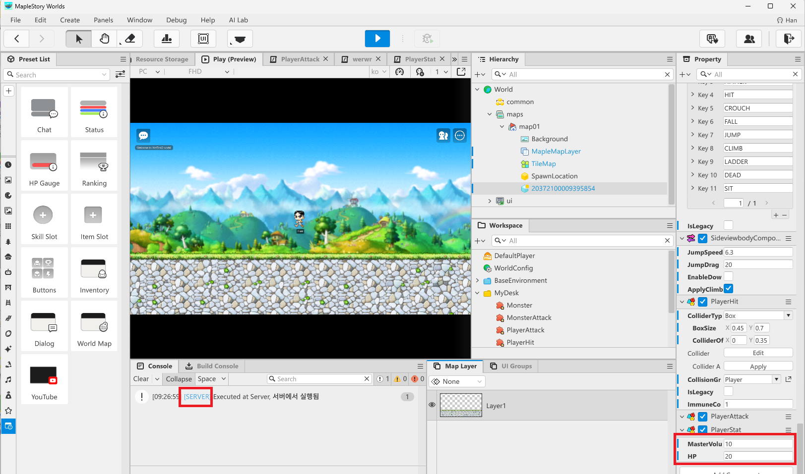

</p>

- 앞으로 로그를 읽을 땐, Server가 앞에 붙어있는지 Client가 붙어있는지 잘 확인해야 합니다.

- 서버 하이어라키에 있는 내용이 수행되었고, 서버에서 수치가 바뀌었으니 Sync에 의해 클라이언트도 변합니다

<br>

<p align="center">
  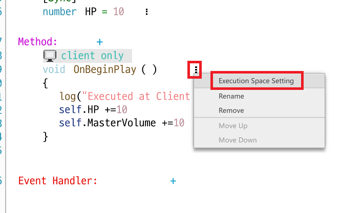
</p>

- 메서드 옆의 더보기(: 모양) 을 누르면 실행 공간을 바꿀 수 있는 옵션이 있습니다.

- 실행 공간 설정(Execution Space Settings)를 눌러줍니다.

<br>

<p align="center">
  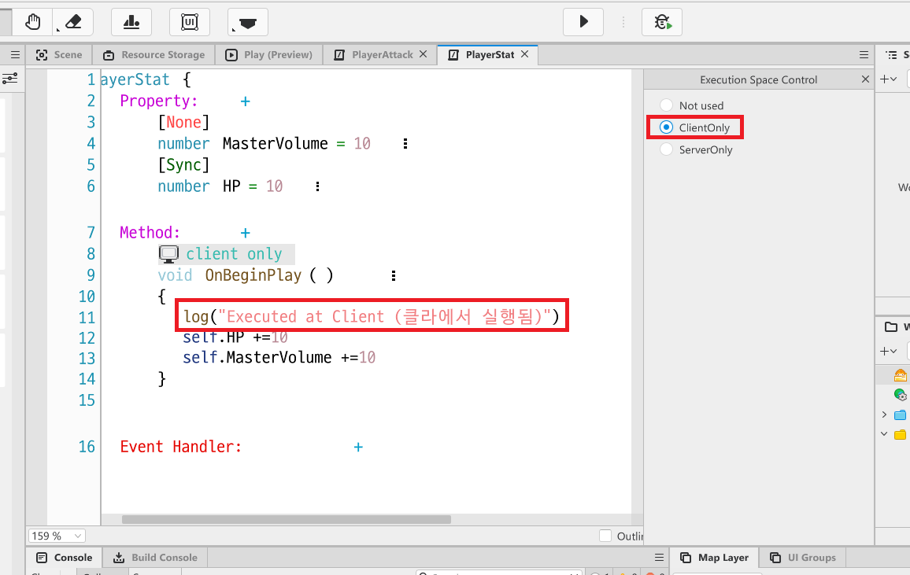
</p>


<p align="center">
  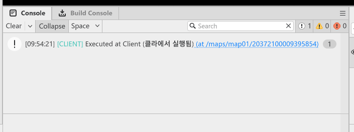
</p>

- OnBeginPlay()위의 함수 실행공간을 client only로 바꿉니다. 주석 또한 "클라에서 실행됨" 으로 바꾸어 줍니다.

- 플레이를 해보면 서버 하이어라키는 반응이 없고, 클라이언트 하이어라키에서만 로그를 찍은 것을 볼 수 있습니다.

- 클라이언트에서 수치가 변한것이므로 거꾸로 서버에 반영되지 않습니다.


<br>

<p align="center">
  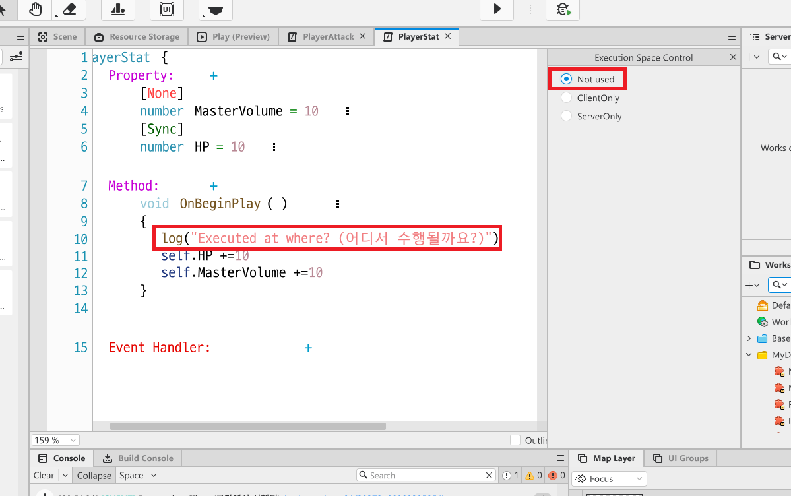
</p>


<br>

<p align="center">
  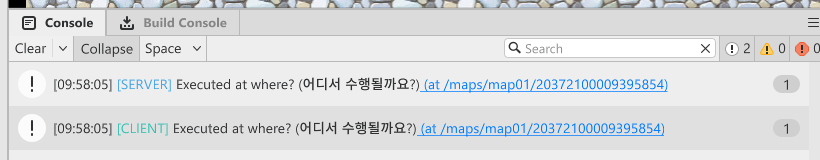
</p>

- 사용하지 않음(Not used)으로 바꾸어주면, 서버 하이어라키 엔티티는 서버에서, 클라이언트 엔티티는 클라이언트에서 수행합니다.

- 로그를 보면, 서버에서 먼저 코드 수행이 일어났고, 이어서 클라이언트도 코드가 실행이 된 것을 볼 수 있습니다.

- 서버의 엔티티와, 클라이언트 엔티티의 HP 및 MasterVolume 수치를, 클릭해서 확인하기 전에 미리 예측하여 봅시다.

<br>

<p align="center">
  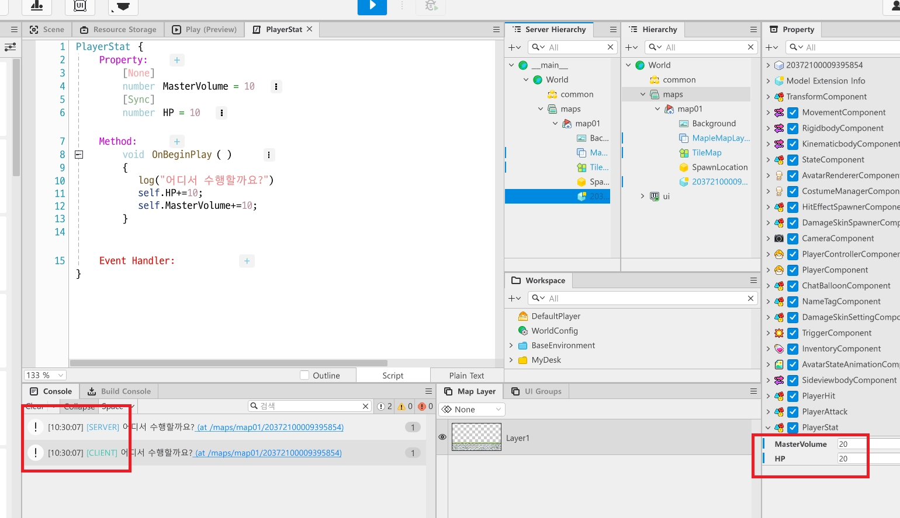
</p>

- 서버 하이어라키의 엔티티를 눌러보면, 볼륨과 체력은 각각 20,20이 되어있습니다. 
  - 서버는 (20,20) 인 것에 대부분 동의하지만 클라이언트는 (20, 20)인지 (20,30)인지 헷갈릴 수 있습니다.
  - 서버에서 스탯을 다 반영하고, 싱크가 일어나고, 후에 클라이언트가 수행되었을 수도 있고
  - 서버와 클라이언트 각각 빠르게 스탯을 반영하고, 둘의 차이가 없으니 싱크가 일어나지 않을 수도 있는 상황입니다.

- 이런 복잡한 상황서 무엇이 언제 동기화가 되었는 지 코드를 통해 순서를 확인할 수 있는 방법이 있습니다.

- OnSyncProperty는 프로퍼티 동기화가 일어날 때 자동으로 불려지는 메서드로, 이를 통해 Sync 시점 및 동기화 된 수치를 확인 가능합니다.


<br>

<p align="center">
  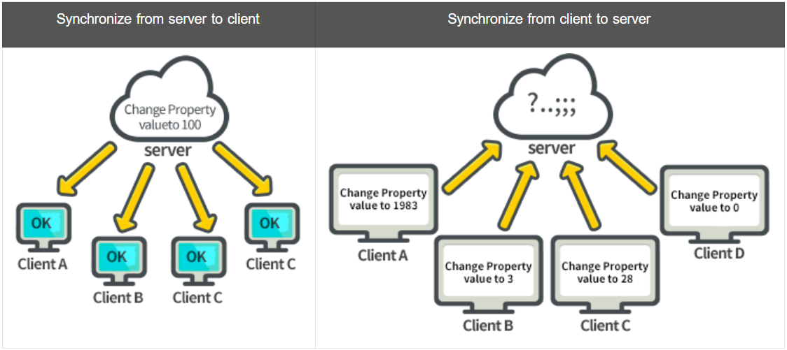
</p>

https://maplestoryworlds-creators.nexon.com/en/docs/?postId=207

- 메이플스토리 월드 문서를 보면, Sync에는 딜레이가 존재한다고 합니다.

- Sync가 언제 어디서 어떻게 실행되는지 알아보기 위해, **IsClient() 메서드와 IsServer() 코드**, 그리고 - **OnSyncProperty**를 알아보겠습니다.

<br>

<p align="center">
  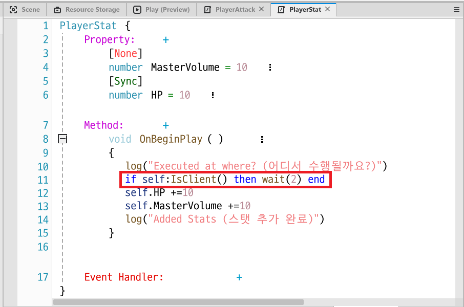
</p>

- if문을 통해, 만약 클라이언트에서 수행중이라면 2초를 기다리게 하는 코드를 작성했습니다. 

- IsClient()는 만약 클라이언트에서 수행중일 경우 True를 반환하고, IsServer()는 서버에서 수행중이었다면 True를 반환합니다.

- 확인을 위한 주석도 추가해줍니다.

<br>


<p align="center">
  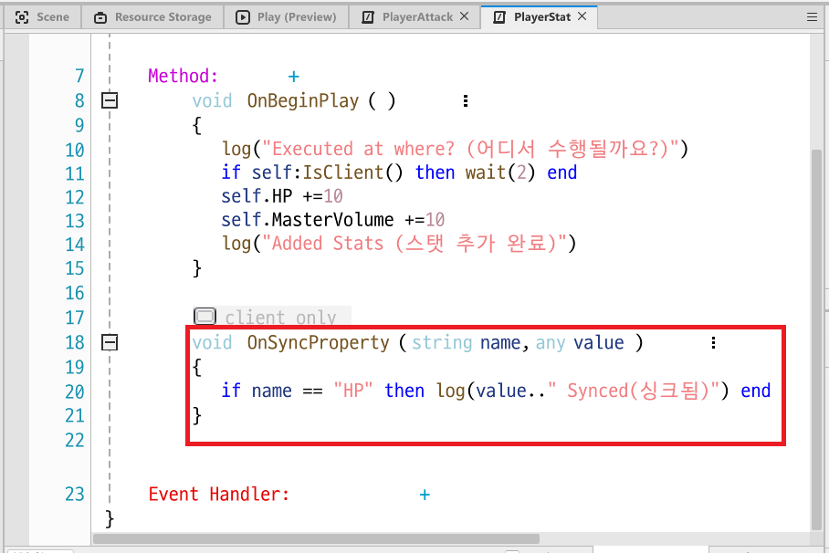
</p>

- OnSyncProperty는 프로퍼티 동기화, 즉 Sync가 수행될 때 자동으로 불리는 메서드로, name엔 동기화 중인 프로퍼티명, value엔 동기화될 수치가 들어있습니다.

- name이 만약 HP와 일치한다면, 즉 동기화되고 있는 프로퍼티가 HP라면 value를 보는 코드를 작성 후 테스트해봅니다.

<br>

<p align="center">
  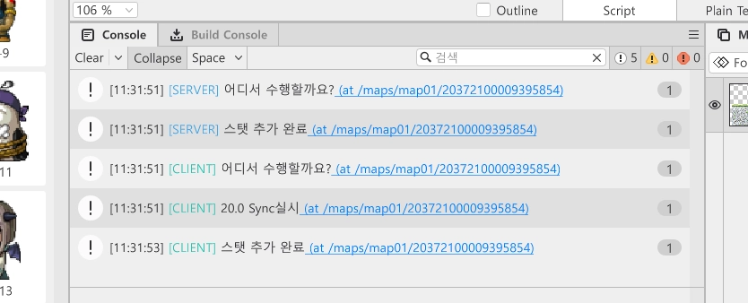
</p>

- 만약 클라이언트쪽의 코드가 2초 늦게 수행되었다면 어떤 순서로 동기화 되는 지 알 수 있습니다.

- 서버에서 스탯을 반영하고, 싱크가 서버에서 클라이언트 방향으로 일어나고, 그 후에 클라이언트에서 스탯이 반영되는 것을 볼 수 있습니다.


<br>

<p align="center">
  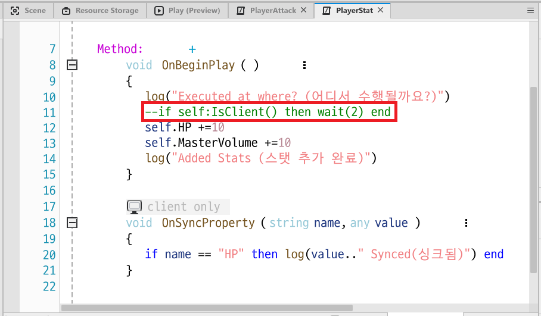
</p>

<p align="center">
  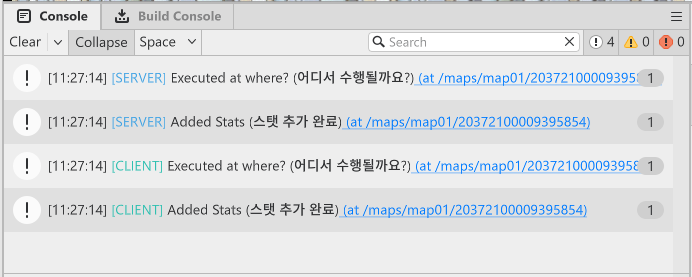
</p>

- 클라이언트에게 기다리라는 코드를 제거하고(혹은 주석을 치고) 다시 테스트 해봅니다.

- OnSyncProperty가 스크립트에 존재하지만 로그가 찍히지 않은 것을 보아, Sync가 발생하지 않았음을 확인할 수 있습니다.


<br>

<p align="center">
  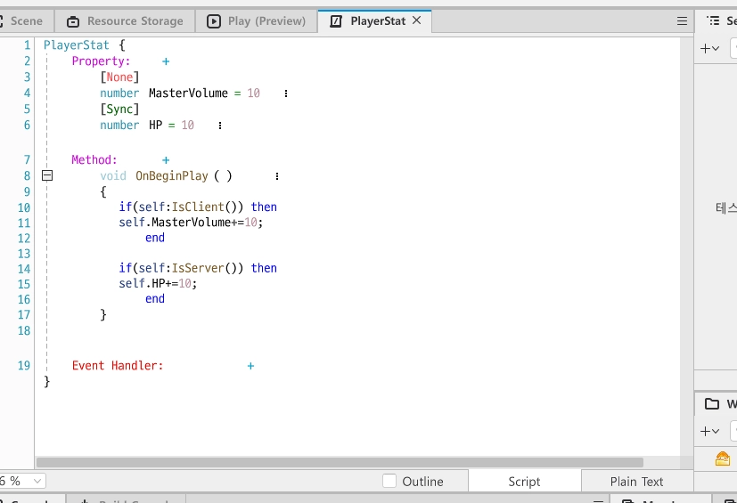
</p>

- 요약을 하자면, IsClient() 는 클라이언트에서 동작중일때만, IsServer()는 서버에서 동작중일때만 참을 반환합니다.

- 이를 통해 위 스크린샷과 같이, 사용 영역에 따른 분기문을 만들수도 있지만, 코드가 너저분하고 유지보수가 좋아보이지 않습니다.


<br>

<p align="center">
  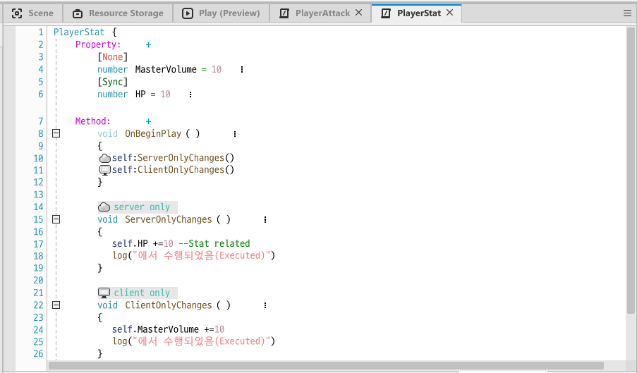
</p>

- 이렇게, 별도의 메서드를 만든 후, 각각 client only와 server only를 잘 붙여지면, 수행 공간에 맞는 메서드가 알아서 발동됩니다.

- 이렇게 추가 메서드를 만들어서 수행 공간을 나누는 방식은 리메이크 월드들을 탐색하다 보면 자주 볼 수 있는 방식입니다.

<br>

---

## Server, Client, Multicast


<p align="center">
  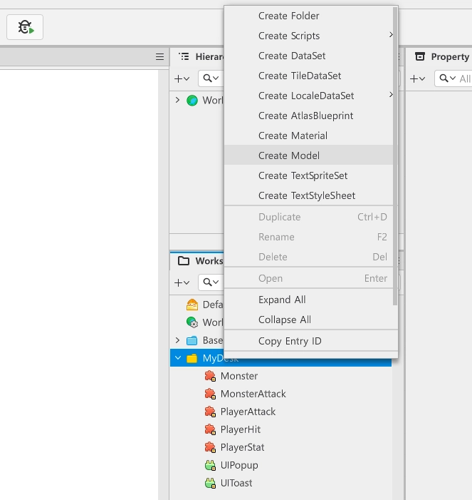
</p>

- UI 는 보통 클라이언트에만 보이면 됩니다. UI 출력용 모델을 새로 만들겠습니다.

- 제작된 모델에 UITransform 및 TextComponent도 붙여줍니다. 크기와 위치를, 눈이 잘 보일정도로 조절해줍니다.


<br>

<p align="center">
  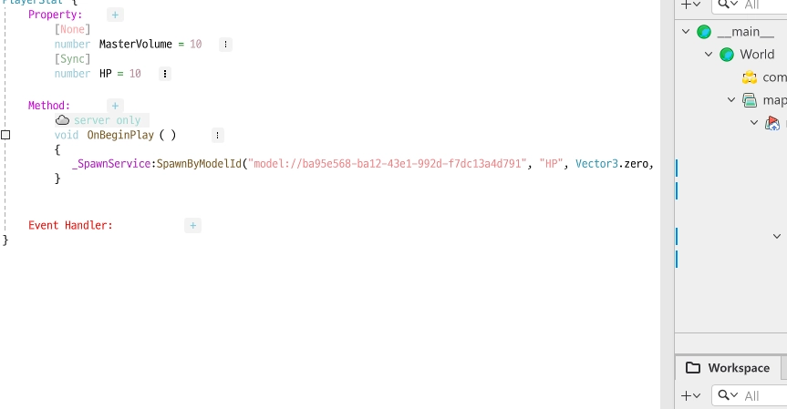
</p>


- SpawnService를 통해 방금 만든 UI를 Default Player 자식으로 만들어줍니다. 

- OnBeginPlay의 플레이 공간을 server only로 둡니다.

<br>

<p align="center">
  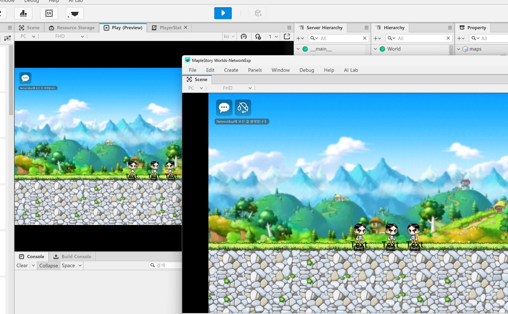
</p>

- 플레이를 통해 세부 위치를 조절해줍니다.


<br>

<p align="center">
  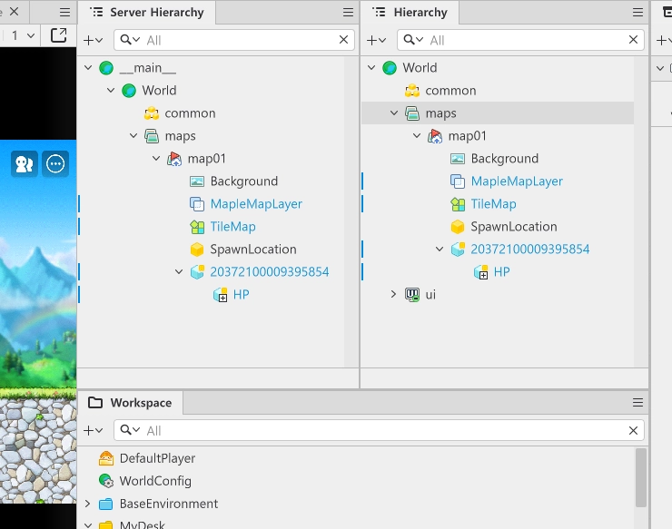
</p>

- server only에서 수행된 spawnService는, 서버에서 만들어지고 이것이 클라이언트에서 반영된 것을 볼 수 있습니다.

- 서버 하이어라키에도 HP UI 엔티티가, 클라이언트 하이어라키에도 HP UI 엔티티가 만들어진 것을 볼 수 있습니다.


<br>

<p align="center">
  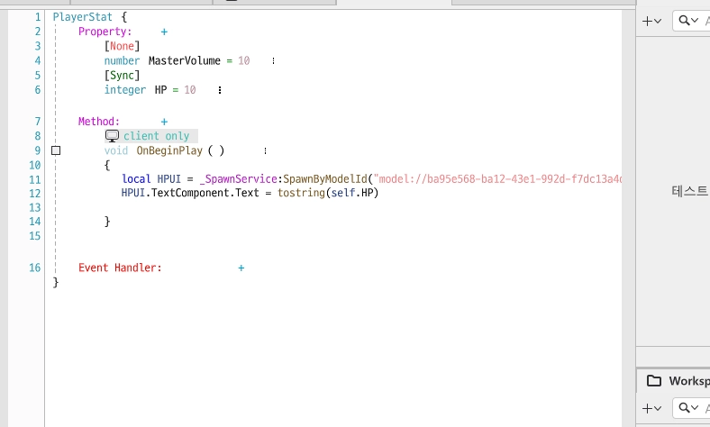
</p>


<br>

<p align="center">
  
</p>


- 이번엔 실행 공간을 client only로 바꾸어 줍니다.

- 방금 만들어진 텍스트 컴포넌트에 HP 프로퍼티의 수치를 띄우게 코드를 작성해봅니다.

- 플레이를 해보면, 2가지를 확인 가능합니다.
  - 첫째로는 HP UI 엔티티가 클라이언트에만 만들어집니다. (client only로 실행공간을 바꾸어서 그렇습니다)
  - 둘째로는 프로퍼티 수치가 클라이언트의 UI 엔티티에 잘 반영됩니다.


<br>

<p align="center">
  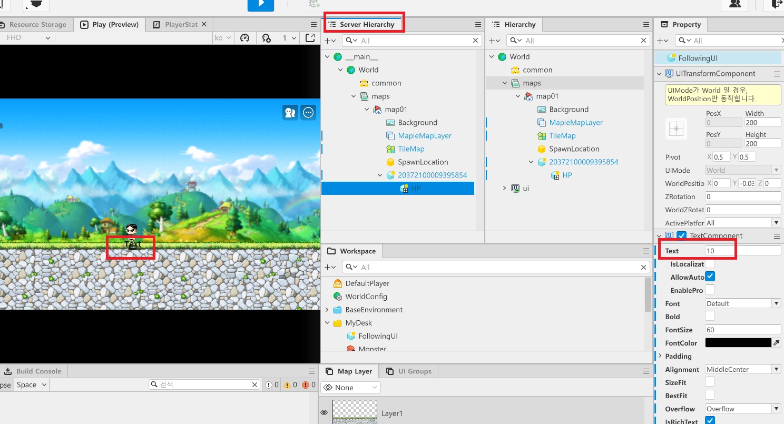
</p>

- OnBeginPlay() 코드를 다시 server only로 바꾸어 주고 테스트 하면, 화면엔 Text 라고 뜨고, 10으로 뜨지 않습니다.

- 서버 하이어라키의 HP UI 엔티티엔 10이 반영되었지만 클라이언트의 HP UI에는 갱신하라는 코드가 없었기에 이런 일이 생겼습니다.

- 이제 [서버] 공간에서 수행되고 있을 때, 클라이언트에게 명령을 내리는 법을 알아보겠습니다.

<br>


<p align="center">
  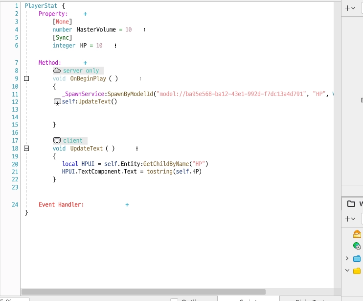
</p>

- 새로운 메서드를 만들되, 실행 공간을 이제 client로 바꿔줍니다.

- OnBeginPlay는 server only이기에 서버에서 수행되지만 client로 되어있는 메서드를 부르면, 클라이언트에서 수행이 됩니다.

<br>

<p align="center">
  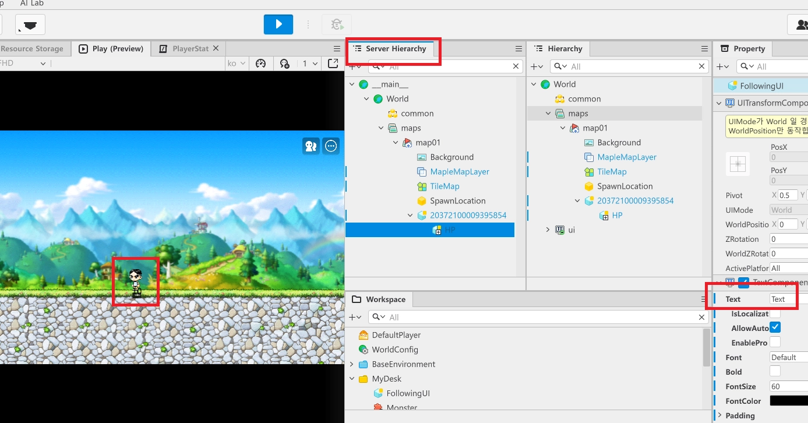
</p>

- 반대 상황이 된 것을 볼 수 있습니다. 서버의 HP UI엔티티엔 Text가, 클라이언트엔 10이 기입된 것을 볼 수 있습니다.

- 이제 서버와 클라이언트 양쪽 다 메서드를 수행하는 Multicast에 대해 알아보겠습니다.


<br>

<p align="center">
  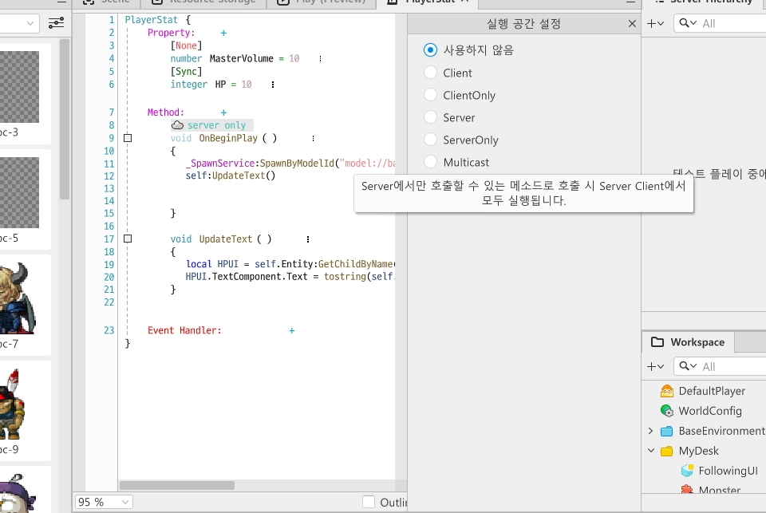
</p>

- Multicast에 마우스를 올려보면, '서버에서만 호출할 수 있는 메소드로 호출 시, Server Client에서 모두 실행됩니다' 라고 적혀있습니다.

<br>

<p align="center">
  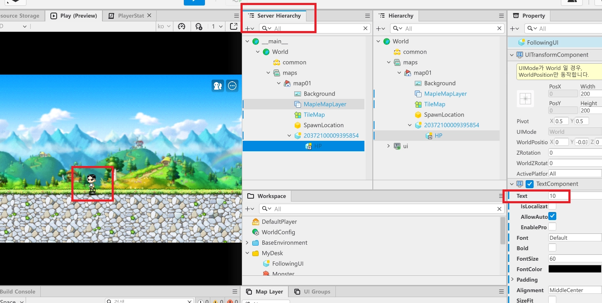
</p>

- client 대신, multicast로 바꾸어주면, 이제 양쪽 UI 엔티티를 클릭할 시, 둘 다 바뀐 것을 볼 수 있습니다.
  - 서버에서 수행되더라도 클라이언트에게 메서드를 수행하게 하려면 Client를 사용합니다.
  - 양쪽 다 수행되게 하려면 Multicast를 쓴다는 것을 확인하였습니다.

- 이제 마지막으로, 클라이언트 공간에서 수행될 경우 서버에서 실행되는 server가 남았는데, 이는 키입력을 활용해보겠습니다.

<br>

<p align="center">
  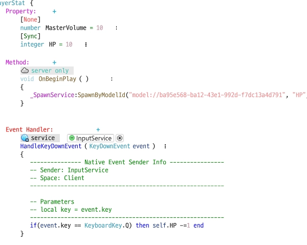
</p>

- 키다운 이벤트를 만들어보면, 주석을 통해 기본적으로 Client에서 수행됨을 알 수 있습니다.

- Q를 누르면 1이 깎이는 코드를 작성해줍니다.


<br>

<p align="center">
  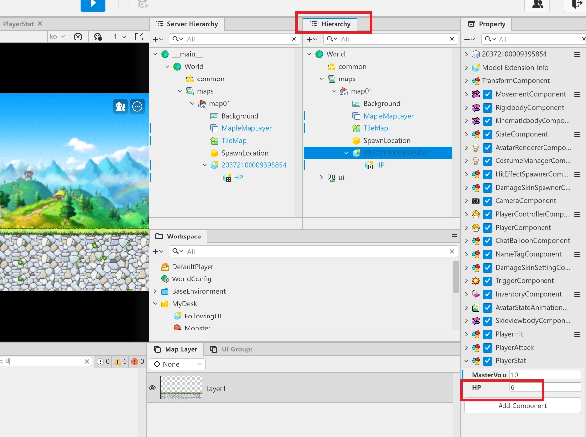
</p>

- 클라이언트 하이어라키를 보면, Q를 누를때마다 체력이 줄어드는 것을 볼 수 있습니다.

- 클라이언트에서 체력이 줄어들더라도, 서버 클라이언트 모델 특성상, 서버에서 체력이 깎인 것이 동기화되지 않습니다.

- 이제 체력 변동과 같은 중요한 로직은 서버에서 작동이 되도록 바꾸어보겠습니다.


<br>

<p align="center">
  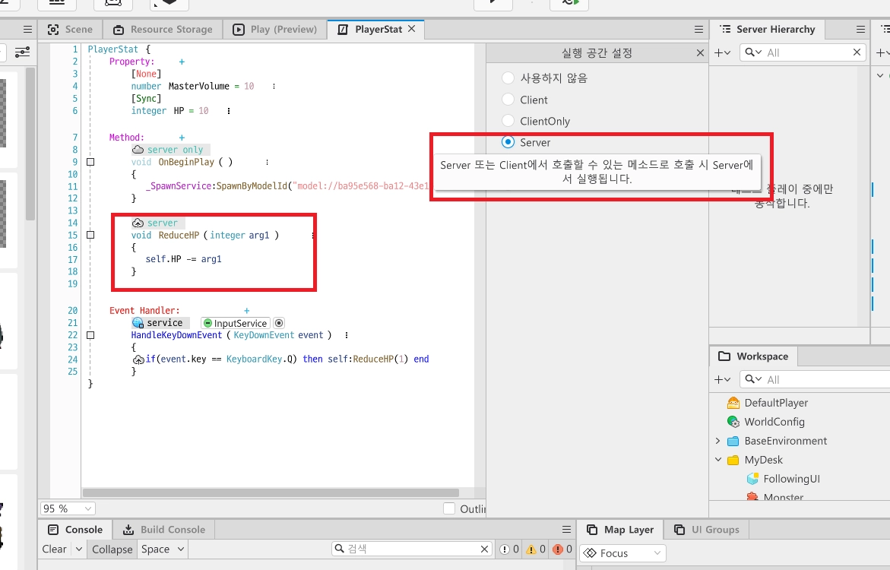
</p>

- server내용을 읽어보면, 서버 혹은 클라이언트에서 호출 시 서버에서 수행된다고 나와있습니다. 

- HP가 변동하는 로직을 서버에서 작성해줍니다. 그 후 실행 공간을 server로 설정해줍니다.

- 키입력이 생기면 이제 바로 HP 수치를 변동하지 않고, 서버에서 수행하도록 메서드를 호출해줍니다.


<br>

<p align="center">
  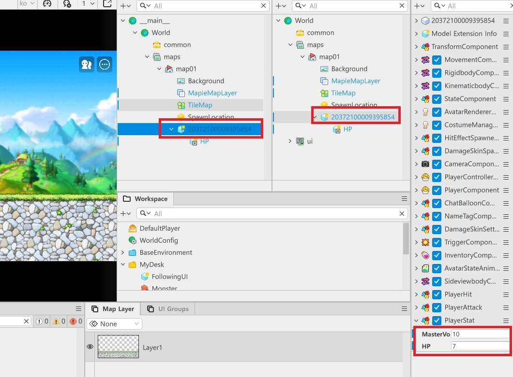
</p>

- 이젠 키입력이 발생 시, 서버에서 HP 변동이 일어나고, 이 수치가 동기화 되어 클라이언트에도 반영되는 것을 볼 수 있습니다.


<br>

<p align="center">
  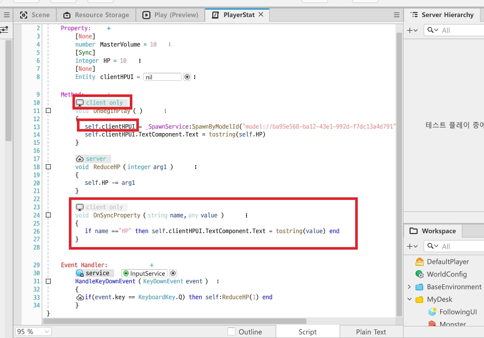
</p>

- UI는 굳이 서버에 존재할 필요가 없음을 깨달았습니다. 클라이언트에만 보이면 유저가 보게 되므로 Spawn을 클라이언트에만 되게 합니다.

- OnSyncProperty를 통해, 서버에서 HP가 변동되면 UI에 갱신하는 로직을 만들어줍니다.

- 이제, Q를 누르면 서버에서도 HP 변동을 수행하고, UI에도 갱신되는 로직을 완성하였습니다.

<br>

---

## 마무리

kor: https://maplestoryworlds-creators.nexon.com/ko/docs/?postId=210

eng: https://maplestoryworlds-creators.nexon.com/en/docs/?postId=210


<br>

<p align="center">
  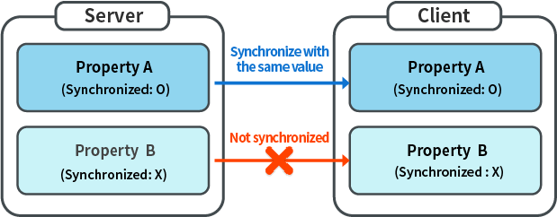
</p>

<p align="center">
  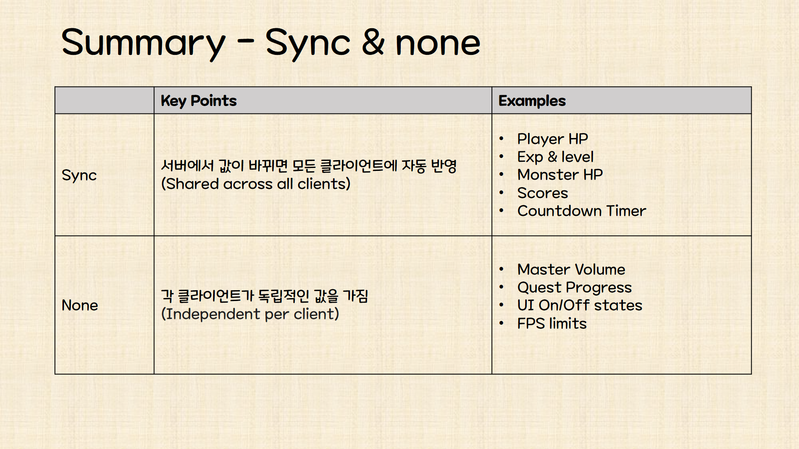
</p>

- Sync와 None의 차이에 대해 알아보았습니다. 

- 동기화가 되어야 할 스텟과 같은 내용은 Sync를 씁니다.

- 동기화 될 필요가 없는 개인 세팅값 등은 None을 씁니다.


<p align="center">
  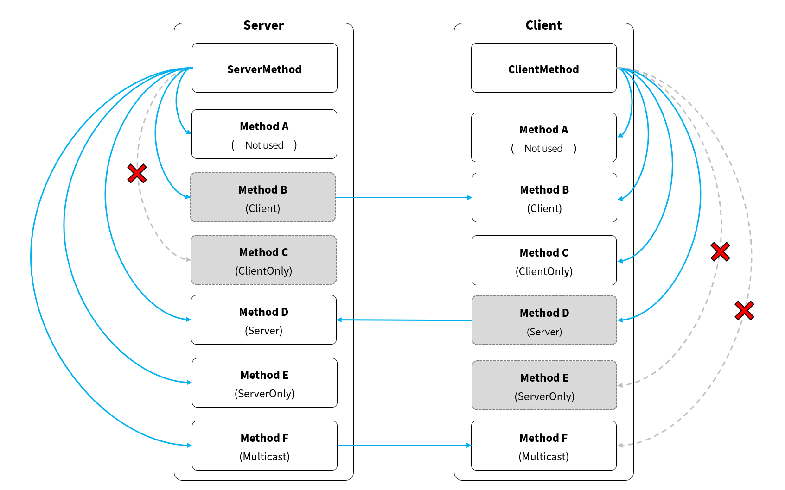
</p>

<p align="center">
  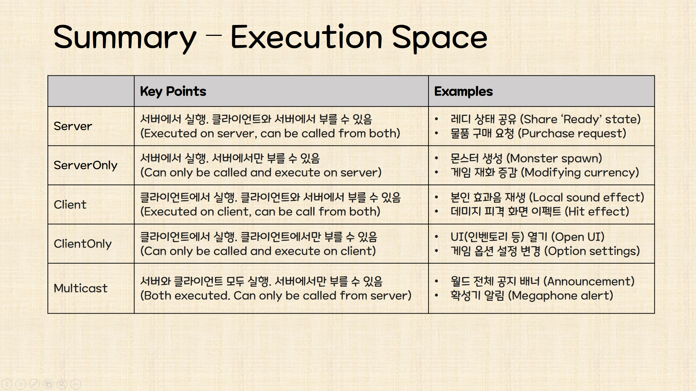
</p>


- 실행제어는 client, client only, server, server only, multicast가 있음을 확인하였습니다.

- UI창을 닫고 여는 행위, 혹은 볼륨 조절등은 서버에 동기화 될 필요가 없으므로 주로 클라이언트에서 수행합니다.

- 중요한 계산 및 캐릭터의 스탯 변동 등은 서버에서 수행을 합니다.

- 서버에서만 수행되는 메서드, 클라이언트에서만 수행되는 메서드는 위 이미지와 같습니다.

- 상황에 맞는 실행 공간 설정을 잘 알아두면 서버-클라이언트 모델서 편히 프로그래밍을 진행할 수 있습니다.